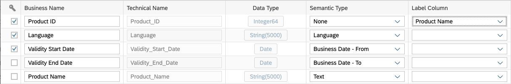
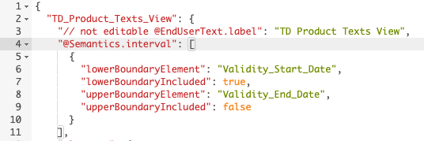
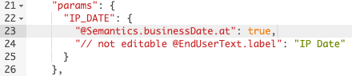

<!-- loio11b2ff4179a14c379bfdf7b7b85b09a1 -->

# Enable Time-Dependency for a Dimension or Text Entity

Enable time-dependency in your dimension or text entity to define periods of validity for each row and ensure that only the appropriate dimension members with the correct names are displayed for any given time period.

This topic contains the following sections:

-   [Specify Time-Dependent Semantic Types in your Dimension or Text Entity](enable-time-dependency-for-a-dimension-or-text-entity-11b2ff4.md#loio11b2ff4179a14c379bfdf7b7b85b09a1__section_dimension)
-   [Create a Reference Date Variable in Your Analytic Model](enable-time-dependency-for-a-dimension-or-text-entity-11b2ff4.md#loio11b2ff4179a14c379bfdf7b7b85b09a1__section_analytic_model)
-   [Create a Time-Dependent Parameter in Your Analytical Dataset \(Deprecated\)](enable-time-dependency-for-a-dimension-or-text-entity-11b2ff4.md#loio11b2ff4179a14c379bfdf7b7b85b09a1__section_ads)


<a name="loio11b2ff4179a14c379bfdf7b7b85b09a1__section_dimension"/>

## Specify Time-Dependent Semantic Types in your Dimension or Text Entity

To enable time-dependency in a dimension or text entity, you must identify one column containing the date from which the row is valid, and a second column containing the date after which the row is no longer valid:

-   Dimensions - The columns identify the start and end dates for the period during which each dimension member is valid.
-   Text entities - The columns identify the start and end dates for the period during which each dimension member name in a given language is valid.

1.  Open your dimension or text entity, and ensure that its *Semantic Usage* is correctly set.
2.  Locate the column containing the start date for the validity of dimension members \(or texts\) and set its *Semantic Type* to *Business Date - From*.
3.  Locate the column containing the end date for the validity of dimension members \(or texts\) and set its *Semantic Type* to *Business Date - To*.

    > ### Note:  
    > Both columns must have the same data type from the datetime family. You should avoid overlapping periods of validity, as this may lead to duplicate data in your stories.

4.  Ensure that one or other of these dates is selected as a key.

    In this example of a time-dependent text entity:

    -   The column `Validity Start Date` has a semantic type of *Business Date - From* and is set as a key \(along with `Product ID` and `Language`\).
    -   The column `Validity End Date` has a semantic type of *Business Date - To*.

    

    > ### Note:  
    > For information about setting keys and mapping them in associations, see [Set Key Columns to Uniquely Identify Records](set-key-columns-to-uniquely-identify-records-d9ef2c9.md).

5.  \[optional\] By default, the *Business Date - From* and *Business Date - To* are treated inclusively. If you want to exclude one or both, you must edit the CSN code for your entity:
    1.  Click *Edit Custom CSN Annotations* \(see [Edit a Custom CSN Annotation](../edit-a-custom-csn-annotation-820d013.md)\).
    2.  Directly after the opening brace following the entity name, add the following code:

        ```
        "@Semantics.interval" : [{
        "lowerBoundaryElement"  : "<Start Date Column>",
        "lowerBoundaryIncluded" : true,
        "upperBoundaryElement"  : "<End Date Column>",
        "upperBoundaryIncluded" : true
        }]
        ```

    3.  Change one or both of the `true` values to `false` to exclude the relevant date.

        In this example, the `Validity Start Date` is treated inclusively but the `Validity End Date` is treated exclusively:

        

    4.  Click *OK* to save your changes.

6.  Click *Deploy* to save and deploy your changes.

When an analytic model containing a fact that has an association pointing to the dimension is consumed in SAP Analytics Cloud, the names of dimension members are determined displayed based on the current date.


<a name="loio11b2ff4179a14c379bfdf7b7b85b09a1__section_analytic_model"/>

## Create a Reference Date Variable in Your Analytic Model

Any analytic model containing a fact pointing to your dimension via an association will, by default, benefit from its time-dependent data so that the dimension members and their names are displayed based on the current date.

You can, optionally, create a reference date variable in your analytic model to allow SAP Analytics Cloud users to enter a date of their choice and show dimension members based on that date \(see [Add a Variable](add-a-variable-cdd8fa0.md)\).


<a name="loio11b2ff4179a14c379bfdf7b7b85b09a1__section_ads"/>

## Create a Time-Dependent Parameter in Your Analytical Dataset \(Deprecated\)

> ### Note:  
> The preferred way to expose data to SAP Analytics Cloud is now to identify your measures in a table or view with a semantic usage of *Fact* and then to use this fact in one or more analytic models, each of which can be consumed by one or more stories \(see [Creating an Analytic Model](creating-an-analytic-model-e5fbe9e.md)\).

Any analytical dataset pointing to your dimension via an association will, by default, benefit from its time-dependent data so that the dimension members and their names are displayed based on the current date.

You can, optionally, add an input parameter to your analytical dataset to allow SAP Analytics Cloud users to enter a date of their choice and show dimension members based on that date.

1.  Create an input parameter \(see [Create an Input Parameter](../create-an-input-parameter-53fa99a.md)\) with data type *Date*.
2.  Edit the CSN code to add a semantic type to the input parameter:
    1.  Click *Edit Custom CSN Annotations*
    2.  In the `params` section, find your parameter and add the following line after its `type`:

        ```
        "@Semantics.businessDate.at" : true
        ```

        In this example, the input parameter `IP_DATE` has the semantic type *Business Date - At*:

        

    3.  Click *OK* to save your changes.

3.  Click *Deploy* to save and deploy your changes.

When the analytical dataset is consumed in SAP Analytics Cloud the names of dimension members are displayed based on the specified date.

