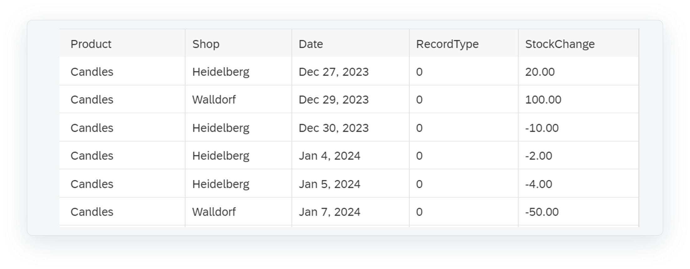

<!-- loio487d8a3c4377420aa8918996ebaf767b -->

# Example for a Non-Cumulative Measure

This is a simple example for using non-cumulative measures.

A candle manufacturer sells candles in two shops. The target requirement is the stock at the end of the year and an average stock per year.

This table shows the actual stock changes for candles in the two shops:

The non-cumulative measure calculates the stock with exception aggregation LAST on the time dimension \(based on the delta items\).

The calculation follows these steps:

-   The non-cumulative measure gets pre-aggregated over all the dimensions, except for the time dimension, which are not included in the drilldown.
-   The date values for the time dimension get filled using a left outer join with the time dimension view, considering the *Earliest Reporting Start Date* and the *Latest Reporting End Date*.
-   The stock values get filled for all dimension values without delta.
-   The handling of Null/0 values are considered.
-   Exception aggregation over time is calculated.

The data preview then looks like this, showing the original stock change measure, two non-cumulative measures with exception aggregation LAST and AVERAGE, combined with switching the property *Set Unbooked Values to 0* on and off.

The view by day is an intermediate step to make it easier to follow the calculation how the data aggregated for the month. When drilling down by day, no exception aggregation takes place.

1.  The sample data is filtered on "Heidelberg".
2.  These are the dimension values which are filled up using a left outer join to the values in the dimension table between the *Earliest Reporting Start Date* and the *Latest Reporting End Date*.
3.  These are the calculated stock values per day.
4.  These are Null values before the first movement which are filled up with 0, when the property *Set Unbooked Values to 0* is selected.
5.  The last stock for year 2023 is 10. As indicated by the dashed line, the initial stock of 20 gets reduced by 10. In year 2024, it gets further reduced by 2, and then by 4, without any new stock being delivered. So the last stock for 2024 is 4.

This is how the handling of Null values influences the calculation of AVERAGE:

1.  The Null values which were replaced by 0 are used in the average calculation \(80/8 = 10\).
2.  The Null values are ignored for the average calculation \(80/5 = 16\)x .

