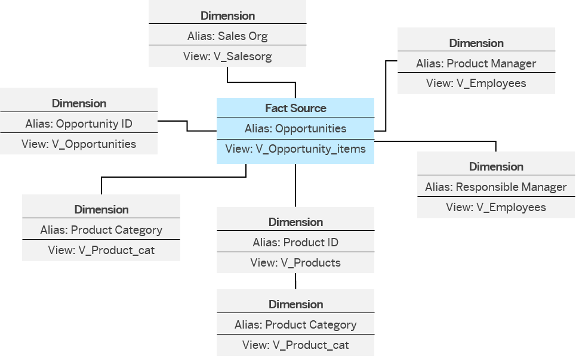
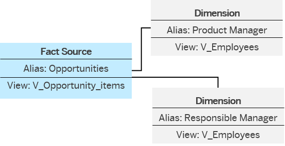

<!-- loiob05ddf48de704f8484804ea6cf953c8c -->

# What's a Dimension?

Dimensions contain attributes that can be used to analyze and categorize measures defined in other entities.

Typical types of dimensions include:

-   Geography - Region, Country, State, City
-   Product - Range, Category, Product
-   Customer
-   Organization - Company, Department, Organization Unit
-   Time - Year, Quarter, Month, Day

The source of your analytic model can contain associations to dimensions, texts, and hierarchies. Dimensions contain attributes that can be used to analyze and categorize measures defined in other entities. Attributes are used as dimensions in the analytic model. When you take over associated dimensions from your source, the object type is also taken over. Thus, you can easily build a multidimensional model in a star schema with the fact source in the center and the dimensions as direct associations.

These associations are supported:

-   Associations to dimensions \(associations to a table or a view with semantic usage Dimension\)
-   Associations to a text table \(associations to a table or a view with semantic usage Text\). They are automatically used by the analytic model if a dimension has a text association.
-   Association from a dimension to a hierarchy table. They are automatically used by the analytic model if a dimension has a hierarchy association.

You can also add dimensions of dimensions.

The graphic shows the star schema of the analytic model: the fact source is in the center and the dimensions are surrounding it. The dimension *Product ID* also has a dimension: *Product Category*.

Here, you can see that the same dimension can be included more than once. To be able to distiguish between the different roles of the dimension in the data preview and the story in SAP Analytics Cloud, you can give the dimensions different aliases. The alias enables you to give a dimension a more specific name for a field than the source provides.

> ### Example:  
> The dimension V\_Employees is included twice, but can be distiguished by the aliases *Responsible Manager*and *Product Manager*.

