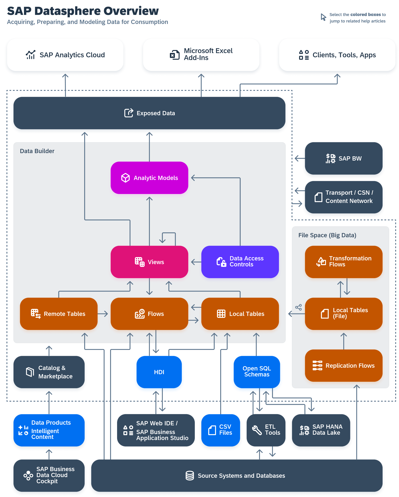

<!-- loiob4a5d02cefdf45478e7376860c985202 -->

<link rel="stylesheet" type="text/css" href="css/sap-icons.css"/>

# Acquiring, Preparing, and Modeling Data with SAP Datasphere

Users with a modeler role can bring data into the *Data Builder*, combine it, and prepare and model it for consumption in SAP Analytics Cloud and other BI clients.

> ### Tip:  
> The English version of this guide is open for contributions and feedback using GitHub. This allows you to get in contact with responsible authors of SAP Help Portal pages and the development team to discuss documentation-related issues. To contribute to this guide, or to provide feedback, choose the corresponding option on SAP Help Portal:
> 
> -    Feedback ** \> *Edit page*: Contribute to a documentation page. This option opens a pull request on GitHub.
> 
> -    Feedback ** \> *Create issue*: Provide feedback about a documentation page. This option opens an issue on GitHub.
> 
> 
> You need a GitHub account to use these options.
> 
> More information:
> 
> -   [Contribution Guidelines](https://help.sap.com/docs/open-documentation-initiative/contribution-guidelines/readme.html)
> 
> -   [Introduction Video: Open Documentation Initiative](https://www.youtube.com/watch?v=WJ0oarMlVW4)
> 
> -   [Blog Post: Introducing the Open Documentation Initiative](https://blogs.sap.com/2021/05/20/introducing-the-open-documentation-initiative/)

This diagram shows how you acquire data from sources, prepare and model it in SAP Datasphere, and expose it for consumption in SAP Analytics Cloud, Microsoft Excel, and other clients, tools, and apps.

-   Creating, Finding, and Sharing Objects - All SAP Datasphere users can use the *Repository Explorer* to browse objects. Users with a modeler role can create objects and otherwise act on them here or in the dedicated builder apps. Users with a catalog user role can, additionally, browse the *Catalog* for trusted data assets that have been published there. See [Creating, Finding, and Sharing Objects](Creating-Finding-Sharing-Objects/creating-finding-and-sharing-objects-6c69b30.md).
-   Browsing Data Products and Assets - Users with the *Catalog User* role can browse the *Catalog* to discover and use the high-quality trusted data and analytic assets, glossary terms, and key performance indicators published by administrators. See [Searching for Data Products and Assets in the Catalog](searching-for-data-products-and-assets-in-the-catalog-1047825.md).
-   Acquiring Data - Users with a modeler role can import data directly into the *Data Builder* from connections and other sources, and use flows to replicate, extract, transform and load data. See [Acquiring Data](Acquiring-and-Preparing-Data-in-the-Data-Builder/acquiring-data-1f15a29.md).
-   Preparing Data - Users with a modeler role can use views and intelligent lookups in the *Data Builder* to combine, clean, and otherwise prepare data. See [Preparing Data](preparing-data-f2e359c.md).
-   Modeling Data - Users with a modeler role can add semantic information to their entities and combine, refine, and enrich them in tightly-focused analytic models for consumption in SAP Analytics Cloud, Microsoft Excel, and other clients, apps, and tools. See [Modeling Data](Modeling-Data-in-the-Data-Builder/modeling-data-5c1e3d4.md).

