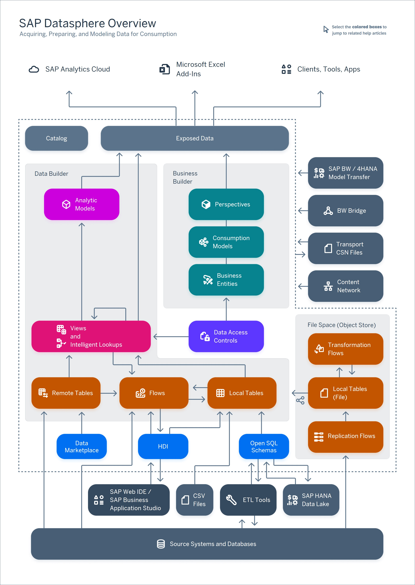

<!-- loiob4a5d02cefdf45478e7376860c985202 -->

<link rel="stylesheet" type="text/css" href="css/sap-icons.css"/>

# Acquiring, Preparing, and Modeling Data with SAP Datasphere

 Users with the *DW Modeler* role can bring data into the *Data Builder*, combine it \(including with external data from the *Data Marketplace*\) and prepare it for consumption in SAP Analytics Cloud and other BI clients either directly or after further modeling in the *Business Builder*.

> ### Tip:  
> The English version of this guide is open for contributions and feedback using GitHub. This allows you to get in contact with responsible authors of SAP Help Portal pages and the development team to discuss documentation-related issues. To contribute to this guide, or to provide feedback, choose the corresponding option on SAP Help Portal:
> 
> -   :pencil2:: Contribute to a documentation page. This option opens a pull request on GitHub.
> 
> -    Feedback: Provide feedback about a documentation page. This option opens an issue on GitHub.
> 
> 
> You need a GitHub account to use these options.
> 
> More information:
> 
> -   [Contribution Guidelines](https://help.sap.com/docs/open-documentation-initiative/contribution-guidelines/readme.html)
> 
> -   [Introduction Video: Open Documentation Initiative](https://www.youtube.com/watch?v=WJ0oarMlVW4)
> 
> -   [Blog Post: Introducing the Open Documentation Initiative](https://blogs.sap.com/2021/05/20/introducing-the-open-documentation-initiative/)

This diagram shows how you acquire data from sources, prepare and model it in SAP Datasphere, and expose it for consumption in SAP Analytics Cloud, Microsoft Excel, and other clients, tools, and apps.

-   Creating, Finding, and Sharing Objects - All SAP Datasphere users use the *Repository Explorer* to browse objects. Modelers can create objects and otherwise act on them here or in the dedicated builder apps. Users with the *Catalog User* role can, additionally, browse the *Catalog* for trusted data assets that have been published there. For more information, see [Creating, Finding, and Sharing Objects](Creating-Finding-Sharing-Objects/creating-finding-and-sharing-objects-6c69b30.md).
-   Purchasing External Data - Users with the *DW Modeler* role can purchase external data from the *Data Marketplace* to combine with and enrich their internal data. For more information, see [Purchasing Data from Data Marketplace](purchasing-data-from-data-marketplace-4096fb8.md).
-   Acquiring and Preparing Data - Users with the *DW Modeler* role can import data directly into the *Data Builder* from connections and other sources or use data flows to extract, transform and load data. They can then use views and intelligent lookups in the *Data Builder* to combine, clean, and otherwise prepare data. For more information, see [Acquiring and Preparing Data in the Data Builder](Acquiring-and-Preparing-Data-in-the-Data-Builder/acquiring-and-preparing-data-in-the-data-builder-1f15a29.md).
-   Modeling Data in the Data Builder - Users with the *DW Modeler* role can add semantic information to their entities and expose them directly or combine, refine, and enrich them in tightly-focused analytic models for consumption in SAP Analytics Cloud and other BI clients. For more information, see [Modeling Data in the Data Builder](Modeling-Data-in-the-Data-Builder/modeling-data-in-the-data-builder-5c1e3d4.md).
-   Modeling Data in the Business Builder - Users with the *DW Modeler* role can use the *Business Builder* editors to combine, refine, and enrich *Data Builder* objects and expose lightweight, tightly-focused perspectives for consumption by SAP Analytics Cloud and other BI clients. For more information, see [Modeling Data in the Business Builder](Buisiness-Builder/modeling-data-in-the-business-builder-3829d46.md).

