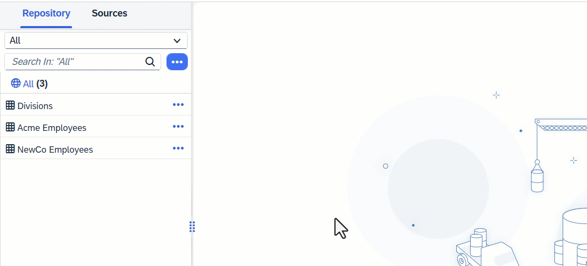

<!-- loio1eee180ff2cd450496967afdaab903e3 -->

<link rel="stylesheet" type="text/css" href="css/sap-icons.css"/>

# Add a Source to a Graphical View

Drag a table or view from the *Source Browser* panel and drop it on the diagram.

## Procedure

1.  If the *Source Browser* panel is not visible on the left of the screen, click *Source Browser* in the toolbar to show it.

2.  Browse or search for the object you want to add on either of the tabs.

    -   The *Repository* tab lists all the tables, views, and intelligent lookups that are available in the space \(including objects shared to the space\).. For more information, see [Add Objects from the Repository](add-objects-from-the-repository-13fcecd.md).

    -   The *Sources* tab lists all the connections and other data sources that have been integrated to the space from which you can import tables. However it shows only limited records. If you can't see the sources you are looking for, use *Import from Connection* to perform search. You can:

        -   Expand the data sources to browse through their objects \(see [Import an Object from a Connection or Other Source](import-an-object-from-a-connection-or-other-source-3e6f8f2.md)\).
        -   Open the *Import Objects from Connection* dialog on a particular connection to select multiple objects for import \(see [Import Multiple Objects from a Connection](import-multiple-objects-from-a-connection-e720b13.md)\).

3.  Select your object and drag and drop it onto the diagram.

     The source is added to the diagram, its symbol is selected, and its properties are displayed in the side panel. In addition, an output node, initially entitiled `View 1`, which represents the final output structure of the view, is created in the diagram and linked to the source.

    > ### Note:  
    > If you choose a table or view from the *Sources* tab, it is automatically imported into the repository and deployed, and will be available on the *Repository* tab for future use by you or others.

4.  If the source is a view or a table containing one or more input parameters \(see [Create an Input Parameter in a Graphical View](create-an-input-parameter-in-a-graphical-view-53fa99a.md)\), the *Map Input Parameters* dialog is displayed, and you must decide how each input parameter will be processed:

    -   *Map To* - Map the source input parameter to an input parameter in the view. You can select an existing input parameter or create a new one.

        Users of this view will need to provide a value for the input parameter.

    -   *Set Value* - Enter a value \(or use the value help, if available\) to resolve the input parameter.

        The input parameter is resolved and users of this view will no longer need to provide a value for it.

    > ### Note:  
    > You can click *Cancel* in the dialog and not map the input parameters immediately, but then an error is displayed on the source, and you must subsequently map them in the source side panel *Input Parameters* section.

    The source symbol displays the number of input parameters present in the source. In this example, the source view and output view both contain two input parameters::

    

5.  Click  \(Preview Data\) to open the *Data Preview* panel and review the data output by this node. For more information, see [Viewing Object Data](viewing-object-data-b338e4a.md).

