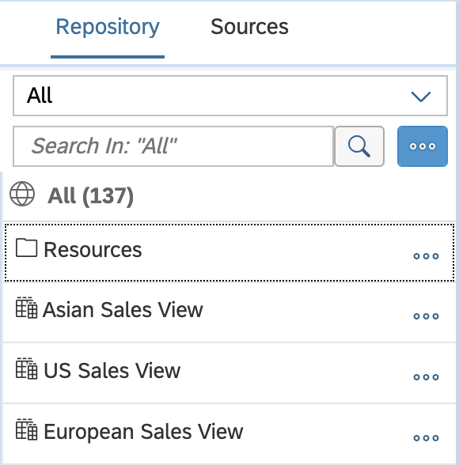

<!-- loio13fcecd59327407a91777c2e8e111bd7 -->

<link rel="stylesheet" type="text/css" href="css/sap-icons.css"/>

# Add Objects from the Repository

Drag objects from the *Repository* tab of the *Source Browser* to add them as sources in your data flow, graphical view, SQL view, or intelligent lookup. In an E/R model, you add objects to visualize them together in a diagram and prepare them for use in other editors.

## Procedure

1.  If the *Source Browser* panel is not visible on the left of the screen, click *Source Browser* in the toolbar to show it.

2.  Click the *Repository* tab.

    The *Repository* tab lists all the tables, views, and intelligent lookups that are available in the space \(including objects shared to the space\). You can filter and sort the list as follows:

    <table>
    <tr>
    <td valign="top">
    
    
    
    </td>
    <td valign="top">
    
    -   Select a *Collection*:
        -   *All* \(default\)
        -   *Recent* - Objects that you recently opened
        -   *My Objects* - Objects that you created
        -   *Shared* - Objects that are shared to your space
        -   *Favorites* - Objects that you have favorited

    -   Enter one or more characters in the *Search* field and press *Enter* \(or click *Search*\).

        As you type, the field will begin proposing objects and search strings. Select an object to open it directly. Click on a string to start a search on it.

    -   Click  \(More\) to access the *Sort* and *Filter* options.
    -   Click a folder in the list to drill down into and restrict your search to the folder.

    
    </td>
    </tr>
    </table>
    
3.  When you find an object, you can preview it before adding it. Click  \(More\) and select:

    -   *Show Info* - See additional properties and optionally open it in a new tab.
    -   *Show Data Preview* - Preview the object's data \(see [Viewing Object Data](viewing-object-data-b338e4a.md).

4.  Drag the object from the *Repository Browser* and drop it on the diagram.

    > ### Note:  
    > In an E/R model, you can additionally::
    > 
    > -   Add multiple objects simultaneously, click  \(Add from Repository\) to open the *Add Repository Object* dialog. Select the objects you want to import and click *OK*.
    > -   Add objects that are related to those already in the diagram \(see [Add Related Entities to an E/R Model Diagram](add-related-entities-to-an-e-r-model-diagram-bbde0a7.md)\).
    > -   Add objects from a CSN file \(see [Importing Objects from a CSN/JSON File](Creating-Finding-Sharing-Objects/importing-objects-from-a-csn-json-file-23599e6.md)\).

