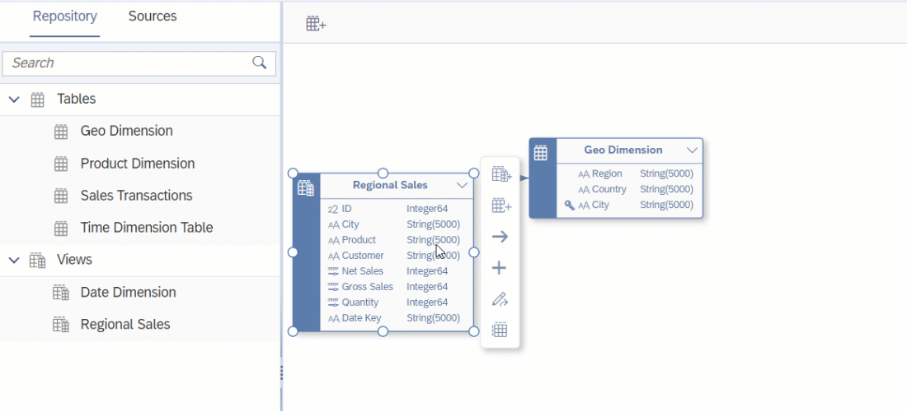

<!-- loiobbde0a7a23ef4c87afd1cc59cdefd33c -->

<link rel="stylesheet" type="text/css" href="css/sap-icons.css"/>

# Add Related Entities to an E/R Model Diagram

If a table or view in your E/R model diagram has previously been connected to other entities by associations, you can find these entities and add them to the diagram using the *Add Related Entities* dialog.

<a name="loiobbde0a7a23ef4c87afd1cc59cdefd33c__steps_gzm_1vd_jsb"/>

## Procedure

1.  Selecting the entity to open its context menu, and then click  \(Add Related Entities\) to open the *Select Object* dialog.

    Any entities that are connected to the current entity by an association and that aren't already present in the diagram are listed.

    Find available objects by entering the object's name in the search bar or click  \(Show filters\) and filter by *Semantic Usage* or other criteria. 

    

2.  Select the entities that you want to add to your diagram and click *Select*.

    The entities and the associations connecting them are added to the diagram.

