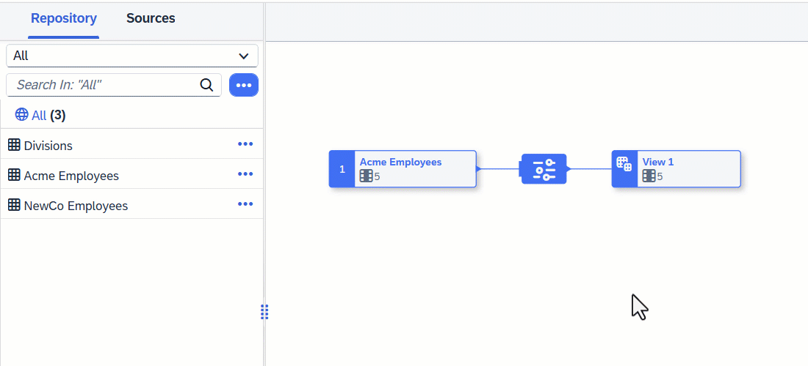

<!-- loio7733250f9d2a46b690a5288634d269f0 -->

<link rel="stylesheet" type="text/css" href="css/sap-icons.css"/>

# Aggregate Data in a Graphical View

Add an *Aggregation* node to perform `SUM`, `COUNT`, `MIN`, and `MAX` calculations. You group by any non-aggregated columns and can optionally filter by specifying a `HAVING` clause.

<a name="loio7733250f9d2a46b690a5288634d269f0__Steps"/>

## Procedure

1.  Identify one or more columns containing data that you want to aggregate.

    These columns \(which can include calculated columns\) must have a numerical data type, and will be used in the SQL `SELECT` clause.

2.  Identify one or more columns containing data that you want to group your aggregations by.

    These columns \(which can include calculated columns\) can have any data type, and will be used in the SQL `SELECT` clause.

3.  Create a projection node to exclude all columns except the column you want to aggregate or group by:

    For example, if you want to aggregate `Revenue` per `Country`, you should exclude all columns except `Revenue` and `Country`.

4.  Select the projection node in order to display its context tools, and click  \(Aggregation\).

     An *Aggregation* node is created, its symbol is selected, and its properties are displayed in the side panel.

5.  Optional. Rename the node in its side panel to clearly identify it. This name can be changed at any time and can contain only alphanumeric characters and underscores.

6.  In the *Columns* section, for each numeric column that you want to aggregate, click the `NONE` and select the appropriate aggregation function:

    -   `SUM`: calculate the total value
    -   `COUNT`: calculate the number of distinct values
    -   `MIN`: calculate the minimum value
    -   `MAX`: calculate the maximum value

    > ### Note:  
    > Any column for which you do not specify an aggregation function will be used in the `GROUP BY` clause to group the aggregations by unique values in that column. If you have two or more columns with no aggregation function specified, then they all will be used in the `GROUP BY` clause, with a row for each unique combination of values between them.

7.  \[optional\]. Enter an expression in the *Having* section to filter the aggregated data.

    For example, if you have aggregated your `Revenue` column using `SUM`, and want to show only:

    -   Total revenues of more than 1m, enter `SUM(Revenue) > 1000000`
    -   Total revenues for the US only, enter `Country='US'`

    You can use the following tools to help with entering your SQL expression:

    -   *Insert Values* - Enter a column name and operator in the field and then click this button to select values from that column to insert \(see [Insert Column Values in a SQL Expression](insert-column-values-in-a-sql-expression-e18c54b.md)\).
    -   *Validate* - Click to verify the syntax of your SQL and fix any errors signaled.
    -   *Functions* - Browse, select a category, or filter available functions \(see [SQL Functions Reference](sql-functions-reference-6d624a1.md)\). Click a function name to see its syntax or click elsewhere in its token to add it to your expression.
    -   *Columns* - Browse or filter available columns. Click a column name to see its properties or click elsewhere in its token to add it to your expression.
    -   *Parameters* - Browse or filter available input parameters \(see [Create an Input Parameter in a Graphical View](create-an-input-parameter-in-a-graphical-view-53fa99a.md)\). Click a parameter name to see its properties or click elsewhere in its token to add it to your expression.
    -   *Other* - Browse available operators, predicates, and case expressions, and click one to add it to your expression \(see [SQL Reference](sql-reference-6a37cc5.md)\).
    -    \(Enter Full Screen\) - Click to expand the expression editor.

8.  Click  \(Preview Data\) to open the *Data Preview* panel and review the data output by this node. For more information, see [Viewing Object Data](viewing-object-data-b338e4a.md).

