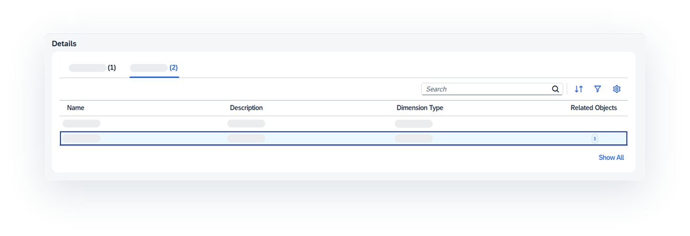
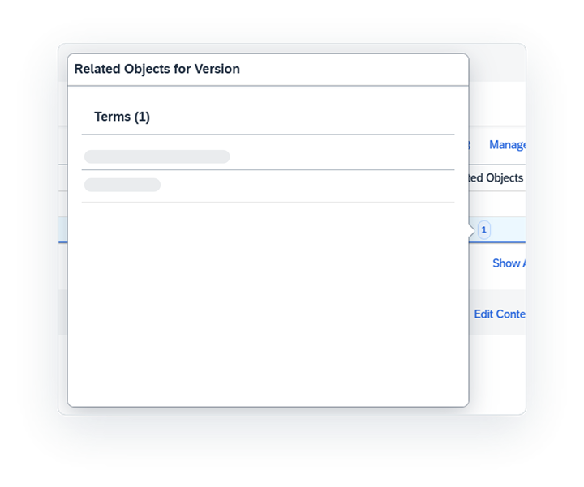
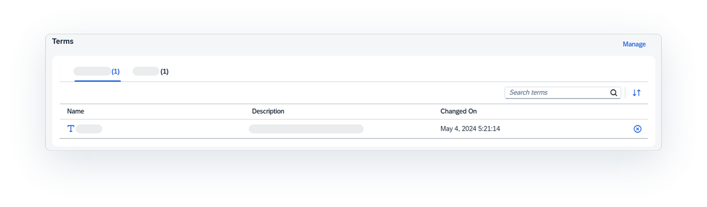
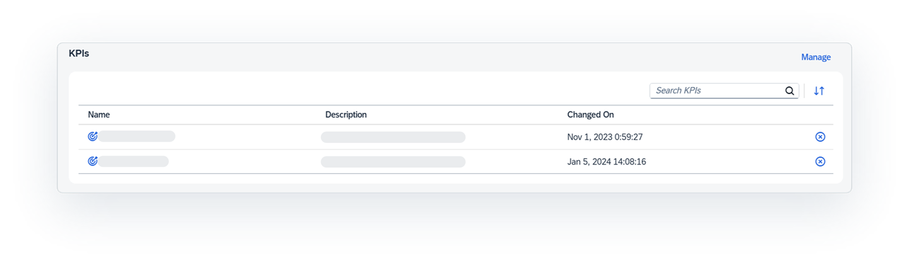
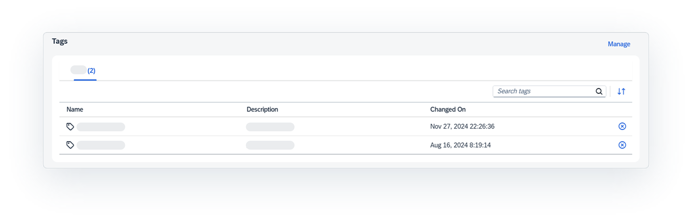
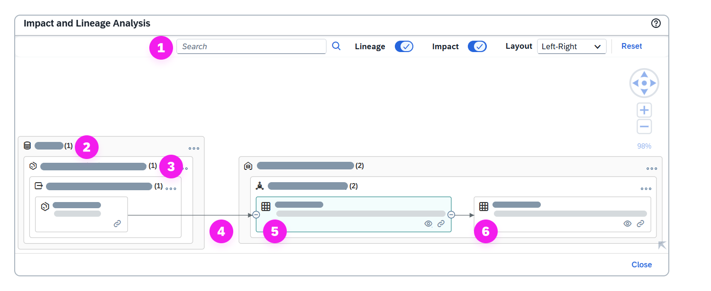
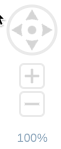

<!-- loioafccc581146542c485a52563167e23cc -->

<link rel="stylesheet" type="text/css" href="css/sap-icons.css"/>

# Catalog Asset Details

If you're interested in an asset, review its detailed information, which includes a preview of its detailed metadata and a diagram illustrating its impact and lineage. This information encompasses metadata from the source system and data enrichments incorporated in the catalog.

The catalog search results provide high-level information about assets, such as their names, data types, and short summaries. To learn more about an asset, choose it to view its details page. This page offers various types of information, including

-   Extracted metadata: asset name, properties, description, and impact and lineage diagram.
-   Data enrichments applied to the asset in the catalog: glossary terms, key performance indicators \(KPIs\), and tag relationships.

Use this information to evaluate and assess whether the asset suits your business task. For example, if you're a data modeler reviewing an asset's details, you can examine its metadata, description, and other semantic enrichments to decide if it should be added to your model. You can also view the impact and lineage diagram to see other objects it affects or is consumed by, as well as the data sources and transformations it underwent.

After reviewing the asset details, you can choose to view the asset in more details in its source system or use it in a new project \(see [Accessing Catalog Assets](accessing-catalog-assets-dc061a2.md)\).

The following table provides a list of object types that you'll be able to find in the *Assets* collection of the catalog:

<table>
<tr>
<th valign="top">

SAP Datasphere

</th>
<th valign="top">

SAP Analytics Cloud

</th>
<th valign="top">

BW Systems

</th>
</tr>
<tr>
<td valign="top">

-   Local Table
-   Remote Table
-   Graphical View
-   SQL View
-   Data Flow
-   Intelligent Lookup
-   Analytic Model
-   Perspective

</td>
<td valign="top">

-   Story
-   Model
-   Insight
-   Predictive Scenario
-   Data Action

</td>
<td valign="top">

-   ADSO \(Advanced DataStore Object\)
-   AREA \(InfoArea\)
-   ALVL \(Aggregation Level\) \(SAP BW∕4HANA and SAP BW 7.5\)
-   DEST \(Open Hub Destination\) \(SAP BW∕4HANA and SAP BW 7.5\)
-   DSUB \(Data Subscription\) \(SAP BW∕4HANA, and SAP BW 7.5\)
-   DTPA \(Data Transfer Process\)
-   ELEM \(BW Query\) \(SAP BW∕4HANA and SAP BW 7.5\)
-   FBPA \(Open ODS View\) \(SAP BW∕4HANA and SAP BW 7.5\)
-   HCPR \(HANA CompositeProvider\)
-   IOBJ \(InfoObject\)
-   LSYS \(Source System\)
-   RSDS \(DataSource\)
-   TRCS \(InfoSource\)
-   TRFN \(Transformation\)

</td>
</tr>
</table>

The asset details header provides high-level information about the asset and organizes the information as shown in the following table.

<table>
<tr>
<th valign="top">

Section

</th>
<th valign="top">

Description

</th>
</tr>
<tr>
<td valign="top">

Name, type, and status

</td>
<td valign="top">

Displays the asset's name and type, and displays its functional and publication status.

If the asset was enriched, the name displayed might not match the name of the underlying source object.

Users with the *Catalog User* role are only able to see published assets that are in the *Current* state. Users with the *Catalog Administrator* role can use the different functional and publication statuses to decide what actions are needed to keep the assets in good shape for catalog users. For information on the statuses, see [Enriching and Managing Catalog Assets](https://help.sap.com/viewer/aca3ccb4b2f84eb8b6154e8fd2812c0e/cloud/en-US/7ed60a094f2a464da6a8d75e5bfed9d5.html "To help catalog users quickly find and evaluate assets, you can enrich the assets by editing their names, adding both short and long descriptions, and adding relationships with terms, KPIs, and tags. You can also review the functional and publication status of the assets to ensure they are well-maintained and accessible.") :arrow_upper_right:.

</td>
</tr>
<tr>
<td valign="top">

Summary description

</td>
<td valign="top">

Displays a summary description of the asset. If you want a more detailed description, choose the *Documentation* tab.

</td>
</tr>
<tr>
<td valign="top">

Extraction system

</td>
<td valign="top">

Displays the name and type of systems that the asset is extracted from.

</td>
</tr>
<tr>
<td valign="top">

Catalog activity

</td>
<td valign="top">

Displays date and time when the asset was added to the catalog and when it was last updated. For example, you can see when the asset was added to the catalog and when it was last changed. You can also find the date and time when the asset was enriched on and published and by which user.

</td>
</tr>
</table>

In the header, you'll also be able to see a toolbar with actions available for all catalog users.

<table>
<tr>
<th valign="top">

Toolbar Actions

</th>
<th valign="top">

Description

</th>
</tr>
<tr>
<td valign="top">

*Open Impact and Lineage* 

</td>
<td valign="top">

Opens a dialog that displays the *Impact and Lineage Analysis* diagram. 

</td>
</tr>
<tr>
<td valign="top">

 \(Add to Favorites\) 

</td>
<td valign="top">

Adds frequently used assets to your favorites. 

</td>
</tr>
<tr>
<td valign="top">

*Open* 

</td>
<td valign="top">

Opens the asset in the source system where you can view or edit it. This button appears if you have permission to access the asset in the source system. 

</td>
</tr>
</table>

If you're a user with the *Catalog Administrator* role, you'll see additional actions in the toolbar.

<table>
<tr>
<th valign="top">

Toolbar Actions

</th>
<th valign="top">

Description

</th>
</tr>
<tr>
<td valign="top">

Publishing actions:

-   *Publish*

-   *Unpublish*

-   *Exclude*

</td>
<td valign="top">

Depending on the publishing status of the asset, publishes or unpublishes assets, or excludes assets from being automatically published to the catalog.

</td>
</tr>
<tr>
<td valign="top">

*Edit* 

</td>
<td valign="top">

Opens a dialog, where you can edit the asset's name and summary description to improve it for users who use the catalog.

</td>
</tr>
</table>

<a name="loioafccc581146542c485a52563167e23cc__section_zyl_jpl_bdc"/>

## Source Properties and Detailed Metadata for an Asset

To view the asset's properties that have been extracted from the source system, select *Overview* \> *Source*.

These properties are separated into the following groups: object properties and extraction system details. The properties that appear vary for each asset. This section describes the most common properties you'll encounter. Additional sections for asset properties can appear as needed. For example, the Open Hub Destination \(DEST\) asset from an SAP BW∕4HANA system will have a property group called **Destination Properties**. For details on properties not described here, see the help documentation for the source system.

-   [Acquiring, Preparing, and Modeling Data with SAP Datasphere](https://help.sap.com/docs/SAP_DATASPHERE/c8a54ee704e94e15926551293243fd1d/b4a5d02cefdf45478e7376860c985202.html)
-   [Welcome to the SAP Analytics Cloud Help](https://help.sap.com/docs/SAP_ANALYTICS_CLOUD/00f68c2e08b941f081002fd3691d86a7/1fb1f4ce92f44fc983debc25ac1f2cc9.html)
-   [SAP Datasphere, SAP BW bridge](https://help.sap.com/docs/SAP_BW_BRIDGE/107a6e8a38b74ede94c833ca3b7b6f51/f2a4eb578452482fbbcb9078a8e51551.html)
-   [SAP BW∕4HANA](https://help.sap.com/docs/SAP_BW4HANA/107a6e8a38b74ede94c833ca3b7b6f51/f2a4eb578452482fbbcb9078a8e51551.html)
-   [SAP BW 7.5](https://help.sap.com/docs/SAP_NETWEAVER_750/ccc9cdbdc6cd4eceaf1e5485b1bf8f4b/4a3739a65e291c67e10000000a42189c.html)

Object properties for an asset can include the following:

<table>
<tr>
<th valign="top">

Property

</th>
<th valign="top">

Description

</th>
</tr>
<tr>
<td valign="top">

Name

</td>
<td valign="top">

The file name of the asset on the source system. The name can also include a *Business Name* or a *Technical Name*. For example, assets in SAP Analytics Cloud have one name that appears. Assets in SAP Datasphere have a business name, which is the descriptive name of the asset that helps you identify the asset, and a technical name, which is the name that is used in scripts and code and is synchronized with the business name.

</td>
</tr>
<tr>
<td valign="top">

Location on the source system

</td>
<td valign="top">

The name of the location where the asset is saved on the source system. This information can be a path name, container name, InfoArea name, or other name where the object is saved on the source system. For example, the container name for assets in SAP Datasphere is the space name. The path name for assets in SAP Analytics Cloud is the folder name.

The container can also include a *Container Business Name*. For example, the container business name for assets in SAP Datasphere is a descriptive name for the space. For SAP Datasphere, only information for the space appears.

</td>
</tr>
<tr>
<td valign="top">

Description

</td>
<td valign="top">

The description of the asset as it appears in the source system.

</td>
</tr>
<tr>
<td valign="top">

Source object activity

</td>
<td valign="top">

The date and time on which the asset was created or changed in the source system. The name of the user who created the asset is also shown.

</td>
</tr>
<tr>
<td valign="top">

Type

</td>
<td valign="top">

The type of container where the asset is saved. The type appears for assets in the SAP Datasphere, and it is always  Space.

</td>
</tr>
</table>

Extraction system details for an asset include the source system's instance name and type. For example, the non-technical name given to an SAP Datasphere or SAP Analytics Cloud system.

For some SAP BW∕4HANA and SAP BW 7.5 objects additional property sections appear:

<table>
<tr>
<th valign="top">

Object Type

</th>
<th valign="top">

Additional Sections

</th>
</tr>
<tr>
<td valign="top">

Open ODS View \(FBPA\)

</td>
<td valign="top">

Semantics fact data, master data, and texts

</td>
</tr>
<tr>
<td valign="top">

Open Hub Destination \(DEST\)

</td>
<td valign="top">

Destination properties \(includes the following information: file and table names, schema, destination and database types, remote source, connection name, and more\)

</td>
</tr>
<tr>
<td valign="top">

Data Subscription \(DSUB\)

</td>
<td valign="top">

Subscription properties \(includes the following information: extraction mode, source BW object, selection, projection, and more\)

</td>
</tr>
</table>

You can see a preview of the detailed metadata about the asset by choosing *Overview* \> *Details*. The detailed metadata can include columns, attributes, measures, dimensions, and other properties specific to each object. This tab option appears only if the asset has detailed metadata that can be shown. Each tab in this section represents the metadata type, such as measures or attributes, and has a table with its data. The number in brackets is the total number of rows for the table, with the preview showing up to 20 rows. If there are more than 20 rows for the table, choose *Show All* to see the rest of the rows in a separate page.

> ### Note:  
> -   For assets in SAP Analytics Cloud, this section is available only for the following model types: planning and analytical models.
> 
> -   For assets in SAP Datasphere, if attributes, measures, and dimensions are available for the object in the source system, you will see them in this section with the following exceptions:
> 
>     -   For analytic models, only measures appear in this section.
>     -   For any asset with measures, the aggregation type does not appear if it is an inherited aggregation type or a calculated measure.

In addition to the preview of the detailed metadata, each metadata table has a column for *Related Objects*. If none of the rows have any object \(term or KPI\) relationships, the column is hidden. After the object relationships are added for one or more rows, the column appears and a button with the total number of object relationships appears for the row. You can choose the button to see the relationships for the row. To view the term or KPI details, choose the link in the dialog.

For each detailed metadata table available, you can use the toolbar to search for and organize the information:

<table>
<tr>
<th valign="top">

Tool

</th>
<th valign="top">

Description

</th>
</tr>
<tr>
<td valign="top">

 \(Search\)

</td>
<td valign="top">

Use the free-text search to search for a row by its name or description.

</td>
</tr>
<tr>
<td valign="top">

 \(Sort\)

</td>
<td valign="top">

Sort the rows in the table by ascending or descending order based on the column you select.

</td>
</tr>
<tr>
<td valign="top">

 \(Filter\)

</td>
<td valign="top">

Select column values for filtering the table.

</td>
</tr>
<tr>
<td valign="top">

 \(Group\)

</td>
<td valign="top">

Select how to group the table rows or leave them not grouped. This tool appears if the content can be organized into groups.

</td>
</tr>
<tr>
<td valign="top">

 \(Select Columns\)

</td>
<td valign="top">

Select which columns you want to show in the table.

</td>
</tr>
</table>

<a name="loioafccc581146542c485a52563167e23cc__section_b4h_zpl_bdc"/>

## Description and Semantic Enrichments for an Asset

You can view the asset’s description and semantic enrichments to get a better idea of how you can use the asset for your business needs.

**Viewing the Asset’s Description**

The summary description in the header provides a short description of the asset. However, to get a more detailed description of the asset, choose the *Documentation* tab. The information in this description can include rich text formatting, links to content, images, videos, and more. After reviewing this description, you can get a better idea of whether the asset meets your business needs and possibly get ideas on how you can use it.

**Viewing the Asset’s Semantic Enrichments**

Use the*Semantic Enrichment*tab to review glossary terms, tags, and KPIs that are assigned to the asset. The preview for each section shows up to 20 rows. To see more rows in a separate page, choose *Show All*.

**Semantic Enrichment Tab**

<table>
<tr>
<th valign="top">

Section Name

</th>
<th valign="top">

Description

</th>
</tr>
<tr>
<td valign="top">

Terms

</td>
<td valign="top">

Displays a list of business glossary terms that are linked to the asset. If the terms originate from several different glossaries, each glossary will be represented by its own tab. The number in brackets for the tab is the number of terms assigned from that glossary. To find a particular term within a glossary tab, use the free text search. 

</td>
</tr>
<tr>
<td valign="top">

KPIs

</td>
<td valign="top">

Displays a list of all key performance indicators \(KPIs\) that are linked to the asset. KPIs are used to track business requirements or goals. You can use the free text search to find a particular KPI linked to the asset.

</td>
</tr>
<tr>
<td valign="top">

Tags

</td>
<td valign="top">

Displays a hierarchical list of all tags that are linked to the asset. If the tags originate from several different tag hierarchies, each tag hierarchy will be represented by its own tab. The number in brackets for the tab is the number of tags assigned from that tag hierarchy. To find a particular tag within a tag hierarchy tab, use the free text search. 

</td>
</tr>
</table>

<a name="loioafccc581146542c485a52563167e23cc__section_qvh_3rl_bdc"/>

## Impact and Lineage Analysis Diagram for an Asset

Choose the *Open Impact and Lineage* button in the header to see a diagram for the analyzed asset. This diagram shows the object-level data analysis of an analyzed object and provides an end-to-end visualization of the object dependencies across multiple systems and layers. It can help you better understand the lineage \(also known as data provenance\) and impacts of a selected object in the catalog. Impact and lineage contain information about the source of the object, the transformations it goes through, its final state, and objects affected by changes made to it. Impact and lineage serve distinct purposes.

-   *Lineage* is displayed to the left of the analyzed object \(or below it\). It shows objects that the analyzed object uses as sources. It allows you to trace errors back to the root cause.
-   *Impact* is displayed to the right of the analyzed object \(or above it\). It shows objects that use the analyzed object as a source. It allows you to understand the impact of changes on dependent objects.

> ### Tip:  
> If you're a data provider, you can see the impact and lineage of your data products as long as you are a member of the spaces where the data products are installed. For more information about data providers, see [Data Sharing Cockpit - Data Provider's Guide](https://help.sap.com/viewer/e4059f908d16406492956e5dbcf142dc/cloud/en-US/e479b7b4c95741c7a7a1d42397984c7e.html "Users with a modeler role can create a data provider profile and publish data products to the Catalog & Marketplace.") :arrow_upper_right:.

This diagram provides the data analysis of the asset and contains the following features.

<table>
<tr>
<th valign="top">

Feature

</th>
<th valign="top">

Description

</th>
</tr>
<tr>
<td valign="top">

\(1\) Toolbar and Diagram Tools

</td>
<td valign="top">

Use the toolbar and diagram tools to control the layout of the diagram. choose *Reset* to restore the default layout.

</td>
</tr>
<tr>
<td valign="top">

\(2\) Outermost Container

</td>
<td valign="top">

The outermost container represents a source system \(for example,  SAP Datasphere or  SAP Analytics Cloud system\) or a  data provider.

Systems connected to and monitored by the catalog show their business or technical name. Systems not connected to the catalog show their system type with the text "unmonitored". The number in brackets indicates the total number of objects in the container that are part of the impact or lineage of the analyzed object.

You can expand or collapse the container, using the  \(Show/Hide All Objects\) menu on the top-right corner of the container.

</td>
</tr>
<tr>
<td valign="top">

\(3\) Inner Container

</td>
<td valign="top">

The inner container represents one of the following:

-   A location in the source system \(for example,  SAP Datasphere space or  SAP Analytics Cloud folder\). It contains objects that either appear in the lineage of or are impacted by the analyzed object. If an object is located within a sublocation \(for example, a subfolder\), you'll see a series of nested inner containers.
-   A :package: data product. The data product is visible if you have access and view permission for it. For example, you are a member of the context associated with it or if you are a member of the space where it has been installed. Also, you will be able to view the details to see a brief summary of the data product or open the data product page.

You can expand or collapse a container, using the  \(Show/Hide All Objects\) menu on the top-right corner of the container. The number in brackets indicates the total number of objects in the container that are part of the impact and lineage of the analyzed object.

</td>
</tr>
<tr>
<td valign="top">

\(4\) Unauthorized or Authorized Object

</td>
<td valign="top">

Unauthorized and authorized objects appear in the lineage or impact of the analyzed object.

-   Unauthorized objects are unpublished objects that you don't have access permission to in the source system. They are represented with the :lock: icon.

-   Authorized objects are published and can be discovered in the catalog. The icon in the top-left corner represents the object's type \(for example,  \(View\)\). The icon in the bottom-right corner represents the object's publication and functional statuses \(for example,  \(Published\) and  \(Current\).

    To learn more about an object select the object and then choose the  \(Show Details\) icon to preview the object's properties . If the object is available in the catalog, you can choose the  \(Open Object Details\) icon to view the details page for the object.

</td>
</tr>
<tr>
<td valign="top">

\(5\) Analyzed Object

</td>
<td valign="top">

The analyzed object appears as a light blue object. The icon in the top-left corner represents the object's type \(for example,  \(Story\),  \(Transformation\), or :package: data product\). The icon in the bottom-right corner represents the object's publication and functional statuses \(for example,  \(Published\) and  \(Current\).

You can show or hide the objects on either side of any object by choosing the  \(Show Next Level\) or  \(Hide All\) on the object.

</td>
</tr>
</table>

### Control Diagram Layout

Use the diagram tools to control the layout of the diagram.

<table>
<tr>
<th valign="top">

Tool

</th>
<th valign="top">

Description

</th>
</tr>
<tr>
<td valign="top">

Search

</td>
<td valign="top">

Find and select objects in the diagram. Results are proposed once three characters are entered. Click a result in the list to select the object symbol and highlight other objects on its path to the analyzed object.

</td>
</tr>
<tr>
<td valign="top">

Lineage

</td>
<td valign="top">

Enable/disable the display of the lineage of the analyzed object.

</td>
</tr>
<tr>
<td valign="top">

Impact

</td>
<td valign="top">

Enable/disable the display of the impacts of the analyzed object.

</td>
</tr>
<tr>
<td valign="top">

Layout

</td>
<td valign="top">

Change the orientation of the diagram:

-   *Left-Right* - \[default\] Display lineage objects on the left and impacts on the right of the analyzed object.
-   *Bottom-Top* - Display lineage objects below and impacts above the analyzed object.

</td>
</tr>
<tr>
<td valign="top">

Reset

</td>
<td valign="top">

Restore the default layout. Changing the mode also resets the layout.

</td>
</tr>
<tr>
<td valign="top">

</td>
<td valign="top">

Scroll, zoom, or recenter the diagram:

-   Click  \(or press [F6\]\) to zoom in.
-   Click  \(or press [F7\]\) to zoom out.
-   Click the center button \(or press [F8\]\) to fit to screen, [CTRL\]-click the center button \(or press [CTRL\] + [F5\] \) to zoom to 100% scale, or enter a percentage.
-   Click the arrow buttons \(or press the arrow keys\) to scroll horizontally or vertically.

</td>
</tr>
</table>

For information on how to use tools to further analyze the objects in SAP Datasphere, see [Impact and Lineage Analysis](impact-and-lineage-analysis-9da4892.md).

