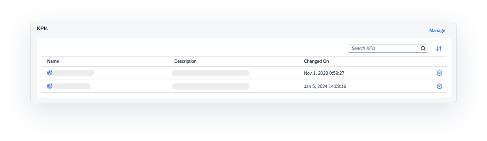

<!-- loioafccc581146542c485a52563167e23cc -->

<link rel="stylesheet" type="text/css" href="css/sap-icons.css"/>

# Catalog Asset Details

If you're interested in an asset, review its detailed information, which includes a preview of its detailed metadata and a diagram illustrating its impact and lineage. This information encompasses metadata from the source system and data enrichments incorporated in the catalog.

The catalog search results provides high-level information about an asset, including as its name, data type, and a short summary. If you want to know more about an asset, select it to view its details page that provides many different types of information about it, including the following:

-   Extracted metadata, like the asset name, properties, description, and impact and lineage diagram

-   Data enrichments that were applied to the asset in the catalog, such as glossary term, key performance indicator \(KPI\), and tag relationships

You can use the information provided to evaluate and make an assessment on whether the asset is the right one you need for your business task at hand. For example, if you're data modeler reviewing the details of an asset, you can review the asset's metadata, description, and other semantic enrichments to determine whether you should add it to your model. You can also view the impact and lineage diagram of that asset to see other assets it affects or is consumed by, as well as the data sources and transformations it underwent.

After reviewing the asset details, you can choose to view the asset in more details in its source system or use it in a new project \(see [Evaluating and Accessing Catalog Assets](evaluating-and-accessing-catalog-assets-dc061a2.md)\).

To get high-level information about the asset, review the header section.

**Asset Details Header**

<table>
<tr>
<th valign="top">

Section

</th>
<th valign="top">

Description

</th>
</tr>
<tr>
<td valign="top">

Name and Type

</td>
<td valign="top">

Displays the asset name and type. The name might not match the name of the underlying source object if it was enriched in the catalog.

</td>
</tr>
<tr>
<td valign="top">

Asset Status

</td>
<td valign="top">

Displays the functional and publication statuses of the asset.

Users with the *Catalog User* role are only able to see published assets that are in the *Current* state. Users with the *Catalog Administrator* role can use the different functional and publication statuses to decide what actions are needed to keep the assets in good shape for catalog users.

For information on the statuses, see [Enriching and Managing Catalog Assets](https://help.sap.com/viewer/97d1d2f0e35d410c893e95a5ff3bee6f/DEV_CURRENT/en-US/7ed60a094f2a464da6a8d75e5bfed9d5.html "To help catalog users quickly find and evaluate assets, you can enrich the assets by editing their names, adding both short and long descriptions, and adding relationships with terms, KPIs, and tags. You can also review the functional and publication status of the assets to ensure they are well-maintained and accessible.") :arrow_upper_right:.

</td>
</tr>
<tr>
<td valign="top">

Summary

</td>
<td valign="top">

Displays a summary description of the asset. If you want a more detailed description, select the *Documentation* tab.

</td>
</tr>
<tr>
<td valign="top">

Catalog Activity

</td>
<td valign="top">

Displays date and time when the asset was added to the catalog and when it was last updated. For example, you can see when the asset was added to the catalog and when it was last changed. You can also find the date and time when the asset was enriched on and published and by which user.

</td>
</tr>
<tr>
<td valign="top">

Toolbar

</td>
<td valign="top">

Select the action you want to perform on the asset.

-   *Open Impact and Lineage*: Opens a dialog that displays the *Impact and Lineage Analysis* diagram. 
-    \(Add to Favorites\): Adds frequently used assets to your favorites.
-   *Open*: Opens the asset in the source system where you can view or edit it. This button appears if you have permission to access the asset in the source system.

</td>
</tr>
<tr>
<td valign="top">

Tabs

</td>
<td valign="top">

Select a tab to view more information about the asset, such as an overview of the asset's properties from the source system, a more detailed description of the asset, semantic enrichments, and more.

</td>
</tr>
</table>

<a name="loioafccc581146542c485a52563167e23cc__section_zyl_jpl_bdc"/>

## Source Properties and Detailed Metadata for an Asset

To view the source properties that have been extracted from the source system for the asset, select *Overview* \> *Source*.

The following table shows some common source properties that are extracted from the source system. Other source properties that are specific to the asset and the source system can also appear within these source properties or under a separate heading for **Additional Source Properties**. For more information about properties not described here, see the documentation for the source system. 

**Common Source Properties**

<table>
<tr>
<th valign="top">

Property

</th>
<th valign="top">

Description

</th>
</tr>
<tr>
<td valign="top">

Name

</td>
<td valign="top">

The file name of the asset on the source system. The asset name can also include a *Business Name* or a *Technical Name*. For example, assets in SAP Analytics Cloud have one name that appears. Assets in SAP Datasphere have a business name, which is the descriptive name of the asset that helps you identify the asset, and a technical name, which is the name that is used in scripts and code and is synchronized with the business name.

</td>
</tr>
<tr>
<td valign="top">

System Name and Type

</td>
<td valign="top">

The source system name and type of system \(for example, SAP Datasphere or SAP Analytics Cloud\).

</td>
</tr>
<tr>
<td valign="top">

Created On

</td>
<td valign="top">

The date and time on which the asset was created on the source system. The name of the user who created the asset is also shown.

</td>
</tr>
<tr>
<td valign="top">

Changed On

</td>
<td valign="top">

The date and time on which the asset was changed on the source system. The name of the user who changed the asset is also shown.

</td>
</tr>
<tr>
<td valign="top">

Container Name and Container Business Name

</td>
<td valign="top">

The location name in the source system where the asset is saved. For example, the container name for assets in SAP Datasphere is the space name. The container name for assets in SAP Analytics Cloud is the parent folder name.

The container can also include a *Container Business Name*. For example, the container business name for assets in SAP Datasphere is a descriptive name for the space.

> ### Note:  
> For SAP Datasphere, only information for the space appears.

</td>
</tr>
<tr>
<td valign="top">

Path

</td>
<td valign="top">

Folder location of the asset, if available. This path does not appear for assets in SAP Datasphere.

</td>
</tr>
<tr>
<td valign="top">

Type

</td>
<td valign="top">

Type of container where the asset is saved. The type appears for assets in the SAP Datasphere, and it is always  Space.

</td>
</tr>
</table>

You can see a preview of the detailed metadata about the asset by selecting *Overview* \> *Details*. The detailed metadata can include columns, attributes, measures, dimensions, and other properties specific to each object. This tab option appears only if the asset has detailed metadata that can be shown. Each tab in this section represents the metadata type, such as measures or attributes, and has a table with its data. The number in brackets is the total number of rows for the table, with the preview showing up to 20 rows. If there are more than 20 rows for the table, select *Show All* to see the rest of the rows in a separate page.

> ### Note:  
> -   For assets in SAP Analytics Cloud, this section is available only for the following model types: planning and analytical models.
> 
> -   For assets in SAP Datasphere, if attributes, measures, and dimensions are available for the object in the source system, you will see them in this section with the following exceptions:
> 
>     -   For analytic models, only measures appear in this section.
>     -   For any asset with measures, the aggregation type does not appear if it is an inherited aggregation type or a calculated measure.
> 
>     For a list of supported object types, see [Connecting and Monitoring Source Systems](https://help.sap.com/viewer/97d1d2f0e35d410c893e95a5ff3bee6f/DEV_CURRENT/en-US/0b5de87f256f466f95b46d4bcaa52640.html "Users with a catalog administrator role can open the Metadata Extractions page to create connections from data sources to the catalog and then manage and monitor those data sources, allowing metadata for objects to be extracted and added to the catalog assets.") :arrow_upper_right:.

In addition to the preview of the detailed metadata, each metadata table has a column for *Related Objects*. If a row has one or more object \(term or KPI\) relationships, a button with the total number of object relationships is displayed. You can select the button to see the relationships for the row. To view the term or KPI details, select the link in the dialog.

For each detailed metadata table available, you can use the toolbar to search for and organize the information:

<table>
<tr>
<th valign="top">

Tool

</th>
<th valign="top">

Description

</th>
</tr>
<tr>
<td valign="top">

 \(Search\)

</td>
<td valign="top">

Use the free-text search to search for a row by its name or description.

</td>
</tr>
<tr>
<td valign="top">

 \(Sort\)

</td>
<td valign="top">

Sort the rows in the table by ascending or descending order based on the column you select.

</td>
</tr>
<tr>
<td valign="top">

 \(Filter\)

</td>
<td valign="top">

Select column values for filtering the table.

</td>
</tr>
<tr>
<td valign="top">

 \(Group\)

</td>
<td valign="top">

Select how to group the table rows or leave them not grouped. This tool appears if the content can be organized into groups.

</td>
</tr>
<tr>
<td valign="top">

 \(Select Columns\)

</td>
<td valign="top">

Select which columns you want to show in the table.

</td>
</tr>
</table>

For information on the metadata that appears in this tab, see the help documentation for the source system and search for the object you want to know more about:

-   For SAP Datasphere, see [Acquiring, Preparing, and Modeling Data with SAP Datasphere](acquiring-preparing-and-modeling-data-with-sap-datasphere-b4a5d02.md).

-   For SAP Analytics Cloud, see [Welcome to the SAP Analytics Cloud Help](https://help.sap.com/docs/SAP_ANALYTICS_CLOUD/00f68c2e08b941f081002fd3691d86a7/1fb1f4ce92f44fc983debc25ac1f2cc9.html).

-   For SAP Datasphere, SAP BW bridge, see [SAP Datasphere, SAP BW bridge](https://help.sap.com/docs/SAP_BW_BRIDGE/107a6e8a38b74ede94c833ca3b7b6f51/f2a4eb578452482fbbcb9078a8e51551.html).

<a name="loioafccc581146542c485a52563167e23cc__section_b4h_zpl_bdc"/>

## Description and Semantic Enrichments for an Asset

You can view the asset’s description and semantic enrichments to get a better idea of how you can use the asset for your business needs.

**Viewing the Asset’s Description**

The summary description in the header provides a short description of the asset. However, to get a more detailed description of the asset, select the *Documentation* tab. The information in this description can include rich text formatting, links to content, images, videos, and more. After reviewing this description, you can get a better idea of whether the asset meets your business needs and possibly get ideas on how you can use it.

**Viewing the Asset’s Semantic Enrichments**

Use the*Semantic Enrichment*tab to review glossary terms, tags, and KPIs that are assigned to the asset. The preview for each section shows up to 20 rows. To see more rows in a separate page, select *Show All*.

**Semantic Enrichment Tab**

<table>
<tr>
<th valign="top">

Section Name

</th>
<th valign="top">

Description

</th>
</tr>
<tr>
<td valign="top">

Terms

</td>
<td valign="top">

Displays a list of business glossary terms that are linked to the asset. If the terms originate from several different glossaries, each glossary will be represented by its own tab. The number in brackets for the tab is the number of terms assigned from that glossary. To find a particular term within a glossary tab, use the free text search. 

</td>
</tr>
<tr>
<td valign="top">

KPIs

</td>
<td valign="top">

Displays a list of all key performance indicators \(KPIs\) that are linked to the asset. KPIs are used to track business requirements or goals. You can use the free text search to find a particular KPI linked to the asset.

</td>
</tr>
<tr>
<td valign="top">

Tags

</td>
<td valign="top">

Displays a hierarchical list of all tags that are linked to the asset. If the tags originate from several different tag hierarchies, each tag hierarchy will be represented by its own tab. The number in brackets for the tab is the number of tags assigned from that tag hierarchy. To find a particular tag within a tag hierarchy tab, use the free text search. 

</td>
</tr>
</table>

<a name="loioafccc581146542c485a52563167e23cc__section_qvh_3rl_bdc"/>

## Impact and Lineage Analysis Diagram for an Asset

Select the *Open Impact and Lineage* button in the header to see a diagram for the analyzed asset. This diagram shows the data analysis of the analyzed object and provides an end-to-end visualization of the object dependencies across multiple systems and layers. It can help you better understand the lineage \(also known as data provenance\) and impacts of a selected object in the catalog. Impact and lineage contain information about the source of the object, the transformations it goes through, its final state, and objects affected by changes made to it. Impact and lineage serve distinct purposes.

-   *Lineage* is displayed to the left of the analyzed object \(or below it\). It shows objects that the analyzed object uses as sources. It allows you to trace errors back to the root cause.
-   *Impact* is displayed to the right of the analyzed object \(or above it\). It shows objects that use the analyzed object as a source. It allows you to understand the impact of changes on dependent objects.

> ### Tip:  
> If you're a data provider, you can see the impact and lineage of your data products as long as you are a member of the spaces where the data products are installed. For more information about data providers, see [Data Marketplace - Data Provider's Guide](https://help.sap.com/viewer/bb1899f0b39f415b9de29a845873d7af/DEV_CURRENT/en-US/e479b7b4c95741c7a7a1d42397984c7e.html "Users with a modeler role can create a data provider profile and publish data products to public, private, and internal Data Marketplaces.") :arrow_upper_right:.

This diagram provides the data analysis of the asset and contains the following features.

<table>
<tr>
<th valign="top">

Feature

</th>
<th valign="top">

Description

</th>
</tr>
<tr>
<td valign="top">

\(1\) Toolbar and Diagram Tools

</td>
<td valign="top">

Use the toolbar and diagram tools to control the layout of the diagram. Click *Reset* to restore the default layout.

</td>
</tr>
<tr>
<td valign="top">

\(2\) Outermost Container

</td>
<td valign="top">

The outermost container represents a source system \(for example,  SAP Datasphere or  SAP Analytics Cloud tenant\) or a  data provider.

The number in brackets indicates the total number of objects in the container that are part of the impact or lineage of the analyzed object. You can expand or collapse the container, using the  \(Show/Hide All Objects\) menu on the top-right corner of the container.

</td>
</tr>
<tr>
<td valign="top">

\(3\) Inner Container

</td>
<td valign="top">

The inner container represents one of the following:

-   A location in the source system \(for example,  SAP Datasphere space or  SAP Analytics Cloud folder\). It contains objects that either appear in the lineage or impact the analyzed object. If an object is located within a sublocation \(for example, a subfolder\), you'll see a series of nested inner containers.
-   A :package: data product. The data product is visible if you have access and view permission for it. For example, you are a member of the context associated with it or if you are a member of the space where it has been installed. Also, you will be able to view the details to see a brief summary of the data product or open the data product page.

You can expand or collapse a container, using the  \(Show/Hide All Objects\) menu on the top-right corner of the container. The number in brackets indicates the total number of objects in the container that are part of the impact and lineage of the analyzed object.

</td>
</tr>
<tr>
<td valign="top">

\(4\) Authorized Object

\(5\) Analyzed Object

\(6\) Unauthorized Object

</td>
<td valign="top">

Authorized and unauthorized objects appear in the lineage or impact of the analyzed object.

-   Authorized objects are published and can be discovered in the catalog. They have an icon that represents its type \(for example,  \(View\)\). Click the  \(Open Object Details\) icon to view the details page for the object.

-   The analyzed object appears as a light blue object. They have an icon that represents its type \(for example,  \(Story\) or  \(Transformation\)\).

-   Unauthorized objects are unpublished objects that you don't have access permission to in the source system. They are represented with the :lock: icon.

You can show or hide the objects on either side of any object by clicking the  \(Show Next Level\) or  \(Hide All\) on the object.

</td>
</tr>
</table>

For information on how to control the diagram layout and use tools to further analyze the objects, see [Impact and Lineage Analysis](impact-and-lineage-analysis-9da4892.md).

