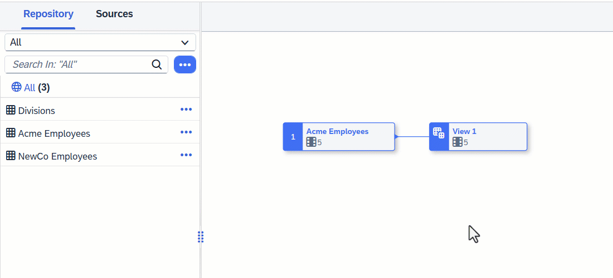

<!-- loio3897f480b9404e6f82de9bba410f17c0 -->

<link rel="stylesheet" type="text/css" href="css/sap-icons.css"/>

# Create a Calculated Column in a Graphical View

Add a *Calculated Columns* node to create new columns and define calculations in them.

## Procedure

1.  Select an object in order to display its context tools, and click  Calculated Columns.

    

    A calculated column node is created, its symbol is selected, and its properties are displayed in the side panel.

2.  Click  \(Add New Calculated Column\) to create a new column.

    The new column properties are displayed in the side panel.

3.  Enter a *Business Name* and a *Technical Name* for the column, and specify its *Data Type*.

4.  Enter a SQL expression into the *Expression* field.

    For example, if you want to calculate the price of a product minus a 15% discount, enter `Price*0.85`.

    You can use the following tools to help with entering your SQL expression:

    -   *Insert Values* - Enter a column name and operator in the field and then click this button to select values from that column to insert \(see [Insert Column Values in a SQL Expression](insert-column-values-in-a-sql-expression-e18c54b.md)\).
    -   *Validate* - Click to verify the syntax of your SQL and fix any errors signaled.
    -   *Functions* - Browse, select a category, or filter available functions \(see [SQL Functions Reference](sql-functions-reference-6d624a1.md)\). Click a function name to see its syntax or click elsewhere in its token to add it to your expression.
    -   *Columns* - Browse or filter available columns. Click a column name to see its properties or click elsewhere in its token to add it to your expression.
    -   *Parameters* - Browse or filter available input parameters \(see [Create an Input Parameter in a Graphical View](create-an-input-parameter-in-a-graphical-view-53fa99a.md)\). Click a parameter name to see its properties or click elsewhere in its token to add it to your expression.
    -   *Other* - Browse available operators, predicates, and case expressions, and click one to add it to your expression \(see [SQL Reference](sql-reference-6a37cc5.md)\).
    -    \(Enter Full Screen\) - Click to expand the expression editor.

5.  When you are satisfied, click the breadcrumbs at the top of the side panel to drill back up to the calculated column node properties.

6.  The list displays all the columns output by the node. You can:

    -   Filter the list with the *Search* box \(or by clicking  Hide Unmodified Columns\) and reorder it.
    -   Modify the expression output by any column by clicking on the chevron on the right of its token.
    -   Delete a column that has been created in the node by clicking  Delete Selected Calculated Column.

7.  Click  \(Preview Data\) to open the *Data Preview* panel and review the data output by this node. For more information, see [Viewing Object Data](viewing-object-data-b338e4a.md).

