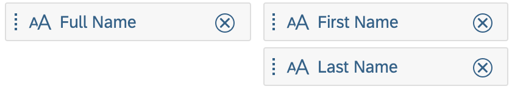
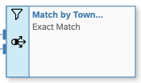

<!-- loiob063518d7a684051b66cc6d9681c8753 -->

<link rel="stylesheet" type="text/css" href="css/sap-icons.css"/>

# Create a Fuzzy Match Rule

Create a fuzzy match rule to compare strings in input entity columns with strings in lookup entity columns using a fault-tolerant search. Each match is allocated a percentage score and you can set thresholds for marking records as matched or requiring review.

## Context

A fuzzy match rule lets you broaden the search for matches to include data that is spread across multiple columns. It matches records based on the percentage of matching characters in selected columns using the SAP HANA fuzzy search.

## Procedure

1.  Click the rule node to open its properties panel and set the following properties in the *General* section:

    <table>
    <tr>
    <th valign="top">

    Property

    
    </th>
    <th valign="top">

    Description

    
    </th>
    </tr>
    <tr>
    <td valign="top">
    
    Business Name

    
    </td>
    <td valign="top">
    
    Enter a name for your rule to identify it in the diagram.

    
    </td>
    </tr>
    <tr>
    <td valign="top">
    
    Match Strategy

    
    </td>
    <td valign="top">
    
    Choose *Fuzzy Match* to display the *Match Thresholds* section.

    
    </td>
    </tr>
    <tr>
    <td valign="top">
    
    Input Scope

    
    </td>
    <td valign="top">
    
    \[read-only\] Specifies which input records are processed by the rule.

    
    </td>
    </tr>
    <tr>
    <td valign="top">
    
    Lookup Scope

    
    </td>
    <td valign="top">
    
    \[read-only\] Specifies which lookup records are available for matching by the rule.

    
    </td>
    </tr>
    </table>
    
2.  Set fuzzy match scores to decide when to place input records in the *Matched* and *Review* results categories.

    <table>
    <tr>
    <th valign="top">

    Property

    
    </th>
    <th valign="top">

    Description

    
    </th>
    </tr>
    <tr>
    <td valign="top">
    
    Matched Records Score

    
    </td>
    <td valign="top">
    
    Set the minimum score needed to match an input record with a lookup record and place it in the *Matched* results category. 

    If an input record is matched to more than one lookup records with a score reaching this threshold, it is placed in the *Multiple* results category.

    Default: `100%`

    
    </td>
    </tr>
    <tr>
    <td valign="top">
    
    Review Records Score

    
    </td>
    <td valign="top">
    
    Set the minimum score needed to match an input record with a lookup record and place it in the *Review* results category. 

    If an input record is matched to more than one lookup records with a score between this threshold and the *Matched Records Score*, it is placed in the *Multiple* results category.

    Default: `80%`

    
    </td>
    </tr>
    <tr>
    <td valign="top">
    
    Unmatched Records Score

    
    </td>
    <td valign="top">
    
    \[read-only\] Displays the score beneath which an input record cannot be matched. 

    If an input record is not matched to any lookup record with a score above this threshold, then it is placed in the *Unmatched* results category.

    
    </td>
    </tr>
    </table>
    
3.  Use the *Match Columns* section to specify columns to compare.

    Click  \(Add\), and select one or more string columns from each entity to compare. When you select more than one column on either side, the columns are concatenated together in the order in which they are displayed in the list.

    <table>
    <tr>
    <th valign="top">

    Example

    
    </th>
    <th valign="top">

    Match Criteria

    
    </th>
    </tr>
    <tr>
    <td valign="top">
    
    

    
    </td>
    <td valign="top">
    
    An input record is matched with a lookup record if:

    -   The value in the input `Last Name` column,
    -   Matches the value in the lookup `Last Name` column,
    -   With a score above the *Matched Records Score*.

    
    </td>
    </tr>
    <tr>
    <td valign="top">
    
    

    
    </td>
    <td valign="top">
    
    An input record is matched with a lookup record if the:

    -   The value obtained by concatenating the input `First Name` and `Last Name` columns,
    -   Matches the value obtained by concatenating the lookup `First Name` and `Last Name` columns,
    -   With a score above the *Matched Records Score*.

    
    </td>
    </tr>
    <tr>
    <td valign="top">
    
    

    
    </td>
    <td valign="top">
    
    An input record is matched with a lookup record if:

    -   The value in the input `Full Name` column,
    -   Matches the value obtained by concatenating the lookup `First Name` and `Last Name` columns,
    -   With a score above the *Matched Records Score*.

    
    </td>
    </tr>
    </table>
    
4.  \[optional\] Specify filters to restrict the records from your input and/or lookup entities that will be considered for matching in the rule using the following sections:

    -   *Input Records Filter* - Specify a filter expression to restrict the input records that are considered for matching in the rule. You can reference any of the columns in the input entity and use any standard operators.
    -   *Lookup Records Filter* - Specify a filter expression to restrict the lookup records that are considered for matching in the rule. You can reference any of the columns in the lookup entity and use any standard operators.

    For example entering `Revenue > 100000 AND Status = 'Active'` would restrict the records to be processed to only those meeting both these criteria. 

    If an *Input Records Filter* is defined, a filter symbol is displayed in the top-left corner of the rule symbol.

    

    If a *Lookup Records Filter* is defined, a filter symbol is displayed in the bottom-left corner of the rule symbol.

5.  \[optional\] Control auto-selection among multiple matches in the *Advanced Settings* section.

    <table>
    <tr>
    <th valign="top">

    Property

    
    </th>
    <th valign="top">

    Description

    
    </th>
    </tr>
    <tr>
    <td valign="top">
    
    Multiple Match Processing

    
    </td>
    <td valign="top">
    
    Enables auto-selection among multiple matches when one match candidate scores conclusively higher than any other. 

    The following settings are available:

    -   *Auto-Select* \[default\] - Automatically places pairing groups in the *Matched* results category if either of the following conditions is met :
        -   Only one match candidate has a 100% match score.
        -   Only one match candidate equals or exceeds the *Matched Record Score*.

    -   *Always Review Match Candidates* - Keeps pairing groups in the *Matched* results category to allow you to manually review them even if one of the above conditions is met.

    
    </td>
    </tr>
    </table>
    
6.  Save, deploy, and run your intelligent lookup to see the results of your rule.

    1.  Click  \(Deploy\) to save and deploy your intelligent lookup.

        If you have not previously saved the intelligent lookup, you will be prompted to provide a business and technical name for it. Enter appropriate names, and then click Save.

        > ### Note:  
        > You need to re-deploy your intelligent lookup each time your make a change to it. If you have pending changes, they will be saved automatically before deployment.

    2.  Once deployment is complete, click  \(Run\) to run the intelligent lookup and review the results.

