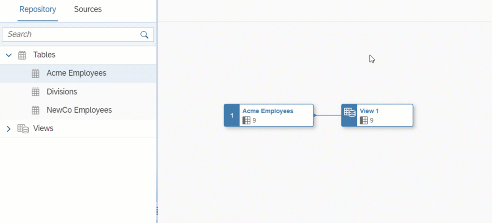

<!-- loio5c3d354a9cc9450984c14bf4b4ceefa9 -->

<link rel="stylesheet" type="text/css" href="css/sap-icons.css"/>

# Create a Union

Drag a source from the *Source Browser*, hover over a source or other node, and click *Union*. A union combines the results from two select statements on separate sources.

## Procedure

1.  If the *Source Browser* panel is not visible on the left of the screen, click *Source Browser* in the toolbar to show it.

2.  Browse or search for the object you want to add on either of the tabs.

    -   The *Repository* tab lists all the tables, views, and intelligent lookups that are available in the space \(including objects shared to the space\).. You can search and expand the categories \(see [Add Objects from the Repository](add-objects-from-the-repository-13fcecd.md)\).

    -   The *Sources* tab lists all the connections and other data sources that have been integrated to the space from which you can import tables. However it shows only limited records. If you can't see the sources you are looking for, use *Import from Connection* to perform search. You can:

        -   Expand the data sources to browse through their objects \(see [Import an Object from a Connection or Other Source](import-an-object-from-a-connection-or-other-source-3e6f8f2.md)\).
        -   Open the *Import Objects from Connection* dialog on a particular connection to select multiple objects for import \(see [Import Multiple Objects from a Connection](import-multiple-objects-from-a-connection-e720b13.md)\).

3.  Select the object of your choice, and then drag it over a source or other node in the diagram. Wait for the context menu to appear, slide your cursor over the *Union* option and then release the mouse button.

    

    The source is added to the diagram and it is unioned with the target node. The union symbol is selected and its properties are displayed in the side panel. You can add multiple tables to the union by dragging and dropping them on the union symbol.

    > ### Note:  
    > -   The union node should come last as you aren't able to add another object to an output after a union. If you do, you will experience technical issues. You can add sources to the nodes preceding the union node.
    > -   If you choose a table or view from the *Sources* tab, it is automatically imported into the repository and deployed, and will be available on the *Repository* tab for future use by you or others.

4.  Optional. Rename the node in its side panel to clearly identify it. This name can be changed at any time and can contain only alphanumeric characters and underscores.

5.  Set the following properties in the *General* section:

    <table>
    <tr>
    <th valign="top">

    Property
    
    </th>
    <th valign="top">

    Description
    
    </th>
    </tr>
    <tr>
    <td valign="top">
    
    Union All
    
    </td>
    <td valign="top">
    
    Default option and fastest to create. It combines two or more `SELECT` statements or queries and includes all rows, including duplicates. Disabling this option applies *Union*.
    
    </td>
    </tr>
    <tr>
    <td valign="top">
    
    Union
    
    </td>
    <td valign="top">
    
    It combines the result set of two or more `SELECT` statements or queries \(only distinct values\) and returns fewer rows. It takes longer to create it because it removes duplicate rows.
    
    </td>
    </tr>
    </table>
    
6.  The *Mappings* section shows, by default, the recently dropped source object columns on the left and the union output colums, initialized from the target source columns on the right.

    -   Mappings are automatically created by matching column names where possible.
    -   To manually map input columns to union output columns, drag a column from the left list and drop it onto a column in the right list.
    -   To delete a mapping, click the link and then click the *Delete* tool.
    -   You can filter the *Mappings* section to show only mapped or unmapped pairs of columns.
    -   You can filter or sort the left or right column lists independently.
    -   You can modify the list of union output columns using the Menu above the right list:
        -   *Add All Source Columns as Union Columns* - Add all columns in the left list to the right list \(if they are not already present\).
        -   *Add Selected Source Columns as Union Columns* - Add columns selected in the left list to the right list \(if they are not already present\).
        -   *Delete Selected Union Columns* - Delete any columns selected in the right list so that they are no longer union output columns.
        -   *Delete All Union Columns* - Delete all columns in the right list so that they are no longer union output columns.

    -   To switch to viewing another input, click the drop-down arrow above the left column list and select it in the list.

7.  Optional. Drop another source object onto the union node to union it with the existing unioned sources.

    The source is added to the diagram and added to the union node. The union symbol is selected, its properties are displayed in the side panel, the new source is displayed in the *Mappings* section and its columns are mapped automatically by matching column names where possible.

8.  Click  \(Preview Data\) to open the *Data Preview* panel and review the data output by this node. For more information, see [Viewing or Previewing Data in Data Builder Objects](viewing-or-previewing-data-in-data-builder-objects-b338e4a.md).

<a name="loio5c3d354a9cc9450984c14bf4b4ceefa9__postreq_bds_dvq_lnb"/>

## Next Steps

