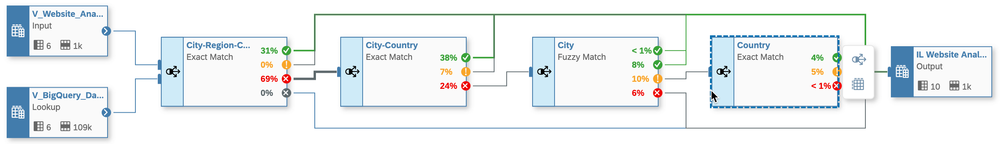
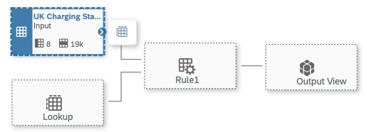
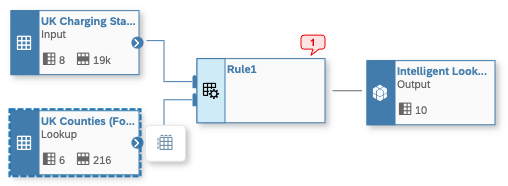

<!-- loio8f29f801faea4d48816d0339777f9d16 -->

<link rel="stylesheet" type="text/css" href="css/sap-icons.css"/>

# Creating an Intelligent Lookup

Create an intelligent lookup to merge data from two entities even if there are problems joining them. Intelligent lookup offers a business-centric, interactive data harmonization environment for subject matter experts.

## Context

> ### Note:  
> The following privileges are required to work with intelligent lookups:
> 
> 
> <table>
> <tr>
> <th valign="top">
> 
> Action
> 
> </th>
> <th valign="top">
> 
> Requires Privileges
> 
> </th>
> <th valign="top">
> 
> Contained in Standard Roles
> 
> </th>
> </tr>
> <tr>
> <td valign="top">
> 
> Create, edit, deploy, delete intelligent lookups
> 
> </td>
> <td valign="top">
> 
> *Data Warehouse Data Builder* \(CRUD----\)
> 
> </td>
> <td valign="top">
> 
> *DW Modeler*
> 
> </td>
> </tr>
> <tr>
> <td valign="top">
> 
> Run intelligent lookups and process results
> 
> </td>
> <td valign="top">
> 
> *Data Warehouse Data Integration* \(--U-----\)
> 
> </td>
> <td valign="top">
> 
> *DW Integrator*
> 
> </td>
> </tr>
> </table>
> 
> For more information about the roles and privileges needed to work with editors, see [Roles and Privileges by App and Feature](https://help.sap.com/viewer/935116dd7c324355803d4b85809cec97/DEV_CURRENT/en-US/2d8b7d04dcae402f911d119437ce0a74.html "Review the standard roles and the privileges needed to access apps, tools, and other features of SAP Datasphere.") :arrow_upper_right:.

When combining data, there may be no column in your primary entity that contains data to uniquely identify a record in the other entity, and which would thus allow the creation of a standard join. Or, if such a column \(a *foreign key*\) exists, its data may be incomplete or unreliable. This can be particularly common when one of the entities comes from outside your organization. It may require a lot of manual work in spreadsheets to join the entities, and the results of this work may not be easy to reuse when new data arrives.

An intelligent lookup lets you iteratively join entities by defining rules to match records and then reviewing and processing the results.

In this example, we use fuzzy matching to enrich a view containing 19,000 UK electric vehicle charging points with accurate UK county names:

For more information, see [Example: Harmonizing County Data for UK Charging Sites](example-harmonizing-county-data-for-uk-charging-sites-4995ae3.md).

In this example, we use a series of rules to iteratively join our website analytics view with a view providing latitude and longitude data for more than 100,000 cities around the world:

For more information, see [Example: Adding Latitude and Longitude Data with a Multi-Rule Intelligent Lookup](example-adding-latitude-and-longitude-data-with-a-multi-rule-intelligent-lookup-dfd5ffd.md).

See the blog [One-Stop-Shop to Intelligent Lookup in SAP Datasphere](https://blogs.sap.com/2021/12/21/one-stop-shop-to-intelligent-lookup-in-sap-data-warehouse-cloud/) \(published in December 2021\) for links to blogs and videos providing further information about intelligent lookup.

## Procedure

1.  In the side navigation area, click  \(*Data Builder*\), select a space if necessary, and click *New Intelligent Lookup* to open the editor.

2.  Select your input entity:

    1.  Drag the table or view that you want to enrich from the *Source Browser* panel and drop it on the *Input* placeholder \(see [Prepare Input and Lookup Entities](prepare-input-and-lookup-entities-1fc32b5.md)\).

        

    2.  In the *Input* node side panel, identify your pairing column by dragging it from the *Columns* section, and dropping it in the *Pairing Column* section.

        You should choose: 

        -   A column intended to identify individual objects of the type stored in the lookup table. These columns often end in *ID* \(such as a `Product ID`, `Customer ID`, or `Building ID`\) or are some other kind of unique identifier, like `Email Address`.
        -   If such a column does not exist, you may choose to create a calculated column and concatenate values from other columns into it to provide unique identifier values.
        -   If the column does not exist and cannot be easily created, or if the objects in the input and lookup entities are of the same type, select the key column.

3.  Select your lookup entity \(see [Prepare Input and Lookup Entities](prepare-input-and-lookup-entities-1fc32b5.md)\):

    1.  Drag the table or view containing the columns you want to use to enrich your input entity from the *Source Browser* panel and drop it on the *Lookup* placeholder.

        

    2.  In the *Lookup* node side panel, identify the columns you want to add to your input entity by dragging them from the *Columns* section and dropping them in the *Return Columns* section.

4.  Click the *Rule* node and choose a strategy to compare values in one or more columns of your input and lookup entities:

    -   *Exact Match* - Require exact matches between values in input entity columns and lookup entity columns \(see [Create an Exact Match Rule](create-an-exact-match-rule-897d26c.md)\).
    -   *Fuzzy Match* - Search across one or more string columns and set threshold scores for determining matches \(see [Create a Fuzzy Match Rule](create-a-fuzzy-match-rule-b063518.md)\).

5.  Click the *Output* node and configure the view that will be output by your intelligent lookup.

    You can set the name of the view, choose to include unmatched records in it, review its columns, and set default values to insert into the return columns of unmatched records \(see [Configure the View Output by an Intelligent Lookup](configure-the-view-output-by-an-intelligent-lookup-aa11efb.md)\).

6.  Deploy and run the intelligent lookup:

    1.  Click  \(Deploy\) , enter business and technical names in the *Save Intelligent Lookup* dialog, then click *Save*.

    2.  Once deployment is complete, click  \(Run\) to run the intelligent lookup and review the results.

        

        Once the run is complete, the color-coded results of the rule are displayed on its symbol as percentages of the input records.

7.  Select the rule node and then click  \(Preview Data\) to open the *Preview Data* panel and process the results in the various tabs:

    

    -   *Matched* \(Green\) - Matched results are input records that are matched with a lookup record. 

        You can reject any matches that you do not agree with. See [Process Matched Results](process-matched-results-f3d98b1.md).

    -   *Review* \(Green\) - \[fuzzy rules only\] Review results are input records that are matched with a lookup record with a score between the *Review* and *Matched* thresholds. 

        You can approve or reject proposed matches. See [Process Review Results](process-review-results-dc05926.md).

    -   *Multiple* \(Yellow\) - Multiple results are input records that are matched with two or more lookup records. 

        You can choose among the match candidates or apply a new rule to them. See [Process Multiple Match Results](process-multiple-match-results-cb2b78a.md).

    -   *Unmatched* \(Red\) - Unmatched results are input records that are not matched with any lookup record. 

        You can try to manually match them or apply a new rule to them. See [Process Unmatched Results](process-unmatched-results-35fbb44.md).

    -   *Unprocessed* \(Grey\) - Unprocessed records were not present the last time that the rule was run. 

        You can re-run your intelligent lookup to process these records.

        > ### Note:  
        > Only records that have new pairing column values are included here. New records that have the same pairing column value as an existing pairing group are automatically placed in the appropriate results category for that pairing group.

8.  If necessary, modify your rule or add further rules to refine your output.

    > ### Note:  
    > You are not required to match all records. You can stop at any time when the view produced by the intelligent lookup is satisfactory for your needs.

    To add a further rule, select a rule node, click the *Add Rule* button and then click:

    -   *Add Rule for Multiple Matches* - To apply a new rule to the records in the *Multiple* category of the present rule. The two rules are combined using an `AND` logic with the new rule applied to the match candidates produced by the present rule.
    -   *Add Rule for Unmatched Records* - To apply a new rule to the records in the *Unmatched* category of the present rule.

    

    > ### Note:  
    > If you modify a rule after having run the intelligent lookup, you are prompted to delete all the results from it and any subsequent rules. You can choose to keep or delete user-confirmed matches \(that you have confirmed on the *Review* tab or manually matched on the *Multiple* or *Unmatched* tabs\).
    > 
    > You can choose to delete all matches at any time by clicking the *Delete All Matches* button on the main toolbar.
    > 
    > If you modify a rule or add a new rule, you must redeploy the intelligent lookup before you can rerun it.

