<!-- loio54fd00ddd0b24ccc9ce0fa55297bc13d -->

<link rel="stylesheet" type="text/css" href="css/sap-icons.css"/>

# Data Pipeline Analyzer

The *Data Pipeline Analyzer* enables you to monitor complex data models efficiently, allowing you to view and analyze errors, warnings, and data discrepancies in real-time. It quickly identifies data transfer failures, allowing you to take immediate action to resolve them.

The *Data Pipeline Analyzer* helps you view and analyze errors, warnings, or data discrepancies for a selected object, so that you can understand the point of data transfer failure. It focuses on node status indicators, error analysis, and navigation options. This tool is useful for identifying and resolving data transfer failures, ensuring efficient monitoring and troubleshooting of data flows within complex data models.

## Prerequisites

To launch the *Data Pipeline Analyzer*, you must have a scoped role that grants you access to a space with the following privileges:

-   **Data Warehouse General** \(-**R**------\) - To access SAP Datasphere.
-   **Data Warehouse Data Integration** \(-**R**------\) or **Data Warehouse Data Builder** \(-R------\) To start the *Data Pipeline Analyzer* 

The *DW Integrator* or *DW Modeler* role template, for example, grants these privileges. For more information, see [Privileges and Permissions](https://help.sap.com/viewer/9f804b8efa8043539289f42f372c4862/cloud/en-US/d7350c6823a14733a7a5727bad8371aa.html "A privilege represents a task or an area in SAP Datasphere and can be assigned to a specific role. The actions that can be performed in the area are determined by the permissions assigned to a privilege.") :arrow_upper_right: and [Standard Roles Delivered with SAP Datasphere](https://help.sap.com/viewer/9f804b8efa8043539289f42f372c4862/cloud/en-US/a50a51d80d5746c9b805a2aacbb7e4ee.html "SAP Datasphere is delivered with several standard roles. A standard role includes a predefined set of privileges and permissions.") :arrow_upper_right:.

In addition, to perform actions \(such as Run\) and solve identified issues, you must have a scoped role that grants you access to a space with the following privileges:

-   **Data Warehouse Data Integration** \(--**U**-----\) - To manually run data integration tasks.

The *DW Integrator* role template, for example, grants these privileges. For more information, see [Privileges and Permissions](https://help.sap.com/viewer/9f804b8efa8043539289f42f372c4862/cloud/en-US/d7350c6823a14733a7a5727bad8371aa.html "A privilege represents a task or an area in SAP Datasphere and can be assigned to a specific role. The actions that can be performed in the area are determined by the permissions assigned to a privilege.") :arrow_upper_right: and [Standard Roles Delivered with SAP Datasphere](https://help.sap.com/viewer/9f804b8efa8043539289f42f372c4862/cloud/en-US/a50a51d80d5746c9b805a2aacbb7e4ee.html "SAP Datasphere is delivered with several standard roles. A standard role includes a predefined set of privileges and permissions.") :arrow_upper_right:

## Open The Data Pipeline Analyzer

You can open the *Data Pipeline Analyzer* from various screens:

-   In the *Data Builder*, from the local table, view, or analytic model editors, select an object to analyze and click  \(Open Data Pipeline Analyzer\) in the toolbar.
-   In the *Data Integration Monitor*, from the details screen of a local table or a view, click  \(Open Data Pipeline Analyzer\).

> ### Example:  
> I have opened my analytic model and clicked  \(Open Data Pipeline Analyzer\):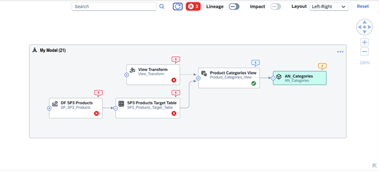
> 
> In this short example, I can quickly see that I have 3 errors \(in red\) in my source objects and that my model has a warning \(orange\). I must correct the “red” errors to turn my analytic model into a green state.

## Control The Data Pipeline Analyzer Layout

**Use the diagram tools to control the layout of the diagram.**

<table>
<tr>
<th valign="top">

Tool

</th>
<th valign="top">

Description

</th>
</tr>
<tr>
<td valign="top">

:mag:

</td>
<td valign="top">

Find and select objects in the diagram. Results are proposed once three characters are entered. Click a result in the list to select the object symbol and highlight other objects on its path to the analyzed object.

</td>
</tr>
<tr>
<td valign="top">

 \(Refresh\)

</td>
<td valign="top">

Perform a global refresh action to refresh the status of all objects.

</td>
</tr>
<tr>
<td valign="top">

 \(Message Button\)

</td>
<td valign="top">

Display the related messages on the model level. The design and color of the button will change to indicate the level of issues \( Error/Warning/Information/Success cases\) from red to green, where red is the most critical error and green means no issue.

</td>
</tr>
<tr>
<td valign="top">

Lineage

</td>
<td valign="top">

Enable/disable the display of the lineage of the analyzed object.

</td>
</tr>
<tr>
<td valign="top">

Impact

</td>
<td valign="top">

Enable/disable the display of the impacts of the analyzed object.

It's unavailable for the *Data Pipeline Analyzer* and therefore can't be enabled.

</td>
</tr>
<tr>
<td valign="top">

Layout

</td>
<td valign="top">

Change the orientation of the diagram:

-   *Left-Right* - \[default\] Display lineage objects on the left and impacts on the right of the analyzed object.
-   *Bottom-Top* - Display lineage objects below and impacts above the analyzed object.

</td>
</tr>
<tr>
<td valign="top">

Reset

</td>
<td valign="top">

Restore the default layout. Changing the mode also resets the layout.

</td>
</tr>
<tr>
<td valign="top">

</td>
<td valign="top">

Scroll, zoom, or recenter the diagram:

-   Click  \(or press [F6\]\) to zoom in.
-   Click  \(or press [F7\]\) to zoom out.
-   Click the center button \(or press [F8\]\) to fit to screen, [CTRL\]-click the center button \(or press [CTRL\] + [F5\] \) to zoom to 100% scale, or enter a percentage.
-   Click the arrow buttons \(or press the arrow keys\) to scroll horizontally or vertically.

</td>
</tr>
</table>

## Understand The Symbols

**The symbols and their meaning**

<table>
<tr>
<th valign="top">

Symbol

</th>
<th valign="top">

Description

</th>
</tr>
<tr>
<td valign="top">

 \(Notification bubbles\)

</td>
<td valign="top">

The Notification Bubbles are displayed with different colors depending of the type of information: red for errors, orange for warning and blue for information. They indicate which objects have issues and will provide more info in a detailed message with specific actions to fix the issue.

The number will always be 1 because it tracks only the last recent error, not all the errors of the entire life cycle of a particular object.

</td>
</tr>
<tr>
<td valign="top">

 \(Icons\)

</td>
<td valign="top">

The icons indicate the run status of an object. They are displayed with the usual color code: Red for errors, orange for warning, blue for information and green for successful run.

</td>
</tr>
<tr>
<td valign="top">

 \(Inbound Buffer\)

</td>
<td valign="top">

\[Local tables \(files\) only\] - The inbound buffer icon is displayed if a merge task is running or has to be run to make data update visible. For more information, see [Merge or Optimize Your Local Tables (File)](https://help.sap.com/viewer/be5967d099974c69b77f4549425ca4c0/cloud/en-US/e533b154ed3e49ce9a03e4421a5296e7.html "Local Tables (File) can store large quantities of data in the object store. You can manage this file storage with merge or optimize tasks, and allocate the required amount of compute resources that the file space can consume when processing these tasks.") :arrow_upper_right: 

</td>
</tr>
<tr>
<td valign="top">

––– \(Dotted Line between 2 nodes\)

</td>
<td valign="top">

The dotted line between 2 objects indicates if there are hidden objects between the 2 displayed objects.

</td>
</tr>
</table>

## Display the Objects

**Display the objects**

<table>
<tr>
<th valign="top">

Menu Paths

</th>
<th valign="top">

Description

</th>
</tr>
<tr>
<td valign="top">

*Show Next Level* and *Show Full Branch*

</td>
<td valign="top">

Expand the nodes by clicking on Left Port to open the hidden lineage objects using either *Show Next Level*\(the immediate lineage object node will be displayed\) or *Show Full Branch* \(all the lineage objects will be displayed\) menu .

> ### Note:  
> The lineage Toggle Button is checked when the whole diagram is displayed.

</td>
</tr>
<tr>
<td valign="top">

*Unauthorized Space*

</td>
<td valign="top">

If you don’t have permission to access a space, then that space will be unclickable with the :lock: Icon

</td>
</tr>
<tr>
<td valign="top">

*Unauthorized Node*

</td>
<td valign="top">

If you do not have permission to view an object, it is shown with the :lock: icon and the name **Unauthorized**.

Note: if a problematic object is in an Unauthorized Space, the monitor indicates from which space and which node the problematic data is coming from. You can share this information with the administrator to get support.

</td>
</tr>
</table>

Select an object to display its context menu, which contains tools for furthering the analysis.

**Object Icons**

<table>
<tr>
<th valign="top">

Icon

</th>
<th valign="top">

Description

</th>
</tr>
<tr>
<td valign="top">

 \(Show Details\)

</td>
<td valign="top">

Preview the object's properties.

The information you can see depends on the type of object:

-   **General**: You can review the technical name and the object type.

-   **Data persistence**: In case your object is a view, you can see how the data is accessed. For more information, see [Persisting and Monitoring Views](https://help.sap.com/viewer/be5967d099974c69b77f4549425ca4c0/cloud/en-US/9af04c990f294fd28c00f46763dd8b0d.html "From Data Integration Monitor > > Views , you can monitor views that have been created in the Data Builder. You can persist these views (direct run or via a schedule) to make them available locally to improve the performance when accessing your data. You can monitor the existing persisted views to keep control of your data sizing and free up memory space.") :arrow_upper_right:

-   **Run info**: You get information on the run status.

-   **Number of records**: It displays how many records your object contains

-   **Task chain**: If the run happened through a task chain, you can access the relevant task chain using the provided link.

-   **Last updated**: You can see when the object was last updated.

-   **Scheduled Next Run**: If a run schedule is defined, you can see when the next run will happen.

-   **Inbound buffer**: \(for local table \(file\) only\): You get information on the inbound buffer \(Buffer merge status, Buffer file count, Buffer last run, Buffer last run by\). For more information, see [Monitoring Local Tables (File)](https://help.sap.com/viewer/be5967d099974c69b77f4549425ca4c0/cloud/en-US/6b2d0073a8684ee6a59d6f47d00ec895.html "Monitor your local tables (file). Check how and when they were last updated and if new data has still to be merged.") :arrow_upper_right:

Some actions to solve the detected issues are proposed, like "Run", "Persist Data", "Replicate Data", etc.

</td>
</tr>
<tr>
<td valign="top">

 \(Open in a New Tab\)

</td>
<td valign="top">

Open the object in its editor in a new browser tab.

</td>
</tr>
<tr>
<td valign="top">

 \(Connections\)

</td>
<td valign="top">

Display the connection where the source is loading the data.

</td>
</tr>
</table>

## Navigate to the Issue and Resolve it

You can navigate to the problematic object through different places:

-   From the validation message area: In addition to getting the information on which object has an issue and what the issue is, the title of the message is a link that redirects you to the problematic object.
-   From the object node, when selecting an error node, the validation message button will be filtered. The number of nodes with the most critical level is reduced to 1. When clicking the validation messages with only 1 message, the detailed message related to the problematic issue in the popover will be shown.
-   From the notification bubble, when clicking on the bubble notification of an object, the validation message popover is automatically opened.

To resolve an issue:

1.  Click  \(Open Data Pipeline Analyzer\).
2.  Check if you have objects with notification bubble.
3.  Open the validation message popover to get detailed information on the error.
4.  Click on the information button in the contextual menu to get more information on the selected object and get guidance on how to solve the issue.

    > ### Note:  
    > The information you can see depends on the object type.

5.  Fix the issue. For example, if a flow did not run, the analyzer will then propose to run the flow to solve the issue.
6.  Refresh the data pipeline analyzer to see if the issue is now fixed.

    > ### Note:  
    > If the issue is still not fixed, open the relevant monitor and check the detailed information on the data integration monitor. For more information, see [Managing and Monitoring Data Integration](https://help.sap.com/viewer/be5967d099974c69b77f4549425ca4c0/cloud/en-US/4cbf7c7fc64645bfa364332827557267.html "Users with a space administrator or integrator role can use the Data Integration Monitor app to schedule, run, and monitor data replication and persistence tasks for remote tables and views, track queries sent to remote source systems, and manage other tasks through flows and task chains.") :arrow_upper_right:.

> ### Note:  
> It's best to solve the issues from left to right.

## Example

Let' s try to resolve the issue with the analytic model we had earlier:

### Step 1: Analyze the Issue

I can see that I have 3 critical errors and one warning that must be solved. The warning is set on the analytic model that I am analyzing. If I click on the related orange bubble information, I am informed that there are runtime errors the previous object “Product Categories View “that provides my source data:

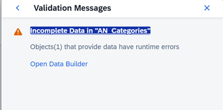

The object “Product Categories View” has a status completed, but you can see in the information bubble that it is waiting for new data: 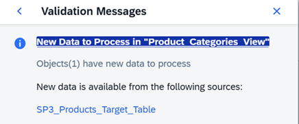

If I click on the information, I can see that it’s a view that has data persisted: 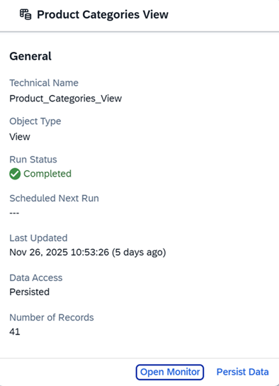

Looking at the model, I can see that source objects that are consumed by the object “Product Categories View,” which is consumed as a source of my analytic model, have errors. Let’s have a look at the error for the “View Transform” object: 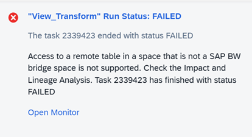

If I click on the information button, I can see the recommended actions is to run the transformation flow: 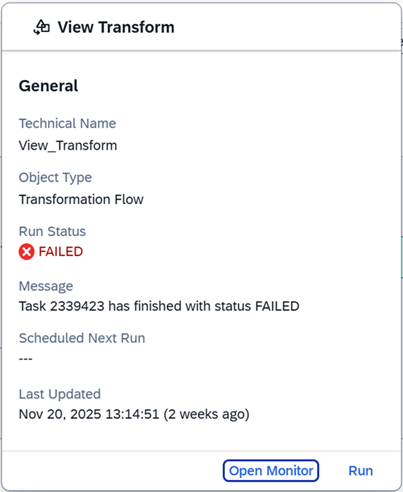

The object “SP3 Products Target Table” also has a failure status: 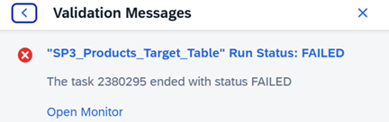

If I click on information, it provides me with no guidance, but proposes to go to the monitor to see more details on the issue: 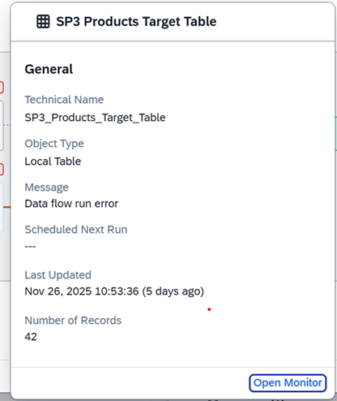

If I open the monitor, I can see that the table is empty. It’s a local table that is a target of the data flow: 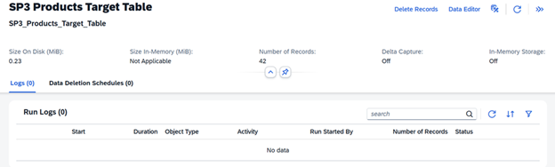

Let’s now have a look at the flow “DF\_SP3\_Products” that must run to update this target table: 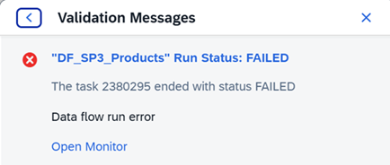

As a solution the monitor proposes to run the data flow again: 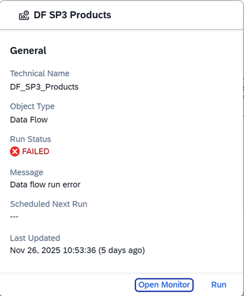

### Step 2: Resolve the Issues

To summarize, to resolve the issues with my analytic model, I must:

1.  Run the flow for the object “DS\_SP3\_Products”. Once the flow run is successful, the target object “SP3 Products Target Table” will be updated.
2.  Run the objects “View Transform”.
3.  Persist the data for the object “Product\_Categories\_View”, to get the data updated.
4.  Refresh the analytic model. All issues are saved, and all nodes are green.

