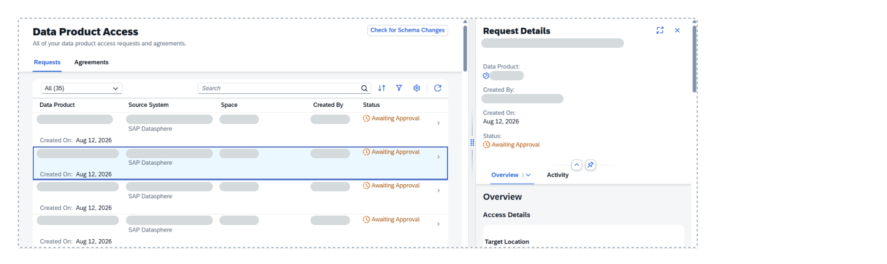
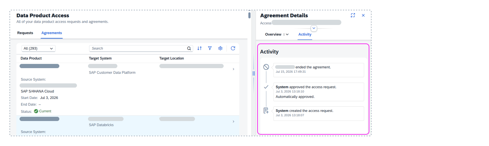

<!-- loio3145063634b848b698d3075be74d7466 -->

<link rel="stylesheet" type="text/css" href="css/sap-icons.css"/>

# Data Product Access Details

You can review details for your access requests and agreements, and those made by other users in spaces you have access to. 

Open the *Data Product Access* page from the side navigation by choosing \(*Catalog & Marketplace*\)** \> ** *\(Data Product Access\)*. You can see all access requests and agreements created by any user for spaces you have access to.

> ### Note:  
> If you are unassigned from a space, you won't see the access requests and agreements for that space, even the ones you created.

This page has the following actions and tabs:

-   The *Check for Schema Changes* button compares data products that are installed to SAP Datasphere spaces with the corresponding data products available in the catalog for schema differences.
-   The *Requests* tab shows access requests that are awaiting approval or have been rejected.
-   The *Agreements* tab shows access agreements that have other statuses, such as **Current** or **Ended**.

You can use the **Search** field and the view tools to find the access request or agreement you want. When you select a request or agreement, the data product access details opens as a panel on the right side of the window.

The request or agreement details header provides an overview that includes the following information:

-   The data product name appears as a link. Select it to open its details page. 
-   Information on who created the access request and the date it was created on. For system-created access requests, this value is **System**.
-   The status of the request or agreement.
    -   A request can have a status of **Awaiting Approval** or **Rejected**. 
    -   An agreement can have a status of **Current**, **Expired**, or **Ended**.

-   The data product installation status for access agreements. 

In the header, you'll also see a toolbar with actions available for managing the access requests or agreements and changing how you view the details panel.

-    \(Enter Full Screen Mode\) and  \(Exit Full Screen Mode\): By default, the access details for a request or agreement opens as a side panel, choose the action to expand the panel to full-screen mode. To view the list of requests or agreements again, choose the action to exit full-screen mode and return to panel mode.

-   *Install Data Product*: For access agreements where the data product has not yet been installed, choose this action to install the data product to the specified target location. This action is hidden for data products that are already installed, that have a lifecycle status of **Inactive**, or that aren't included in your entitlements. This action is available for access agreements and is only visible to the user who created them.

-   *Open Data Product*: Choose this action to open a dialog, where you can get the name for the access agreement and a link for the installation location. 

-   *Reinstall Data Product*: Choose this action to repair the data product installation in an SAP Datasphere space. If a data product isn't working as you expect, you can reinstall it.Reinstalling a data product does the following:

    -   Reinstall entities across spaces
    -   Redeploy objects for replication flows \(if needed\)
    -   Update the ingestion space \(if needed\)

    When you reinstall a data product, you can change how users access the data \(federated access using remote tables or replication flow to local tables\). This setting affects all spaces where the data product is installed. 

-    \(End Agreement\): Choose this action to end the access agreement.

    -   Users can end their own access agreement if they no longer need access to a data product.
    -   Data stewards or other users with appropriate permission can end another user's access agreement for various reasons \(for example, if a user leaves the organization or switches projects, a data steward will end the access agreement\). For an SAP Datasphere space, any user with appropriate permissions to a space can end another user's access agreement.

## Access Details Overview

The *Overview* tab provides details of the access requests or agreements, details of the data product, and the terms and conditions for data product usage.

<table>
<tr>
<th valign="top">

Section

</th>
<th valign="top">

Description

</th>
</tr>
<tr>
<td valign="top">

Request Details

</td>
<td valign="top">

Displays the details of the access request, including the following information:

-   The target location where the data product will be installed to.
-   The purpose and context for data product usage.
-   The start date of the access agreement. This date appears after the access request is approved.
-   The end date of the access agreement. This is either the end date requested by the user or the date the access agreement was ended.

The *Created Through* value provides information on how the access request or agreement was created. Access requests are created by users who discover data products in the catalog. They can also be created automatically by the system during processes such as installing intelligent content, copying a space, updating your system, or importing data.For more information, see [System-Created Access Requests and Agreements](https://help.sap.com/docs/business-data-cloud/governing-and-publishing-data-in-catalog/system-created-access-requests-and-agreements).

</td>
</tr>
<tr>
<td valign="top">

Data Product Details

</td>
<td valign="top">

Displays overview information about the data product. The data product's name is a link to its details page. 

</td>
</tr>
<tr>
<td valign="top">

Terms and Conditions

</td>
<td valign="top">

Displays the terms and conditions for the data product. Choose the link to review the terms and conditions. 

</td>
</tr>
</table>

## Access Details Activity

The *Activity* tab shows an activity timeline for the data product and includes the following information for all requests and agreements:

-   The activity that occurred.
-   The user who performed the activity.
-   The date and time of the activity.
-   Comments related to the activity.

These details help ensure compliance and traceability of data product consumption. 

**Related Information**  

[Data Product Details](data-product-details-71f4d15.md "For data products that you're interested in, review its details, including its name, data provider, contained entities, and links to resources that explain how to use it.")

[Requesting Access to Data Products](requesting-access-to-data-products-ea7cb80.md "You can request access to data products in the Data Product collection for installation to an SAP Datasphere space. After your request is approved, you can install the data product to the space where users can access its data for use in modeling and other projects.")

