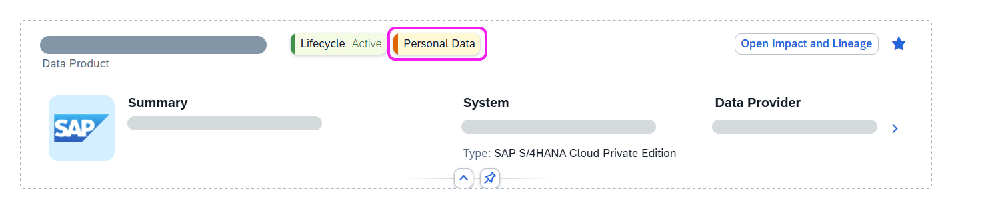
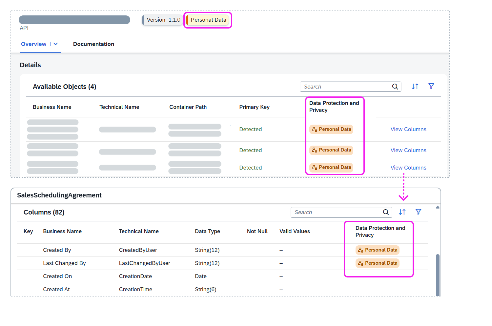
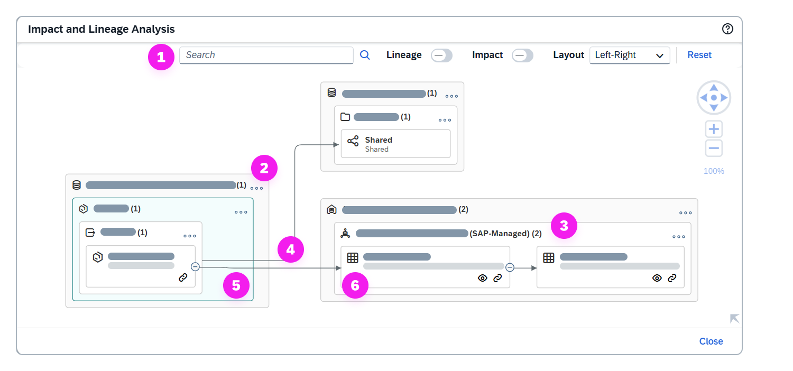
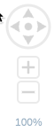

<!-- loio71f4d1599dba4aa59e6682a314650cf7 -->

<link rel="stylesheet" type="text/css" href="css/sap-icons.css"/>

# Data Product Details

For data products that you're interested in, review its details, including its name, data provider, contained entities, and links to resources that explain how to use it.

This topic describes the details for data products from systems in SAP Business Data Cloud formations.

The catalog search results provide high-level information about a data product, including its name, data type, and a short summary. If you want to know more about a data product, choose it to view its details page. You'll see different types of information about the data product, including its properties, detailed information about its APIs, and resources that can provide information or examples on how to use it.

For example, when a data modeler reviews the details of a data product, they can check out any of the resources to get information about how to use it. They can also review individual APIs and learn how to extend them.

After you view the data product details, you can choose to install it in your space \(see [Installing Data Products](installing-data-products-ea7cb80.md)\).

The data product details header provides high-level information about the data product and organizes the information as shown in the following table:

<table>
<tr>
<th valign="top">

Section

</th>
<th valign="top">

Description

</th>
</tr>
<tr>
<td valign="top">

Name

</td>
<td valign="top">

Displays the data product's name. 

</td>
</tr>
<tr>
<td valign="top">

Statuses

</td>
<td valign="top">

Displays the lifecycle, release, and functional statuses for a data product. You can choose a status to get more information.

-   The lifecycle status reflects the different situations and phases of the data product.
-   The release status reflects the data product's availability to consumers.
-   The functional status reflects the integrity of the data product in relation to its source system.

</td>
</tr>
<tr>
<td valign="top">

Data Protection and Privacy

</td>
<td valign="top">

The *Personal Data* and *Sensitive Personal Data* tags help you quickly identify data products requiring strict access control. One tag is automatically applied to any data product containing personal data, with *Sensitive Personal Data* applied if both types are present:

-   *Personal Data* is information that can be used to identify an individual, either on its own or in combination with other data, directly or indirectly.
-   *Sensitive Personal Data* is any of the various categories of high-risk data as defined under different international data protection and privacy laws.

For more information, see [Data Protection and Privacy Tagging](data-protection-and-privacy-tagging-6c00246.md).

> ### Example:  
> The *Personal Data* is applied to data products that contain personal data, such as a person's name.
> 
> 
> 
> To see which specific objects in an API have this tag, select the API to view its details page. Choose *View Columns* to see which columns contain personal data.
> 
> 

</td>
</tr>
<tr>
<td valign="top">

Version

</td>
<td valign="top">

Displays the version number.

</td>
</tr>
<tr>
<td valign="top">

Summary description

</td>
<td valign="top">

Displays a short summary of the data product.

</td>
</tr>
<tr>
<td valign="top">

Source System

</td>
<td valign="top">

Displays the name and type of source system the data product is extracted.

</td>
</tr>
<tr>
<td valign="top">

Data Provider

</td>
<td valign="top">

Displays the data provider's name.

</td>
</tr>
<tr>
<td valign="top">

Catalog Activity

</td>
<td valign="top">

Displays the date when the data product was added to the catalog and when it was updated.

</td>
</tr>
</table>

In the header, you'll also be able to see a toolbar with actions available for catalog users.

<table>
<tr>
<th valign="top">

Toolbar Actions

</th>
<th valign="top">

Description

</th>
</tr>
<tr>
<td valign="top">

*View Version History*

</td>
<td valign="top">

Opens a dialog that shows the change history for the data product. 

</td>
</tr>
<tr>
<td valign="top">

*Open Impact and Lineage* 

</td>
<td valign="top">

Opens a dialog that displays the *Impact and Lineage Analysis* diagram. 

</td>
</tr>
<tr>
<td valign="top">

 \(Update Data Product \(API\)\)

</td>
<td valign="top">

Updates the data product with the latest minor version in all spaces where it's installed. This action is available only if the installed version differs from the version available in the catalog and you have the required permissions. 

</td>
</tr>
<tr>
<td valign="top">

 \(Add to Favorites\)

</td>
<td valign="top">

Adds frequently used data products to your favorites. 

</td>
</tr>
</table>

## Data Product Properties

To view the properties of the data product, choose *Overview tab* \> *Properties*.

The properties are separated into the following areas: 

-   Data product properties are properties directly related to the data product, such as the name, category, entity types, and more.
-   Source properties are properties about the system.

For more information about properties not described here, see the help documentation for the source systems where the data product is from.

**Data Product Properties**

<table>
<tr>
<th valign="top">

Field

</th>
<th valign="top">

Description

</th>
</tr>
<tr>
<td valign="top">

Business Name

</td>
<td valign="top">

Displays the business name for the data product.

</td>
</tr>
<tr>
<td valign="top">

Lifecycle Status

</td>
<td valign="top">

Displays the lifecycle status of the data product:

-   Active: The data product is active and ready.
-   Inactive: The data product is inactive and can’t be installed. To install this data product, you must ask your administrator to activate any data package that contains it.

</td>
</tr>
<tr>
<td valign="top">

Release Status

</td>
<td valign="top">

Displays the release status of the data product:

-   Active: The data product is available to consumers.
-   Beta: The data product is available to consumers for testing.
-   Deprecated: The data product is available to consumers, but it's not recommended to use it.

</td>
</tr>
<tr>
<td valign="top">

Type

</td>
<td valign="top">

Displays the data product type.

</td>
</tr>
<tr>
<td valign="top">

Input Ports

</td>
<td valign="top">

Displays the input ports for the data product.

</td>
</tr>
<tr>
<td valign="top">

Category

</td>
<td valign="top">

Displays the category for the data product.

</td>
</tr>
<tr>
<td valign="top">

Entity Types

</td>
<td valign="top">

Displays the entity types for the data product.

</td>
</tr>
<tr>
<td valign="top">

ORD ID

</td>
<td valign="top">

Displays the open resource discovery \(ORD\) identifier for the API.

</td>
</tr>
<tr>
<td valign="top">

Description

</td>
<td valign="top">

Displays the long description for the data product.

</td>
</tr>
<tr>
<td valign="top">

Version

</td>
<td valign="top">

Displays the latest version number of the data product. Choose *View Version History* to see all version changes for the data product.

</td>
</tr>
<tr>
<td valign="top">

Changed On

</td>
<td valign="top">

Displays the date and time when the data product was changed.

</td>
</tr>
<tr>
<td valign="top">

Extensibility

</td>
<td valign="top">

Displays whether the data product is extensible and be enhanced. The data product can be manually or automatically extensible or not extensible at all. If a data product is extensible, you can choose an API to view extensibility details.

</td>
</tr>
<tr>
<td valign="top">

Visibility

</td>
<td valign="top">

Displays the visibility context for a data product. The visibility context controls who has access to a data product. For example, public visibility means that a data product is visible for all users.

</td>
</tr>
<tr>
<td valign="top">

Additional Properties

</td>
<td valign="top">

Displays the additional properties for the data product. 

For data products from SAP Datasphere systems, additional properties can include the following:

-   Policy Level
-   Industry: Displays the industries the data product is relevant for.
-   Tags: Displays tags that have been linked to the data product. 
-   Line of Business: Displays one or more business areas where the data product can be used.
-   Data Category: Displays one or more data categories that apply to the data product.

For data products from other SAP or partner systems, additional properties can include custom properties specific to those systems or organizations.

</td>
</tr>
</table>

**Source Properties**

<table>
<tr>
<th valign="top">

Field

</th>
<th valign="top">

Description

</th>
</tr>
<tr>
<td valign="top">

System Name

</td>
<td valign="top">

Displays the name of the data provider's system. The system can be the name of an SAP system not in the same landscape or third-party system.

</td>
</tr>
<tr>
<td valign="top">

System Type

</td>
<td valign="top">

Displays the system type.

</td>
</tr>
<tr>
<td valign="top">

Deployment Region

</td>
<td valign="top">

Displays the regions where data product has been deployed.

</td>
</tr>
<tr>
<td valign="top">

Application Namespace

</td>
<td valign="top">

Displays the application namespace that identifies the system instance.

</td>
</tr>
<tr>
<td valign="top">

System ID

</td>
<td valign="top">

Displays the system identifier.

</td>
</tr>
<tr>
<td valign="top">

Data Provider

</td>
<td valign="top">

Displays data provider's name. For data products from an SAP Datasphere system, choose the link to review the data provider's profile.

</td>
</tr>
</table>

## Data Product API Details

You can view a list of APIs for the data product by choosing *Overview tab* \> *Details*.

Data-sharing protocols, such as Delta Sharing, are standardized ways to share data products between systems. The APIs available for the data product are programmable interfaces that you use to access and manage the data product's data and metadata. The APIs also automate tasks like:

-   Provisioning the data product
-   Allowing permissions to access its data
-   Monitoring for changes in the data product

> ### Note:  
> When SAP Datasphere delta-enabled local tables \(file\) are included in SAP Business Data Cloud data products, the internal delta capture columns *Change Date*and *Change Type* are not included in the data product definition or made available to consumers. However, consumers of these data products will still receive delta updates via the Delta Sharing Change Data Feed \(CDF\) API. For more information, see [Change Data Feed](https://docs.delta.io/delta-change-data-feed/).

This table provides high-level information for each data product \(API\), which includes its name, description, version, protocol, functional status and more. If there are more than 20 rows, choose *Show All* to see the rest of the rows for the tab in a separate page.

<table>
<tr>
<th valign="top">

Field

</th>
<th valign="top">

Description

</th>
</tr>
<tr>
<td valign="top">

Name

</td>
<td valign="top">

Displays the name for the data product \(API\).

</td>
</tr>
<tr>
<td valign="top">

Description

</td>
<td valign="top">

Displays a description for the use and purpose of the data product \(API\).

</td>
</tr>
<tr>
<td valign="top">

Version

</td>
<td valign="top">

Displays the version number of the data product \(API\).

</td>
</tr>
<tr>
<td valign="top">

Protocol

</td>
<td valign="top">

Displays the data product \(API\) protocols.

</td>
</tr>
<tr>
<td valign="top">

Functional Status

</td>
<td valign="top">

Displays the functional status of the data product \(API\).

</td>
</tr>
<tr>
<td valign="top">

Visibility

</td>
<td valign="top">

Displays whether the data product \(API\) is public or private.

</td>
</tr>
<tr>
<td valign="top">

Supported Use Cases

</td>
<td valign="top">

Displays the data product \(API\) use cases, if provided. If you don't see this column, choose  \(Select Columns\) to show it.

</td>
</tr>
<tr>
<td valign="top">

Actions

</td>
<td valign="top">

Choose an action:

-   *Install*: Opens the *Import Entities* wizard. Follow the steps to import the entities of an API for a data product to your space on the local SAP Datasphere system.
-   *Update*: Updates the data product with the latest minor version in all spaces where it's installed. This action is available only if the installed version differs from the version available in the catalog and you have the required permissions.
-   *Uninstall*: Opens a dialog, where you choose a space to a data product. Uninstalling a data product removes all entities that are part of the API. You can uninstall a data product from a specific SAP Datasphere space after all its dependent objects have been removed.

The actions to install, uninstall, or update data products appear based on the privileges that are assigned to you \(see [Installing Data Products](installing-data-products-ea7cb80.md)

</td>
</tr>
</table>

### API Details

You can learn more about an API by selecting it to view its details page. Information is separated into the following areas:

<table>
<tr>
<th valign="top">

Section

</th>
<th valign="top">

Description

</th>
</tr>
<tr>
<td valign="top">

Header

</td>
<td valign="top">

Displays the version and tags for data protection and privacy. A toolbar with actions for the API is also available. 

</td>
</tr>
<tr>
<td valign="top">

Description

*Overview* \> *Description*

</td>
<td valign="top">

Displays a description of the API extracted from the source system. 

</td>
</tr>
<tr>
<td valign="top">

Properties

*Overview* \> *Properties*

</td>
<td valign="top">

Displays the same high-level information found in the data product details, along with additional information such as the Open Resource Discovery \(ORD\) identifier. 

</td>
</tr>
<tr>
<td valign="top">

Details

*Overview* \> *Details*

</td>
<td valign="top">

Displays a list of available objects \(or entities\), their container paths, whether they contain personal data, sensitive personal data, or both, and their primary keys. If the primary key is missing, the API can't be installed. To see more details of a particular object, choose the *View Columns* link. This information includes the object's name, type, valid values, the specific columns that have personal or sensitive personal data, and more. 

</td>
</tr>
<tr>
<td valign="top">

Documentation

</td>
<td valign="top">

Provides more details about the API, including external links for more information on how to use it and information on how the API can be extended. 

</td>
</tr>
</table>

<a name="loio71f4d1599dba4aa59e6682a314650cf7__section_axs_q5l_bdc"/>

## Data Product Documentation

The *Documentation* tab provides supporting documentation and resources for the data product:

-   *Description*: This tab provides a more detailed description of the data product.
-   *External Resources*: This tab provides links to resources that provides more information about the data product and how to use it. For example, images, other file types, sample data, and more.

<a name="loio71f4d1599dba4aa59e6682a314650cf7__section_cxf_5k5_y2c"/>

## Impact and Lineage Analysis Diagram for a Data Product

Choose the *Open Impact and Lineage* button in the header to see a diagram for the analyzed data product. This diagram shows the object-level data analysis of an analyzed object and provides an end-to-end visualization of the object dependencies across multiple systems and layers. It can help you better understand the lineage \(also known as data provenance\) and impacts of a selected object in the catalog. Impact and lineage contain information about the source of the object, the transformations it goes through, its final state, and objects affected by changes made to it. Impact and lineage serve distinct purposes.

-   *Lineage* is displayed to the left of the analyzed object \(or below it\). It shows objects that the analyzed object uses as sources. It allows you to trace errors back to the root cause.
-   *Impact* is displayed to the right of the analyzed object \(or above it\). It shows objects that use the analyzed object as a source. It allows you to understand the impact of changes on dependent objects.

This impact and lineage analysis diagram for an installed data product contains the following features.

<table>
<tr>
<th valign="top">

Feature

</th>
<th valign="top">

Description

</th>
</tr>
<tr>
<td valign="top">

\(1\) Toolbar and Diagram Tools

</td>
<td valign="top">

Use the toolbar and diagram tools to control the layout of the diagram. Choose *Reset* to restore the default layout.

</td>
</tr>
<tr>
<td valign="top">

\(2\) Outermost Container

</td>
<td valign="top">

The outermost container represents a source system \(for example,  SAP Datasphere or  SAP Analytics Cloud system\), a  data provider, or a target system \(for example SAP Databricks\).

Source systems connected to and monitored by the catalog show their business or technical name. Systems not connected to the catalog show their system type with the text "unmonitored". The number in brackets indicates the total number of objects in the container that are part of the impact or lineage of the analyzed object.

Target systems appear in the impact of a data product when a data product is shared to it.

You can expand or collapse a container, using the  \(Show/Hide All Objects\) menu on the top-right corner of the container. The number in brackets indicates the total number of objects in the container that are part of the impact and lineage of the analyzed object.

</td>
</tr>
<tr>
<td valign="top">

\(3\) Inner Container

</td>
<td valign="top">

The inner container represents one of the following:

-   A location in the source system \(for example,  SAP Datasphere space,  SAP Analytics Cloud folder, or  BW InfoArea\). It contains objects that either appear in the lineage of or are impacted by the analyzed object. If an object is located within a sublocation \(for example, a subfolder\), you'll see a series of nested inner containers.
-   A :package: data product. The data product is visible if you have access and view permission for it. For example, you are a member of the context associated with it or if you are a member of the space where it has been installed. Also, you will be able to view the details to see a brief summary of the data product or open the data product page.
-   A  folder in a target system. When a data product is shared to certain target systems \(for example, SAP Databricks\), it's shared to a folder. 

You can expand or collapse a container, using the  \(Show/Hide All Objects\) menu on the top-right corner of the container. The number in brackets indicates the total number of objects in the container that are part of the impact and lineage of the analyzed object.

</td>
</tr>
<tr>
<td valign="top">

\(4\) Link Types

</td>
<td valign="top">

The lines connecting all containers and objects demonstrate the impact and lineage flow.

-   Solid lines demonstrate how data moves and transforms between objects.
-   Dashed lines provide traceability from BW Data Transfer Processes \(DTPA\) to their associated Transformation \(TRFN\) objects across all BW systems. You can visualize how one or more transformations are connected to and used within Data Transfer Processes \(DTPs\), which provides complete visibility into data movement and transformation dependencies for compliance and impact analysis. 

</td>
</tr>
<tr>
<td valign="top">

\(5\) Analyzed Object

</td>
<td valign="top">

The analyzed object appears as a light blue object. The icon in the top-left corner represents the object's type \(for example,  \(Story\),  \(Transformation\), or :package: data product\). The icons in the bottom-right corner represent the object's publication and functional statuses \(for example,  \(Published\) and  \(Current\).

To learn more review the details of the analyzed object without closing the diagram, select it to display its context menu, and choose the  \(Show Details\) icon to preview the object's properties.

You can show or hide the objects on either side of any object by choosing the  \(Show Next Level\) or  \(Hide All\) on the object.

</td>
</tr>
<tr>
<td valign="top">

\(6\) Unauthorized or Authorized Object

</td>
<td valign="top">

Unauthorized and authorized objects appear in the lineage or impact of the analyzed object.

-   Unauthorized objects are unpublished objects that you don't have access permission to in the source system. They are represented with the :lock: icon.

-   Authorized objects are published and can be discovered in the catalog. The icon in the top-left corner represents the object's type \(for example,  \(View\)\). The icons in the bottom-right corner represent the object's publication and functional statuses \(for example,  \(Published\) and  \(Current\).

    To learn more about an object, select it to display its context menu. Choose the  \(Show Details\) icon to preview the object's properties. If the object is available in the catalog, you can choose the  \(Open Object Details\) icon to open the details page for the object.

You can show or hide the objects on either side of any object by choosing the  \(Show Next Level\) or  \(Hide All\) on the object.

</td>
</tr>
</table>

### Control Diagram Layout

Use the diagram tools to control the layout of the diagram.

<table>
<tr>
<th valign="top">

Tool

</th>
<th valign="top">

Description

</th>
</tr>
<tr>
<td valign="top">

Search

</td>
<td valign="top">

Find and select objects in the diagram. Results are proposed once three characters are entered. Click a result in the list to select the object symbol and highlight other objects on its path to the analyzed object.

</td>
</tr>
<tr>
<td valign="top">

Lineage

</td>
<td valign="top">

Enable/disable the display of the lineage of the analyzed object.

</td>
</tr>
<tr>
<td valign="top">

Impact

</td>
<td valign="top">

Enable/disable the display of the impacts of the analyzed object.

</td>
</tr>
<tr>
<td valign="top">

Layout

</td>
<td valign="top">

Change the orientation of the diagram:

-   *Left-Right* - \[default\] Display lineage objects on the left and impacts on the right of the analyzed object.
-   *Bottom-Top* - Display lineage objects below and impacts above the analyzed object.

</td>
</tr>
<tr>
<td valign="top">

Reset

</td>
<td valign="top">

Restore the default layout. Changing the mode also resets the layout.

</td>
</tr>
<tr>
<td valign="top">

</td>
<td valign="top">

Scroll, zoom, or recenter the diagram:

-   Click  \(or press [F6\]\) to zoom in.
-   Click  \(or press [F7\]\) to zoom out.
-   Click the center button \(or press [F8\]\) to fit to screen, [CTRL\]-click the center button \(or press [CTRL\] + [F5\] \) to zoom to 100% scale, or enter a percentage.
-   Click the arrow buttons \(or press the arrow keys\) to scroll horizontally or vertically.

</td>
</tr>
</table>

