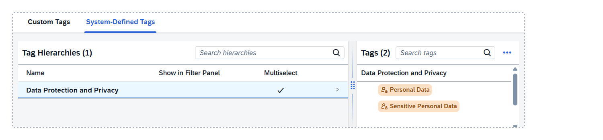

<!-- loio6c00246fd9f6455789e55cddcde0dff0 -->

# Data Protection and Privacy Tagging

Data protection and privacy laws, such as the European Union's General Data Protection Regulation \(GDPR\), require that personal data is handled lawfully, fairly, and transparently. SAP Business Data Cloud helps you track personal data through your modeling processes to ensure that it is properly handled and protected.

The data protection and privacy tag hierarchy contains tags that help you quickly identify data products requiring strict access control.

-   *Personal Data* is information that can be used to identify an individual, either on its own or in combination with other data, directly or indirectly.For example, height, weight, eye and hair color.
-   *Sensitive Personal Data* is any of the various categories of high-risk data as defined under different international data protection and privacy laws.These include:
    -   Data concerning vulnerable persons, such as children or differently-abled individuals
    -   Data to evaluate and predict a person’s behavior
    -   Passwords and answers security questions
    -   Employment, professional, and education details, such as salary, trade union membership, or degrees or certifications obtained
    -   Data revealing someone’s personal details, such as political opinions, religious beliefs, marital status, or criminal convictions and offenses
    -   Health data \(for example, the US Health Insurance Portability and Accountability Act \(HIPAA\)\)
    -   Financial information, such as bank account and credit card data

During metadata extraction, the catalog applies these tags to data products that contain personal data, sensitive personal data, or both. You can't manually create tag relationships to assets with data protection and privacy tags. Also, these tags aren't available in the filter panel.

> ### Note:  
> The catalog can only identify whether a data product has personal data, sensitive personal data, or both. The catalog doesn't collect or store personal data or sensitive personal data.

When data products are installed in SAP Datasphere spaces and consumed by other objects, these tags are propagated and inherited by those consuming objects \(see [Modeling with Personal Data](modeling-with-personal-data-fd0d4e6.md)\).

