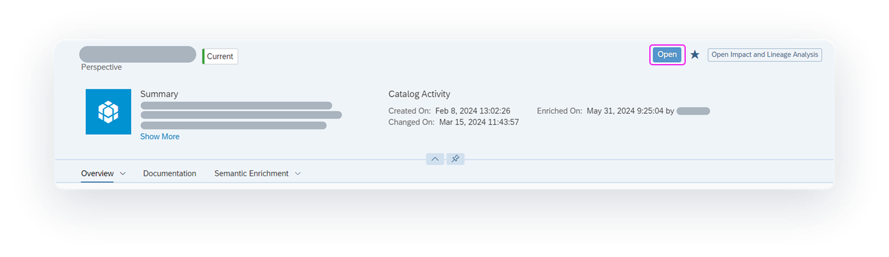

<!-- loiodc061a23484241b1b791f5540b1f38e3 -->

<link rel="stylesheet" type="text/css" href="css/sap-icons.css"/>

# Evaluating and Accessing Catalog Assets

When you find an asset that interests you, you can view information about it to make sure it's the right one for your business needs. You can then choose to view or edit the asset in more details in its source system or use it in a data project.

<a name="loiodc061a23484241b1b791f5540b1f38e3__prereq_fcb_p1y_tyb"/>

## Prerequisites

When you find an asset that interests you, you can view information about it to make sure it’s the right one for your business needs.

You must be assigned one of the following:

-   The *Catalog User* role.

-   A custom role with the *Read* permission for *Catalog Asset*.

    > ### Note:  
    > To see the details of any terms, tags, or KPIs, the role must also have the *Read* permission for each of the following privileges: *Catalog Glossary Object*, *Catalog Tag Hierarchy*, and *Catalog KPI Object*.

<a name="concept_pm1_qqv_zcc"/>

<!-- concept\_pm1\_qqv\_zcc -->

## Evaluating an Asset

On the catalog search page, you can use the filters or the search to discover assets that can help you with your business goals.

To know for sure if an asset will met your needs, you can view its details and evaluate how it can help you. Some of the information that you will be reviewing includes metadata extracted from the source system, like the name and description. Other information are data enrichments, like links to glossary terms, KPIs, and tags, that were added to the asset in the catalog. For more information on the detailed information that you can review, see [Catalog Asset Details](catalog-asset-details-afccc58.md).

After you've evaluated and found an asset, use the following steps to view or edit the asset or use the asset in a data project.

<a name="task_x4m_cny_3wb"/>

<!-- task\_x4m\_cny\_3wb -->

## Viewing or Editing an Asset

<a name="task_x4m_cny_3wb__context_d3z_1dw_hwb"/>

## Context

After you find the asset you want, you might be able to open the asset in the source system to view or edit it. If the asset has been shared with you in the source system, the *Open* button appears in the top-right corner. If the source file for the asset has not been shared with you, contact the person who created the asset or the person who most recently changed it. You can find this information in the asset details page.

For information about sharing files with other users within a source system, see the documentation for the specific source system:

-   For SAP Datasphere, see [Acquiring, Preparing, and Modeling Data with SAP Datasphere](acquiring-preparing-and-modeling-data-with-sap-datasphere-b4a5d02.md).

-   For SAP Analytics Cloud, see [Welcome to the SAP Analytics Cloud Help](https://help.sap.com/docs/SAP_ANALYTICS_CLOUD/00f68c2e08b941f081002fd3691d86a7/1fb1f4ce92f44fc983debc25ac1f2cc9.html).

-   For SAP Datasphere, SAP BW bridge, see [SAP Datasphere, SAP BW bridge](https://help.sap.com/docs/SAP_BW_BRIDGE/107a6e8a38b74ede94c833ca3b7b6f51/f2a4eb578452482fbbcb9078a8e51551.html).

<a name="task_x4m_cny_3wb__steps_egp_cdw_hwb"/>

## Procedure

1.  In the side navigation area, click \(*Catalog*\).

2.  On the catalog search page, use the filters or the search to find the asset you want. For more information, see [Finding Data and Assets in the Catalog](finding-data-and-assets-in-the-catalog-1047825.md).

3.  When viewing the page for the asset, in the top-right corner, click the *Open* button to open the source file in the source system in a new browser tab.

    > ### Note:  
    > For certain source systems, the *Open* button appears if the asset has been shared with you and you have permission to view or edit it. For example, if the asset is from SAP Datasphere or SAP Analytics Cloud, the *Open* button appears only if the asset has been shared with you in the source system and you have permission to view or edit it.
    > 
    > However, for some source systems, the *Open* button is not available regardless of whether the asset has been shared with you in the source system. For example, if the asset is from an SAP Datasphere, SAP BW bridge, the *Open* button does not appear. To view or edit the asset, you must open it directly in the source system.

    

4.  Depending on how the source file is shared with you, you can view the asset in full and explore it, or you can edit it as needed.

<a name="task_x4m_cny_3wb__result_ipq_22w_hwb"/>

## Results

Because the catalog monitors changes to objects saved in SAP Datasphere and SAP Analytics Cloud source systems, these changes are detected in real time. The metadata for the assets are automatically extracted, and the functional status label *Current* is applied.

The catalog does not monitor changes to objects saved in SAP Datasphere, SAP BW bridge source systems. To ensure that these assets are up-to-date, a user with the appropriate permission must run a manual synchronization, which will manually extract all metadata for the assets.

<a name="task_zpg_fny_3wb"/>

<!-- task\_zpg\_fny\_3wb -->

## Using the Asset in a Data Project

<a name="task_zpg_fny_3wb__context_lkt_ghw_hwb"/>

## Context

After you determine the asset is the right one for your needs, you can use it as part of a data project to build something new. For example:

-   As a data modeler in SAP Datasphere, you can use the asset as a source for a Data Builder or Business Builder object. For more information, see [Acquiring Data in the Data Builder](Acquiring-and-Preparing-Data-in-the-Data-Builder/acquiring-data-in-the-data-builder-1f15a29.md) or [Modeling Data in the Data Builder](Modeling-Data-in-the-Data-Builder/modeling-data-in-the-data-builder-5c1e3d4.md).

-   As a content creator in SAP Analytics Cloud, you can use the asset in data object \(for example, a story or digital boardroom\). For more information, see [Welcome to the SAP Analytics Cloud Help](https://help.sap.com/docs/SAP_ANALYTICS_CLOUD/00f68c2e08b941f081002fd3691d86a7/1fb1f4ce92f44fc983debc25ac1f2cc9.html).

-   As a data modeler in SAP Datasphere, SAP BW bridge, you can merge data into models and make them available for reporting and analysis purposes. For more information, see the help for [SAP Datasphere, SAP BW bridge](https://help.sap.com/docs/SAP_BW_BRIDGE/107a6e8a38b74ede94c833ca3b7b6f51/f2a4eb578452482fbbcb9078a8e51551.html).

> ### Tip:  
> Before you search for an asset in the catalog, determine which application you want to use the asset in and open it in a new browser tab. By keeping the catalog opened in a separate tab, you can find the asset you want and have its property information readily available as you switch between tabs.
> 
> Depending on the SAP application you are using, you can open it from the  \(*Product Switch*\) or from the side navigation. For example, to use SAP Datasphere, in the side navigation area, right-click the application you want to use and click *Open App in New Tab*. Or to use SAP Analytics Cloud, in the side navigation area, right-click any application and click *Open App in New Tab*. In the shell bar click  \(*Product Switch*\) and click *Analytics*.

<a name="task_zpg_fny_3wb__steps_dhc_k3w_hwb"/>

## Procedure

1.  In the side navigation area, click \(*Catalog*\).

2.  On the catalog search page, use the filters or the search to find the asset you want. For more information, see [Finding Data and Assets in the Catalog](finding-data-and-assets-in-the-catalog-1047825.md).

3.  Go to the tab where the application you want is open.

4.  Find and open an existing object or create a new object and add the asset. If you haven't opened the application in a new tab, do that now.

5.  Save the object in the location you want.

    > ### Note:  
    > If the object you are saving is in SAP Datasphere, you must save and then deploy it before it can be added to the catalog. For more information, see [Saving and Deploying Objects](saving-and-deploying-objects-7c0b560.md).

<a name="task_zpg_fny_3wb__result_xcb_gmw_hwb"/>

## Results

The catalog automatically detects the change in real time:

-   If you created a new file, a new unpublished catalog asset is created and the functional status is set to *Current*. This asset will only be visible to users who have the *Catalog Administrator* role until they enrich it and then publish it to the catalog. After the asset is published, then it will be available for all catalog users to find.

-   If you edited an existing file, the metadata for the asset is automatically updated.

> ### Note:  
> For files in SAP Datasphere, SAP BW bridge, a user with the necessary permission must run a manual synchronization to add a new asset to the catalog or update an existing asset.

