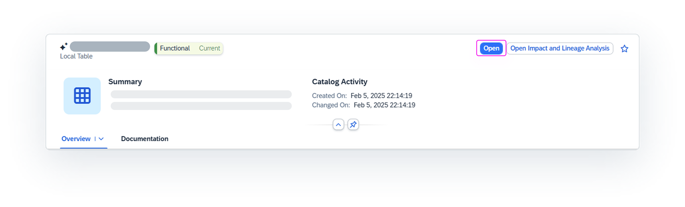

<!-- loiodc061a23484241b1b791f5540b1f38e3 -->

<link rel="stylesheet" type="text/css" href="css/sap-icons.css"/>

# Evaluating and Accessing Catalog Assets

Use the catalog *Assets* collection to view data and analytic assets for use in your modeling and other projects. You can see detailed metadata, including lineage information, for each assets and, if you have the appropriate permissions, can open the asset in its source system.

<a name="loiodc061a23484241b1b791f5540b1f38e3__prereq_fcb_p1y_tyb"/>

## Prerequisites

To search for and evaluate objects in the *Assets* collection, you must have a global role that grants you the following privileges:

-   *Data Warehouse General* \(`-R------`\) - To access SAP Datasphere.
-   *Catalog Asset* \(`–R–––--`\) - To access the catalog and view objects in the *Assets* and *Data Products* collections.
-   *Catalog Glossary Object* \(`–R–––--`\) - To view terms.
-   *Catalog Tag Hierarchy* \(`–R–––--`\) - To view tag hierarchies and tags.
-   *Catalog KPI Object* \(`–R–––--`\) - To view KPIs.

The *Catalog User* global role and the *DW Viewer* role template \(used directly as a global role\) applied together, for example, grant these privileges. For more information, see [Privileges and Permissions](https://help.sap.com/viewer/935116dd7c324355803d4b85809cec97/DEV_CURRENT/en-US/d7350c6823a14733a7a5727bad8371aa.html "A privilege represents a task or an area in SAP Datasphere and can be assigned to a specific role. The actions that can be performed in the area are determined by the permissions assigned to a privilege.") :arrow_upper_right: and [Standard Roles Delivered with SAP Datasphere](https://help.sap.com/viewer/935116dd7c324355803d4b85809cec97/DEV_CURRENT/en-US/a50a51d80d5746c9b805a2aacbb7e4ee.html "SAP Datasphere is delivered with several standard roles. A standard role includes a predefined set of privileges and permissions.") :arrow_upper_right:. 

> ### Tip:  
> If you have the *Catalog Administrator* role, you can enrich the information for an asset. See [Enriching, Classifying, and Publishing](https://help.sap.com/viewer/97d1d2f0e35d410c893e95a5ff3bee6f/DEV_CURRENT/en-US/1218c12e72c34cfd96293e566badb60c.html "Users with a catalog administrator role can set up governance for assets using hierarchical tags and business glossaries, create KPIs to measure progress towards company goals, and publish assets, glossary terms, and KPIs to the catalog.") :arrow_upper_right:.

<a name="concept_pm1_qqv_zcc"/>

<!-- concept\_pm1\_qqv\_zcc -->

## Evaluating an Asset

An asset is any data or analytic object that is available in the catalog. For example, a local table or view sourced from SAP Datasphere or a story from SAP Analytics Cloud. From the catalog search page, select the *Assets* collection to show only assets, and then select one or more filters to narrow the search results.

To know for sure if an asset will meet your needs, you can view its details and evaluate how it can help you. Some of the information that you will be reviewing includes metadata extracted from the source system, like the name and description. Other information are data enrichments, like links to glossary terms, KPIs, and tags, that were added to the asset in the catalog \(see [Catalog Asset Details](catalog-asset-details-afccc58.md)\).

After you've evaluated and found an asset, use the following steps to view or edit the asset in its source system or use the asset in a data project.

<a name="task_x4m_cny_3wb"/>

<!-- task\_x4m\_cny\_3wb -->

## Viewing or Editing an Asset

<a name="task_x4m_cny_3wb__context_d3z_1dw_hwb"/>

## Context

After you find the asset you want, you might be able to open the asset in the source system to view or edit it. If the asset has been shared with you in the source system, the *Open* button appears in the top-right corner. If the source file for the asset has not been shared with you, contact the person who created the asset or the person who most recently changed it. You can find this information in the asset details page.

For information about sharing files with other users within an SAP source system, see the help documentation:

-   [Acquiring, Preparing, and Modeling Data with SAP Datasphere](https://help.sap.com/docs/SAP_DATASPHERE/c8a54ee704e94e15926551293243fd1d/b4a5d02cefdf45478e7376860c985202.html)
-   [Welcome to the SAP Analytics Cloud Help](https://help.sap.com/docs/SAP_ANALYTICS_CLOUD/00f68c2e08b941f081002fd3691d86a7/1fb1f4ce92f44fc983debc25ac1f2cc9.html)
-   [SAP Datasphere, SAP BW bridge](https://help.sap.com/docs/SAP_BW_BRIDGE/107a6e8a38b74ede94c833ca3b7b6f51/f2a4eb578452482fbbcb9078a8e51551.html)
-   [SAP BW∕4HANA](https://help.sap.com/docs/SAP_BW4HANA/107a6e8a38b74ede94c833ca3b7b6f51/f2a4eb578452482fbbcb9078a8e51551.html)

<a name="task_x4m_cny_3wb__steps_egp_cdw_hwb"/>

## Procedure

1.  In the side navigation area, click \(*Catalog & Marketplace*\)** \> ** \(*Search*\).

2.  On the catalog search page, use the filters or the search to find the asset you want. For more information, see [Searching for Data Products and Assets in the Catalog](searching-for-data-products-and-assets-in-the-catalog-1047825.md).

3.  When viewing the page for the asset, click the *Open* button to open the source file in the source system in a new browser tab. If you don't see the *Open* button, it might be available by clicking  \(Additional Options\).

    > ### Note:  
    > For certain source systems, the *Open* button appears if the asset has been shared with you and you have permission to view or edit it. For example, if the asset is from SAP Datasphere or SAP Analytics Cloud, the *Open* button appears only if the asset has been shared with you in the source system and you have permission to view or edit it.
    > 
    > However, for some source systems, the *Open* button is not available regardless of whether the asset has been shared with you in the source system. For example, if the asset is from an SAP BW system, the *Open* button does not appear. To view or edit the asset, you must open it directly in the source system.

    

4.  Depending on how the source file is shared with you, you can view the asset in full and explore it, or you can edit it as needed.

<a name="task_x4m_cny_3wb__result_ipq_22w_hwb"/>

## Results

Changes saved to objects in the source systems are updated in the catalog as follows:

-   The catalog monitors SAP Datasphere and SAP Analytics Cloud source systems. The catalog detects changes to those objects in real time and automatically extracts the metadata.
-   The catalog does not monitor changes to objects saved in SAP BW source systems. The updated metatdata is extracted on the next scheduled synchronization.

<a name="task_zpg_fny_3wb"/>

<!-- task\_zpg\_fny\_3wb -->

## Using the Asset in a Data Project

<a name="task_zpg_fny_3wb__context_lkt_ghw_hwb"/>

## Context

After you determine the asset is the right one for your needs, you can use it as part of a data project to build something new. For example:

-   As a data modeler in SAP Datasphere, you can use the asset as a source for a Data Builder or Business Builder object. For more information, see [Acquiring Data in the Data Builder](Acquiring-and-Preparing-Data-in-the-Data-Builder/acquiring-data-in-the-data-builder-1f15a29.md) or [Modeling Data in the Data Builder](Modeling-Data-in-the-Data-Builder/modeling-data-in-the-data-builder-5c1e3d4.md).

-   As a content creator in SAP Analytics Cloud, you can use the asset in a story. For more information, see [Welcome to the SAP Analytics Cloud Help](https://help.sap.com/docs/SAP_ANALYTICS_CLOUD/00f68c2e08b941f081002fd3691d86a7/1fb1f4ce92f44fc983debc25ac1f2cc9.html).

-   As a data modeler in an SAP BW system, you can merge data into models and make them available for reporting and analysis purposes. For more information, see the help for [SAP Datasphere, SAP BW bridge](https://help.sap.com/docs/SAP_BW_BRIDGE/107a6e8a38b74ede94c833ca3b7b6f51/f2a4eb578452482fbbcb9078a8e51551.html) or [SAP BW∕4HANA](https://help.sap.com/docs/SAP_BW4HANA/107a6e8a38b74ede94c833ca3b7b6f51/f2a4eb578452482fbbcb9078a8e51551.html).

> ### Tip:  
> Before you search for an asset in the catalog, determine which application you want to use the asset in and open it in a new browser tab. By keeping the catalog opened in a separate tab, you can find the asset you want and have its property information readily available as you switch between tabs.
> 
> Depending on the SAP application you are using, you can open it from the  \(*Product Switch*\) or from the side navigation. For example, to use SAP Datasphere, in the side navigation area, right-click the application you want to use and click *Open App in New Tab*. Or to use SAP Analytics Cloud, in the side navigation area, right-click any application and click *Open App in New Tab*. In the shell bar click  \(*Product Switch*\) and click *Analytics*.

<a name="task_zpg_fny_3wb__steps_dhc_k3w_hwb"/>

## Procedure

1.  In the side navigation area, click \(*Catalog & Marketplace*\)** \> ** \(*Search*\).

2.  On the catalog search page, use the filters or the search to find the asset you want. For more information, see [Searching for Data Products and Assets in the Catalog](searching-for-data-products-and-assets-in-the-catalog-1047825.md).

3.  Go to the tab where the application you want is open.

4.  Find and open an existing object or create a new object and add the asset. If you haven't opened the application in a new tab, do that now.

5.  Save the object in the location you want.

    > ### Note:  
    > If the object you are saving is in SAP Datasphere, you must save and then deploy it before it can be added to the catalog. For more information, see [Saving and Deploying Objects](saving-and-deploying-objects-7c0b560.md).

<a name="task_zpg_fny_3wb__result_xcb_gmw_hwb"/>

## Results

Changes saved to objects in the source systems are updated in the catalog as follows:

-   The catalog monitors SAP Datasphere and SAP Analytics Cloud source systems.

    -   If you created a new file, a new unpublished catalog asset is created and the functional status is set to *Current*. This asset will only be visible to users who have the *Catalog Administrator* role until they enrich it and then publish it to the catalog. After the asset is published, then it will be available for all catalog users to find.

    -   If you edited an existing file, the metadata for the asset is automatically updated.

-   The catalog does not monitor changes to objects saved in SAP BW source systems.

    -   The updated metatdata is extracted on the next scheduled synchronization.

