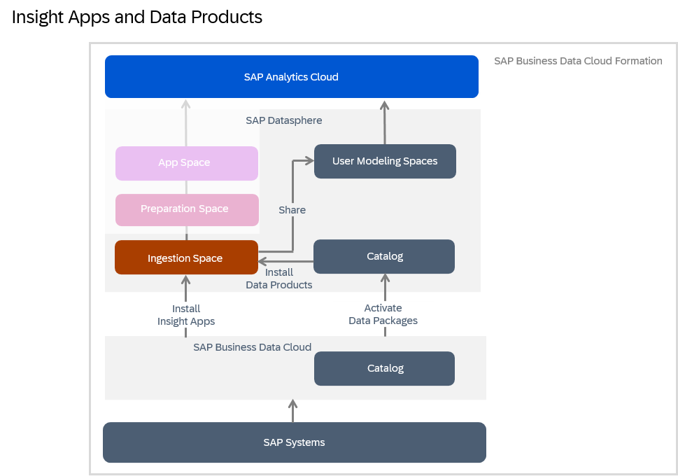

<!-- loioea7cb802cbea47b39a441888873c3a49 -->

<link rel="stylesheet" type="text/css" href="css/sap-icons.css"/>

# Evaluating and Installing Data Products

Use the catalog *Data Product* collection to view data products for use in your modeling and other projects. You can see detailed metadata for each data product and if you have the appropriate permissions, install it to an SAP Datasphere space.

<a name="loioea7cb802cbea47b39a441888873c3a49__prereq_fcb_p1y_tyb"/>

## Prerequisites

Your SAP Datasphere tenant must be part of an SAP Business Data Cloud formation \(see [Integrating Data from SAP Business Data Cloud](https://help.sap.com/viewer/9f36ca35bc6145e4acdef6b4d852d560/DEV_CURRENT/en-US/8f9c3725cfe84e08b3e951e7af06ce57.html "SAP Business Data Cloud is a fully managed SaaS solution that unifies and governs all SAP data and seamlessly connects with third-party data—giving line-of-business leaders context to make even more impactful decisions.") :arrow_upper_right:\).

A user with an administrator role must choose the spaces to which the data product can be installed \(see [Authorize Spaces to Install SAP Business Data Cloud Data Products](https://help.sap.com/viewer/935116dd7c324355803d4b85809cec97/DEV_CURRENT/en-US/67ec785b5de842488781f20c4ab52a9f.html "An SAP Datasphere administrator must choose the spaces to which SAP Business Data Cloud data products from an activated data package can be installed.") :arrow_upper_right:\).

To search for and evaluate objects in the *Data Products* collection, you must have

-   A global role that grants you the following privileges:
    -   *Data Warehouse General* \(`-R------`\) - To access SAP Datasphere.
    -   *Catalog Asset* \(`–R–––--`\) - To access the catalog and view objects in the *Assets* and *Data Products* collections.

-   A scoped role that grants you access to the space or spaces where you can install data products, with the following privileges :
    -   *Spaces* \(`–R–––--`\) - To access a space.
    -   *Space Files* \(`CRUD–--`\) - To install data products to a space.
    -   *Data Warehouse Data Builder* \(`CRUD–--`\) - To create, edit, or remove objects in the *Data Builder*.

The *Catalog User* global role and the *DW Modeler* scoped role template, applied together for example, grant these privileges. For more information, see [Privileges and Permissions](https://help.sap.com/viewer/935116dd7c324355803d4b85809cec97/DEV_CURRENT/en-US/d7350c6823a14733a7a5727bad8371aa.html "A privilege represents a task or an area in SAP Datasphere and can be assigned to a specific role. The actions that can be performed in the area are determined by the permissions assigned to a privilege.") :arrow_upper_right: and [Standard Roles Delivered with SAP Datasphere](https://help.sap.com/viewer/935116dd7c324355803d4b85809cec97/DEV_CURRENT/en-US/a50a51d80d5746c9b805a2aacbb7e4ee.html "SAP Datasphere is delivered with several standard roles. A standard role includes a predefined set of privileges and permissions.") :arrow_upper_right:. 

<a name="concept_bx2_pkv_zcc"/>

<!-- concept\_bx2\_pkv\_zcc -->

## Evaluating a Data Product

Data products are high-quality, coherent data sets that you can use via APIs in various SAP or third-party products across different data regions to help you make better business decisions. A single data product can include business objects, entities, analytic data, and more. On the search page in the SAP Datasphere catalog, select the *Data Products* collection and then select one or more filters to narrow the search results.

To know for sure if a data product will meet your needs, you can view its details to evaluate how it can help you. Some of the information that you can review includes properties about the data product, like its name and the data provider, the list of entities within the data product, and links to resources for how to use it \(see [Data Product Details](data-product-details-71f4d15.md)\).

After you've evaluated and found a data product, you can install it in your space \(see steps below\).

<a name="task_abn_f2n_gcc"/>

<!-- task\_abn\_f2n\_gcc -->

## Installing a Data Product to an SAP Datasphere Space

<a name="task_abn_f2n_gcc__context_hzr_g2n_gcc"/>

## Context

After you find an active data product in the SAP Datasphere catalog, you can install it to an SAP Datasphere space by selecting the appropriate API. If the data product is inactive, ask your administrator for help.

The following diagram displays the flow for data products.

<a name="task_abn_f2n_gcc__steps_zsy_dfn_gcc"/>

## Procedure

1.  In the side navigation area, click \(*Catalog & Marketplace*\)** \> ** \(*Search*\).

2.  In the SAP Datasphere catalog, search for a data product by entering a portion of its name in the search field or use the filters. For more information, see [Searching for Data Products and Assets in the Catalog](searching-for-data-products-and-assets-in-the-catalog-1047825.md).

3.  When you find the data product you want, check that it has an active status and select it, to open its details page.

    You can review the list of APIs by choosing the tab *Overview* \> *Details*.

4.  For the row you want, select the *Install* button.

    The *Import Entities* wizard opens.

    > ### Tip:  
    > If you're reviewing the details of a particular API, you can select the *Install* button from the API details page.

5.  Select a target space and select *Next Step*.

6.  On the *Review Entities* page, review the entities that you will import.

    You'll be able to see a list of all the objects that will be created in SAP Datasphere *Data Builder*.

7.  Select *Start Import and Deploy*.

    A notification is sent immediately, and this notification will update as the import process continues. After the import completes, you will have two notifications.

    -   Select the first notification to see the imported entities listed in the  \(*Repository Explorer*\).
    -   Select the second notification to view the import log messages.

        If any entity could not be created, an error is given.

<a name="task_abn_f2n_gcc__result_cbk_bhn_gcc"/>

## Results

The data product objects are created and deployed in the ingestion space and shared with your space:

-   You can view the objects in the *Repository Explorer*.
-   You can view and work with them in the  \(*Data Builder*\). Select the space where the data product was installed. To work with the objects, see [Preparing Data in the Data Builder](https://help.sap.com/viewer/ac696daa26f0413db39626bc2971e6c2/DEV_CURRENT/en-US/a43c8134d5df4f869d63a2976df9ed94.html "Users with a modeler role can use views and intelligent lookups in the Data Builder to combine, clean, and otherwise prepare data.") :arrow_upper_right: and [Modeling Data in the Data Builder](Modeling-Data-in-the-Data-Builder/modeling-data-in-the-data-builder-5c1e3d4.md).
-   In the catalog, users can discover the objects. Select the *Assets* collection and use the filters or search field to find the objects. The objects are discoverable only if an authenticated system user for the source system has access permission to the space where the data product was installed. For more information about automatic extraction, see [Understanding Different Methods for Extracting Metadata](https://help.sap.com/viewer/97d1d2f0e35d410c893e95a5ff3bee6f/DEV_CURRENT/en-US/b4f364186a9a4dddbd3f757d89decf94.html "Depending on the type of source system connected to the catalog, metadata for data and assets is extracted automatically, by a background process, or manually. These different methods help you ensure that the data and assets in the catalog are up-to-date.") :arrow_upper_right:.

    > ### Note:  
    > If the entity has a replication flow, two objects are created: one object is created by the replication flow \(a delta object\), and the other object is the actual object that is used as part of the installation of the data product. Both objects will have the same business name, but the technical name will be different. The delta object's name is appended with "\_Delta".

