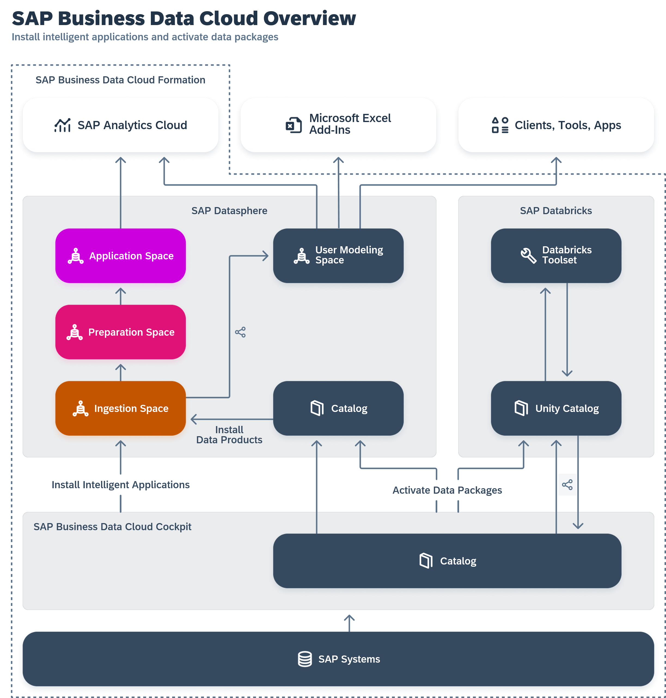

<!-- loioea7cb802cbea47b39a441888873c3a49 -->

<link rel="stylesheet" type="text/css" href="css/sap-icons.css"/>

# Evaluating and Installing Data Products

Use the catalog *Data Product* collection to view data products for use in your modeling and other projects. You can see detailed metadata for each data product and if you have the appropriate permissions, install it to an SAP Datasphere space.

<a name="loioea7cb802cbea47b39a441888873c3a49__prereq_fcb_p1y_tyb"/>

## Prerequisites

Your SAP Datasphere system must be part of an SAP Business Data Cloud formation \(see [Integrating Data from SAP Business Data Cloud](https://help.sap.com/viewer/9f36ca35bc6145e4acdef6b4d852d560/DEV_CURRENT/en-US/8f9c3725cfe84e08b3e951e7af06ce57.html "Users with an SAP Business Data Cloud administrator role can install intelligent applications to SAP Datasphere and activate data packages to allow modelers to work with data products.") :arrow_upper_right:\).

A user with an administrator role must choose the spaces to which the data product can be installed \(see [Authorize Spaces to Install SAP Business Data Cloud Data Products](https://help.sap.com/viewer/935116dd7c324355803d4b85809cec97/DEV_CURRENT/en-US/67ec785b5de842488781f20c4ab52a9f.html "An SAP Datasphere administrator must choose the spaces to which SAP Business Data Cloud data products from an activated data package can be installed.") :arrow_upper_right:\).

To search for and evaluate objects in the *Data Products* collection, you must have

-   A global role that grants you the following privileges:
    -   *Data Warehouse General* \(`-R------`\) - To access SAP Datasphere.
    -   *Catalog Asset* \(`–R–––--`\) - To access the catalog and view objects in the *Assets* and *Data Products* collections.

-   A scoped role that grants you access to the space or spaces where you can install data products, with the following privileges :
    -   *Spaces* \(`–R–––--`\) - To access a space.
    -   *Space Files* \(`CRUD–--`\) - To install data products to or uninstall data products from a space.
    -   *Data Warehouse Data Builder* \(`CRUD–--`\) - To create, edit, or remove objects in the *Data Builder*.

The *Catalog User* global role and the *DW Modeler* scoped role template, applied together for example, grant these privileges. For more information, see [Privileges and Permissions](https://help.sap.com/viewer/935116dd7c324355803d4b85809cec97/DEV_CURRENT/en-US/d7350c6823a14733a7a5727bad8371aa.html "A privilege represents a task or an area in SAP Datasphere and can be assigned to a specific role. The actions that can be performed in the area are determined by the permissions assigned to a privilege.") :arrow_upper_right: and [Standard Roles Delivered with SAP Datasphere](https://help.sap.com/viewer/935116dd7c324355803d4b85809cec97/DEV_CURRENT/en-US/a50a51d80d5746c9b805a2aacbb7e4ee.html "SAP Datasphere is delivered with several standard roles. A standard role includes a predefined set of privileges and permissions.") :arrow_upper_right:. 

<a name="concept_bx2_pkv_zcc"/>

<!-- concept\_bx2\_pkv\_zcc -->

## Evaluating a Data Product

Data products are high-quality, coherent data sets that you can use via APIs in various SAP or third-party products across different data regions to help you make better business decisions. A single data product can include business objects, entities, analytic data, and more. On the search page in the SAP Datasphere catalog, select the *Data Products* collection and then select one or more filters to narrow the search results. These data products are from tenants that are part of SAP Business Data Cloud formations.

To know for sure if a data product will meet your needs, you can view its details to evaluate how it can help you. Some of the information that you can review includes properties about the data product, like its name and the data provider, the list of entities within the data product, and links to resources for how to use it \(see [Data Product Details](data-product-details-71f4d15.md)\).

After you've evaluated and found a data product, you can install it in your space \(see steps below\).

> ### Note:  
> If you're an administrator for SAP Business Data Cloud, you can access the catalog from the SAP Business Data Cloud cockpit to share the data product to an SAP or partner system \(see [Sharing Data Products to Target Systems](https://help.sap.com/docs/business-data-cloud/governing-and-publishing-data-in-catalog/sharing-data-products-to-sap-databricks) in the SAP Business Data Cloud documentation\).

<a name="task_abn_f2n_gcc"/>

<!-- task\_abn\_f2n\_gcc -->

## Installing a Data Product to an SAP Datasphere Space

<a name="task_abn_f2n_gcc__context_hzr_g2n_gcc"/>

## Context

After you find an active data product in the SAP Datasphere catalog, you can install it to an SAP Datasphere space by selecting the appropriate API. If the data product is inactive, ask your administrator for help.

The following diagram displays the flow for data products.

<a name="task_abn_f2n_gcc__steps_zsy_dfn_gcc"/>

## Procedure

1.  In the side navigation area, click \(*Catalog & Marketplace*\)** \> ** \(*Search*\).

2.  In the SAP Datasphere catalog, search for a data product by entering a portion of its name in the search field or use the filters. For more information, see [Searching for Data Products and Assets in the Catalog](searching-for-data-products-and-assets-in-the-catalog-1047825.md).

3.  When you find the data product you want, check that it has an active status and select it, to open its details page.

    You can review the list of APIs by choosing the tab *Overview* \> *Details*.

4.  For the row you want, select the *Install* action.

    The *Import Entities* wizard opens.

    > ### Tip:  
    > If you're reviewing the details of a particular API, you can select the *Install* button from the API details page.

5.  Select a target space and select *Next Step*.

6.  On the *Review Entities* page, review the entities that you will import and then choose the appropriate data access method.

    -   *Remote Tables* - Federated access guarantees data freshness, but may reduce performance.
    -   *Replication flow to Local Tables* - Replication improves performance, but the freshness of your data will depend on your replication schedule.

    You'll be able to see a list of all the objects that will be created in the *Data Builder*.

7.  Select *Start Import and Deploy*.

    A notification is sent immediately, and this notification will update as the import process continues. After the import completes, you will have two notifications.

    -   Select the first notification to see the imported entities listed in the  \(*Repository Explorer*\).
    -   Select the second notification to view the import log messages.

        If any entity could not be created, an error is given.

<a name="task_abn_f2n_gcc__result_cbk_bhn_gcc"/>

## Results

The data product objects are created and deployed in the ingestion space and shared with your space.

-   Navigate to the objects in the *Repository Explorer* and review the data based on the data access method you selected.
    -   *Remote Tables*: By default, data is only federated. To replicate the data, open the *Data Integration Monitor* \(see [Replicating Data and Monitoring Remote Tables](https://help.sap.com/viewer/9f36ca35bc6145e4acdef6b4d852d560/DEV_CURRENT/en-US/4dd95d7bff1f48b399c8b55dbdd34b9e.html "In the Remote Tables monitor, you can find a remote table monitor per space. Here, you can copy data from remote tables that have been deployed in your space into SAP Datasphere, and you can monitor the replication of the data. You can copy or schedule copying the full set of data from the source, or you can set up replication of data changes in real-time via change data capturing (CDC).") :arrow_upper_right:\).
    -   *Replication flow to Local Tables*: Open the replication flow and run it \(or create a schedule\) to replicate the data \(see  <?sap-ot O2O class="- topic/xref " href="5b591d4998fa4a148750016a29ada91e.xml" text="" desc="" xtrc="xref:6" xtrf="file:/home/builder/src/dita-all/znj1755614851492/loioc25299a38b6448f889a43b42c9e5897d_en-US/src/content/localization/en-us/ea7cb802cbea47b39a441888873c3a49.xml" output-class="" outputTopicFile="file:/home/builder/tp.net.sf.dita-ot/2.3/plugins/com.elovirta.dita.markdown_1.3.0/xsl/dita2markdownImpl.xsl" ?> \).

-   View and work with the objects in the  \(*Data Builder*\). Select the space where the data product was installed. To work with the objects, see [Preparing Data](https://help.sap.com/viewer/ac696daa26f0413db39626bc2971e6c2/DEV_CURRENT/en-US/a43c8134d5df4f869d63a2976df9ed94.html "Users with a modeler role can use views and intelligent lookups in the Data Builder to combine, clean, and otherwise prepare data.") :arrow_upper_right: and [Modeling Data in the Data Builder](Modeling-Data-in-the-Data-Builder/modeling-data-in-the-data-builder-5c1e3d4.md).

<a name="task_zbr_nl5_gfc"/>

<!-- task\_zbr\_nl5\_gfc -->

## Modifying the Data Access for a Data Product

<a name="task_zbr_nl5_gfc__context_ygp_pl5_gfc"/>

## Context

When selecting a data access method, you will consider both storage and processing time costs and data freshness. You can at any time change the data access method for your data product.

## Procedure

1.  In the side navigation area, click \(*Catalog & Marketplace*\)** \> ** \(*Search*\).

2.  In the SAP Datasphere catalog, search for a data product by entering a portion of its name in the search field or use the filters. For more information, see [Searching for Data Products and Assets in the Catalog](searching-for-data-products-and-assets-in-the-catalog-1047825.md).

3.  When you find the data product you want, reinstall it.

    On the *Review Entities* page of the wizard, remember to switch the data access method to the one you want.

<a name="task_dw1_ykv_s2c"/>

<!-- task\_dw1\_ykv\_s2c -->

## Uninstalling a Data Product from an SAP Datasphere Space

<a name="task_dw1_ykv_s2c__prereq_e1l_clv_s2c"/>

## Prerequisites

Remove all dependent objects for the data product before you uninstall a data product \(API\) from your SAP Datasphere space.

<a name="task_dw1_ykv_s2c__context_apk_bqx_t2c"/>

## Context

If you no longer need a data product in a particular space, you can uninstall it.

> ### Note:  
> If the lifecycle status of a data product changes so that the data product is no longer active, the data product might not be visible in the catalog. For example, when the status of a custom Delta Share data product \(that was created in the Data Sharing Cockpit\) changes from *Listed* to *Delisted*, the data product will not appear in the catalog. If you can't find the data product that you want to uninstall, contact your administrator. For more information about custom Delta Share data products, see [Creating Custom Delta Share Data Products](https://help.sap.com/viewer/bb1899f0b39f415b9de29a845873d7af/DEV_CURRENT/en-US/b07e95d07a1e4569b87d9bb57b732bcf.html "Create a custom data product on a Delta Share runtime. This custom data product can then be shared with any system in the formation that supports it, such as SAP Databricks.") :arrow_upper_right: in the **Data Marketplace - Data Provider's Guide**.

## Procedure

1.  In the side navigation area, click \(*Catalog & Marketplace*\)** \> ** \(*Search*\).

2.  In the SAP Datasphere catalog, search for the data product by entering a portion of its name in the search field or use the filters. For more information, see [Searching for Data Products and Assets in the Catalog](searching-for-data-products-and-assets-in-the-catalog-1047825.md).

3.  When you find the data product you want to remove, select it to open its details page.

4.  Select *Overview* \> *Details* to see all available data product APIs.

5.  Find the API that you want to uninstall and select *Uninstall*.

    The dialog that appears shows a list of all spaces where the data product is installed. If any objects in a space still depend on the data product, preventing its removal, a note is displayed for that space.

    <table>
    <tr>
    <th valign="top">

    Option
    
    </th>
    <th valign="top">

    Steps
    
    </th>
    </tr>
    <tr>
    <td valign="top">
    
    **Space with no dependent objects**
    
    </td>
    <td valign="top">
    
    1.  Select a system.
    2.  In the confirmation dialog, select *Uninstall* to uninstall the data product from that space.

    
    </td>
    </tr>
    <tr>
    <td valign="top">
    
    **Space with dependent objects**
    
    </td>
    <td valign="top">
    
    1.  Select a system to see all dependent objects.
    2.  To remove a single dependent object, select it, which opens it, and then delete it.
    3.  To remove several dependent objects, select the *View in Repository Explorer* button, which opens the *Repository Explorer*, and then delete all dependent objects.
    4.  After all dependent objects are removed, go back to the data product and uninstall it from the space.

    
    </td>
    </tr>
    </table>
    

**Related Information**  

[Authorize Spaces to Install SAP Business Data Cloud Data Products](https://help.sap.com/viewer/935116dd7c324355803d4b85809cec97/DEV_CURRENT/en-US/67ec785b5de842488781f20c4ab52a9f.html "An SAP Datasphere administrator must choose the spaces to which SAP Business Data Cloud data products from an activated data package can be installed.") :arrow_upper_right:

[Importing Entities with Semantics from SAP S/4HANA](Acquiring-and-Preparing-Data-in-the-Data-Builder/importing-entities-with-semantics-from-sap-s-4hana-845fedb.md "You can use the Import Entities wizard to load metadata from your SAP S/4HANA Cloud and SAP S/4HANA on-premise connections via semantically-rich objects. The wizard creates Business Builder and Data Builder entities (along with all the objects on which they depend) in SAP Datasphere.")

