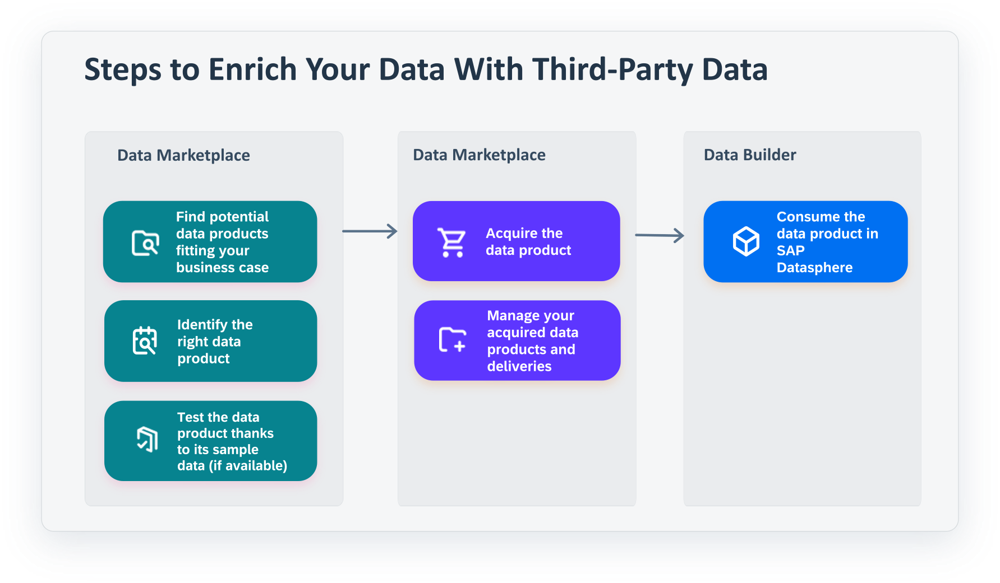

<!-- loio92c35efd6a4945a1a78250539aee9a51 -->

<link rel="stylesheet" type="text/css" href="css/sap-icons.css"/>

# Evaluating and Installing Marketplace Data Products

When you find a data product that interests you, review its details page and test the sample data sets \(if available\) to make sure it's the right one for your business needs. After you evaluate it and decide it's what you need, you can install it to an SAP Datasphere space.

<a name="loio92c35efd6a4945a1a78250539aee9a51__prereq_fcb_p1y_tyb"/>

## Prerequisites

You must be assigned one of the following roles:

-   DW Viewer
-   DW Modeler
-   DW Integrator

Or you must be assigned a custom role with the following settings:

-   *Read* permission for *Spaces*
-   *Create*, *Read*, *Update*, and *Delete* permissions for *Space Files* and *Data Warehouse Remote Connection*
-   *Create*, *Read*, and *Update* for *Data Warehouse Data Integration* and *Data Warehouse Data Builder*

You also must be assigned as a member user for one or more spaces and be a member of one or more contexts.

> ### Note:  
> If a data product is delivered using the Open SQL delivery mode, you must have access to a space and an Open SQL schema with credentials that you can share with the data provider.

The *Marketplace Data Products* and *Data Providers* tabs are only available in the SAP Datasphere catalog.

<a name="concept_atb_t5v_zcc"/>

<!-- concept\_atb\_t5v\_zcc -->

## Evaluating a Marketplace Data Product

From the catalog search page, you can select the *Marketplace Data Products* filter and then apply more filters or search terms to discover data products that can help you with your business goals.

To know for sure if a data product will met your needs, you can view its details to evaluate how it can help you. Some of the information that you will be reviewing includes, summary information about the data product, like its name and the data provider. Other information provides a bit more details, like sample data, objects within the data product and terms of use and other documentation. For more information on the detailed information that you can review, see [Marketplace Data Product Details](marketplace-data-product-details-f59e912.md).

After you've evaluated and found a data product, use the following steps to download a sample dataset for testing or to install the data product in an SAP Datasphere space.

The following diagram shows a simple workflow for getting data products into an SAP Datasphere space.

<a name="marketplacedp_downloadsample"/>

<!-- marketplacedp\_downloadsample -->

## Downloading a Sample Dataset

<a name="marketplacedp_downloadsample__context_mdn_cmg_2cc"/>

## Context

If you want to further evaluate a data product, you can download a sample dataset \(if available\) and test it to see if it’s really what you need.

<a name="marketplacedp_downloadsample__steps_nh4_dmg_2cc"/>

## Procedure

1.  In the side navigation area, click \(*Catalog*\).

2.  On the catalog search page, use the filters or the search to find the data product you want. For more information, see [Finding Data and Assets in the Catalog](finding-data-and-assets-in-the-catalog-1047825.md).

3.  When viewing the page for the data product, select *Overview tab* \> *Details*, and select the *Sample Data* tab.

4.  Select a dataset and review the preview of the sample data.

5.  If the dataset is suitable, download it.

<a name="marketplacedp_downloadsample__result_v1d_wmg_2cc"/>

## Results

Open the file explorer on your computer to find the sample dataset and then use it where you need it. If it passes all your tests, you can go back to the data product and install it in the SAP Datasphere space that you need it in.

<a name="marketplacedp_install"/>

<!-- marketplacedp\_install -->

## Installing a Marketplace Data Product

<a name="marketplacedp_install__context_vvx_ymg_2cc"/>

## Context

After you decide that the data product is what you need, you can install it in any SAP Datasphere space you have access to and use in a data project.

<a name="marketplacedp_install__steps_oyn_1ng_2cc"/>

## Procedure

1.  In the side navigation area, click \(*Catalog*\).

2.  On the catalog search page, use the filters or the search to find the data product you want. For more information, see [Finding Data and Assets in the Catalog](finding-data-and-assets-in-the-catalog-1047825.md).

3.  On the data product details page, choose one of the following to install it:

    -   For free data products, select *Install*.

        If the data product has already been installed, the install dialog shows a list of spaces where it has been installed.

    -   For data products that require a license key, select *Install with License Key*.

        If the data product has already been installed, the license key is automatically entered in the install dialog and you'll see a list of spaces where it has been installed.

    -   For data products that you have to request for, select *Request Access*.

        Edit the email to request access for the data product and send it to the data provider. You can continue with these steps after you get access to the data product.

4.  If the data product requires a license key, enter it.

    If you don't have a license key, select *Get Key* to contact the data provider and continue with these steps after you get the license key.

5.  In *Target Space*, select the space where you want to install the data product.

    You can select only spaces that you have access to. If no target spaces are available, the data product has been installed to all spaces that you have access to or you must request user access to a different space.

6.  If available, select the update type.

    Data products that have the *Full Replication*type delivery mode can receive updates.

7.  Review the terms of use, the legal documents, and other supplemental documents, and then select *Install*.

<a name="marketplacedp_install__result_ivx_fng_2cc"/>

## Results

Objects from the data product are created and deployed in the space you selected. You can view the objects in the *Repository Explorer* and start using them, or users can discover them in the catalog.

-   In the *Repository Explorer*, select the space where the data product was installed to. When you find the objects from the data product, you can use them in a new or existing project as a source.

    For example, in the *Data Builder*, you use the objects from the data product to create a graphical view. For information on preparing data in the *Data Builder*, see [Preparing Data in the Data Builder](preparing-data-in-the-data-builder-f2e359c.md).

-   In the catalog, users will be able to discover the objects. Select the *Assets* tab and use the filters or the search to find the objects. The objects are discoverable only if authenticated system user for the source system has access permission to the space where the data product was installed. For more information about automatic extraction, see [Understanding Different Methods for Extracting Metadata](https://help.sap.com/viewer/97d1d2f0e35d410c893e95a5ff3bee6f/DEV_CURRENT/en-US/b4f364186a9a4dddbd3f757d89decf94.html "Depending on the type of source system connected to the catalog, metadata for data and assets is extracted automatically or manually. These different methods help you ensure that the data and assets in the catalog are up-to-date.") :arrow_upper_right:.

<a name="marketplacedp_install__postreq_ihg_ycs_c2c"/>

## Next Steps

After you install one or more data products, you can keep track of the data product installations, activate licenses, and choose which contexts you are a member of.

-   Go to the *My Data Products* page to review and keep track of the data products you've installed. You can also see when they were last updated and their delivery status. For more information, see [Managing your Data Products](managing-your-data-products-2e9d2e2.md).
-   Go to the *My Licenses* page to keep track of your licenses. For more information, see [Managing your Licenses](managing-your-licenses-98d9865.md).
-   Go to the *My Contexts* page to manage the contexts you are member of. For more information, see [Managing your Contexts](managing-your-contexts-4c390c5.md).

