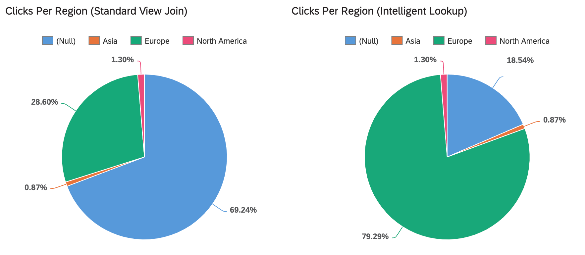

<!-- loiodfd5ffd26d804073aeb3ef95bc8917ca -->

# Example: Adding Latitude and Longitude Data with a Multi-Rule Intelligent Lookup

In this example, we want to enrich our website analytics data with latitude and longitude values from another view containing geo data for over 100,000 cities across the world. But the data identifying the city, country, and region from which each of our website clicks originates is not always complete and even where it is, it does not always match with our geo data values.

<table>
<tr>
<th valign="top">

Step

</th>
<th valign="top">

Result

</th>
</tr>
<tr>
<td valign="top">

First, we try to join the two views by `city`, `country`, and `region` in a standard view but, since one or more of these columns may be empty, we find that only around 31% of our records can be matched.

</td>
<td valign="top">

</td>
</tr>
<tr>
<td valign="top">

We decide to join our entities via an intelligent lookup. We have previously created a calculated column to concatenate the `City`, `Region`, and `Country` columns to generate a unique identifier for each city and we select that as the pairing column.

</td>
<td valign="top">

</td>
</tr>
<tr>
<td valign="top">

We recreate the same join mapping in an exact match rule and get the same result as for our view join.

</td>
<td valign="top">

</td>
</tr>
<tr>
<td valign="top">

We add a second exact match rule to treat the unmatched records, this time mapping on just `city` and `country`, and get:

-   38% of the total records matched
-   7% of the records with multiple potential matches, most of which can be reviewed and manually resolved
-   24% still unmatched

</td>
<td valign="top">

</td>
</tr>
<tr>
<td valign="top">

Next, we take the remaining 24% of unmatched records, create a fuzzy rule on just `city` with the default 100% \(match\) and 80% \(review\) thresholds, and get:

-   < 1% matched
-   8% matched but requiring review
-   10% with multiple matches
-   6% still unmatched

</td>
<td valign="top">

</td>
</tr>
<tr>
<td valign="top">

We create a final exact match rule to add a further condition for the multiple matches. The logic here is fuzzy match on `city` AND exact match on `country` and get:

-   4% matched
-   5% with multiple matches
-   <1% unmatched

</td>
<td valign="top">

</td>
</tr>
<tr>
<td valign="top">

Taken together, our four rules take us from just 31% of records matched with the standard view join, all the way to 79% matched with the intelligent lookup before any manual review.

</td>
<td valign="top">

</td>
</tr>
</table>

