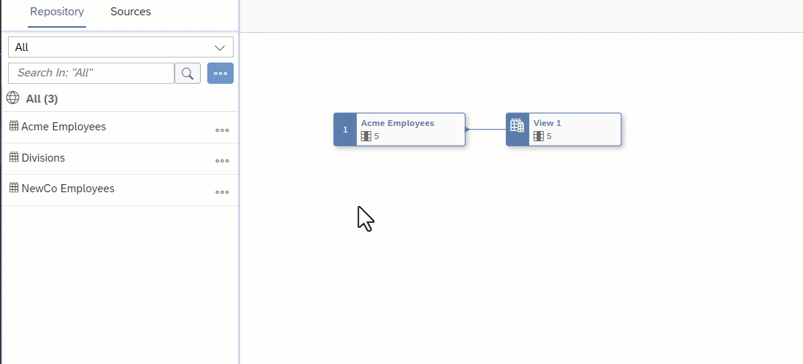

<!-- loio6f6fa18c7c9444da8ca62d76656b7b1a -->

<link rel="stylesheet" type="text/css" href="css/sap-icons.css"/>

# Filter Data

Add a *Filter* node to filter your data with an SQL expression.

## Procedure

1.  Select an object in order to display its context tools, and click  Filter.

    

    A filter node is created, its symbol is selected, and its properties are displayed in the side panel.

2.  Optional. Rename the node in its side panel to clearly identify it. This name can be changed at any time and can contain only alphanumeric characters and underscores.

3.  Enter a SQL expression into the *Expression* field. You can use the following items in your SQL expression:

    -   *Insert Values* - Click to open the *Insert Value* dialog, select the values you need to insert in the list, and click *Insert Value*.

        > ### Note:  
        > -   The button is enabled when, in the *Expression* field, a column name is followed by the operator `=`, `>`, `<`, `>=`, `<=`, `!=`, `IN`, `BETWEEN`, or `LIKE`.
        > 
        > -   The values listed in the dialog are retrieved from the sources and intermediate nodes of your object. You can insert values of the data types string, integer, boolean, date, and time. The data types binary and UUID aren't supported.
        > -   Once your expression is valid, additional values cannot be inserted. You must edit your expression to make it incomplete; this enables the *Insert Values* button and allows you to insert other values.
        > -   The *Insert Values* dialog doesn't format the expression. Manual formatting may be required after inserting values.
        > 
        > > ### Example:  
        > > -   The expression `Column1 =`enables the *Insert Values* dialog. You can select a single value from the list.
        > > 
        > > -   The expression `Column2 BETWEEN` enables the *Insert Values* dialog. You can select two values from the list. If both values are available in a single search results, both of them can be selected together. However, if the values needs to be selected from two different search results, you have to select and insert one value at once.
        > > -   The expression `Column3 IN` enables the *Insert Values* dialog. You can select multiple values from the list. If all the required values are available in a single search results, those values can be selected together. However, if the values have to be selected from different search results, you have to select and insert one value at once. You select and insert the values 2, 5, 6, and 9. The expression `Column3 IN (2, 5, 6, 9)` is valid. You want to add another value to it, so you click *Insert Values*. In the *Insert Values* dialog, you can only see the values 2, 5, 6, and 9 because the dialog is already filtered by the selected values. To see all available values, edit your expression to make it invalid: `Column3 IN (2, 5, 6, 9,`. The *Insert Values* button is available again and you can add new values.

        Select available value\(s\) and click *Insert* to add them to your expression.

    -   *Functions* - Browse, select a category, or filter available functions \(see [SQL Functions Reference](sql-functions-reference-6d624a1.md)\). Click a function name to see its syntax or click elsewhere in its token to add it to your expression.
    -   *Columns* - Browse or filter available columns. Click a column name to see its properties or click elsewhere in its token to add it to your expression.
    -   *Parameters* - Browse or filter available input parameters \(see [Create an Input Parameter](create-an-input-parameter-53fa99a.md)\). Click a parameter name to see its properties or click elsewhere in its token to add it to your expression.
    -   *Other* - Browse available operators, predicates, and case expressions, and click one to add it to your expression \(see [SQL Reference](sql-reference-6a37cc5.md)\).

    For example, if you want to list only those products with 10 units or less in stock, enter `Units_on_hand <= 10` 

    When working on a large expression, click  \(Enter Full Screen\) to expand the expression editor.

4.  Click *Validate* to check if your expression is semantically correct, and fix any errors signaled. You can reference columns by name as well as HANA functions, operators, predicates, and case expressions.

5.  Click  \(Preview Data\) to open the *Data Preview* panel and review the data output by this node. For more information, see [Viewing Object Data](viewing-object-data-b338e4a.md).

