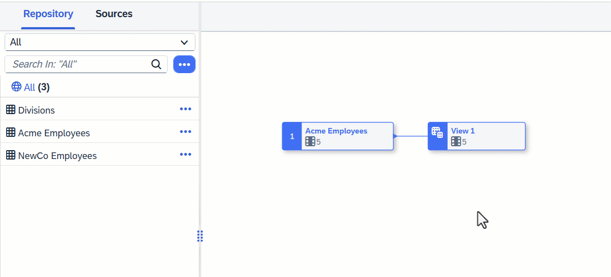

<!-- loio6f6fa18c7c9444da8ca62d76656b7b1a -->

<link rel="stylesheet" type="text/css" href="css/sap-icons.css"/>

# Filter Data in a Graphical View

Add a *Filter* node to filter your data with an SQL expression.

## Procedure

1.  Select an object in order to display its context tools, and click  Filter.

    

    A filter node is created, its symbol is selected, and its properties are displayed in the side panel.

2.  Optional. Rename the node in its side panel to clearly identify it. This name can be changed at any time and can contain only alphanumeric characters and underscores.

3.  Enter a SQL expression into the *Expression* field.

    For example, if you want to list only those products with 10 units or less in stock, enter `Units_on_hand <= 10`.

    You can use the following tools to help with entering your SQL expression:

    -   *Insert Values* - Enter a column name and operator in the field and then click this button to select values from that column to insert \(see [Insert Column Values in a SQL Expression](insert-column-values-in-a-sql-expression-e18c54b.md)\).
    -   *Validate* - Click to verify the syntax of your SQL and fix any errors signaled.
    -   *Functions* - Browse, select a category, or filter available functions \(see [SQL Functions Reference](sql-functions-reference-6d624a1.md)\). Click a function name to see its syntax or click elsewhere in its token to add it to your expression.
    -   *Columns* - Browse or filter available columns. Click a column name to see its properties or click elsewhere in its token to add it to your expression.
    -   *Parameters* - Browse or filter available input parameters \(see [Create an Input Parameter in a Graphical View](create-an-input-parameter-in-a-graphical-view-53fa99a.md)\). Click a parameter name to see its properties or click elsewhere in its token to add it to your expression.
    -   *Other* - Browse available operators, predicates, and case expressions, and click one to add it to your expression \(see [SQL Reference](sql-reference-6a37cc5.md)\).
    -    \(Enter Full Screen\) - Click to expand the expression editor.

4.  Click  \(Preview Data\) to open the *Data Preview* panel and review the data output by this node. For more information, see [Viewing Object Data](viewing-object-data-b338e4a.md).

