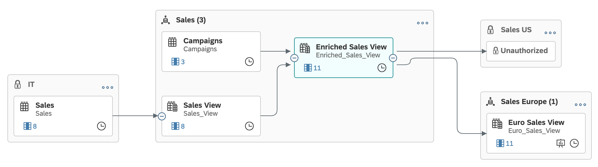
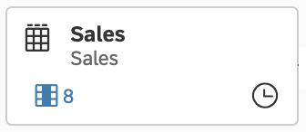

<!-- loio9da4892cb0e4427ab80ad8d89e6676b8 -->

<link rel="stylesheet" type="text/css" href="css/sap-icons.css"/>

# Impact and Lineage Analysis

The *Impact and Lineage Analysis* diagram helps you to understand the lineage \(or data provenance\) of a selected object or one or more of its columns, along with its impacts - the objects that depend on it and that will be impacted by any changes that are made to it.

This topic contains the following sections:

-   [Open the Diagram](impact-and-lineage-analysis-9da4892.md#loio9da4892cb0e4427ab80ad8d89e6676b8__section_opening)
-   [Control the Diagram Layout](impact-and-lineage-analysis-9da4892.md#loio9da4892cb0e4427ab80ad8d89e6676b8__section_exploring)
-   [Display Object Properties and Analyze or Open Objects](impact-and-lineage-analysis-9da4892.md#loio9da4892cb0e4427ab80ad8d89e6676b8__section_properties)
-   [Dependency Analysis Mode](impact-and-lineage-analysis-9da4892.md#loio9da4892cb0e4427ab80ad8d89e6676b8__section_dependency_analysis)
-   [Column Analysis](impact-and-lineage-analysis-9da4892.md#loio9da4892cb0e4427ab80ad8d89e6676b8__section_column_analysis)
-   [Shared Objects and Unauthorized Objects](impact-and-lineage-analysis-9da4892.md#loio9da4892cb0e4427ab80ad8d89e6676b8__section_shared_unauthorized)

<a name="loio9da4892cb0e4427ab80ad8d89e6676b8__section_opening"/>

## Open the Diagram

You can open the *Impact and Lineage Analysis* dialog from various screens:

-   In the *Repository Explorer* or the *Data Builder* start page, select an object to analyze and click  \(Impact and Lineage Analysis\) in the toolbar.
-   In the *Catalog*, click the *Open Impact and Lineage Analysis* button on the asset details page.
-   In *Data Builder* object editors, click  \(Impact and Lineage Analysis\) in the toolbar or, if the editor contains a diagram, select a table, view, or data flow symbol and click the tool in the symbol toolbar.

In this example, a user opens the diagram to analyze the *Enriched Sales View* in the *Sales* space, which has two sources and which is a source for two objects in other spaces:

<a name="loio9da4892cb0e4427ab80ad8d89e6676b8__section_exploring"/>

## Control the Diagram Layout

Use the diagram tools to control the layout of the diagram. 

<table>
<tr>
<th valign="top">

Tool

</th>
<th valign="top">

Description

</th>
</tr>
<tr>
<td valign="top">

Data Analysis / Dependency Analysis

</td>
<td valign="top">

Toggle between the two modes:

-   *Data Analysis* - Focus exclusively on data movements and transformations.
-   *Dependency Analysis* - Additionally display objects connected through associations and data access controls.

</td>
</tr>
<tr>
<td valign="top">

Search

</td>
<td valign="top">

Find and select objects in the diagram. Results are proposed once three characters are entered. Click a result in the list to select the object symbol and highlight other objects on its path to the analyzed object.

</td>
</tr>
<tr>
<td valign="top">

Lineage

</td>
<td valign="top">

Enable/disable the display of the lineage of the analyzed object.

</td>
</tr>
<tr>
<td valign="top">

Impact

</td>
<td valign="top">

Enable/disable the display of the impacts of the analyzed object.

</td>
</tr>
<tr>
<td valign="top">

Layout

</td>
<td valign="top">

Change the orientation of the diagram:

-   *Left-Right* - \[default\] Display lineage objects on the left and impacts on the right of the analyzed object.
-   *Bottom-Top* - Display lineage objects below and impacts above the analyzed object.

</td>
</tr>
<tr>
<td valign="top">

Reset

</td>
<td valign="top">

Restore the default layout. Changing the mode also resets the layout.

</td>
</tr>
<tr>
<td valign="top">

</td>
<td valign="top">

Scroll, zoom, or recenter the diagram:

-   Click  \(or press [F6\]\) to zoom in.
-   Click  \(or press [F7\]\) to zoom out.
-   Click the center button \(or press [F8\]\) to fit to screen, [CTRL\]-click the center button \(or press [CTRL\] + [F5\] \) to zoom to 100% scale, or enter a percentage.
-   Click the arrow buttons \(or press the arrow keys\) to scroll horizontally or vertically.

</td>
</tr>
</table>

The diagram can contain various types of symbols. 

<table>
<tr>
<th valign="top">

Symbol

</th>
<th valign="top">

Description

</th>
</tr>
<tr>
<td valign="top">

</td>
<td valign="top">

The object being analyzed.

You can show or hide the objects on either side of this or any object by clicking the  \(Show Next Level\) or  \(Hide All\) buttons on the symbol.

</td>
</tr>
<tr>
<td valign="top">

</td>
<td valign="top">

Objects appearing in the lineage or impacts of the analyzed object.

If you do not have permission to view an object, it is shown with the :lock: icon and the name *Unauthorized*.

</td>
</tr>
<tr>
<td valign="top">

</td>
<td valign="top">

Spaces that contain objects appearing in the lineage or impacts of the analyzed objects. The number in brackets indicates the total number of objects in the space that are part of the impact or lineage of the analyzed object.

You can expand or collapse a space, using the  \(Show/Hide All Objects\) menu on the top-right corner of the symbol.

If you do not have permission to view a space, it is shown with the :lock: icon.

</td>
</tr>
</table>

<a name="loio9da4892cb0e4427ab80ad8d89e6676b8__section_properties"/>

## Display Object Properties and Analyze or Open Objects

In addition to their business and technical names and their object type \(indicated by the icon in the top-left corner, object symbols can display the following properties:

<table>
<tr>
<th valign="top">

Icon

</th>
<th valign="top">

Description

</th>
</tr>
<tr>
<td valign="top">

 \(Persisted\)/\(Replicated\)

</td>
<td valign="top">

Persisted and replicated objects have their data copied locally to enhance performance \(see [Persist View Data](persist-view-data-9bd12cf.md) and [Replicate Remote Table Data](Acquiring-and-Preparing-Data-in-the-Data-Builder/replicate-remote-table-data-7e258a7.md)\).

</td>
</tr>
<tr>
<td valign="top">

 \(Exposed for Consumption\)

</td>
<td valign="top">

Exposed objects can be consumed by SAP Analytics Cloud and other BI clients, tools and apps \(see [Exposing a View For Consumption](Modeling-Data-in-the-Data-Builder/exposing-a-view-for-consumption-40ec77e.md)\).

</td>
</tr>
<tr>
<td valign="top">

 \(Deployed\)

</td>
<td valign="top">

Deployment Status \(see [Saving and Deploying Objects](saving-and-deploying-objects-7c0b560.md)\).

</td>
</tr>
<tr>
<td valign="top">

 \(Released\)

</td>
<td valign="top">

Release State \(see [Releasing Stable Views for Consumption](releasing-stable-views-for-consumption-5b99e9b.md)\).

</td>
</tr>
<tr>
<td valign="top">

</td>
<td valign="top">

Number of columns in the object. Click to see the column list and, in the case of the analyzed object, to select one or more columns for analysis \(see [Column Analysis](impact-and-lineage-analysis-9da4892.md#loio9da4892cb0e4427ab80ad8d89e6676b8__section_column_analysis)\).

</td>
</tr>
</table>

Select an object to display its context menu, which contains tools for furthering the analysis. 

<table>
<tr>
<th valign="top">

Tool

</th>
<th valign="top">

Description

</th>
</tr>
<tr>
<td valign="top">

 \(Show Details\)

</td>
<td valign="top">

Preview the object's properties.

</td>
</tr>
<tr>
<td valign="top">

 \(Impact and Lineage Analysis\)

</td>
<td valign="top">

Change the focus of the diagram to analyze this object. You can go back to the previous diagram by clicking  \(Navigate Back\) in the dialog header.

</td>
</tr>
<tr>
<td valign="top">

 \(Open in New Tab\)

</td>
<td valign="top">

Open the object in its editor in a new browser tab.

</td>
</tr>
</table>

<a name="loio9da4892cb0e4427ab80ad8d89e6676b8__section_dependency_analysis"/>

## Dependency Analysis Mode

While the default *Data Analysis* mode focuses exclusively on data movements and transformations, the *Dependency Analysis* mode adds objects that are connected to the analyzed object by associations and data access controls.

In this example, the *Sales View* entity shows a single source table in *Data Analysis* mode:

In *Dependency Analysis* mode, it shows several other entities, to which it is linked via associations, along with a data access control:

These additional link types display as follows::

-    \(Association\) - Association pointing to another entity to indicate a potential join between them \(see [Create an Association to Define a Semantic Relationship Between Entities](Modeling-Data-in-the-Data-Builder/create-an-association-to-define-a-semantic-relationship-between-entities-66c6998.md)\).

-    \(Data Access Control\) - Data access control providing row-level security \(see [Securing Data with Data Access Controls](https://help.sap.com/viewer/9f36ca35bc6145e4acdef6b4d852d560/DEV_CURRENT/en-US/a032e51c730147c7a1fcac125b4cfe14.html "Data access controls allow you to apply row-level security to your objects. When a data access control is applied to a data layer view or a business layer object, any user viewing its data will see only the rows for which they are authorized, based on the specified criteria.") :arrow_upper_right:\).

<a name="loio9da4892cb0e4427ab80ad8d89e6676b8__section_column_analysis"/>

## Column Analysis

To review the lineage and impacts of one or more columns in your analyzed object:

1.  Click the columns button on the analyzed object to open the list of columns.
2.  Select one or more columns that you want to analyze and then click *Select*.

    The diagram refreshes to show the selected columns under the analyzed object and columns implicated in their lineage or impacts under all other relevant objects. A green filter bar shows the number of columns selected.

    > ### Note:  
    > Column analysis is only supported for tables, graphical and SQL \(Standard Query\) views, and analytic models. The analysis cannot continue beyond other types of objects.

    

3.  \[optional\] Click any column in the analyzed object \(or any other object\) to highlight its participation in the graph.

    

4.  You can change your column selection at any time, and leave column analysis by clicking the X on the right of the filter bar.

<a name="loio9da4892cb0e4427ab80ad8d89e6676b8__section_shared_unauthorized"/>

## Shared Objects and Unauthorized Objects

You only have permission to see an object if it is created in \(or shared to\) a space you're assigned to. When exploring the diagram, you may encounter objects that you do not have permission to see. Such objects are shown as *Unauthorized*, and both the object and space show a :lock: icon:

-   Unauthorized Lineage Objects - If the analyzed object \(or an object appearing in its lineage\) is shared from a space you are not assigned to, to a space you are assigned to, this shared object is shown inside its space, which has a :lock: icon.

    You can show the immediate sources of this object but, if you do not have permission to see one or more of them, then they will be represented by *Unauthorized* placeholders. You cannot view the properties of these placeholder objects, perform any actions on them, or continue the analysis beyond them in any way.

-   Unauthorized Impact Objects - The analyzed object \(or an object appearing in its impacts\) may be shared to a space you're assigned to and used as a source by objects in that space.

    You can show the objects that are immediately impacted by this object in their space, which has a locked icon but, if you do not have permission to see one or more of them, then you they will be represented by *Unauthorized* placeholders. You cannot view the properties of these placeholder objects, perform any actions on them, or continue the analysis beyond them in any way.

In our example:

-   The user can see the *Sales* table that is shared from the *IT* space to the *Sales* space, but does not have permission to see the sources of that table \(if any\) or any other objects in the *IT* space.
-   The user does not have permission to see any objects in the *Sales US* space, to which the *Enriched Sales View* is shared.

