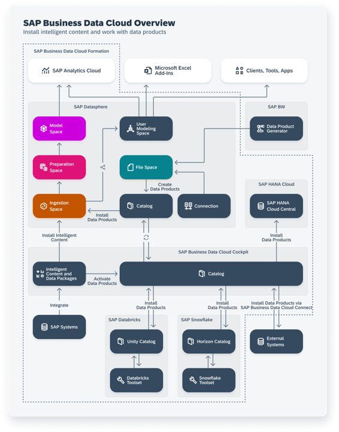

<!-- loio605b734f433f4c3895ec827fa71bea41 -->

<link rel="stylesheet" type="text/css" href="css/sap-icons.css"/>

# Installing Data Products

Access requests that have been approved become access agreements and appear under the *Agreements* tab. You can install a data product for an access agreement or end an access agreement that's no longer needed.

<a name="loio605b734f433f4c3895ec827fa71bea41__prereq_fcb_p1y_tyb"/>

## Prerequisites

To search for and request access to data products, manage access requests and agreements, and install data products, you must have:

-   A global role that grants you the following privileges:
    -   *Data Warehouse General* \(`-R------`\) - To access SAP Datasphere.
    -   *Catalog Asset* \(`–R–––--`\) - To access the catalog, view objects in the *Assets* and *Data Products* collections, and create and manage data product access requests and agreements.

-   A scoped role that grants you access to the space or spaces where you can install data products, with the following privileges:
    -   *Spaces* \(`–R–––--`\) - To access a space.
    -   *Space Files* \(`CRUD–--`\) - To install data products in a space or end an access agreement.
    -   *Data Warehouse Data Builder* \(`CRUD----`\) - To create, edit, and delete *Data Builder* objects.
    -   *Data Warehouse Connection* \(`-R------`\) - To access remote objects.

The *Catalog User* global role and the *DW Modeler* scoped role template, applied together for example, grant these privileges. For more information, see [Privileges and Permissions](https://help.sap.com/viewer/9f804b8efa8043539289f42f372c4862/cloud/en-US/d7350c6823a14733a7a5727bad8371aa.html "A privilege represents a task or an area in SAP Datasphere and can be assigned to a specific role. The actions that can be performed in the area are determined by the permissions assigned to a privilege.") :arrow_upper_right: and [Standard Roles Delivered with SAP Datasphere](https://help.sap.com/viewer/9f804b8efa8043539289f42f372c4862/cloud/en-US/a50a51d80d5746c9b805a2aacbb7e4ee.html "SAP Datasphere is delivered with several standard roles. A standard role includes a predefined set of privileges and permissions.") :arrow_upper_right:. 

## Context

After you receive the notification your access request has been approved, you can review the access agreement and install the data product. 

> ### Tip:  
> If the data product is already installed in the location you specified, the installation action won't be available. You can skip these steps and go directly to the location to start using the data product.

## Procedure

1.  In the side navigation area, choose \(*Catalog & Marketplace*\) ** \> ** *\(Data Product Access\)*.

    > ### Tip:  
    > You can access this page from the approval notification.

2.  On the *Data Product Access* page, choose the *Agreements* tab. 

3.  Select a filter and enter search terms to show the items that you want.

    The list is updated to show only the items that match the criteria you entered. 

4.  Select the access agreement to view its details page. 

5.  Choose *Install Data Product*. 

6.  Select the delivery method for accessing the data.

    -   *Federation* - Federated access uses remote tables and guarantees data freshness, but may reduce performance.
    -   *Replication* - Replication improves performance, but the freshness of your data will depend on your replication schedule.

    > ### Note:  
    > Data products from supported external systems can be installed only with the *Federation* option.

7.  Choose **Install**.

## Results

The data product is installed in the space specified in the access agreement.

If the data product you installed was created from a different system, the data product objects, including any custom fields defined in the source system, are created and deployed in the ingestion space. These objects are then shared with your space. For more information about spaces, see [Ingestion Spaces and Other SAP Business Data Cloud Spaces](https://help.sap.com/viewer/be5967d099974c69b77f4549425ca4c0/cloud/en-US/8390855d227547c284bee71eda281459.html "") :arrow_upper_right:.

-   Navigate to the objects in the *Repository Explorer* and review the data based on how you chose to access it.
    -   *Federation*: By default, data is accessed using remote tables. To replicate the data, open the *Data Integration Monitor* \(see [Monitoring Remote Tables](https://help.sap.com/viewer/be5967d099974c69b77f4549425ca4c0/cloud/en-US/4dd95d7bff1f48b399c8b55dbdd34b9e.html "In the Remote Tables monitor, you can find a remote table monitor per space. Here, you can copy data from remote tables that have been deployed in your space into SAP Datasphere, and you can monitor the replication of the data. You can copy or schedule copying the full set of data from the source, or you can set up replication of data changes in real-time via change data capturing (CDC).") :arrow_upper_right:\).
    -   *Replication*: Open the replication flow and run it \(or create a schedule\) to replicate the data \(see [Run a Replication Flow](Acquiring-and-Preparing-Data-in-the-Data-Builder/run-a-replication-flow-98a26b2.md)\).

-   View and work with the objects in the  \(*Data Builder*\). Select the space where the data product was installed. To work with the objects, see [Preparing Data](https://help.sap.com/viewer/d4f3c5a0bb074d09ae9b42b2b9bd7a08/cloud/en-US/a43c8134d5df4f869d63a2976df9ed94.html "Users with a modeler role can use views and intelligent lookups in the Data Builder to combine, clean, and otherwise prepare data.") :arrow_upper_right: and [Modeling Data](Modeling-Data-in-the-Data-Builder/modeling-data-5c1e3d4.md).

> ### Tip:  
> If objects in a data product are associated with objects in one or more other data products, those associations will only be visible if the related data products are installed.

The following diagram shows the flow for data products.

<a name="task_pv2_1z3_njc"/>

<!-- task\_pv2\_1z3\_njc -->

## Reinstalling a Data Product

## Context

If you experience issues with a data product and it's not working as expected, you might have to reinstall it. Reinstalling a data product refreshes its data and can help fix issues. Reinstalling a data product does the following:

-   Reinstall entities across spaces
-   Redeploy objects for replication flows \(if needed\)
-   Update the ingestion space \(if needed\)

When you reinstall a data product, you can change how users access the data \(federated access using remote tables or replication flow to local tables\). This setting affects all spaces where the data product is installed.For installed data products created outside SAP Datasphere, consider storage and processing costs as well as data freshness. Review the table below to understand your options and choose the method that best fits your needs.

<table>
<tr>
<th valign="top">

Data Access

</th>
<th valign="top">

Description

</th>
<th valign="top">

Advantages

</th>
<th valign="top">

Disadvantages

</th>
</tr>
<tr>
<td valign="top">

Federation

</td>
<td valign="top">

Remote tables are created in the ingestion space giving federated access to the data on the source system.

</td>
<td valign="top">

Data is federated which guarantees the most current data is used for real-time data processing.

</td>
<td valign="top">

Reduced performance can occur because data is accessed live from the source system.

</td>
</tr>
<tr>
<td valign="top">

Replication

</td>
<td valign="top">

Local tables are created in the ingestion space and data is replicated to them to make it available locally.

</td>
<td valign="top">

Improved performance because data is accessed locally.

</td>
<td valign="top">

Increased data storage costs.

Latest data may not be available because data is replicated and accessed locally.

</td>
</tr>
</table>

If the data product is extended to have custom fields, you can reinstall the data product to include them \(see [Reinstalling Data Products with Custom Fields](https://help.sap.com/viewer/be5967d099974c69b77f4549425ca4c0/cloud/en-US/e150cae6255d46849f1ec9e81346a681.html "You can reinstall an SAP data product that has custom fields.") :arrow_upper_right:\).

## Procedure

1.  In the side navigation area, choose \(*Catalog & Marketplace*\) ** \> ** *\(Data Product Access\)*.

2.  On the *Data Product Access* page, choose the *Agreements* tab. 

3.  Select a filter and enter search terms to show the items that you want.

    The list is updated to show only the items that match the criteria you entered. 

4.  Select the access agreement to view its details page. 

5.  Choose *Reinstall Data Product* to update the data product.

6.  **Optional:** Update the delivery method for accessing the data \(select *Federation* or *Replication*\). This change affects all users who have an access agreement for the data product installed in the specific space.

7.  Choose *Reinstall Data Product*.

## Results

The data product is updated in the target location specified in the access agreement.

<a name="task_tsy_v4m_mjc"/>

<!-- task\_tsy\_v4m\_mjc -->

## Updating a Data Product

## Context

Data products are automatically updated with the latest patch and minor updates. In the case that a data product fails to automatically update, the *Update* action is available, and you can manually update the data product.

## Procedure

1.  In the side navigation area, choose \(*Catalog & Marketplace*\)** \> ** \(*Search*\).

2.  In the SAP Datasphere catalog, search for a data product by entering a portion of its name in the search field or use the filters.

3.  When you find the data product you want, select it to view its details page.

4.  Update the data product by choosing the  \(Update Data Product \(API\)\) action in the toolbar or, in the list of APIs, by choosing the *Update* action for the specific API.

    A confirmation dialog letting you know that the data product will be installed from the installed version to the current version number in all spaces where it's installed.

5.  Review the confirmation dialog that appears and choose *Update*.

    Notifications appear when the update starts and finishes.

## Results

The data product is updated to the current version for all spaces that use it. The *Update* action will no longer be available for the data product.

<a name="task_fdz_np5_djc"/>

<!-- task\_fdz\_np5\_djc -->

## Ending an Access Agreement

## Context

For data products that you no longer need and don't anticipate a future need, you can end your access agreement at any time.

If a user no longer needs access to a data product \(for example, the user is no longer with the company\), any user with access permissions to the space can end another user's access agreement.

## Procedure

1.  In the side navigation area, choose \(*Catalog & Marketplace*\) ** \> ** *\(Data Product Access\)*.

    > ### Tip:  
    > You can access this page from the approval notification.

2.  On the *Data Product Access* page, choose the *Agreements* tab.

3.  Select a filter and enter search terms to show the items that you want.

    The list is updated to show only the items that match the criteria you entered. 

4.  Select the access agreement to view its details page. 

5.  Choose  \(End Agreement\).

6.  Review the warning dialog, and choose *End*.

## Results

Your access to the data product is affected as follows:

-   If this was your sole access agreement for the data product, your access agreement ends and you no longer have access.
-   If you have multiple access agreements for the same data product:
    -   You retain access in spaces covered by your other access agreements.
    -   If another of your access agreements covers the same installation space, you retain access in that space.
    -   Other users’ agreements aren't affected.

> ### Note:  
> A data product is uninstalled from a space only when its sole access agreement for that space ends. If multiple access agreements exist for the data product in a space, it remains installed in that space for all remaining access agreements.

