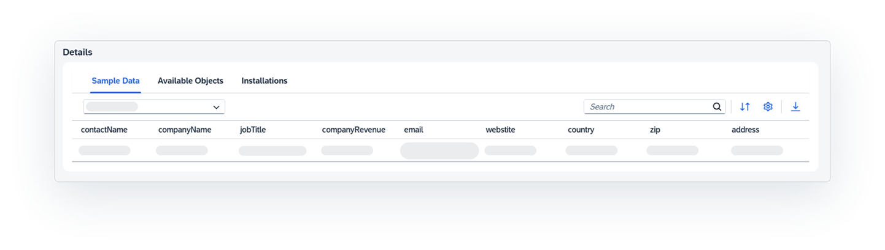
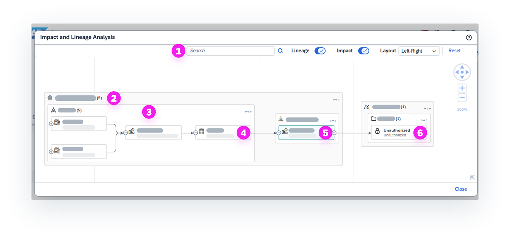

<!-- loiof59e912bf1ee45cf90375fd86109b952 -->

<link rel="stylesheet" type="text/css" href="css/sap-icons.css"/>

# Marketplace Data Product Details

If you're interested in a data product, review its detailed information, such as its lifecycle status, price, supporting documentation, and more.

The catalog search results provides high-level information about a data product, including its name, data type, and a short summary. If you want to know more about a data product, select it to view its details page that provides many different types of information about it. This information can include a preview of its pricing information, marketing description and images, terms of use, and more.

For example, when a data modeler reviews the details of a data product, they can review the pricing and installation information and review the terms of use and other supplemental documents.

After you review the data product details, you can choose to download a sample dataset \(if available\) and test it or install the data product to an SAP Datasphere space \(see [Evaluating and Installing Marketplace Data Products](evaluating-and-installing-marketplace-data-products-92c35ef.md)\).

To get high-level information about the data product, review the header section.

**Data Product Details Header**

<table>
<tr>
<th valign="top">

Field

</th>
<th valign="top">

Description

</th>
</tr>
<tr>
<td valign="top">

Name and Type

</td>
<td valign="top">

Displays the data product name and type.

</td>
</tr>
<tr>
<td valign="top">

Status and Product Views

</td>
<td valign="top">

Displays the lifecycle status of the data product and the number of times it was viewed.

-   A data product that is listed is active and available for public or limited visibility. Catalog users can search for the data product.
-   A data product that is delisted is inactive and no longer available for consumers. Consumers who obtained the data product before it became inactive can still use it. However, support and updates from the data provider might be limited or not available.

</td>
</tr>
<tr>
<td valign="top">

Provider

</td>
<td valign="top">

Displays the name of the data provider and contact information.

</td>
</tr>
<tr>
<td valign="top">

Content Aggregator

</td>
<td valign="top">

Displays the content aggregator's name. For more information, see [Data Provider Vs Content Aggregator](https://help.sap.com/viewer/bb1899f0b39f415b9de29a845873d7af/DEV_CURRENT/en-US/ba1b703d905547b392c09b35c1028de1.html "Data Marketplace content can either be created by a data provider or a content aggregator.") :arrow_upper_right:.

</td>
</tr>
<tr>
<td valign="top">

Contexts

</td>
<td valign="top">

Displays the context for the data product. Contexts control who has access to the data product. For a user to be able to use a data product, they must belong to a context that is assigned to the data product. 

</td>
</tr>
<tr>
<td valign="top">

Access and Price

</td>
<td valign="top">

Displays the license access type and the price for the data product.

The data product has these different access types:

-   *Open*: The data product is free of charge and does not require a license key to activate it. This data product can be part of public domain data or data provided by a commercial data provider as give-away data. This data product is activated after accepting the data specific terms of use.
-   *License Key*: The data product requires a license key to activate it. The license key provides authorization to access one or multiple data products. License keys can be used for commercial data products, where the data provider sends the license key via email after closing the commercial agreement, or for any other type of product that needs access authorization \(for example for scenarios where non-public data is exchanged without payment\).
-   *On Request*: The data product must be requested from the data provider before you can have access to install it.

For data products that require you to purchase a license key, the price, currency code, and pricing model are displayed.

</td>
</tr>
<tr>
<td valign="top">

Catalog Activity

</td>
<td valign="top">

Displays the date when the data product was added to the catalog and when it was updated.

</td>
</tr>
<tr>
<td valign="top">

Toolbar

</td>
<td valign="top">

The following tools are available for the data product.

-   *Install*: Opens a dialog for installing the free data product.
-   *Install with License Key*: Opens a dialog for installing a data product that requires a license key. If you are installing the data product for the first time, you must enter the license key to activate the data products. For subsequent installations, the license key will be marked as registered.
-   *Request Access*: Opens an email message that you can edit and send to the data provider to request access to the data product.
-   *Open Impact and Lineage*: Opens a dialog that displays the *Impact and Lineage Analysis* diagram.
-    \(Add to Favorites\): Adds frequently used data products to your favorites.

    Adding a data product to your favorites is different from using bookmarks. For more information about bookmarks, see [Using Bookmarks](using-bookmarks-aec68bb.md).

</td>
</tr>
<tr>
<td valign="top">

Tabs

</td>
<td valign="top">

Select a tab to view more information about the data product, such as an overview of the data product's properties, sample data, terms of use, and more.

</td>
</tr>
</table>

<a name="loiof59e912bf1ee45cf90375fd86109b952__section_lrg_hsl_bdc"/>

## Marketplace Data Product's Properties and Details

To view the properties of the data product, select *Overview tab* \> *Properties*.

The properties are separated into the following areas: 

-   Data product properties are properties directly related to the data product, such as the name, shipment, lifecycle status, and delivery mode of the data product.
-   Source properties are properties about the data provider or data aggregator.

For more information about properties not described here, see the documentation for the data product.

**Data Product Properties**

<table>
<tr>
<th valign="top">

Field

</th>
<th valign="top">

Description

</th>
</tr>
<tr>
<td valign="top">

Business Name

</td>
<td valign="top">

Displays the business name for the data product.

</td>
</tr>
<tr>
<td valign="top">

Product ID

</td>
<td valign="top">

Displays the unique identifier for the data product.

</td>
</tr>
<tr>
<td valign="top">

Data Shipment

</td>
<td valign="top">

Displays how the data product will be delivered to your space. The shipment varies depending on how the data provider offers the data product.

-   *Integrated Delivery*: The data is copied directly into the selected space. After the data product is activated, it is visible in the *Repository Explorer*, where it can be selected for use in an SAP Datasphere project. For example, the data product can be used as a source in the *Data Builder*. This type of data shipment is managed by Data Marketplace.
-   *External Delivery*: The data is delivered by sharing files outside SAP Datasphere. This type of data shipment is managed by the data provider.
-   *Open SQL*: The data is delivered by using an Open SQL Schema. Consumers create an OpenSQL Schema in the space and provide the information to the data provider using the Data Inbox. Once the data product is activated, consumers can access the data through the *Data Builder* and the provided schema appears as a source. This type of data shipment is managed by the data provider.

For more information, see [Data Shipment](data-shipment-837e749.md).

</td>
</tr>
<tr>
<td valign="top">

Delivery Pattern

</td>
<td valign="top">

Displays the update cycle of the data product. For example, a data product can be updated biweekly, daily, monthly, quarterly, weekly, yearly, or other.

</td>
</tr>
<tr>
<td valign="top">

Size Category

</td>
<td valign="top">

Displays the size of the data product, using the following ranges.

-   S: Less than 1000 records
-   M: Between 1000 and 100,000 records
-   L: Between 100,000 and 1 million records
-   XL: Between 1 million and 10 million records
-   XXL: Between 10 million and 100 million records
-   XXXL: More than 100 million records

</td>
</tr>
<tr>
<td valign="top">

Status

</td>
<td valign="top">

Displays the lifecycle status of the data product.

-   A data product is active when it is listed and available for public or limited visibility.
-   A data product is inactive when it is delisted, deactivated, deleted, or in draft. These data products are not available for consumers. Consumers who obtained a previously active data product before it became inactive can still use it. However, support and updates from the data provider might be limited or not available.

    For more information about data product lifecycle statuses, see [Managing your Data Product's Lifecycle](https://help.sap.com/viewer/bb1899f0b39f415b9de29a845873d7af/DEV_CURRENT/en-US/c400001264094f8c89da104db72514ad.html "To reflect various situations and different phases in the lifecycle of a data product, you can change its lifecycle status.") :arrow_upper_right:.

</td>
</tr>
<tr>
<td valign="top">

Delivery Mode

</td>
<td valign="top">

Displays whether new deliveries \(for example, data updates\) are offered by the data provider and how these deliveries affect the existing data.

-   **Full Replication**: Delivers multiple data updates. You can find the updated data under *My Data Products*.
-   **Live Access**: Delivers data within the same tenant without replication. Because the data view is shared live with the target space, the data is always up-to-date and doesn’t require any update. In the target space, under **Shared Objects**, you can find the views in the repository corresponding to all other views shared with the space
-   **One-Time Replication**: Delivers data only once without any additional corrections or updates. This type of delivery is suited when the nature of the data doesn't require a refresh on the consumer side. For example, a snapshot of historical facts such as: NYC Taxi Trip Data of 2020. If the consumer needs to receive data corrections, they can re-load the data through **My Data Products** re-initialization.

> ### Note:  
> For data products that require a license key, the license validity is not effective for products with live access delivery.

</td>
</tr>
<tr>
<td valign="top">

Delivery Pattern Description

</td>
<td valign="top">

Displays the description of the delivery pattern for the data product.

</td>
</tr>
<tr>
<td valign="top">

Visibility

</td>
<td valign="top">

Displays who \(public or private\) can view the product details. Currently, only public data products can be offered and can be seen by all users.

</td>
</tr>
<tr>
<td valign="top">

Additional Properties

</td>
<td valign="top">

Displays the additional properties for the data product. These properties are hidden by default and are visible after you select the **Show More** link.

-   Data Category: Displays one or more categories where the data product can be used.
-   Industry: Displays one or more industries where the data product can be used.
-   SAP Application: Displays one or more SAP Applications where the data product can be used.
-   Regional Coverage: Displays the countries and regions the data product is assigned for.

</td>
</tr>
</table>

**Source Properties**

<table>
<tr>
<th valign="top">

Field

</th>
<th valign="top">

Description

</th>
</tr>
<tr>
<td valign="top">

Content Aggregator

</td>
<td valign="top">

Displays the content aggregator's name. For more information, see [Data Provider Vs Content Aggregator](https://help.sap.com/viewer/bb1899f0b39f415b9de29a845873d7af/DEV_CURRENT/en-US/ba1b703d905547b392c09b35c1028de1.html "Data Marketplace content can either be created by a data provider or a content aggregator.") :arrow_upper_right:.

</td>
</tr>
<tr>
<td valign="top">

Data Provider Page

</td>
<td valign="top">

Displays a link to the data provider profile page that provides additional information about the data provider and other data products or product groups.

</td>
</tr>
<tr>
<td valign="top">

Data Provider Products

</td>
<td valign="top">

Displays a link that shows the number of additional data products from the data provider.

</td>
</tr>
</table>

You can see a preview of the details of the data product by selecting the *Overview tab* \> *Details*.

The *Details* section has tabs for sample data, available objects, and installations. Each tab has a table shows a preview of up to 20 rows. If there are more than 20 rows, select *Show All* to see the rest of the rows for the tab in a separate page.

**Data Product Details**

<table>
<tr>
<th valign="top">

Tab

</th>
<th valign="top">

Description

</th>
</tr>
<tr>
<td valign="top">

Sample Data

</td>
<td valign="top">

Review the contents of a sample dataset and download it if you think it might work for your needs. Sample data is usually in JSON format, but can only be downloaded as a Microsoft Excel file. Some data products offer free sample data that you can activate and then use for testing purposes. 

This tab appears only if one or more samples are available.

</td>
</tr>
<tr>
<td valign="top">

Available Objects

</td>
<td valign="top">

View a preview of all available dimensions and measures in the data product. The information available for the dimensions and measures includes the name of the object, a description, the attribute, delivery mode, and data filter.

</td>
</tr>
<tr>
<td valign="top">

Installations

</td>
<td valign="top">

Review the installations for the data product. The information available includes the space name where the data product is installed and the date it was installed on.

</td>
</tr>
</table>

<a name="concept_fls_bjg_2cc"/>

<!-- concept\_fls\_bjg\_2cc -->

## Marketplace Data Product Documentation

The *Documentation* tab provides supporting documentation, such as pricing and terms of use, for the data product.

<table>
<tr>
<th valign="top">

Tab

</th>
<th valign="top">

Description

</th>
</tr>
<tr>
<td valign="top">

Pricing

</td>
<td valign="top">

Displays the pricing information, the price with the currency code, and pricing model \(one time or monthly\) for the data product. If you need to purchase a license key for the data product, you can select the *URL for License Key Purchase* to purchase your own license.

</td>
</tr>
<tr>
<td valign="top">

Terms of Use

</td>
<td valign="top">

Displays the terms of use for the data product.As a best practice, review the terms of use before installing the data product. By installing the data product, you agree to the terms as outlined by the data provider.

</td>
</tr>
<tr>
<td valign="top">

Attachments

</td>
<td valign="top">

Displays a list of additional documents for the data product.These documents can include the following types:

-   **Legal**: Documents that outline the legal agreement between you and the data provider for using the data product.
-   **Supplemental**: Documents that describe the data available in the data product or provide other information about the data product and its terms of use \(for example, warranties and refund policies\).

</td>
</tr>
</table>

<a name="concept_r2v_rvh_jdc"/>

<!-- concept\_r2v\_rvh\_jdc -->

## Impact and Lineage Analysis Diagram for a Marketplace Data Product

Select the *Open Impact and Lineage* button in the header to see a diagram for the analyzed data product. This diagram shows the data analysis of the analyzed object and provides an end-to-end visualization of the object dependencies across multiple systems and layers. It can help you better understand the lineage \(also known as data provenance\) and impacts of a selected object in the catalog. Impact and lineage contain information about the source of the object, the transformations it goes through, its final state, and objects affected by changes made to it. Impact and lineage serve distinct purposes.

-   *Lineage* is displayed to the left of the analyzed object \(or below it\). It shows objects that the analyzed object uses as sources. It allows you to trace errors back to the root cause.
-   *Impact* is displayed to the right of the analyzed object \(or above it\). It shows objects that use the analyzed object as a source. It allows you to understand the impact of changes on dependent objects.

> ### Tip:  
> If you're a data provider, you can see the impact and lineage of your data products as long as you are a member of the spaces where the data products are installed. For more information about data providers, see [Data Marketplace - Data Provider's Guide](https://help.sap.com/viewer/bb1899f0b39f415b9de29a845873d7af/DEV_CURRENT/en-US/e479b7b4c95741c7a7a1d42397984c7e.html "Users with a modeler role can create a data provider profile and publish data products to public, private, and internal Data Marketplaces.") :arrow_upper_right:.

This diagram provides the data analysis of the data product and contains the following features.

<table>
<tr>
<th valign="top">

Feature

</th>
<th valign="top">

Description

</th>
</tr>
<tr>
<td valign="top">

\(1\) Toolbar and Diagram Tools

</td>
<td valign="top">

Use the toolbar and diagram tools to control the layout of the diagram. Click *Reset* to restore the default layout.

</td>
</tr>
<tr>
<td valign="top">

\(2\) Outermost Container

</td>
<td valign="top">

The outermost container represents a source system \(for example,  SAP Datasphere or  SAP Analytics Cloud tenant\) or a  data provider.

The number in brackets indicates the total number of objects in the container that are part of the impact or lineage of the analyzed object. You can expand or collapse the container, using the  \(Show/Hide All Objects\) menu on the top-right corner of the container.

</td>
</tr>
<tr>
<td valign="top">

\(3\) Inner Container

</td>
<td valign="top">

The inner container represents one of the following:

-   A location in the source system \(for example,  SAP Datasphere space or  SAP Analytics Cloud folder\). It contains objects that either appear in the lineage or impact the analyzed object. If an object is located within a sublocation \(for example, a subfolder\), you'll see a series of nested inner containers.
-   A :package: data product. The data product is visible if you have access and view permission for it. For example, you are a member of the context associated with it or if you are a member of the space where it has been installed. Also, you will be able to view the details to see a brief summary of the data product or open the data product page.

You can expand or collapse a container, using the  \(Show/Hide All Objects\) menu on the top-right corner of the container. The number in brackets indicates the total number of objects in the container that are part of the impact and lineage of the analyzed object.

</td>
</tr>
<tr>
<td valign="top">

\(4\) Authorized Object

\(5\) Analyzed Object

\(6\) Unauthorized Object

</td>
<td valign="top">

Authorized and unauthorized objects appear in the lineage or impact of the analyzed object.

-   Authorized objects are published and can be discovered in the catalog. They have an icon that represents its type \(for example,  \(View\)\). Click the  \(Open Object Details\) icon to view the details page for the object.

-   The analyzed object appears as a light blue object. They have an icon that represents its type \(for example,  \(Story\) or  \(Transformation\)\).

-   Unauthorized objects are unpublished objects that you don't have access permission to in the source system. They are represented with the :lock: icon.

You can show or hide the objects on either side of any object by clicking the  \(Show Next Level\) or  \(Hide All\) on the object.

</td>
</tr>
</table>

For information on how to control the diagram layout and use tools to further analyze the objects, see [Impact and Lineage Analysis](impact-and-lineage-analysis-9da4892.md).

