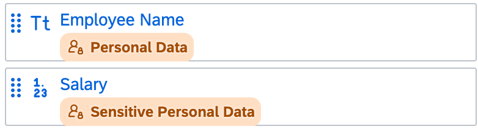
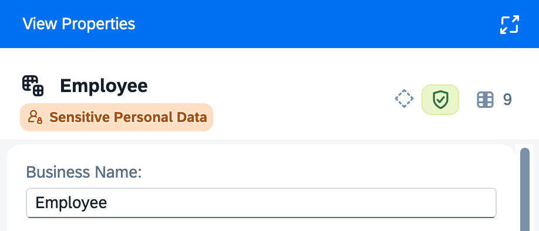

<!-- loiofd0d4e63b73c4b8bb2efbd2399a9f9b9 -->

# Modeling with Personal Data

Data protection and privacy laws, such as the European Union's General Data Protection Regulation \(GDPR\), require that personal data is handled lawfully, fairly, and transparently. SAP Business Data Cloud helps you track personal data through your modeling processes to ensure that it is properly handled and protected.

This topic contains the following sections:

-   [Introduction to Data Protection and Privacy](modeling-with-personal-data-fd0d4e6.md#loiofd0d4e63b73c4b8bb2efbd2399a9f9b9__section_intro)
-   [Identify Objects Containing Personal Data](modeling-with-personal-data-fd0d4e6.md#loiofd0d4e63b73c4b8bb2efbd2399a9f9b9__section_tagging)

<a name="loiofd0d4e63b73c4b8bb2efbd2399a9f9b9__section_intro"/>

## Introduction to Data Protection and Privacy

Data products that have one or more columns containing personal data or sensitive personal data are automatically tagged as they enter the catalog with one of the following tags:

-   *Personal Data* is information that can be used to identify an individual, either on its own or in combination with other data, directly or indirectly.For example, height, weight, eye and hair color.
-   *Sensitive Personal Data* is any of the various categories of high-risk data as defined under different international data protection and privacy laws.These include:
    -   Data concerning vulnerable persons, such as children or differently-abled individuals
    -   Data to evaluate and predict a person’s behavior
    -   Passwords and answers security questions
    -   Employment, professional, and education details, such as salary, trade union membership, or degrees or certifications obtained
    -   Data revealing someone’s personal details, such as political opinions, religious beliefs, marital status, or criminal convictions and offenses
    -   Health data \(for example, the US Health Insurance Portability and Accountability Act \(HIPAA\)\)
    -   Financial information, such as bank account and credit card data

See [Data Protection and Privacy Tagging](data-protection-and-privacy-tagging-6c00246.md).

<a name="loiofd0d4e63b73c4b8bb2efbd2399a9f9b9__section_tagging"/>

## Identify Objects Containing Personal Data

The personal data tags are displayed in the following editors where the object is either a data product entity or an object consuming data from a data product entity:

-   Remote tables - See [Review and Edit Imported Table Properties](Acquiring-and-Preparing-Data-in-the-Data-Builder/review-and-edit-imported-table-properties-75cea7b.md).
-   Local tables - See [Creating a Local Table](Acquiring-and-Preparing-Data-in-the-Data-Builder/creating-a-local-table-2509fe4.md).
-   Graphical views - See [Creating a Graphical View](creating-a-graphical-view-27efb47.md).
-   SQL views - See [Creating an SQL View](creating-an-sql-view-81920e4.md).

    > ### Note:  
    > Personal data tracing is not supported for SQL views with language *SQLScript \(Table Function\)*.

-   Task Chain - See [Creating a Task Chain](Acquiring-and-Preparing-Data-in-the-Data-Builder/creating-a-task-chain-d1afbc2.md).
-   Transformation flows - See [Creating a Transformation Flow](creating-a-transformation-flow-f7161e6.md).
-   Analytic models - See [Creating an Analytic Model](Modeling-Data-in-the-Data-Builder/creating-an-analytic-model-e5fbe9e.md).

> ### Note:  
> This feature is not supported for file spaces \(spaces with a storage type of *SAP HANA Data Lake Files*\).

The tags are displayed in lists of columns:

If the object outputs any columns containing *Personal Data* or *Sensitive Personal Data* then it will itself inherit the appropriate tag:

The *Personal Data* icon is also displayed on column headers in the data viewer panel and relevant entities in impact and lineage analysis diagrams. See:

-   [Viewing Object Data](viewing-object-data-b338e4a.md)
-   [Impact and Lineage Analysis](impact-and-lineage-analysis-9da4892.md)

