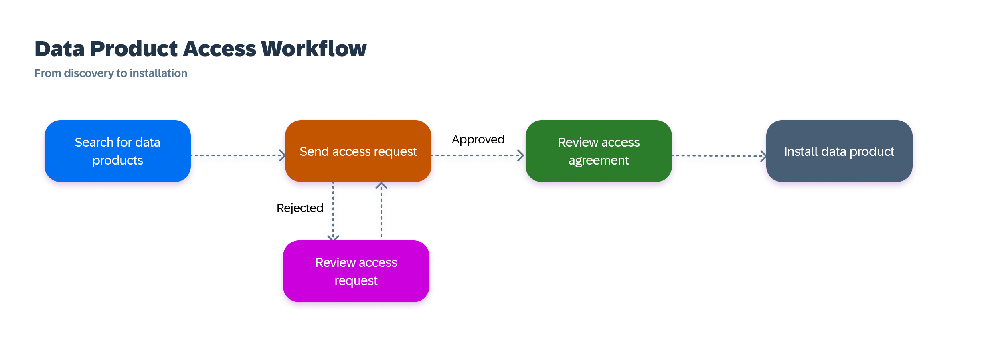

<!-- loio998fb5f447d04021baf497375261c9d1 -->

# Obtaining Access to Data Products

You can request access for data products that you discover in the catalog.

You can use the catalog to discover and evaluate data products to determine if they fit your project needs. This is the first step in the workflow for accessing data products. The following diagram shows the workflow for requesting access to a data product:

When you find a suitable data product, send an access request for it. The request is reviewed and either approved \(automatically or manually\) or rejected.

-   If your request is approved, it becomes an access agreement and you can install the data product.

-   If your request is rejected, it's returned to you with a comment explaining why. You can't edit a rejected request. However, you can send a new request for the same data product that addresses the data steward's concerns from the original request.

At any time, you can review an access request or agreement by opening the *Data Product Access* page \(see [Data Product Access Details](data-product-access-details-3145063.md)\).

Administrative users, such as catalog administrators and data stewards who install data products to other SAP and supported external systems, must follow the same data product access workflow: they send an access request and then approve the request and install the data product. There is no alternate data product access workflow for administrators.

For more information about sending an access request and managing your access requests and agreements, see [Requesting Access to Data Products](requesting-access-to-data-products-ea7cb80.md) and [Installing Data Products](installing-data-products-605b734.md).

Users typically initiate access requests manually when they want access to data products. However, in certain processes \(such as copying a SAP Datasphere space\), the system automatically creates access requests. These system-created requests are automatically approved, and the data products are installed to the target locations. To learn more, see [System-Created Access Requests and Agreements](https://help.sap.com/docs/business-data-cloud/governing-and-publishing-data-in-catalog/system-created-access-requests-and-agreements).

> ### Note:  
> Data product access requests and agreements that are created and approved outside of the catalog aren't visible to users on the *Data Product Access*. Also, they aren't visible to data stewards on the *Access Manage* page. As a result, the governance activity for these data product access agreements aren't tracked.

