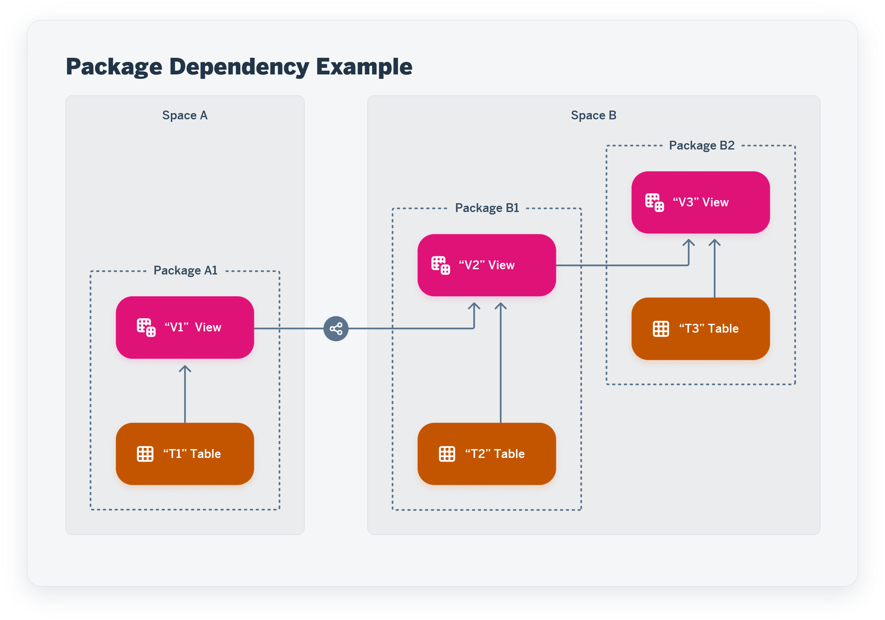

<!-- loioa806c67ed11749c788142775d2cc2494 -->

# Packages

Users with the *DW Space Administrator* role can create packages to model groups of related objects for transport between tenants. Modelers can add objects to packages via the *Package* field, which appears in editors when a package is created in their space. Once a package is complete and validated, the space administrator can export it to the Content Network. The structure of your package is preserved and, as the objects it contains evolve, you can easily export updated versions of it.

This topic contains the following sections:

-   [Introduction to Packages](packages-a806c67.md#loioa806c67ed11749c788142775d2cc2494__section_intro)
-   [Create a Package](packages-a806c67.md#loioa806c67ed11749c788142775d2cc2494__section_create)
-   [Add an Object to a Package](packages-a806c67.md#loioa806c67ed11749c788142775d2cc2494__section_add)
-   [Update an Object in a Package](packages-a806c67.md#loioa806c67ed11749c788142775d2cc2494__section_update)

<a name="loioa806c67ed11749c788142775d2cc2494__section_intro"/>

## Introduction to Packages

Each package must contain a complete and coherent set of objects:

-   A package can contain one or more objects from one space.
-   Each object can belong to only one package.
-   A package must:
    -   Contain the complete lineage of all the objects that belong to it, or
    -   Include other packages containing all or part of this lineage as required packages.

-   Required packages can be selected from other spaces.

    If an object in a package has, as part of its lineage, an object shared from another space, then the shared object must be included in a package defined in its origin space, which is then added as a required package.

In our example:

-   `Package A1` - Contains `T1` and `V1`, where `V1` has a single source, `T1`.
-   `Package B1` - Contains `T2` and `V2`, where `V2` has two sources, `T2` and `V1`.
    -   `Package B1` adds `Package A1` as a required package.

-   `Package B2` - Contains `T3`, and `V3`, where `V3` has two sources, `T3` and `V2`.
    -   `Package B2` adds `Package B1` as a required package.

<a name="loioa806c67ed11749c788142775d2cc2494__section_create"/>

## Create a Package

Only a user with the *DW Space Administrator* role \(or equivalent privileges\) can create a package \(see [Creating Packages to Export](https://help.sap.com/viewer/9f36ca35bc6145e4acdef6b4d852d560/DEV_CURRENT/en-US/24aba84ceeb3416881736f70f02e3a0a.html "Users with the DW Space Administrator role can create packages to model groups of related objects for transport between tenants. Modelers can add objects to packages via the Package field, which appears in editors when a package is created in their space. Once a package is complete and validated, the space administrator can export it to the Content Network. The structure of your package is preserved and, as the objects it contains evolve, you can easily export updated versions of it.") :arrow_upper_right:\).

Once one or more packages is created in your space, the *Package* property becomes available in the object editors, and modelers can add their objects to the package \(see [Add an Object to a Package](packages-a806c67.md#loioa806c67ed11749c788142775d2cc2494__section_add)\).

<a name="loioa806c67ed11749c788142775d2cc2494__section_add"/>

## Add an Object to a Package

Users with the *DW Space Administrator* role \(or equivalent privileges\) can add any object to a package using the package editor \(see [Creating Packages to Export](https://help.sap.com/viewer/9f36ca35bc6145e4acdef6b4d852d560/DEV_CURRENT/en-US/24aba84ceeb3416881736f70f02e3a0a.html "Users with the DW Space Administrator role can create packages to model groups of related objects for transport between tenants. Modelers can add objects to packages via the Package field, which appears in editors when a package is created in their space. Once a package is complete and validated, the space administrator can export it to the Content Network. The structure of your package is preserved and, as the objects it contains evolve, you can easily export updated versions of it.") :arrow_upper_right:\).

Modelers can add objects to a package from the relevant editor:

1.  Open your object in its editor.
2.  In the property sheet, select the package from the *Package* field.

    > ### Note:  
    > The *Package* field is only available if one or more packages has been created in the space.

    A warning is displayed, explaining that you have to save your object to confirm and validate the package assignment.

3.  Click *Save* and then, when the *Validation Messages* dialog opens, click *Save Anyway*.

    The object is saved and the updated package is validated to determine if the full lineage of your object is assigned to the package \(or to one of its required packages\):

    -   If the validation is successful, the warning is removed.
    -   If the validation is not successful, a new warning is displayed explaining that the dependencies of your object cannot be resolved in the package. You should then add missing dependencies to the package or contact a space administrator to ask them to review and resolve the situation.

    > ### Note:  
    > Whether your object's dependencies can be resolved or not, the package assignment becomes read-only and can no longer be modified in the object editor. Only a space administrator can remove an object from a package in the package editor \(see [Creating Packages to Export](https://help.sap.com/viewer/9f36ca35bc6145e4acdef6b4d852d560/DEV_CURRENT/en-US/24aba84ceeb3416881736f70f02e3a0a.html "Users with the DW Space Administrator role can create packages to model groups of related objects for transport between tenants. Modelers can add objects to packages via the Package field, which appears in editors when a package is created in their space. Once a package is complete and validated, the space administrator can export it to the Content Network. The structure of your package is preserved and, as the objects it contains evolve, you can easily export updated versions of it.") :arrow_upper_right:\).

<a name="loioa806c67ed11749c788142775d2cc2494__section_update"/>

## Update an Object in a Package

Modelers can freely update objects that are assigned to a package \(though they may not change the package assignment\). When changes to an object are made, the status of the package is changed to *Changes to Export*. A space administrator can choose to export the new changes at any time, either overwriting the current version or creating a new version in the Content Network.

