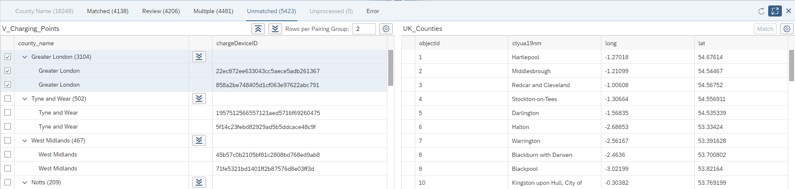

<!-- loio35fbb44d62e7498bb54461d3a4d460d5 -->

<link rel="stylesheet" type="text/css" href="css/sap-icons.css"/>

# Process Unmatched Results

Unmatched results are input records that are not matched with any lookup record. You can try to manually match them or apply a new rule to them.

<a name="loio35fbb44d62e7498bb54461d3a4d460d5__steps_hmz_25d_cqb"/>

## Procedure

1.  Select the rule node and then click  \(Preview Data\) to open the *Preview Data* panel.

2.  Click the *Unmatched* tab.

    > ### Note:  
    > If you have added a further rule to process the records in the *Unmatched* category of a rule, then you can review the records but you cannot process them.

    Two tables are displayed:

    -   The left table lists input records for which the rule has found no matches, grouped by pairing column value.
    -   The right table lists all of the lookup entity records.

    In our example, 5,423 records out of 18,248 have no matches with a score higher than our 80% threshold and so appear on the *Unmatched* tab.

    The first pairing group, `Greater London` contains 3,104 records:

    

    The following tools are available above the left table:

    <table>
    <tr>
    <th valign="top">

    Tools
    
    </th>
    <th valign="top">

    Description
    
    </th>
    </tr>
    <tr>
    <td valign="top">
    
     \(Collapse All\) /  \(Expand All\)
    
    </td>
    <td valign="top">
    
    Collapse or expand all pairing groups.
    
    </td>
    </tr>
    <tr>
    <td valign="top">
    
    Rows per Pairing Group
    
    </td>
    <td valign="top">
    
    Specify the maximum number of rows to display for each pairing group.
    
    </td>
    </tr>
    <tr>
    <td valign="top">
    
    Match
    
    </td>
    <td valign="top">
    
    Match all the records in the selected pairing group to the selected lookup record.
    
    </td>
    </tr>
    <tr>
    <td valign="top">
    
     \(Settings\)
    
    </td>
    <td valign="top">
    
    Select and reorder table columns. 

    In the right-hand lookup records table *View Settings* dialog, you can use the *Sort* and *Filter* tabs to sort on and filter by values in multiple columns.
    
    </td>
    </tr>
    </table>
    
    > ### Note:  
    > Click in any table column header to reorder or filter by that column's values.

3.  Review each of the pairing groups that the rule has found no matches for.

    Select a pairing group in the left table and consult the lookup records in the right table:

    -   If you find a lookup record that is a correct match, select it and click *Match* to move all the records in the pairing group to the *Matched* tab.
    -   If you do not find a suitable lookup record, you can leave the record unmatched.

4.  If appropriate, add a new rule to further process the remaining pairing groups and their match candidates.

    Records in the *Unmatched* category at the end of the flow are not included in the output of your intelligent lookup unless you select the *Include Unmatched Records* option.

