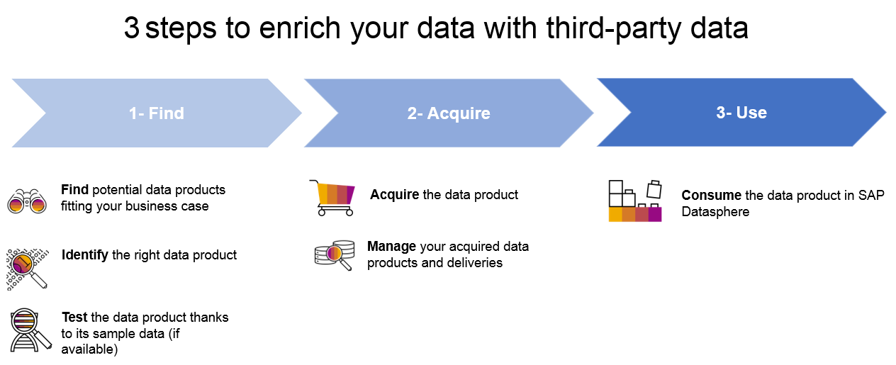

<!-- loio4096fb8c97dd4d84a7200941c1721368 -->

# Purchasing Data from Data Marketplace

Enrich your own data with third-party data products.

> ### Note:  
> Data Marketplace and the Data Sharing Cockpit are only available in SAP Datasphere tenants provisioned since January 25, 2021. See [3148585](https://launchpad.support.sap.com/#/notes/3148585) for more information.

<a name="loio4096fb8c97dd4d84a7200941c1721368__section_nrc_kcg_crb"/>

## Overview

Data Marketplace is fully integrated into SAP Datasphere. It’s tailored for businesses to easily integrate third-party data. You can search and purchase analytical data from data providers. The data comes in form of objects packaged as data products that can be used in one or several spaces of your SAP Datasphere tenant.

Data products are either provided for free or require the purchase of a license at a certain cost. Some data products are available as one-time shipments, other data products are regularly updated by data providers.

To get data products into your SAP Datasphere tenant and consume them, you can follow a simple workflow:

Independent from time, you can also view and manage your licenses. For more information, see [Managing your Licenses](managing-your-licenses-98d9865.md).

> ### Note:  
> Please note that cross-landscape visibility and installation of data products is not supported. That means products created in landscape A can only be seen and acquired in landscape A. They are not visible in other landscapes, e.g. in landscape B or landscape C.

