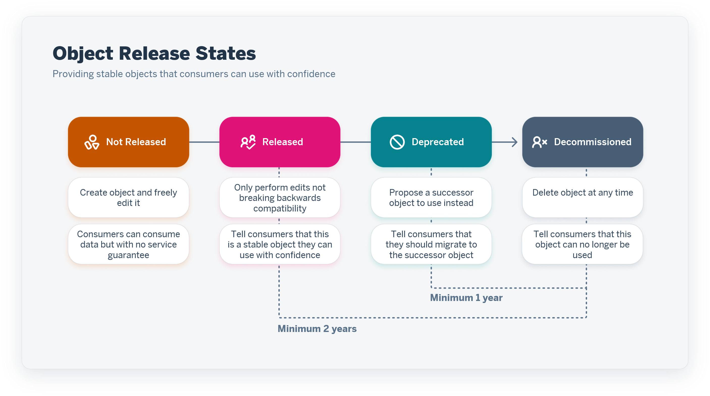

<!-- loio5b99e9bcb5964ab69b094215d285feb1 -->

# Releasing Stable Views for Consumption

To encourage confidence in the stability of your views and to guarantee backward compatibility when they are updated, you can set their *Release State* to *Released*. Once a view is released, it must continue to provide the same output columns until it is replaced by a successor, at which point it can be deprecated and, eventually, decommissioned.

This topic contains the following sections:

-   [Introduction to View Release States](releasing-stable-views-for-consumption-5b99e9b.md#loio5b99e9bcb5964ab69b094215d285feb1__section_introduction)
-   [Release a View](releasing-stable-views-for-consumption-5b99e9b.md#loio5b99e9bcb5964ab69b094215d285feb1__section_released)
-   [Modify a Released View](releasing-stable-views-for-consumption-5b99e9b.md#loio5b99e9bcb5964ab69b094215d285feb1__section_modify)
-   [Deprecate a View](releasing-stable-views-for-consumption-5b99e9b.md#loio5b99e9bcb5964ab69b094215d285feb1__section_deprecated)
-   [Decommission a View](releasing-stable-views-for-consumption-5b99e9b.md#loio5b99e9bcb5964ab69b094215d285feb1__section_decommissioned)
-   [Revert a View to a Previous Release State](releasing-stable-views-for-consumption-5b99e9b.md#loio5b99e9bcb5964ab69b094215d285feb1__section_revert)
-   [Import Objects with Release States](releasing-stable-views-for-consumption-5b99e9b.md#loio5b99e9bcb5964ab69b094215d285feb1__section_import)

<a name="loio5b99e9bcb5964ab69b094215d285feb1__section_introduction"/>

## Introduction to View Release States

As your warehousing process matures, and the number of entities you are managing increases, it becomes more important to formalize their lifecycles and to ensure that consumers of your entities have stable objects that they can use with confidence.

When the design of a view is complete and is ready for consumption, you can set its *Release State* to *Released*. Once a view is released, it must be maintained until a successor object that consumers can migrate to is selected. After this it can be deprecated and then, eventually, decommissioned and deleted.

> ### Note:  
> Release states are an optional feature. By default, all views are set to *Not Released* and there is no obligation to release any view.

<a name="loio5b99e9bcb5964ab69b094215d285feb1__section_released"/>

## Release a View

When you release a view, you are guaranteeing that it will continue to output data in a consistent manner for at least two years. Thus other modelers and analysts can used it as a source with confidence:

1.  In the *Release State* field, select *Released*.

    A warning will display, explaining that once saved, this change cannot be reverted.

2.  Click *Save* to finalize the change in release state.

    The *Save as Released* dialog opens.

3.  Click *Save as Released* to confirm the change.

    Released views have an information strip at the top of the editor to inform you that only limited changes can be made to them.

<a name="loio5b99e9bcb5964ab69b094215d285feb1__section_modify"/>

## Modify a Released View

While a released view must maintain each of its output columns, it is possible to make limited modifications to it, so long as those modifications will not interrupt the consumption of its data by any object that depends on it.

You can:

-   Add a column \(see [Create a Calculated Column in a Graphical View](create-a-calculated-column-in-a-graphical-view-3897f48.md)\).
-   Add an input parameter with a default value, so long as the view already contains at least one input parameter \(see [Create an Input Parameter in a Graphical View](create-an-input-parameter-in-a-graphical-view-53fa99a.md)\).
-   Add an association \(see [Create an Association to Define a Semantic Relationship Between Entities](Modeling-Data-in-the-Data-Builder/create-an-association-to-define-a-semantic-relationship-between-entities-66c6998.md)\).

You may not remove columns, parameters, or associations, or make other changes that could impact consumer objects, and additional validation messages are enabled to warn you if you make an unauthorized change.

> ### Note:  
> As soon as you save your changes, they become part of the released view, and cannot be removed.

<a name="loio5b99e9bcb5964ab69b094215d285feb1__section_deprecated"/>

## Deprecate a View

Once a view has been released, you can deprecate it at any time, but you must select a successor view that consumer objects can migrate to during the deprecation period:

1.  In the *Release State* field, select *Released*.
2.  In the *Successor* field, click the *Value Help* button, select a view to replace the current released view, and click *OK*.
3.  Click *Save*.

    The *Save as Deprecated* dialog opens.

4.  Click *Save as Deprecated* to confirm the change.

    Deprecated views have an information strip at the top of the editor to inform modelers that only limited changes can be made to them and to guide consumers to the successor view.

<a name="loio5b99e9bcb5964ab69b094215d285feb1__section_decommissioned"/>

## Decommission a View

Once a view has been deprecated for one year \(and at least two years after it was released\), it can be decommissioned:

1.  In the *Release State* field, select *Decommissioned*.
2.  Click *Save*.

    The *Save as Decommissioned* dialog opens.

3.  Click *Save as Decommissioned* to confirm the change.

Once an object is decommissioned, it can be deleted at any time.

<a name="loio5b99e9bcb5964ab69b094215d285feb1__section_revert"/>

## Revert a View to a Previous Release State

Users with the *Spaces.Update* permission \(included in the *DW Space Administrator* role\) can, if necessary, revert a view to a previous release state:

1.  In the *Release State* field, select the preceding release state.
2.  Click *Save*.

    The *Revert to Previous Release State* dialog opens.

3.  Click *Revert* to confirm the change.

<a name="loio5b99e9bcb5964ab69b094215d285feb1__section_import"/>

## Import Objects with Release States

When you are importing an object to update or replace an object that already exists in your space, the object you are importing must have the same release state or another release state that is consistent with the lifecycle of the existing object:

-   The *Transport* app - Objects with invalid release states cannot be imported \(see [Importing Content from Another Tenant](https://help.sap.com/viewer/9f36ca35bc6145e4acdef6b4d852d560/DEV_CURRENT/en-US/b607a12931d74c4a93506ea64c55ab4e.html "You can use the Transport app to import content that has been shared from another tenant.") :arrow_upper_right:\).
-   CSN/JSON file import - If necessary, users with the *Spaces.Update* permission \(included in the *DW Space Administrator* role\) can override the warnings and import objects with invalid release states \(see [Importing Objects from a CSN/JSON File](Creating-Finding-Sharing-Objects/importing-objects-from-a-csn-json-file-23599e6.md)\).
-   `datasphere` command line interface - If necessary, users with the *Spaces.Update* permission \(included in the *DW Space Administrator* role\) can override the warnings and import objects with invalid release states \(see [Manage Modeling Objects and Tasks via the Command Line](https://help.sap.com/viewer/9b8363ae47c347de9a027c0e5567a37a/DEV_CURRENT/en-US/6f5c65f209004751aa48f9682ee2ec45.html "Users with a modeler role can use the datasphere command line interface to list, create, update, and delete modeling objects.") :arrow_upper_right:\).

