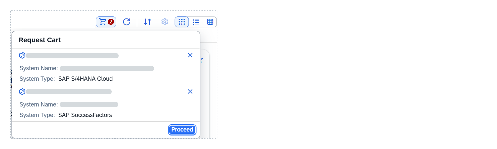
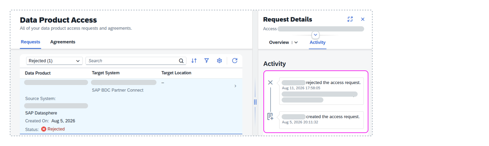

<!-- loioea7cb802cbea47b39a441888873c3a49 -->

<link rel="stylesheet" type="text/css" href="css/sap-icons.css"/>

# Requesting Access to Data Products

You can request access to data products in the *Data Product* collection for installation to an SAP Datasphere space. After your request is approved, you can install the data product to the space where users can access its data for use in modeling and other projects.

<a name="loioea7cb802cbea47b39a441888873c3a49__prereq_fcb_p1y_tyb"/>

## Prerequisites

To search for and request access to data products, manage access requests and agreements, and install data products, you must have:

-   A global role that grants you the following privileges:
    -   *Data Warehouse General* \(`-R------`\) - To access SAP Datasphere.
    -   *Catalog Asset* \(`–R–––--`\) - To access the catalog, view objects in the *Assets* and *Data Products* collections, and create and manage data product access requests and agreements.

-   A scoped role that grants you access to the space or spaces where you can install data products, with the following privileges:
    -   *Spaces* \(`–R–––--`\) - To access a space.
    -   *Space Files* \(`CRUD–--`\) - To install data products in a space or end an access agreement.
    -   *Data Warehouse Data Builder* \(`CRUD----`\) - To create, edit, and delete *Data Builder* objects.
    -   *Data Warehouse Connection* \(`-R------`\) - To access remote objects.

The *Catalog User* global role and the *DW Modeler* scoped role template, applied together for example, grant these privileges. For more information, see [Privileges and Permissions](https://help.sap.com/viewer/9f804b8efa8043539289f42f372c4862/cloud/en-US/d7350c6823a14733a7a5727bad8371aa.html "A privilege represents a task or an area in SAP Datasphere and can be assigned to a specific role. The actions that can be performed in the area are determined by the permissions assigned to a privilege.") :arrow_upper_right: and [Standard Roles Delivered with SAP Datasphere](https://help.sap.com/viewer/9f804b8efa8043539289f42f372c4862/cloud/en-US/a50a51d80d5746c9b805a2aacbb7e4ee.html "SAP Datasphere is delivered with several standard roles. A standard role includes a predefined set of privileges and permissions.") :arrow_upper_right:. 

## Context

You can request access to one or more data products in a single transaction.

> ### Note:  
> -   Data products tagged for data protection and privacy \(for example, *Personal Data*\) require strict access controls. Ensure the installation space enforces strict user access. For more information on data protection and privacy tags, see [Data Protection and Privacy Tagging](data-protection-and-privacy-tagging-6c00246.md).
> 
> -   When SAP Datasphere delta-enabled local tables \(file\) are included in SAP Business Data Cloud data products, the internal delta capture columns *Change Date*and *Change Type* are not included in the data product definition or made available to consumers. However, consumers of these data products will still receive delta updates via the Delta Sharing Change Data Feed \(CDF\) API. For more information, see [Change Data Feed](https://docs.delta.io/delta-change-data-feed/).

## Procedure

1.  In the side navigation area, choose \(*Catalog & Marketplace*\)** \> ** \(*Search*\).

2.  On the catalog search page, select the *Data Products* collection.

3.  Apply filters or enter a search term to find a data product that matches what you want \(see [Searching for Data Products and Assets in the Catalog](searching-for-data-products-and-assets-in-the-catalog-1047825.md)\).

    You can only request access to data products with appropriate release, lifecycle, and functional statuses: 

    -   Its release status and lifecycle status are both *Active*.
    -   Its functional status and the functional status for all its APIs are *Current*.
    -   Data products with outdated APIs cannot be installed. If the functional status of one or more of its APIs is *Outdated*, try waiting a few moments and then refresh the details page. If the APIs are still outdated, ask your administrator for help.

4.  Select the data product to open its details page and choose  *Add to Cart*. 

    > ### Tip:  
    > If you stay on the catalog search page and view the search results in grid or table view, you can choose  \(Add to Cart\) from the data product card without having to view its details page.

    The data product is added to your request cart and the :shopping_cart: is updated with the number of data products that you added. If needed, search for and add more data products to your request cart.

5.  In the *Data Products* collection on the catalog search page, choose :shopping_cart: to review the items in your cart.

    

6.  Optional. If you decide you don't want a data product, choose  to remove it.

7.  Choose *Proceed*.

    In the *Request Access* dialog, do the following:

    -   In *Target Location*, select the space to install the data product.
    -   In *Purpose and Access Period*, add a comment to specify the context for using the data product. Optionally, you can add any relevant links and specify an end date for when you no longer need access to the data product. Leaving the end date empty means that access to the data product will never expire.
    -   Review the terms and conditions for all data products that you are requesting access to and select the checkbox to indicate that you have read and acknowledged them.

8.  Choose *Send*.

## Results

Separate access requests are created for each data product in your cart and are sent for approval. It might take some time for your access requests to be processed. After they're processed, you'll receive notifications letting you know the results. Access requests that are not processed by the specified end date are automatically rejected. 

> ### Note:  
> In your user profile settings, check that you configured in-app and email notifications for access request decisions and expiring agreements. By default, the in-app notifications are switched on.

## Next Steps

When you're notified that your access requests have been approved or rejected, you can review their details.

-   Approved access requests become access agreements. Review the access agreement to review comments and install the data product to the space you specified. See [Installing Data Products](installing-data-products-605b734.md).

-   Access requests not approved have an updated status of **Rejected**. Review the activity section of your access request for the reason why it was rejected. For assistance, contact your administrator. Rejected requests remain in the *Requests* tab and are permanently deleted after 90 days from the date they were created. 

<a name="task_qbl_qbc_2jc"/>

<!-- task\_qbl\_qbc\_2jc -->

## Reviewing Your Access Requests

## Context

You can review your access requests that are awaiting approval or have been rejected.

## Procedure

1.  In the side navigation area, choose \(*Catalog & Marketplace*\) ** \> ** *\(Data Product Access\)*.

2.  On the *Data Product Access* page, choose the *Requests* tab.

3.  Select a filter and enter search terms to show the items that you want.

    The list is updated to show only the access requests that match the criteria you entered.

4.  Select a filter and enter search terms to show the items that you want.

5.  Select the access request to view its details.

## Results

You can review the request details:

-   For an access request that has not yet been approved, review the header details to see the date it was created on. The time it takes to process access requests varies and depends on your organization. If it's taking longer than expected to process, contact your administrator for assistance. If you decide you no longer need the access request, delete it.

    > ### Note:  
    > Access requests can't be edited. If you noticed an error in an existing access request, delete it and then send a new one.

-   For a rejected access request, choose the *Activity* tab to view the comment explaining why the request was rejected. For additional assistance, contact your administrator.

    

<a name="deleteaccessrequest"/>

<!-- deleteaccessrequest -->

## Deleting Your Access Request

## Context

You can delete any access request that is awaiting approval. Rejected requests can't be deleted and remain in the list for 90 days after the date they were created.

## Procedure

1.  In the side navigation area, choose \(*Catalog & Marketplace*\) ** \> ** *\(Data Product Access\)*.

2.  On the *Data Product Access* page, choose the *Requests* tab.

3.  Select a filter and enter search terms to show the items that you want. 

    The list is updated to show only the items that match the criteria you entered. 

4.  Select the access request to view its details page.

5.  Choose  \(Delete\). 

6.  Review the warning dialog, and choose *Delete*. 

## Results

The access request is permanently deleted.

