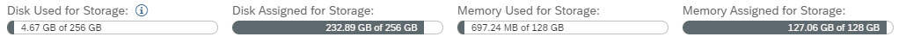

<!-- loio39b08d375d8d4bb5ade5902e10f39ea8 -->

# Monitor Tenant and Space Storage

You can see the total storage available and the amount assigned to and used by spaces in the bars at the top of the *Space Management* page.

> ### Note:  
> You can also see the information below in the *System Monitor*. For more information, see [Monitoring SAP Datasphere](../Monitoring-SAP-Datasphere/monitoring-sap-datasphere-28910cd.md).

The following information is available:

-   *Disk Used for Storage* - Shows the total amount of disk storage used. Hover over this bar to see a breakdown between:
    -   *Data in Spaces*: All data that is stored in spaces.

    -   *Audit Log Data*: Data related to audit logs \(see [Audit Logging](https://help.sap.com/viewer/0c3780ad05fd417fa27b98418535debd/cloud/en-US/c78a7c2a3cec4b0897db294d74e00d9b.html "Audit logs are records of read or change actions performed in the database. They allow you to see who did what and when.") :arrow_upper_right:\).

        > ### Note:  
        > Audit logs can grow quickly and consume a great deal of disk storage \(see [Delete Audit Logs](../Monitoring-SAP-Datasphere/delete-audit-logs-589fa42.md)\).

    -   *Other Data*: Includes data stored in database user group schemas \(see [Creating a Database User Group](../Creating-a-Database-User-Group/creating-a-database-user-group-1097a47.md)\) and SAP HANA data \(such as statistics schemas\).

    -   *Administrative Data*: Data used to administer the tenant and all spaces \(such as space quota, space version\). Includes all information stored in the central schemas \(DWC\_GLOBAL, DWC\_GLOBAL\_LOG, DWC\_TENANT\_OWNER\).

-   *Disk Assigned for Storage* - Shows the total amount of disk storage assigned to all spaces.
-   *Memory Used for Storage* -Shows the total amount of memory storage used in all spaces.
-   *Memory Assigned for Storage* - Shows the total amount of memory storage assigned to all spaces.

