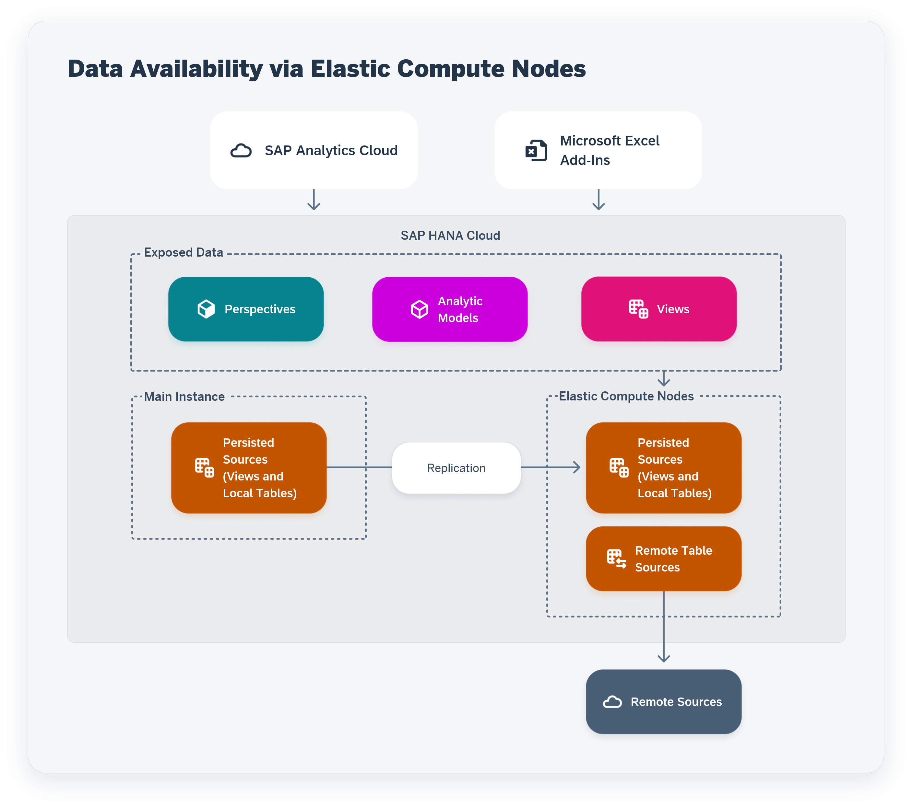
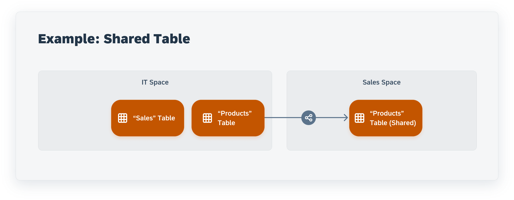

<!-- loio99ad61e1b63a44de8572a49c6f374e8a -->

# Create an Elastic Compute Node

Once you've purchased additional resources, you can create an elastic compute node to take over peak loads.

This topic contains the following sections:

-   [Introduction to Elastic Compute Nodes](create-an-elastic-compute-node-99ad61e.md#loio99ad61e1b63a44de8572a49c6f374e8a__section_wyd_q1t_qzb)
-   [Create an Elastic Compute Node](create-an-elastic-compute-node-99ad61e.md#loio99ad61e1b63a44de8572a49c6f374e8a__section_l3z_hzs_qzb)
-   [Add Spaces and Objects to an Elastic Compute Node](create-an-elastic-compute-node-99ad61e.md#loio99ad61e1b63a44de8572a49c6f374e8a__section_blh_rwt_qzb)
-   [Remove Spaces and Objects from an Elastic Compute Node](create-an-elastic-compute-node-99ad61e.md#loio99ad61e1b63a44de8572a49c6f374e8a__section_k21_32b_tzb)
-   [Delete an Elastic Compute Node](create-an-elastic-compute-node-99ad61e.md#loio99ad61e1b63a44de8572a49c6f374e8a__section_u5p_3wt_qzb)

<a name="loio99ad61e1b63a44de8572a49c6f374e8a__section_wyd_q1t_qzb"/>

## Introduction to Elastic Compute Nodes

Once an administrator has purchased additional resources dedicated to elastic compute nodes, they can create and manage elastic compute nodes in the *Space Management*. You can create an elastic compute node and allocate resources to it, assign spaces and objects to it to specify the data that will be replicated to the node, and start the node \(manually or via a schedule\) to replicate the data to be consumed.

You can select the following objects for an elastic compute node: perspectives and analytic models, and views of type analytical dataset and that are exposed for consumption. To make the data of the objects avalaible for consumption, their sources - persisted views and local tables - are replicated to the elastic compute node.

Users of SAP Analytics Cloud and Microsoft Excel \(with the SAP add-in\) will then automatically benefit from the improved performance of the elastic compute nodes when consuming data exposed by SAP Datasphere. See [Consuming Data Exposed by SAP Datasphere](https://help.sap.com/viewer/ac696daa26f0413db39626bc2971e6c2/DEV_CURRENT/en-US/ff47998f19154d159b89da50980f98b2.html "All users with any of the standard roles can consume data exposed by spaces they are assigned to. If a user does not need to access SAP Datasphere itself, and only wants to consume data exposed by it, they should be granted a consumer role.") :arrow_upper_right:.

To create and manage elastic compute nodes, you must have the following privileges:

-   *Spaces* \(C------M\) - To create, manage and run an elastic compute node
-   *Space Files* \(-------M\) - To add spaces and objects to an elastic compute node
-   *System Information* \(--U-----\) - To access tenant settings needed to manage elastic compute nodes

The *DW Administrator* global role, for example, grants these privileges \(see [Roles and Privileges by App and Feature](../Managing-Users-and-Roles/roles-and-privileges-by-app-and-feature-2d8b7d0.md)\).

<a name="loio99ad61e1b63a44de8572a49c6f374e8a__section_l3z_hzs_qzb"/>

## Create an Elastic Compute Node

1.  In the side navigation area, click  \(*Space Management*\), then click *Create* in the *Elastic Compute Nodes* area.

2.  In the *Create Elastic Compute Node* dialog, enter the following properties, and then click *Create*:

    <table>
    <tr>
    <th valign="top">

    Property
    
    </th>
    <th valign="top">

    Description
    
    </th>
    </tr>
    <tr>
    <td valign="top">
    
    *Business Name*
    
    </td>
    <td valign="top">
    
    Enter the business name of the elastic compute node. Can contain a maximum of 30 characters, and can contain spaces and special characters.
    
    </td>
    </tr>
    <tr>
    <td valign="top">
    
    *Technical Name*
    
    </td>
    <td valign="top">
    
    Enter the technical name of the elastic compute node. The technical name must be unique. It can only contain lowercase letters \(a-z\) and numbers \(0-9\). It must contain the prefix: ds \(which helps to identify elastic compute nodes in monitoring tools\). The minimum length is 3 and the maximum length is 9 characters. See [Rules for Technical Names](../Creating-Spaces-and-Allocating-Storage/rules-for-technical-names-982f9a3.md).

    > ### Note:  
    > As the technical name will be displayed in monitoring tools, including SAP internal tools, we recommend that you do not mention sensitive information in the name.

    
    </td>
    </tr>
    <tr>
    <td valign="top">
    
    *Performance Class*
    
    </td>
    <td valign="top">
    
    The performance class, which has been selected beforehand for all elastic compute nodes, is displayed and you cannot modify it for a particular elastic compute node.

    > ### Note:  
    > The performance class is selected when purchasing additional resources in the *Tenant Configuration* page \(see [Configure the Size of Your SAP Datasphere Tenant](configure-the-size-of-your-sap-datasphere-tenant-33f8ef4.md)\) and applies to all elastic compute nodes. The default performance class is *High Compute* and you may want change it in specific cases. For example, if you notice that the memory usage is high and the CPU usage is low during the runtime and you want to save resources, you can select another the performance class, which will change the memory/CPU ratio.
    > 
    > If the performance class is changed in the *Tenant Configuration* page and you want to edit your elastic compute node by selecting it and clicking *Configure*, you will be asked to select the changed performance class.

    
    </td>
    </tr>
    <tr>
    <td valign="top">
    
    *Compute Blocks*
    
    </td>
    <td valign="top">
    
    Select the number of compute blocks. You can choose 4, 8, 12, or 16 blocks. The amount of memory and vCPU depends on the performance class you choose:

    -   Memory: 1 vCPU and 16 GB RAM per block
    -   Compute: 2 vCPUs and 16 GB RAM per block
    -   High Compute: 4 vCPUs and 16 GB RAM per block

    Default: 4

    The number of GB for memory and storage and the number of CPU are calculated based on the compute blocks and you cannot modify them.

    > ### Note:  
    > You can modify the number of compute blocks later on by selecting the elastic compute node and click *Configure*.

    The price you pay for additional resources depends on the compute blocks and the performance class. If a node that includes 4 compute blocks runs for 30 minutes, you pay for 2 block-hours.
    
    </td>
    </tr>
    </table>
    

<a name="loio99ad61e1b63a44de8572a49c6f374e8a__section_blh_rwt_qzb"/>

## Add Spaces and Objects to an Elastic Compute Node

Select the spaces and objects whose data you want to make available in an elastic compute node. The data of the objects you've selected, which is stored in local tables and persisted views, will be replicated to the node and available for consumption when the elastic compute node is run.

1.  In the side navigation area, click  \(*Space Management*\), then select the elastic compute node.

2.  Click *Add Spaces*, then in the dialog box, select the spaces that contain objects whose data you want to make available in an elastic compute node and click *Add Spaces*.

    > ### Note:  
    > File spaces are not displayed in the dialog box as they cannot be added to an elastic compute node.

    The number of spaces added to the elastic compute node is displayed in the list of nodes on the left part of the screen.

    By default, all current and future exposed objects of the selected spaces are automatically assigned to the elastic compute node and *All Exposed Objects* is displayed in the space tile.

    You can deactivate the automatic assignment and manually select the objects.

    There are 3 types of exposed objects: analytic models, perspectives and views \(of type analytical dataset and that are exposed for consumption\). See [Consuming Data Exposed by SAP Datasphere](https://help.sap.com/viewer/ac696daa26f0413db39626bc2971e6c2/DEV_CURRENT/en-US/ff47998f19154d159b89da50980f98b2.html "All users with any of the standard roles can consume data exposed by spaces they are assigned to. If a user does not need to access SAP Datasphere itself, and only wants to consume data exposed by it, they should be granted a consumer role.") :arrow_upper_right:.

3.  To manually select the objects of a space, select the space and click *Add Objects*. Uncheck *Add All Objects Automatically*, then select the objects you want and click *Add Objects*.

All the objects added across all the added spaces, are displayed in the *Exposed Objects* tab, whether they've been added manually or automatically via the option *All Exposed Objects*.

> ### Note:  
> Remote Tables - Data that is replicated from remote tables in the main instance cannot be replicated to an elastic compute node. If you want to make data from a replicated remote table available in an elastic compute node, you should build a view on top of the remote table and persist its data in the view \(see [Persist Data in a Graphical or SQL View](https://help.sap.com/viewer/24f836070a704022a40c15442163e5cf/DEV_CURRENT/en-US/9bd12cf116ae40e09cdba8b60cf75e11.html "Improve the performance while working with views by persisting the view data, and scheduling regular updates to keep your data up-to-date.") :arrow_upper_right:\). You should then make sure that the object \(analytic model, perspective or view\) does not consume the remote table but now consumes the persisted view.

**Shared Table Example** - Making data from a shared table available in an elastic compute node:

-   The IT space shares the Products table with the Sales space.

-   The analytical model in the Sales space uses the shared Products table as a source.

-   If you want the Products table to be replicated to an elastic compute node, you need to add to the node both the Sales space and the IT space. The shared Products table will not be replicated to the node if you only add the Sales space.

<a name="loio99ad61e1b63a44de8572a49c6f374e8a__section_k21_32b_tzb"/>

## Remove Spaces and Objects from an Elastic Compute Node

1.  In the side navigation area, click  \(*Space Management*\), then select the elastic compute node.

2.  Select one or more spaces and click *Remove Spaces*.

    All spaces and their objects are removed from the elastic compute node.

3.  To remove one or more objects that you've manually added, in the *Exposed Objects* tab, select one or more objects and click *Remove Objects*.

<a name="loio99ad61e1b63a44de8572a49c6f374e8a__section_u5p_3wt_qzb"/>

## Delete an Elastic Compute Node

1.  In the side navigation area, click  \(*Space Management*\), then select the elastic compute node.

2.  Click *Delete* then in the confirmation dialog click *Delete* again.

    The *Delete* button is disabled if the status of the elastic compute node is *Running*.

