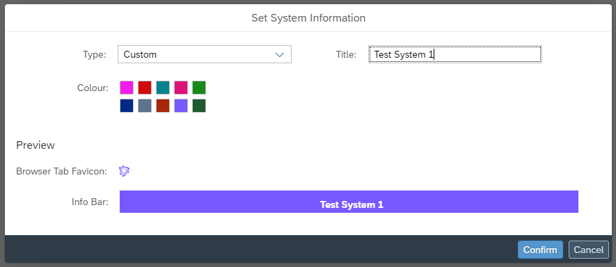
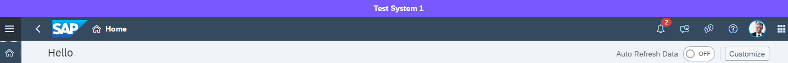

<!-- loio6bdd79878afa4ec5bcd9d3502158a06e -->

# Display Your System Information

Add a visual tenant type indicator to your system.

## Context

You can add a tenant type indicator to show all users which system they are using. For example, it would allow users to differentiate between a test or production system. When enabled, a colored information bar is visible to all users of the tenant, and the browser favicon is be updated with the matching color.

## Procedure

1.  Go to *System* \> *Configuration* \> *System Information*.

2.  If you have not set system information before, select *Customize Visual Settings*. If you have previously set system information, select *Edit*.

3.  Select a tenant type from the list. If you select a *Custom* type, you must add a *Title*. The tenant type will be displayed in the information bar.

    Example *Custom* dialog:

    

4.  Select a color.

    A preview of the favicon and information bar will be displayed.

5.  Select *Confirm*.

6.  Turn on the *Display System Information* toggle.

<a name="loio6bdd79878afa4ec5bcd9d3502158a06e__result_gll_bmb_4bc"/>

## Results

The tenant information that you set is displayed to all users above the shell bar. For example:

