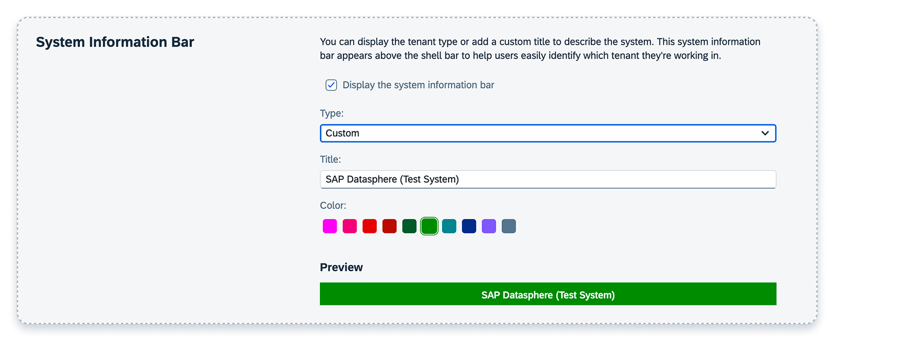
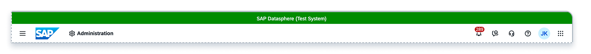

<!-- loio6bdd79878afa4ec5bcd9d3502158a06e -->

<link rel="stylesheet" type="text/css" href="../css/sap-icons.css"/>

# Display Your System Information

Configure a system information bar and change the favicon to differentiate between your systems.

<a name="loio6bdd79878afa4ec5bcd9d3502158a06e__prereq_ilb_f35_3hc"/>

## Prerequisites

To add a system information bar and change the favicon in your tenant, you must have a global role that grants you the following privileges:

-   *Data Warehouse General* \(`-R------`\) - To access SAP Datasphere.
-   *System Information* \(`-RU-----`\) - To access the *System* tool.

The *DW Administrator* global role, for example, grants these privileges. For more information, see [Privileges and Permissions](../Managing-Users-and-Roles/privileges-and-permissions-d7350c6.md) and [Standard Roles Delivered with SAP Datasphere](../Managing-Users-and-Roles/standard-roles-delivered-with-sap-datasphere-a50a51d.md). 

## Context

You can add a system information bar to show all users which system they're currently in. For example, it would allow users to easily differentiate between a test or production system. When enabled, a colored information bar is visible to all users of the tenant. In addition, you can choose to show the SAP or Datasphere icon in the browser tabs, bookmarks, search results, and history.

## Procedure

1.  From the side navigation, select  \(*System*\) ** \> **  \(*Administration*\) ** \> *Default Appearance* tab.

2.  In the *System Information Bar* section, select the checkbox *Display the system information bar*.

3.  Choose one of the tenant types from the drop-down menu.

    -   *Test*
    -   *Development*
    -   *Production*
    -   *Custom*

        If you select a custom type, you can enter your own title and choose a background color. The custom title can contain up to 100 characters.

    

4.  **Optional:** In the *Favicon* section, choose the SAP or Datasphere icon.

    The Datasphere icon will be the same color as your system information bar.

5.  Select *Save* to commit your changes.

<a name="loio6bdd79878afa4ec5bcd9d3502158a06e__result_gll_bmb_4bc"/>

## Results

The system information is displayed for all users above the shell bar.

