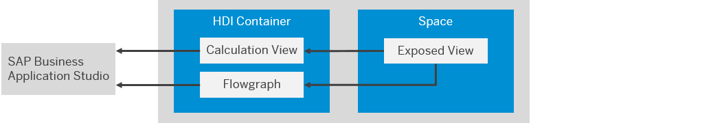

<!-- loioe9a287849ccf41bb8a132d12dd3fdc8f -->

<link rel="stylesheet" type="text/css" href="../css/sap-icons.css"/>

# Enable SAP SQL Data Warehousing on Your SAP Datasphere Tenant

You can enable SAP SQL Data Warehousing on your SAP Datasphere tenant to exchange data between your HDI containers and your SAP Datasphere spaces without the need for data movement.

## Context

To enable SAP SQL Data Warehousing on your SAP Datasphere tenant, an S-user must create an SAP ticket to connect your SAP BTP account.

> ### Note:  
> The SAP Datasphere tenant and SAP Business Technology Platform organization and space must be in the same data centre \(for example, eu10, us10\).

This integrated SAP SQL data warehousing approach allows you to add HDI containers to your space and exchange data between them:

-   Use calculation views and other SAP Business Application Studio objects as sources for your SAP Datasphere views and data flows \(see [Add an HDI Container and Access its Objects in Your Space](https://help.sap.com/viewer/9f36ca35bc6145e4acdef6b4d852d560/internal/en-US/5d55da5514b240ff8d3a970bf7dc6705.html "To access calculation views and other HDI objects as sources for your views and data flows, you must add the HDI container to your SAP Datasphere space.") :arrow_upper_right:\).

    

-   Use SAP Datasphere views that are exposed for consumption as sources for your SAP Business Application Studio calculation views and flowgraphs \(see [Access Space Objects in Your HDI Container](https://help.sap.com/viewer/9f36ca35bc6145e4acdef6b4d852d560/internal/en-US/656eebc2ced14ec09afa455224fa9a98.html "To access SAP Datasphere views that are exposed for consumption as sources for your calculation views and flowgraphs, you must create a database user with appropriate privileges, create a user-provided service in SAP BTP Cockpit, and configure your HDI project.") :arrow_upper_right:\).

    

-   Use SAP Business Application Studio tables as targets for your SAP Datasphere data flows \(see [Allow Your Space to Write to Your HDI Container](https://help.sap.com/viewer/9f36ca35bc6145e4acdef6b4d852d560/internal/en-US/aa3627f987d04b5f95fec1c45083dde9.html "To allow data flows in your SAP Datasphere space to use tables in your HDI container as targets, you must set the appropriate roles and add the container to your space.") :arrow_upper_right:\).

    

> ### Note:  
> See the blog [SAP BTP Showcase – Access the SAP HANA Cloud Database Underneath SAP Data Warehouse Cloud](https://blogs.sap.com/2021/01/31/sap-btp-showcase-access-the-sap-hana-cloud-database-underneath-sap-data-warehouse-cloud/) \(published in January 2021\) for an overview of the Integrated SAP SQL Warehousing approach.
> 
> See the blog [SAP Data Warehouse Cloud – Hybrid Access to SAP HANA for SQL Data Warehousing](https://blogs.sap.com/2020/06/19/sap-data-warehouse-cloud-hybrid-access-to-sap-hana-for-sql-data-warehousing/) \(published in June 2021\) for information about accessing your HDI objects on another server through a standard SAP HANA connection.

<a name="loioe9a287849ccf41bb8a132d12dd3fdc8f__steps_xxb_cty_tsb"/>

## Procedure

1.  In the side navigation area, click  \(*Space Management*\), locate your space tile, and click *Edit* to open it.

2.  In the *HDI Containers* section, click *Enable Access* and then click *Open Ticket* to create an SAP ticket for the `DWC-SM` component to request us to map your SAP Datasphere tenant to your SAP Business Technology Platform account.

3.  Provide the following information:

    <table>
    <tr>
    <th valign="top">

    Item

    
    </th>
    <th valign="top">

    Description

    
    </th>
    </tr>
    <tr>
    <td valign="top">

    SAP Datasphere Tenant ID

    
    </td>
    <td valign="top">

    In the side navigation area, click  \(*System*\) ** \> ** \(*About*\).

    > ### Note:  
    > You need the *Tenant ID* for the ticket, and the *Database ID* when building your containers in the SAP Datasphere run-time database.

    
    </td>
    </tr>
    <tr>
    <td valign="top">

     SAP Business Technology Platform Org GUID

    
    </td>
    <td valign="top">

    Your SAP Business Technology Platform organization ID.

    You can use the Cloud Foundry CLI to find your organization GUID \(see [https://cli.cloudfoundry.org/en-US/v6/org.html](https://cli.cloudfoundry.org/en-US/v6/org.html)\).

    
    </td>
    </tr>
    <tr>
    <td valign="top">

     SAP Business Technology Platform Space GUID

    
    </td>
    <td valign="top">

    The SAP Business Technology Platform space inside the organization.

    You can use the Cloud Foundry CLI to find your space GUID \(see [https://cli.cloudfoundry.org/en-US/v6/space.html](https://cli.cloudfoundry.org/en-US/v6/space.html)\).

    
    </td>
    </tr>
    </table>
    
    You will be notified when your ticket has been processed.

4.  Build one or more new HDI containers in the SAP Datasphere run-time database \(identified by the *Database ID* on the SAP Datasphere *About* dialog\).

    For information about setting up your build, see [Set Up an HDI Container](https://help.sap.com/docs/HANA_SERVICE_CF/cc53ad464a57404b8d453bbadbc81ceb/93cdbb1bd50d49fe872e7b648a4d9677.html?locale=en-US&version=Cloud).

5.  When one or more containers are available in the run-time database, the *Enable Access* button is replaced by the *\+* button in the *HDI Containers* section for all your SAP Datasphere spaces \(see [Add an HDI Container and Access its Objects in Your Space](https://help.sap.com/viewer/9f36ca35bc6145e4acdef6b4d852d560/internal/en-US/5d55da5514b240ff8d3a970bf7dc6705.html "To access calculation views and other HDI objects as sources for your views and data flows, you must add the HDI container to your SAP Datasphere space.") :arrow_upper_right:\).

