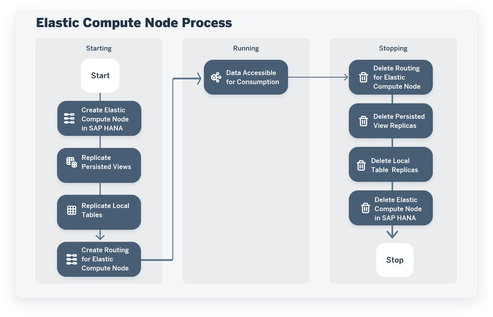
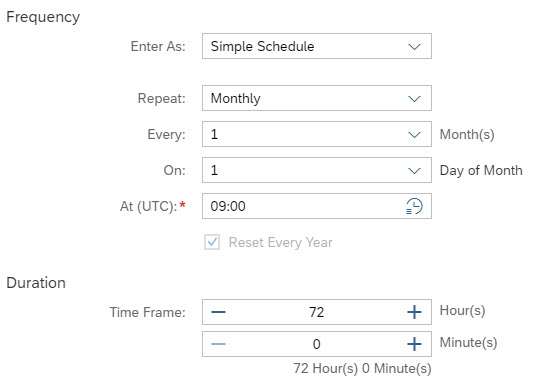

<!-- loio34b35852f2ff4888bda6b17e08f73ce3 -->

# Run an Elastic Compute Node

Once you've created an elastic compute node and added spaces and objects to it, you can run it and make data available for consumption.

This topic contains the following sections:

-   [Introduction to Elastic Compute Node Run Process](run-an-elastic-compute-node-34b3585.md#loio34b35852f2ff4888bda6b17e08f73ce3__section_crv_xpr_pbc)
-   [Start an Elastic Compute Node Manually](run-an-elastic-compute-node-34b3585.md#loio34b35852f2ff4888bda6b17e08f73ce3__section_syj_cwt_qzb)
-   [Stop an Elastic Compute Node Manually](run-an-elastic-compute-node-34b3585.md#loio34b35852f2ff4888bda6b17e08f73ce3__section_gzj_5lb_tzb)
-   [Schedule an Elastic Compute Node](run-an-elastic-compute-node-34b3585.md#loio34b35852f2ff4888bda6b17e08f73ce3__section_j5y_dwt_qzb)
-   [Update an Elastic Compute Node](run-an-elastic-compute-node-34b3585.md#loio34b35852f2ff4888bda6b17e08f73ce3__section_pwl_fst_qzb)
-   [Monitor an Elastic Compute Node](run-an-elastic-compute-node-34b3585.md#loio34b35852f2ff4888bda6b17e08f73ce3__section_wy2_xxg_tzb)

<a name="loio34b35852f2ff4888bda6b17e08f73ce3__section_crv_xpr_pbc"/>

## Introduction to Elastic Compute Node Run Process

When you start an elastic compute node, it will pass through the following phases:

An elastic compute node can have the following statuses:

-   *Not Ready* - The node cannot be run because no spaces or objects are assigned to it.

-   *Ready* - Spaces or objects are assigned to the node, which can be run, either by starting the run manually or scheduling it.

-   *Starting* - You’ve started the elastic compute node manually by clicking the *Start* button or it has been started via a schedule: persisted views and local tables are being replicated and routing is created to the elastic compute node.

-   *Starting Failed* \(displayed in red\) - You’ve started the elastic compute node manually by clicking the *Start* button or it has been started via a schedule: issues have occurred. You can start again the elastic compute node.

-   *Updating* - You’ve started the elastic compute node manually by clicking the *Update* button: persisted views and local tables that have failed to be replicated are now replicated and routing is created to the elastic compute node.

-   *Running* - The node is in its running phase: the data that have been replicated during the starting phase can be consumed in SAP Analytics Cloud for the spaces and objects specified.

    > ### Note:  
    > The *Running* status displayed in red indicates that the elastic compute node contains issues. We recommend that you stop and restart the node, or, alternatively that you stop and delete the node and create a new one.

-   *Stopping* - You’ve stopped the elastic compute node manually by clicking the *Stop* button or it has been stopped via a schedule: persisted view replicas, local table replicas and routing are being deleted from the node.

-   *Stopping Failed* \(displayed in red\) - You’ve stopped the elastic compute node manually by clicking the *Stop* button or it has been stopped via a schedule: issues have occurred. You can stop again the elastic compute node.

> ### Note:  
> Up to 4 elastic compute nodes can run at the same time.

**Updates of local tables or persisted views while an elastic compute node is running** - An elastic compute node is in its running phase, which means that its local tables and persisted views have been replicated. Here is the behavior if these objects are updated while the node is running:

-   If a local table data is updated, it is updated on the main instance and the local table replica is also updated in parallel on the elastic compute node. The runtime may take longer and more memory may be consumed.

-   If a persisted view data is updated, it is first updated on the main instance, then as a second step the persisted view replica is updated on the elastic compute node. The runtime will take longer, and more memory and compute will be consumed.

-   If local table or persisted view metadata is changed on \(new column for example\) or deleted from the main instance, the local table replica or the persisted view replica is deleted from the elastic compute node. The data of these objects is therefore read from the main instance and not from the elastic compute node.

To create and manage elastic compute nodes, you must have the following privileges:

-   *Spaces* \(C------M\) - To create, manage and run an elastic compute node
-   *Space Files* \(-------M\) - To add spaces and objects to an elastic compute node
-   *System Information* \(--U-----\) - To access tenant settings needed to manage elastic compute nodes

The *DW Administrator* global role, for example, grants these privileges \(see [Roles and Privileges by App and Feature](../Managing-Users-and-Roles/roles-and-privileges-by-app-and-feature-2d8b7d0.md)\).

<a name="loio34b35852f2ff4888bda6b17e08f73ce3__section_syj_cwt_qzb"/>

## Start an Elastic Compute Node Manually

If the status of an elastic compute node is *Ready*, you can start it.

1.  In the side navigation area, click  \(*Space Management*\), then select the elastic compute node.

2.  Click *Start*.

    The status of the elastic compute node changes to *Starting*.

<a name="loio34b35852f2ff4888bda6b17e08f73ce3__section_gzj_5lb_tzb"/>

## Stop an Elastic Compute Node Manually

If the status of an elastic compute node is *Starting* or *Running*, you can stop it.

1.  In the side navigation area, click  \(*Space Management*\), then select the elastic compute node.

2.  Click *Stop*.

    The status of the elastic compute node changes to *Stopping*.

<a name="loio34b35852f2ff4888bda6b17e08f73ce3__section_j5y_dwt_qzb"/>

## Schedule an Elastic Compute Node

You can schedule an elastic compute node to run periodically at a specified date or time. You can also pause and then later resume the schedule. You create and manage a schedule to run an elastic compute node as any other data integration task \(see [Scheduling Data Integration Tasks](https://help.sap.com/viewer/9f36ca35bc6145e4acdef6b4d852d560/DEV_CURRENT/en-US/7fa07621d9c0452a978cb2cc8e4cd2b1.html "Schedule data integration tasks to run periodically at a specified date or time.") :arrow_upper_right:\) and, in addition, you can specify the duration time frame as follows.

1.  In the side navigation area, click  \(*Space Management*\), then select the elastic compute node.

2.  Click *Schedule*, then *Create Schedule*.
3.  In the *Create Schedule* dialog, specify the options of the schedule, just like for any other integration task. See [Schedule a Data Integration Task (Simple Schedule)](https://help.sap.com/viewer/9f36ca35bc6145e4acdef6b4d852d560/DEV_CURRENT/en-US/7c11059ed3314e1fb753736b7867512c.html "You can schedule or unschedule data integration tasks such as remote data replication, data persistence, data flow, replication flow, or task chains runs. You may also pause and then later resume the run of scheduled tasks.") :arrow_upper_right: and [Schedule a Data Integration Task (with Cron Expression)](https://help.sap.com/viewer/9f36ca35bc6145e4acdef6b4d852d560/DEV_CURRENT/en-US/169ba34e19744362be25a4325de8d10c.html "Schedule data integration tasks such as data replication, data persistence, or data flow runs or task chains runs, by entering directly a cron expression.") :arrow_upper_right:.

4.  In addition, specify in the *Duration* area the total number of hours and minutes of an elastic compute node run, from the starting to the stopping stages.

**Example** - The elastic compute node is scheduled to run on the first day of every month for a duration of 72 hours \(uptime of 3 days\).

Once you've created the schedule, a schedule icon is displayed next to the elastic compute node in the list of nodes in the left-hand side area of the *Space Management*.

You can then perform the following actions for the schedule by clicking *Schedule*: edit, pause, resume, delete or take over the ownership of the schedule \(see [Scheduling Data Integration Tasks](https://help.sap.com/viewer/9f36ca35bc6145e4acdef6b4d852d560/DEV_CURRENT/en-US/7fa07621d9c0452a978cb2cc8e4cd2b1.html "Schedule data integration tasks to run periodically at a specified date or time.") :arrow_upper_right:\).

<a name="loio34b35852f2ff4888bda6b17e08f73ce3__section_pwl_fst_qzb"/>

## Update an Elastic Compute Node

In some cases, you can partially run again an elastic compute node for updates and replicate tables or persisted views that were not replicated: if changes have been made to a local table or a persisted view assigned to the node while or after the node was running; if a table or a view has failed to be replicated. In such a case, the *Update* button is available.

1.  In the side navigation area, click  \(*Space Management*\), then select the elastic compute node.

2.  Click *Update*.

    The status of the elastic compute node changes to *Starting*.

<a name="loio34b35852f2ff4888bda6b17e08f73ce3__section_wy2_xxg_tzb"/>

## Monitor an Elastic Compute Node

Monitor an elastic compute node to see for example all its start and stop runs or if all local tables and persisted views have been replicated.

1.  In the side navigation area, click  \(*Space Management*\), then select the elastic compute node.

2.  Click *View Logs*.

    The *Statement Logs* tab of the *System Monitor* opens, displaying information filtered on the elastic compute node. For more information about logs in the *System Monitor*, see [Monitoring SAP Datasphere](../Monitoring-SAP-Datasphere/monitoring-sap-datasphere-28910cd.md).

    If local tables or persisted views were not replicated, you can go back to the elastic compute node and update it to replicate them.

> ### Note:  
> To monitor the start and stop runs for all elastic compute nodes, you can click *View Logs* in the left-hand area of the *Space Management*.

You can monitor key figures related to an elastic compute node \(such as start and end time of the last run; amount of memory used for data replication\), in the *Elastic Compute Nodes* tab of the *System Monitor*  \(see [Monitoring SAP Datasphere](../Monitoring-SAP-Datasphere/monitoring-sap-datasphere-28910cd.md)\).

