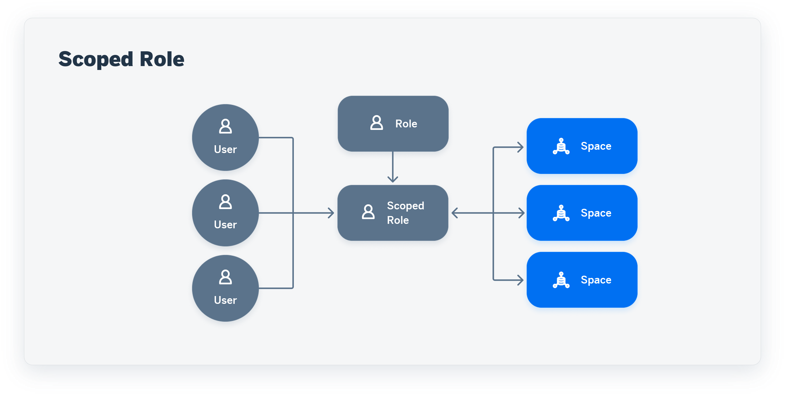
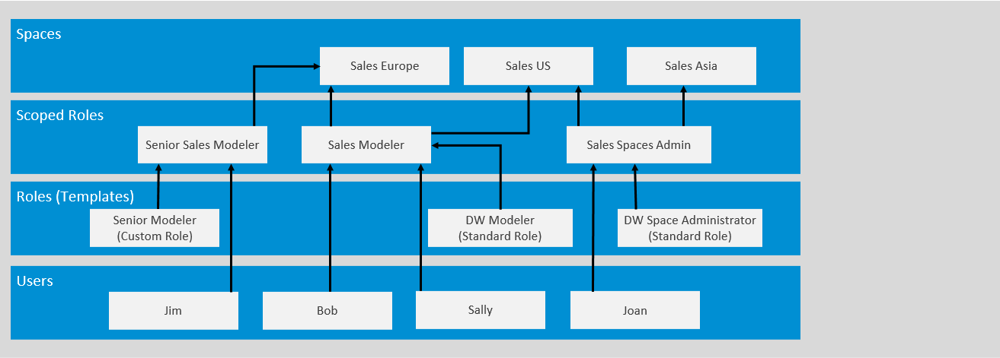

<!-- loiob5c4e0b6c462414783ebbfc053815521 -->

<link rel="stylesheet" type="text/css" href="../css/sap-icons.css"/>

# Create a Scoped Role to Assign Privileges to Users in Spaces

A scoped role inherits a set of scoped privileges from a standard or custom role and grants these privileges to users for use in the assigned spaces.

This topic contains the following sections:

-   [Introduction to Scoped Roles](create-a-scoped-role-to-assign-privileges-to-users-in-spaces-b5c4e0b.md#loiob5c4e0b6c462414783ebbfc053815521__section_uhl_gzy_bzb)
-   [Create a Scoped Role](create-a-scoped-role-to-assign-privileges-to-users-in-spaces-b5c4e0b.md#loiob5c4e0b6c462414783ebbfc053815521__section_z4m_mpj_zyb)
-   [Add Spaces to a Scoped Role](create-a-scoped-role-to-assign-privileges-to-users-in-spaces-b5c4e0b.md#loiob5c4e0b6c462414783ebbfc053815521__section_pr1_5pj_zyb)
-   [Remove Spaces from a Scoped Role](create-a-scoped-role-to-assign-privileges-to-users-in-spaces-b5c4e0b.md#loiob5c4e0b6c462414783ebbfc053815521__section_lbc_gbz_bzb)
-   [Add Users to a Scoped Role](create-a-scoped-role-to-assign-privileges-to-users-in-spaces-b5c4e0b.md#loiob5c4e0b6c462414783ebbfc053815521__section_u4g_xpj_zyb)
-   [Remove Users from a Scoped Role](create-a-scoped-role-to-assign-privileges-to-users-in-spaces-b5c4e0b.md#loiob5c4e0b6c462414783ebbfc053815521__section_anc_jbz_bzb)

> ### Caution:  
> Scoped roles and all related features will be rolled out to all tenants over the course of a number of versions. For more details, see SAP Note [3380409](https://launchpad.support.sap.com/#/notes/3380409).

<a name="loiob5c4e0b6c462414783ebbfc053815521__section_uhl_gzy_bzb"/>

## Introduction to Scoped Roles

A user with the DW Administrator role can create scoped roles.

A DW Administrator can assign a role to multiple users in multiple spaces, in a single scoped role. As a consequence, a user can have different roles in different spaces: be a modeler in space Sales Germany and Sales France and a viewer in space Europe Sales.

You can create a scoped role based on a standard role or on a custom role. In both cases, the scoped role inherits the privileges from the standard or custom role. You cannot edit the privileges of a scoped role or of a standard role. You can edit the privileges of a custom role. To create a scoped role with a different set of privileges, create a custom role with the set of privileges wanted and then create the scoped role from the custom role. You can then change the privileges of the custom role as needed, which will also change the privileges of all the scoped roles that are based on the custom role.

Users who are granted the DW Space Administrator role via a scoped role can add or remove users to or from their spaces and the changes are reflected in the scoped roles. See [Control User Access to Your Space](https://help.sap.com/viewer/9f36ca35bc6145e4acdef6b4d852d560/DEV_CURRENT/en-US/9d59fe511ae644d98384897443054c16.html "You can assign users to your space and manage them.") :arrow_upper_right:.

We recommend that you create scoped roles by logical groups of spaces.

In the following example, the DW administrator begins assigning users to the three Sales spaces by creating the appropriate scoped roles:

She creates three scoped roles based on standard and custom roles and assigns the users to the spaces as follows:

<table>
<tr>
<th valign="top">

Scoped Roles

</th>
<th valign="top">

Roles \(Templates\)

</th>
<th valign="top">

Users

</th>
<th valign="top">

Spaces

</th>
</tr>
<tr>
<td valign="top">

Sales Modeler

</td>
<td valign="top">

DW Modeler standard role

</td>
<td valign="top">

Sally

Bob

</td>
<td valign="top">

Sales Europe

Sales US

</td>
</tr>
<tr>
<td valign="top">

Senior Sales Modeler

</td>
<td valign="top">

Custom role “Senior Modeler” based on the DW Modeler standard role + these privileges \(and permissions\):

-   Data Warehouse Data Integration \(Execute\)

-   Data Warehouse Remote Connection \(Create, Read, Update and Delete\)

</td>
<td valign="top">

Jim

</td>
<td valign="top">

Sales Europe

</td>
</tr>
<tr>
<td valign="top">

Sales Spaces Admin

</td>
<td valign="top">

DW Space Administrator standard role + this privilege \(permission\):

-   Scoped Role User Assignment \(Manage\)

</td>
<td valign="top">

Joan

</td>
<td valign="top">

Sales US

Sales Asia

</td>
</tr>
</table>

If Bob no longer needs to work in the space Sales US, the DW administrator can unassign Bob from Sales US in the scoped role Sales Modeler.

As Joan has the role of space administrator for the space Sales US, she can also unassign Bob from Sales US directly in the space page \(in the *Space Management*\). The user assignment change is automatically reflected in the Sales Modeler scoped role.

Later on, Bob needs the space administration privileges for the space Sales Asia. From the page of the space Sales Asia, Joan assigns Bob to the space with the Sales Space Admin scoped role.

For more information on scoped roles, see the blog [Preliminary Information SAP Datasphere– Scoped Roles](https://blogs.sap.com/2023/09/13/preliminary-information-sap-datasphere-scoped-roles/) \(published in September 2023\).

<a name="loiob5c4e0b6c462414783ebbfc053815521__section_z4m_mpj_zyb"/>

## Create a Scoped Role

> ### Note:  
> In addition to the standard workflows, you can also create scoped roles and assign scopes and users to them via the command line \(see [Manage Scoped Roles via the Command Line](https://help.sap.com/viewer/9b8363ae47c347de9a027c0e5567a37a/DEV_CURRENT/en-US/85085a35a58a4589bc121fb94efc4876.html "Users with a DW Administrator role (or with equivalent privileges) can create, read, update, and delete scoped roles via the command line.") :arrow_upper_right:\).

1.  In the side navigation area, click  \(*Security*\) ** \> **  \(*Roles*\) and click your scoped role to open it.
2.  Click  \(Add Role\) and select *Create a Scoped Role*.

    > ### Note:  
    > As an alternative to creating a scoped role, you can use one of the predefined scoped roles that are delivered with SAP Datasphere in the *Roles* page and directly assign spaces and users to them.

3.  Enter a unique name for the role and select the license type SAP Datasphere.

4.  Click *Create*.

5.  Select the role template, which can either be a standard role template or a custom role and click *Save*.

6.  As your scoped role inherits privileges from the template you've chosen, you cannot edit the privileges, except for the one privilege *Scoped Role User Assignment* \(Manage\). If you're creating a scoped role for space administration purposes, you should select this privilege that allows to manage user assignment in a space.

You can then assign spaces and users to the new scoped role. The spaces and users must be created beforehand and you must assign spaces before assigning users to them.

> ### Note:  
> If you’re creating a scoped role to assign space administration privileges to certain users in certain spaces, you can either do as follows:
> 
> -   Create a scoped role based on the standard role template DW Space Administrator and, to allow user assignment, select the privilege \(permission\) *Scoped Role User Assignment* privilege \(Manage\), which is the only privilege you can select, as the rest of the privileges are inherited from the template. Then, assign one or more spaces and one or more users to the spaces.
> 
> -   Open the predefined scoped role DW Scoped Space Administrator and assign one or more spaces and one or more users to the spaces. *Scoped Role User Assignment* \(Manage\) is selected by default.
> 
> 
> The users can manage the spaces they're assigned to.

<a name="loiob5c4e0b6c462414783ebbfc053815521__section_pr1_5pj_zyb"/>

## Add Spaces to a Scoped Role

To add spaces to a scoped role, the spaces must be created beforehand.

1.  In the side navigation area, click  \(*Security*\) ** \> **  \(*Roles*\) and click your scoped role to open it.
2.  Click *\[number\] Scopes*, select one or more spaces in the dialog *Scopes* and click *Save*.

    > ### Note:  
    > By default, all users of the scoped role are automatically assigned to the spaces you've just added. You can change this and assign only certain members to certain spaces in the *Users* page of the scoped role.

<a name="loiob5c4e0b6c462414783ebbfc053815521__section_lbc_gbz_bzb"/>

## Remove Spaces from a Scoped Role

1.  In the side navigation area, click  \(*Security*\) ** \> **  \(*Roles*\) and click your scoped role to open it.
2.  Click *\[number\] Scopes*.

3.  In the *Selected Scopes* area of the dialog *Scopes*, click the cross icon for each space that you want to remove from the role, then click *Save*.

    All users that were assigned to the spaces you've just removed are automatically removed from the scoped role.

<a name="loiob5c4e0b6c462414783ebbfc053815521__section_u4g_xpj_zyb"/>

## Add Users to a Scoped Role

To add users to a scoped role, the users must be created beforehand.

1.  In the side navigation area, click  \(*Security*\) ** \> **  \(*Roles*\) and click your scoped role to open it.
2.  Click *Users*. All user assignements are displayed in the *Users* page.

    -   To individually select users and assign them to spaces, click  \(Add Users to Scopes\), then *Add New Users to Scopes*. Select one or more users in the wizard *Add Users to Scopes* and click *Next Step*.

        > ### Note:  
        > By default, the added users are automatically assigned to all the spaces included in the scoped role. If you want to modify this, select the one or more spaces to which you want to assign the users.

        Click *Next Step* and *Save*.

        > ### Note:  
        > You can also add a user to a scoped role from the  \(*Users*\) area. In such a case, the user is automatically assigned to all the spaces included in the scoped role. See [Assign Users to a Role](assign-users-to-a-role-57a7880.md).

    -   To assign all users included in the scoped role to one or more spaces. To do so, click  \(Add Users to Scopes\), then *Add All Current Users to Scopes*. Select one or more spaces in the wizard *Add Users to Scopes* and click *Next Step* and *Save*.

    -   To assign all users of the tenant to one or more spaces, click  \(Add Users to Scopes\), then *Add All Users to Scopes*. Select one or more spaces in the wizard *Add Users to Scopes* and click *Next Step* and *Save*.

> ### Restriction:  
> A user can be assigned to a maximum of 100 spaces across all scoped roles.

> ### Note:  
> In the *Users* page, you can filter users and spaces to see for example to which spaces and roles a user is assigned to.

Once you've assigned a user to a space with the DW Space Administrator role via a scoped role, this user can manage the users for its space directly in the page of its space \(in the *Space Management*\). See [Control User Access to Your Space](https://help.sap.com/viewer/9f36ca35bc6145e4acdef6b4d852d560/DEV_CURRENT/en-US/9d59fe511ae644d98384897443054c16.html "You can assign users to your space and manage them.") :arrow_upper_right:.

<a name="loiob5c4e0b6c462414783ebbfc053815521__section_anc_jbz_bzb"/>

## Remove Users from a Scoped Role

1.  In the side navigation area, click  \(*Security*\) ** \> **  \(*Roles*\) and click your scoped role to open it.
2.  Click *Users*. All user assignements are displayed in the *Users* page.

3.  Check the relevant rows \(a row corresponding to a combination of one user and one space\) and click the garbage icon. The users cannot access the spaces they were previously assigned to in the scoped role.

