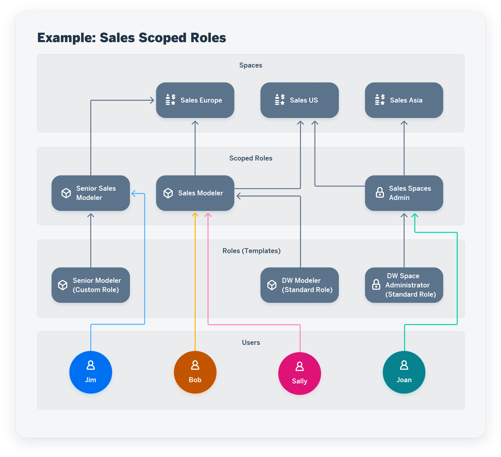

<!-- loiob5c4e0b6c462414783ebbfc053815521 -->

<link rel="stylesheet" type="text/css" href="../css/sap-icons.css"/>

# Create a Scoped Role to Assign Privileges to Users in Spaces

A scoped role inherits a set of scoped privileges from a standard or custom role and grants these privileges to users for use in the assigned spaces.

> ### Caution:  
> Scoped roles and all related features will be rolled out to all tenants over the course of a number of versions. For more details, see SAP Note [3380409](https://launchpad.support.sap.com/#/notes/3380409).

A user with the DW Administrator role can create scoped roles.

A DW Administrator can assign a role to multiple users in multiple spaces, in a single scoped role. As a consequence, a user can have different roles in different spaces: be a modeler in space Sales Germany and Sales France and a viewer in space Europe Sales.

Users with the DW Space Administrator role can then assign and unassign users to their spaces and the changes are reflected in the scoped roles. See [Control User Access to Your Space](https://help.sap.com/viewer/be5967d099974c69b77f4549425ca4c0/cloud/en-US/9d59fe511ae644d98384897443054c16.html "You can assign users to your space and manage them.") :arrow_upper_right:.

You can create a scoped role based on a standard role or on a custom role. In both cases, the scoped role inherits the privileges from the standard or custom role. You cannot edit the privileges of a scoped role or of a standard role. You can edit the privileges of a custom role. To create a scoped role with a different set of privileges, create a custom role with the set of privileges wanted and then create the scoped role from the custom role. You can then change the privileges of the custom role as needed, which will also change the privileges of all the scoped roles that are based on the custom role.

In the following example, the DW administrator begins assigning users to the three Sales spaces by creating the appropriate scoped roles:

She creates three scoped roles based on standard and custom roles and assigns the users to the spaces as follows:

<table>
<tr>
<th valign="top">

Scoped Roles

</th>
<th valign="top">

Roles \(Templates\)

</th>
<th valign="top">

Users

</th>
<th valign="top">

Spaces

</th>
</tr>
<tr>
<td valign="top">

Sales Modeler

</td>
<td valign="top">

DW Modeler standard role

</td>
<td valign="top">

Sally

Bob

</td>
<td valign="top">

Sales Europe

Sales US

</td>
</tr>
<tr>
<td valign="top">

Senior Sales Modeler

</td>
<td valign="top">

Custom role “Senior Modeler” based on the DW Modeler standard role + these privileges \(and permissions\):

-   Data Warehouse Cloud Data Integration \(Execute\)

-   Data Warehouse Remote Connection \(Create, Read, Update and Delete\)

</td>
<td valign="top">

Jim

</td>
<td valign="top">

Sales Europe

</td>
</tr>
<tr>
<td valign="top">

Sales Spaces Admin

</td>
<td valign="top">

DW Space Administrator standard role + this privilege \(permission\):

-   Scoped Role User Assignment \(Manage\)

</td>
<td valign="top">

Joan

</td>
<td valign="top">

Sales US

Sales Asia

</td>
</tr>
</table>

If Bob no longer needs to work in the space Sales US, the DW administrator can unassign Bob from Sales US in the scoped role Sales Modeler.

As Joan has the role of space administrator for the space Sales US, she can also unassign Bob from Sales US directly in the space page \(in the *Space Management*\). The user assignment change is automatically reflected in the Sales Modeler scoped role.

Later on, Bob needs the space administration privileges for the space Sales Asia. From the page of the space Sales Asia, Joan assigns Bob to the space with the Sales Space Admin scoped role.

> ### Note:  
> If you’re creating a scoped role to assign space administration privileges to certain users in certain spaces, you can either do as follows:
> 
> -   Create a scoped role based on the standard role template DW Space Administrator and, to allow user assignment, select the privilege \(permission\) *Scoped Role User Assignment* privilege \(Manage\), which is the only privilege you can select, as the rest of the privileges are inherited from the template. Then, assign one or more spaces and one or more users to the spaces.
> 
> -   Open the predefined scoped role DW Scoped Space Administrator and assign one or more spaces and one or more users to the spaces. *Scoped Role User Assignment* \(Manage\) is selected by default.
> 
> 
> The users can manage the spaces they're assigned to.

> ### Note:  
> As an alternative to creating a scoped role, you can use one of the predefined scoped roles that are delivered with SAP Datasphere in the *Roles* page and assign spaces and users to them.

> ### Note:  
> Default behavior when adding a user or a space to an existing scoped role:
> 
> -   When you add a user to an existing scoped role, the user is automatically assigned to all the spaces included in the scoped role. This happens when you assign a user to a scoped role from the area  \(*Expand*\)** \> ** \(*Security*\)** \> ** \(*Users*\).
> 
> -   When you add a space to an existing scoped role, all users of the scoped roles are automatically assigned to the space.
> 
> 
> You can change the user assignment within the scoped role.

> ### Note:  
> See the blog [Preliminary Information SAP Datasphere– Scoped Roles](https://blogs.sap.com/2023/09/13/preliminary-information-sap-datasphere-scoped-roles/) \(published in September 2023\).

<a name="loiob5c4e0b6c462414783ebbfc053815521__section_scb_wj1_fxb"/>

## Create a Scoped Role

**Prerequisites**

To assign spaces and users in a scoped role, the spaces and users must be created beforehand.

1.  Go to  \(*Expand*\)** \> ** \(*Security*\)** \> ** \(*Roles*\).

2.  Click  \(Add Role\) and select *Create a Scoped Role*.

3.  Enter a unique name for the role and select the license type SAP Datasphere.

4.  Click *Create*.

5.  Select the role template, which can either be a standard role template or a custom role and click *Save*.

6.  As your scoped role inherits privileges from the template you've chosen, you cannot edit the privileges, except for the one privilege *Scoped Role User Assignment* \(Manage\). If you're creating a scoped role for space administration purposes, you should select this privilege that allows to manage user assignment in a space.
7.  To assign spaces, click *Assign Scopes*, select one or more spaces in the dialog *Assign Scopes* and click *Save*.

    > ### Note:  
    > You must assign spaces before assigning users to them.

8.  To assign users to one or more spaces, click *User Assignment*. All user assignements are displayed in the *User Assignment* page.

    -   To individually select users and assign them to spaces, click the button *Assign Users* or  \(Add User Assignment\), then *Select Users*. Select one or more users in the wizard *Assign Users* and click *Next Step*. The spaces you've selected in the *Assign Scopes* dialog in the previous step are displayed. Select the one or more spaces to which you want to assign the users. Click *Next Step* and *Save*.

    -   To assign all users of the tenant to one or more spaces, click  \(Add User Assignment\), then *All Users*. Select one or more spaces in the wizard *Assign Users* and click *Next Step* and *Save*.

    Once you've assigned users to spaces a first time in the scoped role, you can change the user assignment as explained above and also do the following actions:

    -   Assign all users included in the scoped role to one or more spaces. To do so, click  \(Add User Assignment\), then *All Users of Current Role*. Select one or more spaces in the wizard *Assign Users* and click *Next Step* and *Save*.

    -   Assign additional spaces to the scoped role. To do so, click *Scopes* in the main page of the scoped role and select the spaces you want to include. Be aware that all the users included in the scoped roles are automatically assigned to the added spaces. You can modify the user assignment in the *User Assignment* page.

    -   Unassign users from spaces. To do so, check the relevant rows \(a row corresponding to a combination of a user and a space\) and click the garbage icon in the *User Assignment* page.

> ### Note:  
> In the *User Assignment* page, you can filter users and spaces to see for example to which spaces and roles a user is assigned to.

> ### Note:  
> Users with the DW Space Administrator role can then manage the user assignment for their space directly in the page of their space \(in the *Space Management*\). See [Control User Access to Your Space](https://help.sap.com/viewer/be5967d099974c69b77f4549425ca4c0/cloud/en-US/9d59fe511ae644d98384897443054c16.html "You can assign users to your space and manage them.") :arrow_upper_right:.

