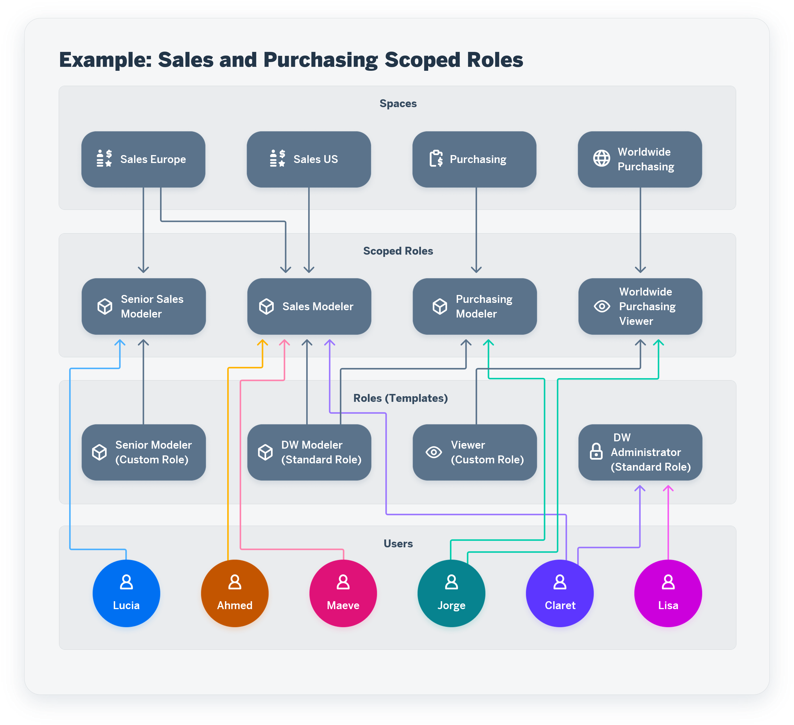

<!-- loio3740dacbc2794f33bb5d8d42216cc3bc -->

# Managing Roles and Privileges

Assigning roles to your users maintains access rights and secures your information in SAP Datasphere.

A role is a set of privileges and permissions.

SAP Datasphere delivers a set of standard roles and you can create your own custom roles:

-   Standard role - A role delivered with SAP Datasphere that includes a set of privileges. As a best practice, a tenant administrator can use these roles as templates for creating custom roles for different business needs. See [Standard Roles Delivered with SAP Datasphere](standard-roles-delivered-with-sap-datasphere-a50a51d.md).
-   Custom role - A role that a tenant administrator creates to choose specific privileges as needed. See [Create a Custom Role](create-a-custom-role-862b88e.md).

Each standard or custom role is either a global role or a template for scoped roles:

-   Global role - A role that enables users assigned to it to perform actions that are not space-related, typically a role that enables to administrate the tenant. A standard or custom role is considered as global when it includes global privileges. A tenant administrator can assign a global role to the relevant users. See [Assign Users to a Role](assign-users-to-a-role-57a7880.md).
-   Scoped role - A role that inherits a set of privileges from a standard or custom role and assigns them to one or more users for one or more spaces. Users assigned to a scoped role can perform actions in the assigned spaces. A tenant administrator can create a scoped role. See [Create a Scoped Role to Assign Privileges to Users in Spaces](create-a-scoped-role-to-assign-privileges-to-users-in-spaces-b5c4e0b.md).

For more information on global and scoped privileges, see [Privileges and Permissions](privileges-and-permissions-d7350c6.md).

> ### Caution:  
> Scoped roles and all related features will be rolled out to all tenants over the course of a number of versions. For more details, see SAP Note [3380409](https://launchpad.support.sap.com/#/notes/3380409).

Users have relevant privileges depending on which actions they can do in the spaces.

-   Lisa administers the SAP Datasphere tenant.
-   Claret administers the SAP Datasphere tenant and also has modeler privileges in the two spaces Sales Europe and Sales US.
-   Jorge has purchasing modeler privileges in the Purchasing space and has viewer privileges in the Worldwide Purchasing space.
-   Maeve and Ahmed have modeler privileges in the two spaces Sales Europe and Sales US.
-   Lucia has modeler privileges in the Sales Europe space.

