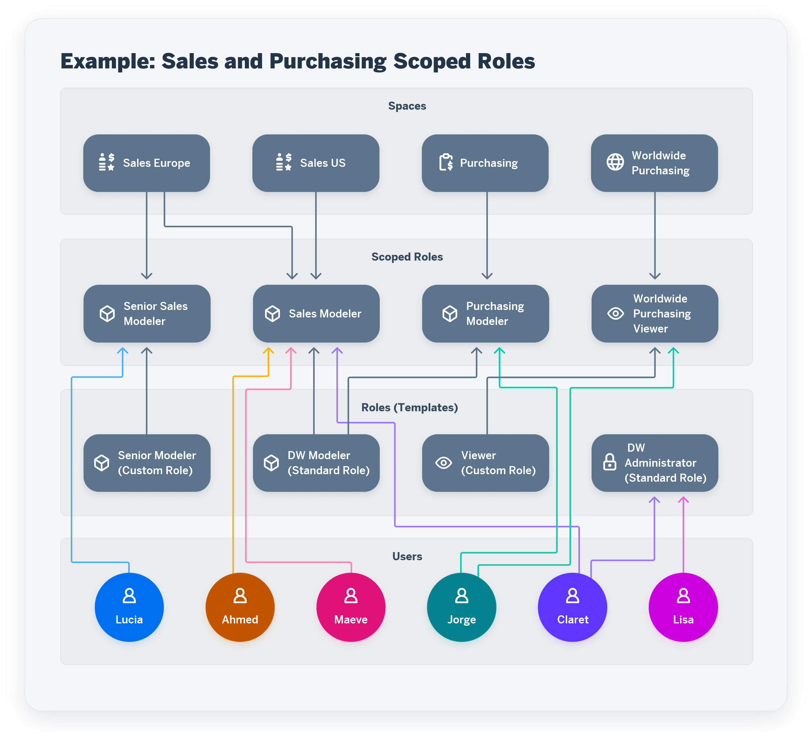
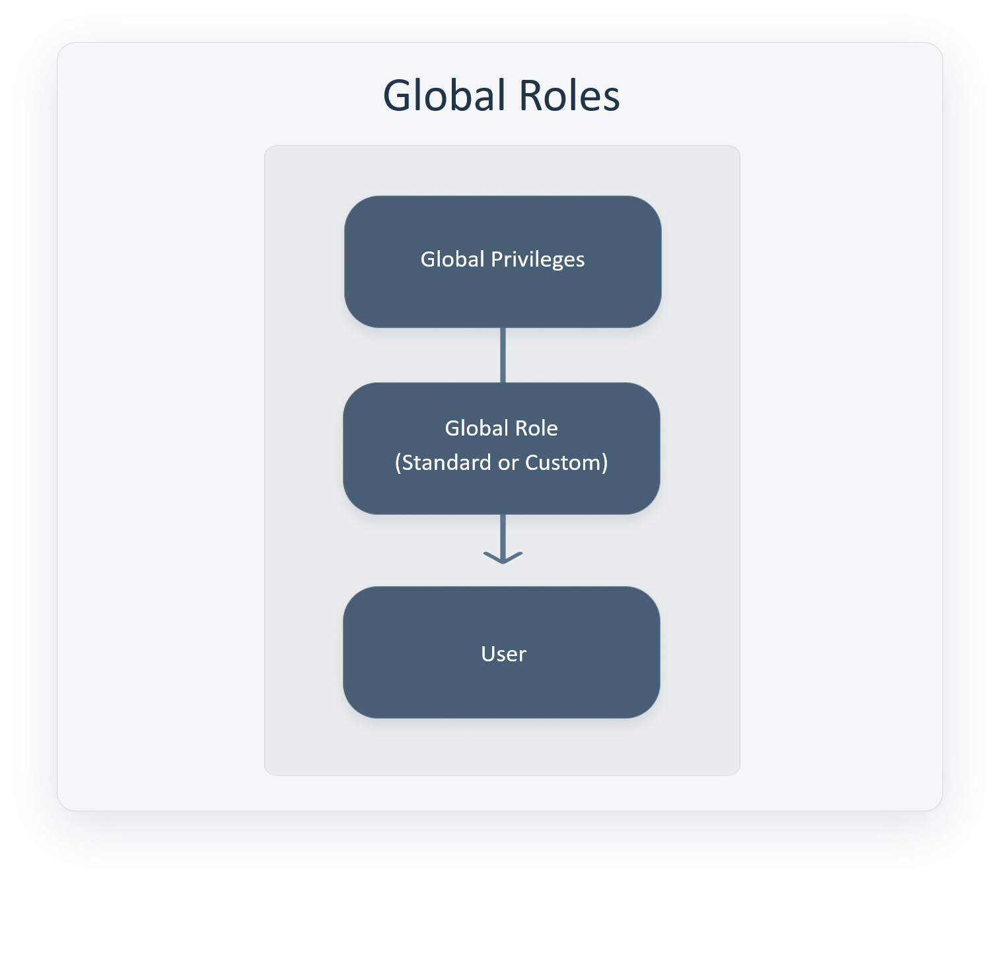
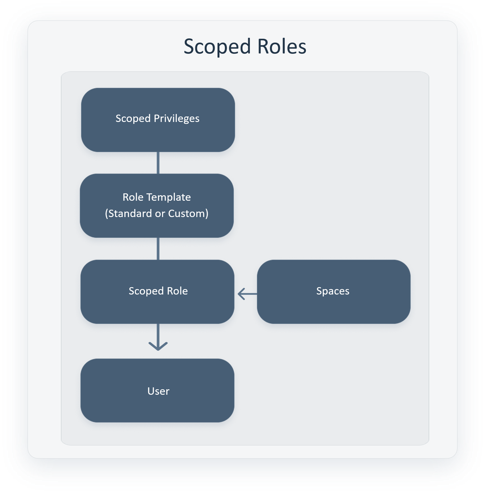

<!-- loio3740dacbc2794f33bb5d8d42216cc3bc -->

<link rel="stylesheet" type="text/css" href="../css/sap-icons.css"/>

# Managing Roles and Privileges

Assigning roles to your users maintains access rights and secures your information in SAP Datasphere.

This topic contains the following sections:

-   [Prerequisites](managing-roles-and-privileges-3740dac.md#loio3740dacbc2794f33bb5d8d42216cc3bc__section_qvm_vr4_hfc)
-   [Introduction to Roles and Privileges](managing-roles-and-privileges-3740dac.md#loio3740dacbc2794f33bb5d8d42216cc3bc__section_wp5_sr4_hfc)
-   [Granting Privileges via Global and Scoped Roles](managing-roles-and-privileges-3740dac.md#loio3740dacbc2794f33bb5d8d42216cc3bc__section_vdy_gmg_2bc)

<a name="loio3740dacbc2794f33bb5d8d42216cc3bc__section_qvm_vr4_hfc"/>

## Prerequisites

To manage roles and privileges, you must have a global role that grants you the following privileges:

-   *Data Warehouse General* \(`-R------`\) - To access SAP Datasphere.
-   *Role* \(`CRUD----`\) - To access the  \(*Roles*\) and  \(*Authorization Overview*\) areas in the  \(*Security*\) tool and to create, update, and delete roles.
-   *User* \(`-------M`\) - To add users to roles.
-   *Spaces* \(`-------M`\) - To add spaces to scoped roles.

The *DW Administrator* global role, for example, grants these privileges. For more information, see [Privileges and Permissions](privileges-and-permissions-d7350c6.md) and [Standard Roles Delivered with SAP Datasphere](standard-roles-delivered-with-sap-datasphere-a50a51d.md). 

## Context

In addition to working with roles in the *Security* tool, you can also:

-   List global roles, list users assigned to a global role, and add or remove users from global roles using the `datasphere` command line interface \(see [Manage Global Roles via the Command Line](https://help.sap.com/viewer/d0ecd6f297ac40249072a44df0549c1a/cloud/en-US/7db69de1d27f422fb153e80680b28335.html "Users with a DW Administrator role (or with equivalent privileges) can list and read global roles and add users to and remove users from them via the command line.") :arrow_upper_right:\).
-   List, read, create, update, and delete scoped roles, and add or remove users or spaces from scoped roles using the `datasphere` command line interface \(see [Manage Scoped Roles via the Command Line](https://help.sap.com/viewer/d0ecd6f297ac40249072a44df0549c1a/cloud/en-US/85085a35a58a4589bc121fb94efc4876.html "Users with a DW Administrator role (or with equivalent privileges) can create, read, update, and delete scoped roles via the command line.") :arrow_upper_right:\).

<a name="loio3740dacbc2794f33bb5d8d42216cc3bc__section_wp5_sr4_hfc"/>

## Introduction to Roles and Privileges

A role is a set of privileges and permissions.

SAP Datasphere delivers a set of standard roles and you can create your own custom roles:

-   Standard role - A role delivered with SAP Datasphere that includes a set of privileges. As a best practice, a tenant administrator can use these roles as templates for creating custom roles for different business needs. See [Standard Roles Delivered with SAP Datasphere](standard-roles-delivered-with-sap-datasphere-a50a51d.md).
-   Custom role - A role that a tenant administrator creates to choose specific privileges as needed. See [Create a Custom Role](create-a-custom-role-862b88e.md).

Each standard or custom role is either a global role or a template for scoped roles:

-   Global role - A role that enables users assigned to it to perform actions that are not space-related, typically a role that enables to administrate the tenant. A standard or custom role is considered as global when it includes global privileges. A tenant administrator can assign a global role to the relevant users. See [Assign Users to a Role](assign-users-to-a-role-57a7880.md).
-   Scoped role - A role that inherits a set of privileges from a standard or custom role and assigns them to one or more users for one or more spaces. Users assigned to a scoped role can perform actions in the assigned spaces. A tenant administrator can create a scoped role. See [Create a Scoped Role to Assign Privileges to Users in Spaces](create-a-scoped-role-to-assign-privileges-to-users-in-spaces-b5c4e0b.md).

For more information on global and scoped privileges, see [Privileges and Permissions](privileges-and-permissions-d7350c6.md).

Users have relevant privileges depending on which actions they can do in the spaces.

-   Lisa administers the SAP Datasphere tenant.
-   Claret administers the SAP Datasphere tenant and also has modeler privileges in the two spaces Sales Europe and Sales US.
-   Jorge has purchasing modeler privileges in the Purchasing space and has viewer privileges in the Worldwide Purchasing space.
-   Maeve and Ahmed have modeler privileges in the two spaces Sales Europe and Sales US.
-   Lucia has modeler privileges in the Sales Europe space.

<a name="loio3740dacbc2794f33bb5d8d42216cc3bc__section_vdy_gmg_2bc"/>

## Granting Privileges via Global and Scoped Roles

<table>
<tr>
<td valign="top">

</td>
<td valign="top">

</td>
</tr>
<tr>
<td valign="top">

A user is granted a set of global privileges for the tenant via a global role.

The global role can be:

-   A standard global role that is delivered with SAP Datasphere \(such as *DW Administrator*\).

-   A custom role that you create from a template \(a standard global role or another custom role containing global privileges\).

To assign a user to a global role, see [Assign Users to a Role](assign-users-to-a-role-57a7880.md).

</td>
<td valign="top">

A user is granted a set of scoped privileges for one or more spaces via a scoped role.

The scoped role inherits a role template, which can be:

-   A standard scoped role template that is delivered with SAP Datasphere \(such as *DW Space Administrator*\).

-   A custom role template that you create from another template \(a standard scoped role or another custom role\).

To assign a user to a scoped role, see [Create a Scoped Role to Assign Privileges to Users in Spaces](create-a-scoped-role-to-assign-privileges-to-users-in-spaces-b5c4e0b.md).

</td>
</tr>
</table>

> ### Note:  
> For complete lists of standard roles, privileges and permissions, see:
> 
> -   [Standard Roles Delivered with SAP Datasphere](standard-roles-delivered-with-sap-datasphere-a50a51d.md)
> -   [Privileges and Permissions](privileges-and-permissions-d7350c6.md)

