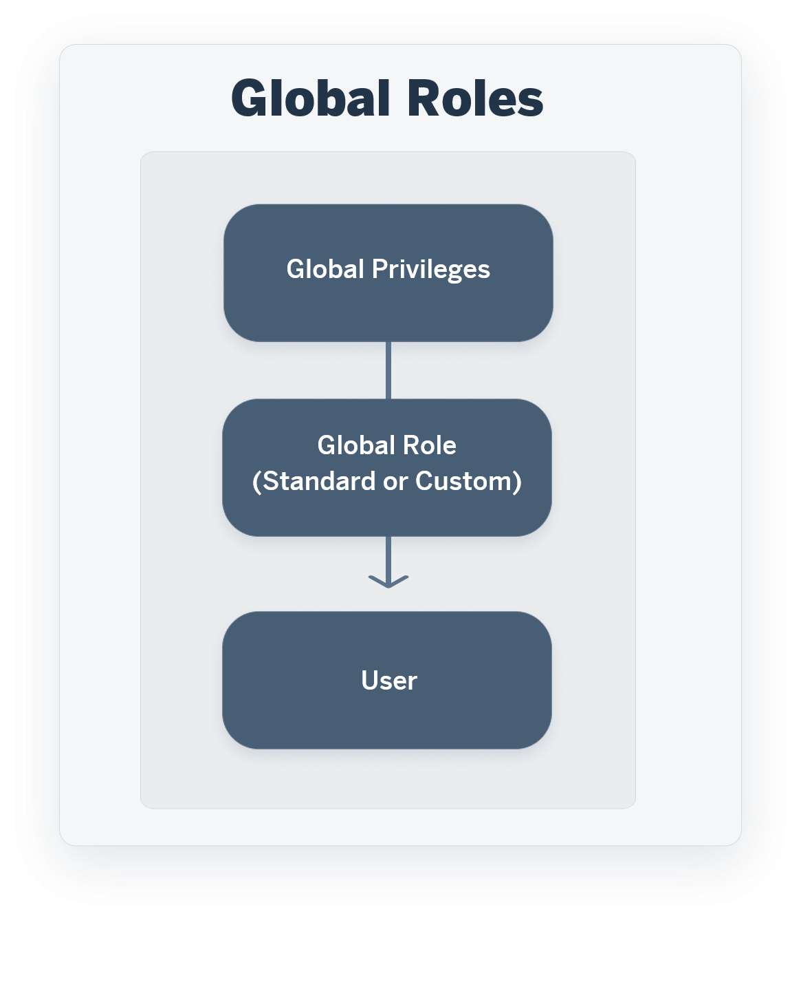
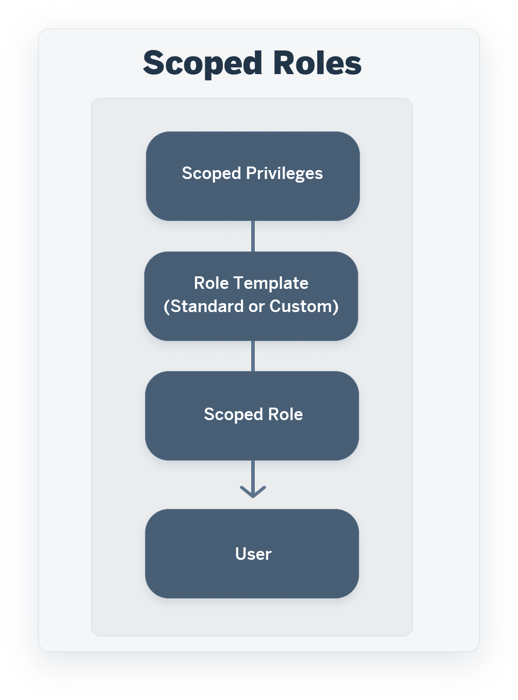

<!-- loio2d8b7d04dcae402f911d119437ce0a74 -->

<link rel="stylesheet" type="text/css" href="../css/sap-icons.css"/>

# Roles and Privileges by App and Feature

Review the standard roles and the privileges needed to access apps, tools, and other features of SAP Datasphere.

This topic contains the following sections:

-   [Granting Privileges via Global and Scoped Roles](roles-and-privileges-by-app-and-feature-2d8b7d0.md#loio2d8b7d04dcae402f911d119437ce0a74__section_vdy_gmg_2bc)
-   [Apps](roles-and-privileges-by-app-and-feature-2d8b7d0.md#loio2d8b7d04dcae402f911d119437ce0a74__section_apps)
-   [Administration Tools](roles-and-privileges-by-app-and-feature-2d8b7d0.md#loio2d8b7d04dcae402f911d119437ce0a74__section_tools)
-   [Space Management Privileges and Permissions](roles-and-privileges-by-app-and-feature-2d8b7d0.md#loio2d8b7d04dcae402f911d119437ce0a74__section_space_management_permissions_SDP_ON)
-   [External Data Consumption](roles-and-privileges-by-app-and-feature-2d8b7d0.md#loio2d8b7d04dcae402f911d119437ce0a74__section_external_consumption)
-   [The Command Line Interface](roles-and-privileges-by-app-and-feature-2d8b7d0.md#loio2d8b7d04dcae402f911d119437ce0a74__section_cli)

<a name="loio2d8b7d04dcae402f911d119437ce0a74__section_vdy_gmg_2bc"/>

## Granting Privileges via Global and Scoped Roles

<table>
<tr>
<td valign="top">

</td>
<td valign="top">

</td>
</tr>
<tr>
<td valign="top">

A user is granted a set of global privileges for the tenant via a global role.

The global role can be:

-   A standard global role that is delivered with SAP Datasphere \(such as *DW Administrator*\).

-   A custom role that you create from a template \(a standard global role or another custom role containing global privileges\).

To assign a user to a global role, see [Assign Users to a Role](assign-users-to-a-role-57a7880.md).

</td>
<td valign="top">

A user is granted a set of scoped privileges for one or more spaces via a scoped role.

The scoped role inherits a role template, which can be:

-   A standard scoped role template that is delivered with SAP Datasphere, such as *DW Space Administrator*\).

-   A custom role template that you create from another template \(a standard scoped role or another custom role\).

To assign a user to a scoped role, see [Create a Scoped Role to Assign Privileges to Users in Spaces](create-a-scoped-role-to-assign-privileges-to-users-in-spaces-b5c4e0b.md).

</td>
</tr>
</table>

> ### Note:  
> For complete lists of standard roles, privileges and permissions, see:
> 
> -   [Standard Roles Delivered with SAP Datasphere](standard-roles-delivered-with-sap-datasphere-a50a51d.md)
> -   [Privileges and Permissions](privileges-and-permissions-d7350c6.md)

<a name="loio2d8b7d04dcae402f911d119437ce0a74__section_apps"/>

## Apps

To access an app, tool, or editor, a user must have a global or scoped role inheriting from a role template which contains the listed privileges:

<table>
<tr>
<th valign="top">

App

</th>
<th valign="top">

Requires Privileges \(Permissions\)…

</th>
<th valign="top">

Granted by Role Template...

</th>
</tr>
<tr>
<td valign="top">

 \(*Home*\)

See [The SAP Datasphere Homepage](https://help.sap.com/viewer/ac696daa26f0413db39626bc2971e6c2/DEV_CURRENT/en-US/2d85c8b63c454df585099fc93e4f8baf.html "The SAP Datasphere homepage gives you access to recent objects, quick actions, and blog posts. You can choose to show, hide, and reorder cards to suit your needs.") :arrow_upper_right:

</td>
<td valign="top">

*Data Warehouse General* \(-R------\)

</td>
<td valign="top">

All roles except *DW Consumer*

*DW Viewer* \(read-only access\)

</td>
</tr>
<tr>
<td valign="top">

 \(*Repository Explorer*\)

See [Repository Explorer](https://help.sap.com/viewer/24f836070a704022a40c15442163e5cf/DEV_CURRENT/en-US/f8ce0b4a24fe473a962176c8aa3cad42.html "The Repository Explorer gives you access to all your SAP Datasphere objects. You can search and filter the list, open or act on existing objects, and create new objects.") :arrow_upper_right:

</td>
<td valign="top">

*Space Files* \(-R------\)

</td>
<td valign="top">

All roles except *DW Consumer*

*DW Viewer* \(read-only access\)

</td>
</tr>
<tr>
<td valign="top">

\(*Catalog & Marketplace*\)

See [Governing and Publishing Data in the Catalog](https://help.sap.com/viewer/97d1d2f0e35d410c893e95a5ff3bee6f/DEV_CURRENT/en-US/de29b96a9438439682715a93212ae4f4.html "Users with a catalog administrator role are responsible for connecting source systems to the catalog and monitoring those systems, and for enriching, classifying, and publishing objects extracted from these systems as catalog assets.") :arrow_upper_right:

</td>
<td valign="top">

-   *Catalog Asset* \(CRUD---M\)

-   *Catalog Glossary* \(CRUD----\)

-   *Catalog Glossary Object* \(CRUD---M\)

-   *Catalog KPI Object* \(CRUD---M\)

-   *Catalog KPI Template* \(-RU-----\)

-   *Catalog Tag Hierarchy* \(CRUD------\)

-   *Catalog System* \(CRUDE---\)

-   *Catalog Log* \(-R------\)

-   *Cloud Data Product* \(------S\)

</td>
<td valign="top">

*Catalog Administrator*

*Catalog User* \(read-only access for all privileges, except no access for *Catalog System*, *Catalog Log*, and *Cloud Data Product*\)

In addition, the following sub-tools require the *Catalog Administrator* role:

-   Tag Hierarchies
-   Monitoring

</td>
</tr>
<tr>
<td valign="top">

:convenience_store: \(*Data Marketplace*\)

See [Installing Marketplace Data Products](https://help.sap.com/viewer/24f836070a704022a40c15442163e5cf/DEV_CURRENT/en-US/92c35efd6a4945a1a78250539aee9a51.html "Use the catalog Data Products (Marketplace) collection to view data products for use in your modeling and other projects. You can see detailed metadata, including lineage information, for each data product, test the sample data sets (if available), and if you have the appropriate permissions, install it to an SAP Datasphere space.") :arrow_upper_right:

</td>
<td valign="top">

-   *Spaces* \(-R------\)

-   *Space Files* \(CRUD----\)

-   *Data Warehouse Connection* \(CRUD--S-\)

-   *Data Warehouse Data Integration* \(-RU-E---\)

-   *Data Warehouse Data Builder* \(CRU-----\)

</td>
<td valign="top">

*DW Integrator*

*DW Modeler*

*DW Administrator*, *DW Space Administrator* and *DW Viewer*: read-only access

</td>
</tr>
<tr>
<td valign="top">

 \(*Semantic Onboarding*\)

See [Semantic Onboarding](https://help.sap.com/viewer/24f836070a704022a40c15442163e5cf/DEV_CURRENT/en-US/4c9e45e19ff14271a65f883e30023736.html "Users with a modeler or space administrator role can use the Semantic Onboarding app, a central entry point for importing semantically-rich objects from your SAP systems and the Content Network, as well as the Public Data Marketplace and other marketplace contexts.") :arrow_upper_right:.

</td>
<td valign="top">

*Data Warehouse General* \(-R------\)

Each section requires a specific permission:

-   *SAP Systems*:
    -   *Data Warehouse Data Builder* \(CRU-----\)
    -   *Data Warehouse Business Entity* \(CRU-----\)

        *Data Warehouse Consumption Model* \(CRU-----\)

-   *Content Network*:
    -   *Lifecycle* \(-R---MS-\)

-   *Data Products* - See *Data Marketplace*, above.

</td>
<td valign="top">

*DW Viewer* \(read-only access\)

*DW Space Administrator* \(all sections\)

*DW Modeler \(**SAP Systems* and *Data Products*\)

</td>
</tr>
<tr>
<td valign="top">

 \(*Business Builder*\)

Start page

Dimension editor

Fact editor

Fact model editor

Consumption model editor

Authorization scenario editor

See [Modeling Data in the Business Builder](https://help.sap.com/viewer/24f836070a704022a40c15442163e5cf/DEV_CURRENT/en-US/3829d46c48a44f1e94915054bd76b7b9.html "Users with a modeler role can use the Business Builder editors to combine, refine, and enrich Data Builder objects and expose lightweight, tightly-focused perspectives for consumption by SAP Analytics Cloud and Microsoft Excel.") :arrow_upper_right:

</td>
<td valign="top">

Each page or editor requires a separate permission:

-   Start page: *Data Warehouse Business Builder* \(-R------\)
-   Dimension editor: *Data Warehouse Business Entity* \(CRUD----\)
-   Fact editor: *Data Warehouse Business Entity* \(CRUD----\)
-   Fact model editor: *Data Warehouse Fact Model* \(CRUD----\)
-   Consumption model editor: *Data Warehouse Consumption Model* \(CRUD----\)
-   Authorization scenario editor: *Data Warehouse Authorization Scenario* \(CRUD----\)

The following features need additional permissions \(which are included in the *DW Modeler* role\):

-   Preview data from any object in the *Data Preview* screen - *Data Warehouse Consumption.Execute*

    > ### Note:  
    > The *DW Viewer* role includes Data Warehouse Consumption.Read, which allows these users to preview only data from Fact models and consumption models.

</td>
<td valign="top">

*DW Space Administrator*

*DW Modeler*

*DW Viewer* \(read-only access\)

</td>
</tr>
<tr>
<td valign="top">

 \(*Data Builder*\) 

Start Page

Table editor

Graphical view editor

SQL view editor

Entity-relationship model editor

Data flow editor

Transformation flow editor

Replication flow editor

Analytic model editor

Intelligent lookup editor

Task chain editor

Data access control editor

See:

-   [Acquiring Data](https://help.sap.com/viewer/24f836070a704022a40c15442163e5cf/DEV_CURRENT/en-US/1f15a29a25354ec28392ab10ca4e9350.html "Users with a modeler role can import data directly into the Data Builder from connections and other sources, and use flows to replicate, extract, transform and load data.") :arrow_upper_right:
-   [Preparing Data](https://help.sap.com/viewer/24f836070a704022a40c15442163e5cf/DEV_CURRENT/en-US/f2e359c899fa4351b5f514d1d86ed9e2.html "Users with a modeler role can use views and intelligent lookups in the Data Builder to combine, clean, and otherwise prepare data.") :arrow_upper_right:
-   [Modeling Data in the Data Builder](https://help.sap.com/viewer/24f836070a704022a40c15442163e5cf/DEV_CURRENT/en-US/5c1e3d4a49554fcd8fcf199d664d1109.html "Users with a modeler role can add semantic information to their entities and combine, refine, and enrich them in tightly-focused analytic models for consumption in SAP Analytics Cloud, Microsoft Excel, and other clients, apps, and tools.") :arrow_upper_right:
-   [Securing Data with Data Access Controls](https://help.sap.com/viewer/9f36ca35bc6145e4acdef6b4d852d560/DEV_CURRENT/en-US/a032e51c730147c7a1fcac125b4cfe14.html "Users with a space administrator role can create data access controls to allow modelers to apply row-level security to Data Builder and Business Builder objects. Once a data access control is applied to an object, any user viewing its data either directly or via an object using it as a source, will see only those records they are authorized to view, based on the specified criteria.") :arrow_upper_right:

</td>
<td valign="top">

All pages and editors share a single permission:

-   *Data Warehouse Data Builder* \(CRUD--S-\)

The following features need additional permissions \(which are included in the *DW Modeler* role\):

-   Preview data from any object in the *Data Preview* panel - *Data Warehouse Consumption.Execute*

    > ### Note:  
    > The *DW Viewer* role includes *Data Warehouse Consumption.Read*, which allows these users to preview only data output by views with the *Expose for Consumption* switch enabled.

-   Upload data in a local table - *Data Warehouse Consumption.Update* or *Data Warehouse Data Integration.Update*
-   Access the local table *Data Editor* screen - *Data Warehouse Data Builder.Update*
-   See remote objects in *Data Builder* editors - *Data Warehouse Connection.Read*

The following features need additional permissions \(which are included in the *DW Integrator* role\):

-   Run an intelligent lookup - *Data Warehouse Data Integration.Update*
-   Run a task chain - *Data Warehouse Data Integration.Update*
-   Delete data in a local table - *Data Warehouse Data Integration.Update*

The following features need additional permissions \(which are included in the *DW Space Administrator* role\):

-   Create, update, and delete a data access control - *Data Warehouse Data Access Control* \(CRUD----\)

    > ### Note:  
    > The *DW Modeler* role includes *Data Warehouse Data Access Control.Read*, which allows them to apply an existing data access control to a view.

</td>
<td valign="top">

*DW Space Administrator*

*DW Modeler*

*DW Viewer* \(read-only access\)

</td>
</tr>
<tr>
<td valign="top">

 \(*Data Integration Monitor*\)

See [Managing and Monitoring Data Integration](https://help.sap.com/viewer/9f36ca35bc6145e4acdef6b4d852d560/DEV_CURRENT/en-US/4cbf7c7fc64645bfa364332827557267.html "Users with a space administrator or integrator role can use the Data Integration Monitor app to schedule, run, and monitor data replication and persistence tasks for remote tables and views, track queries sent to remote source systems, and manage other tasks through flows and task chains.") :arrow_upper_right:

</td>
<td valign="top">

*Data Warehouse Data Integration* \(-RU-E---\)

> ### Note:  
> *Data Warehouse Data Integration.Update* allows you to do only manual integration tasks. The *DW Integrator* role includes *Data Warehouse Data Integration.Execute*, which also allows scheduling automated integration tasks.

The following features need additional permissions \(which are included in the *DW Space Administrator* role\):

-   *Views* \(monitor\) ** \> ** Define partitions - *Data Builder.READ*
-   *Views* \(monitor\) ** \> *View Analyzer* - *Data Builder.READ*
-   *Views* \(monitor\) ** \> *Generate SQL Analyzer Plan File* - *Data Warehouse.RUNTIME*

</td>
<td valign="top">

*DW Space Administrator*

*DW Integrator*

*DW Modeler* \(manual tasks only\)

*DW Viewer* \(read-only access\)

</td>
</tr>
<tr>
<td valign="top">

 \(*Connections*\)

See [Integrating Data via Connections](https://help.sap.com/viewer/9f36ca35bc6145e4acdef6b4d852d560/DEV_CURRENT/en-US/eb85e157ab654152bd68a8714036e463.html "Users with a space administrator or integrator role can create connections to SAP and non-SAP source systems, including cloud and on-premise systems and partner tools, and to target systems for outbound replication flows. Users with modeler roles can import data via connections for preparation and modeling in SAP Datasphere.") :arrow_upper_right:

</td>
<td valign="top">

*Data Warehouse Connection* \(CRUD--S-\)

The following feature needs an additional permission \(which is included in the *DW Administrator* role\):

-   Select a location ID - *Connection.Read* 

</td>
<td valign="top">

*DW Space Administrator*

*DW Integrator*

*DW Modeler* \(read-only access\)

*DW Viewer* \(read-only access\)

</td>
</tr>
</table>

<a name="loio2d8b7d04dcae402f911d119437ce0a74__section_tools"/>

## Administration Tools

To access an app, tool, or editor, a user must have a global or scoped role inheriting from a role template which contains the listed privileges:

<table>
<tr>
<th valign="top">

Tool

</th>
<th valign="top">

Requires Privileges \(Permissions\)…

</th>
<th valign="top">

Granted by Role Template...

</th>
</tr>
<tr>
<td valign="top">

 \(*Space Management*\)

See [Preparing Your Space and Integrating Data](https://help.sap.com/viewer/ac696daa26f0413db39626bc2971e6c2/DEV_CURRENT/en-US/8cb00503395049029055bb7aceafc080.html "Users with a space administrator or integrator role can create connections to source systems and databases and can schedule and monitor data replication and other data integration tasks. Space administrators are, additionally, responsible for controlling user access to their space, creating data access controls to secure data, enabling other forms of data integration, transporting content between tenants, and monitoring and otherwise managing the space.") :arrow_upper_right:

</td>
<td valign="top">

*Spaces* \(CRUD---M\)

> ### Note:  
> For detailed information on permissions for *Spaces*, see [Space Management Privileges and Permissions](roles-and-privileges-by-app-and-feature-2d8b7d0.md#loio2d8b7d04dcae402f911d119437ce0a74__section_space_management_permissions_SDP_ON)

</td>
<td valign="top">

*DW Administrator* \(can create spaces\)

*DW Space Administrator*

*DW Integrator* and *DW Modeler*: have read-only access to the page for their space \(though they cannot see all its properties\).

</td>
</tr>
<tr>
<td valign="top">

 \(*System Monitor*\)

See [Monitoring SAP Datasphere](../Monitoring-SAP-Datasphere/monitoring-sap-datasphere-28910cd.md)

</td>
<td valign="top">

*System Information* \(-RU-----\)

</td>
<td valign="top">

*DW Administrator*

</td>
</tr>
<tr>
<td valign="top">

 \(*Translation*\)

See [Translating Metadata for SAP Analytics Cloud](https://help.sap.com/viewer/9f36ca35bc6145e4acdef6b4d852d560/DEV_CURRENT/en-US/fe829debe389450394cf7a15860e2caa.html "Users with a scoped role containing the Translation privilege can translate metadata such as business names and column names for dimensions and analytic models, and hierarchy dimension labels for SAP Analytics Cloud stories.") :arrow_upper_right:

</td>
<td valign="top">

*Translation* \(CR-D----\)

</td>
<td valign="top">

*DW Space Administrator*

*DW Modeler* \(read-only access\)

</td>
</tr>
<tr>
<td valign="top">

 \(*Security*\)

Users \(see [Managing SAP Datasphere Users](managing-sap-datasphere-users-4fb82cb.md)\)

Roles \(see [Managing Roles and Privileges](managing-roles-and-privileges-3740dac.md)\)

Authorization Overview \(see [View Authorizations by User, Role, or Space](view-authorizations-by-user-role-or-space-c6538ea.md)\)

Activities \(see [Monitor Object Changes with Activities](../Monitoring-SAP-Datasphere/monitor-object-changes-with-activities-08e607c.md)\)

</td>
<td valign="top">

The sub-tools require the following permissions:

-   *Users*: *User* \(CRUD---M\)
-   *Roles*: *Role* \(CRUD----\)
-   *Authorization Overview*: *Role* \(CRUD----\)
-   *Activities*: *Activity Log*

</td>
<td valign="top">

*DW Administrator* \(read-only access for the sub-tool *Activities*\)

</td>
</tr>
<tr>
<td valign="top">

 \(*Transport*\)

See [Transporting Content Between Tenants](https://help.sap.com/viewer/9f36ca35bc6145e4acdef6b4d852d560/DEV_CURRENT/en-US/df12666cf98e41248ef2251c564b0166.html "Users with an administrator or space administrator role can use the Transport app to transfer content between tenants via a private cloud storage area.") :arrow_upper_right:

</td>
<td valign="top">

*Lifecycle* \(-R---MS-\)

</td>
<td valign="top">

*DW Administrator* 

*DW Space Administrator* 

</td>
</tr>
<tr>
<td valign="top">

 \(*Data Sharing Cockpit*\)

See [Data Marketplace - Data Provider's Guide](https://help.sap.com/viewer/bb1899f0b39f415b9de29a845873d7af/DEV_CURRENT/en-US/e479b7b4c95741c7a7a1d42397984c7e.html "Users with a modeler role can create a data provider profile and publish data products to public, private, and internal Data Marketplaces.") :arrow_upper_right:

</td>
<td valign="top">

*Data Warehouse Data Builder* \(CRU-----\)

> ### Note:  
> To create a new data provider profile, or edit an existing one, you must have the **Spaces \(Update\)** privilege assigned to your role.
> 
> See [Maintaining your Data Provider Profile](https://help.sap.com/viewer/bb1899f0b39f415b9de29a845873d7af/DEV_CURRENT/en-US/4d298f8654fe4a6c9b6a4399a9e14c77.html "Provide information as you would like to present it to consumers of Data Marketplace. Provide company and business contact information as well as general information about the data you offer.") :arrow_upper_right:.

</td>
<td valign="top">

*DW Modeler*

*DW Space Administrator*

</td>
</tr>
<tr>
<td valign="top">

 \(*System*\)

Configuration

Administration

About

See [Administering SAP Datasphere](../administering-sap-datasphere-70ee87c.md)

</td>
<td valign="top">

*System Information* \(-RU-----\)

-   *System Information* \(-R------\) gives access to the *Configuration* area in read-only.
-   *System Information* \(--U-----\) gives access to the *Configuration* and *Administration*areas.

</td>
<td valign="top">

*DW Administrator*

> ### Note:  
> Users with any role can view the *About* dialog.

</td>
</tr>
</table>

<a name="loio2d8b7d04dcae402f911d119437ce0a74__section_space_management_permissions_SDP_ON"/>

## Space Management Privileges and Permissions

Users with different roles have different levels of access to the *Space Management* tool:

-   A user with a consumer role cannot log into SAP Datasphere.

-   A user with a viewer role can log into SAP Datasphere, but has no *Spaces* permissions and cannot see the *Space Management* tool.

-   A user with a modeler or integrator role has *Spaces* `(-R------)` permission. They have read-only access to the page for their space \(though they cannot see all its properties\).

-   A user with a space administrator role has *Spaces* `(-RUD----)` permissions. They can see all the space properties, and edit those outside the *General Settings* and *Workload Management* sections.

-   A user with an administrator role has *Spaces* `(C------M)` permissions. They can create spaces and edit some space properties, including modifying the storage allocated and the space priority.

Various privileges and permissions are required to see and edit different parts of the *Space Management* tool:

> ### Note:  
> -   In addition to all the privileges listed in the table below that are required to work with the *Space Management* tool, the following privileges are required:
>     -   *Data Warehouse General* `(-R------)` \(both global and scoped privilege\) - To access SAP Datasphere.
>     -   Global privilege *Space Files* `(-------M)` or scoped privilege *Space Files* `(-R------)`- To view objects in your space.
> 
> -   The global privilege *Spaces* `(-------M)` enables users with a global role to perform the following actions in all the spaces of the tenant: read, update and delete.

<table>
<tr>
<th valign="top">

Action

</th>
<th valign="top">

Requires Privilege \(Permission\)

</th>
<th valign="top">

Granted by Role Template...

</th>
</tr>
<tr>
<td valign="top">

Create a Space

See [Create a Space](../Creating-Spaces-and-Allocating-Storage/create-a-space-bbd41b8.md)

</td>
<td valign="top">

Global privileges *Spaces* `(C------M)` and *User* `(-R------)`.

</td>
<td valign="top">

DW Administrator

</td>
</tr>
<tr>
<td valign="top">

View Space Properties

</td>
<td valign="top">

Global privilege *Spaces* `(-------M)`

or scoped privilege *Spaces* `(-R------)`

> ### Note:  
> In addition, you also need the following permissions to view these properties:
> 
> -   *Users*: Global privileges *Role* `(-R------)` or scoped privileges *Scoped Role User Assignment* `(-------M)`
> 
> -   *Data Consumption* and *Database Users*: Global privilege *Spaces* `(-------M)` or scoped privilege *Spaces* `(-R------)`
> 
> -   *HDI Containers*: Scoped privileges *Spaces* `(-R------)` and *Data Warehouse Connection* `(-R------)`
> 
>     > ### Note:  
>     > A DW Administrator cannot see the *HDI Containers* area in a space.
> 
> -   *Time Data*: Scoped privileges *Spaces* `(-R------)` and *Data Builder* `(-R------)`
> 
>     > ### Note:  
>     > A DW Administrator cannot see the *Time Data* area in a space.
> 
> -   *Auditing*: Global privilege *Spaces* `(-------M)` or scoped privilege *Spaces* `(--R-----)`

</td>
<td valign="top">

DW Administrator and DW Space Administrator

> ### Note:  
> A user with a role based on the DW Modeler or DW Integrator role template have read-only access to the page for their space but they cannot view all its properties.

</td>
</tr>
<tr>
<td valign="top">

Modify *General Settings* \(except for *Space Storage*\)

See [Create a Space](../Creating-Spaces-and-Allocating-Storage/create-a-space-bbd41b8.md)

</td>
<td valign="top">

Global privilege *Spaces* `(-------M)` 

or scoped privilege *Spaces* `(-RU-----)`

</td>
<td valign="top">

DW Administrator and DW Space Administrator

</td>
</tr>
<tr>
<td valign="top">

Modify *Space Storage*, *Data Lake Access*, *Workload Management*

See [Create a Space](../Creating-Spaces-and-Allocating-Storage/create-a-space-bbd41b8.md), [Allocate Storage to a Space](../Creating-Spaces-and-Allocating-Storage/allocate-storage-to-a-space-f414c3d.md) and [Set Priorities and Statement Limits for Spaces or Groups](../Creating-Spaces-and-Allocating-Storage/set-priorities-and-statement-limits-for-spaces-or-groups-d66ac1e.md)

</td>
<td valign="top">

Global privilege *Spaces* `(-------M)`

</td>
<td valign="top">

DW Administrator

</td>
</tr>
<tr>
<td valign="top">

Modify *Users*

See [Control User Access to Your Space](https://help.sap.com/viewer/9f36ca35bc6145e4acdef6b4d852d560/DEV_CURRENT/en-US/9d59fe511ae644d98384897443054c16.html "You can assign users to your space and manage them.") :arrow_upper_right:

</td>
<td valign="top">

Global privileges *Spaces* `(-------M)` and *Role* `(-------M)` 

or scoped privileges *Spaces* `(--U-----)` and *Scoped Role User Assignment* `(-------M)`

</td>
<td valign="top">

DW Administrator and DW Space Administrator

</td>
</tr>
<tr>
<td valign="top">

Modify *Data Consumption* and *Database Users*

See [Create a Database User](https://help.sap.com/viewer/9f36ca35bc6145e4acdef6b4d852d560/DEV_CURRENT/en-US/798e3fd6707940c3bd2219b2d1ebaac2.html "Users with a space administration role can create database users, granting them privileges to read from and/or write to an Open SQL schema with restricted access to the space schema.") :arrow_upper_right:

</td>
<td valign="top">

Global privilege *Spaces* `(-------M)`

or scoped privileges *Spaces* `(-RU-----)`

</td>
<td valign="top">

DW Administrator, DW Space Administrator

> ### Note:  
> A user with a role based in the DW Integrator role template needs in addition the privilege *Spaces* `(--U-----)` to create database users.

</td>
</tr>
<tr>
<td valign="top">

Modify *HDI Containers*

See [Prepare Your HDI Project for Exchanging Data with Your Space](https://help.sap.com/viewer/9f36ca35bc6145e4acdef6b4d852d560/DEV_CURRENT/en-US/a94e1637db484a5c8ec2da83cfa75156.html "To allow your SAP Datasphere space to read from and, if appropriate, write to the HDI container, you must configure your HDI project to build on your SAP Datasphere tenant and define the appropriate roles.") :arrow_upper_right:

</td>
<td valign="top">

Scoped privileges *Spaces* `(--U-----)` and *Data Warehouse Connection* `(--U-----)`

</td>
<td valign="top">

DW Space Administrator

> ### Note:  
> A DW Administrator cannot access the *HDI Containers* area in a space.

</td>
</tr>
<tr>
<td valign="top">

Modify *Time Data*

See [Create Time Data and Dimensions](https://help.sap.com/viewer/9f36ca35bc6145e4acdef6b4d852d560/DEV_CURRENT/en-US/c5cfce4d22b04650b2fd6078762cdeb9.html "Create a time table and dimension views in your space to provide standardized time data for your analyses. The time table contains a record for each day in the specified period (by default from 1900 to 2050), and the dimension views allow you to work with this date data at a granularity of day, week, month, quarter, and year, and to drill down and up in hierarchies.") :arrow_upper_right:

</td>
<td valign="top">

To update time data: scoped privileges *Spaces* `(--U-----)` and *Data Builder* `(--U-----)`

To delete time data: scoped privileges *Spaces*`(--U-----)` and *Data Builder* `(---D----)`

</td>
<td valign="top">

DW Space Administrator

> ### Note:  
> A DW Administrator cannot access the *Time Data* area in a space.

</td>
</tr>
<tr>
<td valign="top">

Modify *Auditing*

See [Logging Read and Change Actions for Audit](https://help.sap.com/viewer/9f36ca35bc6145e4acdef6b4d852d560/DEV_CURRENT/en-US/266553976e1c4db9aaa28a75e2308b77.html "You can enable audit logs for your space so that read and change actions (policies) are recorded. Administrators can then analyze who performed which action at which point in time.") :arrow_upper_right:

</td>
<td valign="top">

Global privilege *Spaces* `(-------M)` or scoped privilege *Spaces* `(-RU-----)`

</td>
<td valign="top">

DW Administrator and DW Space Administrator

</td>
</tr>
<tr>
<td valign="top">

Monitor a Space

See [Monitor Your Space Storage Consumption](https://help.sap.com/viewer/9f36ca35bc6145e4acdef6b4d852d560/DEV_CURRENT/en-US/94fe6c13f6a340288cd50ee355566591.html "See the storage amount assigned to and used by your space.") :arrow_upper_right:

</td>
<td valign="top">

Global privileges *Spaces* `(-------M)`

or scoped privilege *Spaces* `(-R------)`

</td>
<td valign="top">

DW Administrator, DW Space Administrator, DW Integrator and DW Modeler

</td>
</tr>
<tr>
<td valign="top">

Lock or Unlock a Space

See [Unlock a Locked Space](https://help.sap.com/viewer/9f36ca35bc6145e4acdef6b4d852d560/DEV_CURRENT/en-US/c05b6a6d06db427dbdd3041d61fd5840.html "When a space exceeds its assigned storage or when the audit logs enabled in the space consume too much disk storage, the space is automatically locked after 60 minutes if you do not free up space.") :arrow_upper_right:

</td>
<td valign="top">

Global privileges *Spaces* `(-------M)` 

or scoped privilege *Spaces* `(--U-----)`

</td>
<td valign="top">

DW Administrator and DW Space Administrator

</td>
</tr>
<tr>
<td valign="top">

Delete a Space

See [Delete Your Space](https://help.sap.com/viewer/9f36ca35bc6145e4acdef6b4d852d560/DEV_CURRENT/en-US/3eb19b96e6ba41dfbffd759c5c8370bb.html "Delete a space if you are sure that you no longer need any of its content or data. The space is moved to the recycle bin, from which it can either be restored or permanently deleted from the database.") :arrow_upper_right:

</td>
<td valign="top">

Global privileges *Spaces* `(-------M)` and *User* `(-------M)` 

or scoped privileges *Spaces* `(-RUD----)` and *Scoped Role User Assignment* `(-------M)`

</td>
<td valign="top">

DW Administrator and DW Space Administrator

> ### Note:  
> A user with a space administrator role can delete only the spaces they’re assigned to via a scoped role.
> 
> A user with a tenant administrator role can delete any space as *Spaces* `(-------M)` is included in the role.

</td>
</tr>
</table>

<a name="loio2d8b7d04dcae402f911d119437ce0a74__section_arj_3xw_jzb"/>

## Catalog Role Privilege Dependencies

When creating a custom role for using or administering the catalog, you must set the permissions for the privileges in certain ways so that you can complete various tasks. Review the following table of tasks to see which permissions and privilege combinations you need.

To be able to access the *Catalog* app from the side navigation, all custom catalog roles need the *Read* permission on Catalog Asset.

> ### Note:  
> All custom catalog roles need the SAP Datasphere read permission on**Space Files** to allow users to mark assets, terms, and KPIs as their favorite.

<table>
<tr>
<th valign="top">

Category

</th>
<th valign="top">

What do you want to do

</th>
<th valign="top">

Required combination of privileges

</th>
</tr>
<tr>
<td valign="top">

Assets

</td>
<td valign="top">

Search for an asset and view the detailed information for it.

See [Searching for Data Products and Assets in the Catalog](https://help.sap.com/viewer/24f836070a704022a40c15442163e5cf/DEV_CURRENT/en-US/10478251045b43e782fa15e0f3e113b0.html "The catalog is the place where you can discover data products and assets, such as models and SAP Analytics Cloud stories. By using the search and filtering features to narrow the search results, you can learn more about the objects you find and mark some as your favorite.") :arrow_upper_right:

</td>
<td valign="top">

Catalog Asset: `(-R------)` 

</td>
</tr>
<tr>
<td valign="top">

Assets

</td>
<td valign="top">

View detailed information for an asset, including the details for any term, tag, or KPI that is linked. 

See [Accessing Catalog Assets](https://help.sap.com/viewer/24f836070a704022a40c15442163e5cf/DEV_CURRENT/en-US/dc061a23484241b1b791f5540b1f38e3.html "Use the catalog Assets collection to view data and analytic assets for use in your modeling and other projects. You can see detailed metadata, including lineage information, for each assets and, if you have the appropriate permissions, can open the asset in its source system.") :arrow_upper_right:

</td>
<td valign="top">

Catalog Asset: `(-R------)` 

Catalog Glossary: `(-R------)` 

Catalog Glossary Object: `(-R------)` 

Tag Hierarchy: `(-R------)` 

Catalog KPI Object: `(-R------)` 

Catalog KPI Template: `(-R------)` 

</td>
</tr>
<tr>
<td valign="top">

Assets

</td>
<td valign="top">

Edit the name of the asset that appears in the catalog.

See [Enriching and Managing Catalog Assets](https://help.sap.com/viewer/97d1d2f0e35d410c893e95a5ff3bee6f/DEV_CURRENT/en-US/7ed60a094f2a464da6a8d75e5bfed9d5.html "To help catalog users quickly find and evaluate assets, you can enrich the assets by editing their names, adding both short and long descriptions, and adding relationships with terms, KPIs, and tags. You can also review the functional and publication status of the assets to ensure they are well-maintained and accessible.") :arrow_upper_right:

</td>
<td valign="top">

Catalog Asset: `(-RU-----)` 

Catalog Tag Hierarchy: `(-R------)` 

</td>
</tr>
<tr>
<td valign="top">

Assets

</td>
<td valign="top">

Add a catalog description for the asset.

See [Enriching and Managing Catalog Assets](https://help.sap.com/viewer/97d1d2f0e35d410c893e95a5ff3bee6f/DEV_CURRENT/en-US/7ed60a094f2a464da6a8d75e5bfed9d5.html "To help catalog users quickly find and evaluate assets, you can enrich the assets by editing their names, adding both short and long descriptions, and adding relationships with terms, KPIs, and tags. You can also review the functional and publication status of the assets to ensure they are well-maintained and accessible.") :arrow_upper_right:

</td>
<td valign="top">

Catalog Asset: `(-RU-----)` 

Catalog Tag Hierarchy: `(-R------)` 

</td>
</tr>
<tr>
<td valign="top">

Assets

</td>
<td valign="top">

Add a term, tag, or KPI relationship to the asset from the asset’s detailed information page.

See [Enriching and Managing Catalog Assets](https://help.sap.com/viewer/97d1d2f0e35d410c893e95a5ff3bee6f/DEV_CURRENT/en-US/7ed60a094f2a464da6a8d75e5bfed9d5.html "To help catalog users quickly find and evaluate assets, you can enrich the assets by editing their names, adding both short and long descriptions, and adding relationships with terms, KPIs, and tags. You can also review the functional and publication status of the assets to ensure they are well-maintained and accessible.") :arrow_upper_right:

</td>
<td valign="top">

Catalog Asset: `(-RU-----)` 

Catalog Tag Hierarchy: `(-R------)` 

Catalog Glossary Object: `(-R------)` 

Catalog KPI Object: `(-R------)` 

</td>
</tr>
<tr>
<td valign="top">

Assets

</td>
<td valign="top">

Create or delete a relationship between a tag and an asset.

See [Manage Tag Relationships for Assets](https://help.sap.com/viewer/97d1d2f0e35d410c893e95a5ff3bee6f/DEV_CURRENT/en-US/bb608dd2a4dc402889351c4303a173a4.html "On the Semantic Enrichment tab of the asset details page, you can add, edit, or remove tags.") :arrow_upper_right:

</td>
<td valign="top">

Catalog Asset: `(-RU-----)` 

Catalog Tag Hierarchy: `(-R------)` 

</td>
</tr>
<tr>
<td valign="top">

Assets

</td>
<td valign="top">

Manage the relationship for a term and an asset.

See [Create and Manage Glossary Terms](https://help.sap.com/viewer/97d1d2f0e35d410c893e95a5ff3bee6f/DEV_CURRENT/en-US/193336a4eba94c978c08fd2cee625a3e.html "Glossary terms provide a business definition for assets, terms, and KPIs.") :arrow_upper_right:

</td>
<td valign="top">

Catalog Glossary Object: `(-R------)`

Catalog Asset: `(-RU-----)` 

</td>
</tr>
<tr>
<td valign="top">

Assets

</td>
<td valign="top">

Manage the relationship for a KPI and an asset.

See [Create and Manage Key Performance Indicators](https://help.sap.com/viewer/97d1d2f0e35d410c893e95a5ff3bee6f/DEV_CURRENT/en-US/ca4f04da3afa4f82b85a0835fceb444b.html "Add, edit, or delete a key performance indicator (KPI).") :arrow_upper_right:

</td>
<td valign="top">

Catalog KPI Object: `(-R------)` 

Catalog Asset: `(-RU-----)` 

</td>
</tr>
<tr>
<td valign="top">

Assets

</td>
<td valign="top">

Publish/Unpublish assets to the catalog or exclude assets from being automatically published.

See [Publishing Content to the Catalog](https://help.sap.com/viewer/97d1d2f0e35d410c893e95a5ff3bee6f/DEV_CURRENT/en-US/f31d2d97afb0482a874acb0ec61465fe.html "When you publish assets, terms, and key performance indicators (KPIs) to the catalog, you determine what content is available for catalog users to discover. You can set source systems to automatically publish assets, or you can be more involved and manually publish individual assets from the asset details page or manually publish small groups of assets from the catalog search page.") :arrow_upper_right:

</td>
<td valign="top">

Catalog Asset: `(-R-----M)` 

</td>
</tr>
<tr>
<td valign="top">

Tags

</td>
<td valign="top">

Add a tag relationship to the asset from the asset’s detailed information page.

See [Enriching and Managing Catalog Assets](https://help.sap.com/viewer/97d1d2f0e35d410c893e95a5ff3bee6f/DEV_CURRENT/en-US/7ed60a094f2a464da6a8d75e5bfed9d5.html "To help catalog users quickly find and evaluate assets, you can enrich the assets by editing their names, adding both short and long descriptions, and adding relationships with terms, KPIs, and tags. You can also review the functional and publication status of the assets to ensure they are well-maintained and accessible.") :arrow_upper_right:

</td>
<td valign="top">

Catalog Asset: `(-RU-----)` 

Catalog Tag Hierarchy: `(-R------)` 

</td>
</tr>
<tr>
<td valign="top">

Tags

</td>
<td valign="top">

Create a tag hierarchy.

See [Manage Hierarchies and Tags](https://help.sap.com/viewer/97d1d2f0e35d410c893e95a5ff3bee6f/DEV_CURRENT/en-US/0c167fa12afc47eeac9f018fe975b73f.html "Create, edit, and delete tags and hierarchies.") :arrow_upper_right:

</td>
<td valign="top">

Catalog Tag Hierarchy: `(CRU-----)` 

</td>
</tr>
<tr>
<td valign="top">

Tags

</td>
<td valign="top">

Edit a tag hierarchy.

See [Manage Hierarchies and Tags](https://help.sap.com/viewer/97d1d2f0e35d410c893e95a5ff3bee6f/DEV_CURRENT/en-US/0c167fa12afc47eeac9f018fe975b73f.html "Create, edit, and delete tags and hierarchies.") :arrow_upper_right:

</td>
<td valign="top">

Catalog Tag Hierarchy: `(-RU-----)` 

</td>
</tr>
<tr>
<td valign="top">

Tags

</td>
<td valign="top">

Delete a tag hierarchy.

See [Manage Hierarchies and Tags](https://help.sap.com/viewer/97d1d2f0e35d410c893e95a5ff3bee6f/DEV_CURRENT/en-US/0c167fa12afc47eeac9f018fe975b73f.html "Create, edit, and delete tags and hierarchies.") :arrow_upper_right:

</td>
<td valign="top">

Catalog Tag Hierarchy: `(-R-D----)` 

</td>
</tr>
<tr>
<td valign="top">

Tags

</td>
<td valign="top">

Create or delete a relationship between a tag and an asset.

See [Manage Tag Relationships for Assets](https://help.sap.com/viewer/97d1d2f0e35d410c893e95a5ff3bee6f/DEV_CURRENT/en-US/bb608dd2a4dc402889351c4303a173a4.html "On the Semantic Enrichment tab of the asset details page, you can add, edit, or remove tags.") :arrow_upper_right:

</td>
<td valign="top">

Catalog Asset: `(-RU-----)` 

Catalog Tag Hierarchy: `(-R------)` 

</td>
</tr>
<tr>
<td valign="top">

Glossary

</td>
<td valign="top">

Create a glossary.

See [Create and Manage a Glossary](https://help.sap.com/viewer/97d1d2f0e35d410c893e95a5ff3bee6f/DEV_CURRENT/en-US/e40310c9781848bfad031cce7792f394.html "Add, edit, and delete a glossary.") :arrow_upper_right:

</td>
<td valign="top">

Catalog Glossary: `(C-------)` 

</td>
</tr>
<tr>
<td valign="top">

Glossary

</td>
<td valign="top">

Edit a glossary.

See [Create and Manage a Glossary](https://help.sap.com/viewer/97d1d2f0e35d410c893e95a5ff3bee6f/DEV_CURRENT/en-US/e40310c9781848bfad031cce7792f394.html "Add, edit, and delete a glossary.") :arrow_upper_right:

</td>
<td valign="top">

Catalog Glossary: `(-RU-----)`

</td>
</tr>
<tr>
<td valign="top">

Glossary

</td>
<td valign="top">

Delete a glossary.

See [Create and Manage a Glossary](https://help.sap.com/viewer/97d1d2f0e35d410c893e95a5ff3bee6f/DEV_CURRENT/en-US/e40310c9781848bfad031cce7792f394.html "Add, edit, and delete a glossary.") :arrow_upper_right:

</td>
<td valign="top">

Catalog Glossary: `(-R-D----)` 

</td>
</tr>
<tr>
<td valign="top">

Glossary

</td>
<td valign="top">

Create a glossary category.

See [Create and Manage a Glossary Category](https://help.sap.com/viewer/97d1d2f0e35d410c893e95a5ff3bee6f/DEV_CURRENT/en-US/e9ce9f6e36384517b531f6e9cf88f498.html "Create categories to organize your terms.") :arrow_upper_right:

</td>
<td valign="top">

Catalog Glossary: `(-R------)`

Catalog Glossary Object: `(C-------)` 

</td>
</tr>
<tr>
<td valign="top">

Glossary

</td>
<td valign="top">

Edit a glossary category.

See [Create and Manage a Glossary Category](https://help.sap.com/viewer/97d1d2f0e35d410c893e95a5ff3bee6f/DEV_CURRENT/en-US/e9ce9f6e36384517b531f6e9cf88f498.html "Create categories to organize your terms.") :arrow_upper_right:

</td>
<td valign="top">

Catalog Glossary: `(-R------)` 

Catalog Glossary Object: `(-RU-----)` 

</td>
</tr>
<tr>
<td valign="top">

Glossary

</td>
<td valign="top">

Delete a glossary category.

See [Create and Manage a Glossary Category](https://help.sap.com/viewer/97d1d2f0e35d410c893e95a5ff3bee6f/DEV_CURRENT/en-US/e9ce9f6e36384517b531f6e9cf88f498.html "Create categories to organize your terms.") :arrow_upper_right:

</td>
<td valign="top">

Catalog Glossary: `(-R------)` 

Catalog Glossary Object: `(-R-D----)` 

</td>
</tr>
<tr>
<td valign="top">

Terms

</td>
<td valign="top">

Create a glossary term.

See [Create and Manage Glossary Terms](https://help.sap.com/viewer/97d1d2f0e35d410c893e95a5ff3bee6f/DEV_CURRENT/en-US/193336a4eba94c978c08fd2cee625a3e.html "Glossary terms provide a business definition for assets, terms, and KPIs.") :arrow_upper_right:

</td>
<td valign="top">

Catalog Glossary: `(-R------)` 

Catalog Glossary Object: `(C-------)` 

</td>
</tr>
<tr>
<td valign="top">

Terms

</td>
<td valign="top">

Edit a glossary term.

See [Create and Manage Glossary Terms](https://help.sap.com/viewer/97d1d2f0e35d410c893e95a5ff3bee6f/DEV_CURRENT/en-US/193336a4eba94c978c08fd2cee625a3e.html "Glossary terms provide a business definition for assets, terms, and KPIs.") :arrow_upper_right:

</td>
<td valign="top">

Catalog Glossary: `(-R------)` 

Catalog Glossary Object: `(-RU-----)` 

</td>
</tr>
<tr>
<td valign="top">

Terms

</td>
<td valign="top">

Delete a glossary term.

See [Create and Manage Glossary Terms](https://help.sap.com/viewer/97d1d2f0e35d410c893e95a5ff3bee6f/DEV_CURRENT/en-US/193336a4eba94c978c08fd2cee625a3e.html "Glossary terms provide a business definition for assets, terms, and KPIs.") :arrow_upper_right:

</td>
<td valign="top">

Catalog Glossary: `(-R------)` 

Catalog Glossary Object: `(-R-D----)` 

</td>
</tr>
<tr>
<td valign="top">

Terms

</td>
<td valign="top">

Publish or unpublish a glossary term.

See [Create and Manage Glossary Terms](https://help.sap.com/viewer/97d1d2f0e35d410c893e95a5ff3bee6f/DEV_CURRENT/en-US/193336a4eba94c978c08fd2cee625a3e.html "Glossary terms provide a business definition for assets, terms, and KPIs.") :arrow_upper_right:

</td>
<td valign="top">

Catalog Glossary Object: `(-R-----M)`

</td>
</tr>
<tr>
<td valign="top">

Terms

</td>
<td valign="top">

Manage the relationship for a term and an asset.

See [Create and Manage Glossary Terms](https://help.sap.com/viewer/97d1d2f0e35d410c893e95a5ff3bee6f/DEV_CURRENT/en-US/193336a4eba94c978c08fd2cee625a3e.html "Glossary terms provide a business definition for assets, terms, and KPIs.") :arrow_upper_right:

</td>
<td valign="top">

Catalog Glossary Object: `(-R------)` 

Catalog Asset:`(-RU-----)` 

</td>
</tr>
<tr>
<td valign="top">

KPIs

</td>
<td valign="top">

Create a KPI.

[Create and Manage Key Performance Indicators](https://help.sap.com/viewer/97d1d2f0e35d410c893e95a5ff3bee6f/DEV_CURRENT/en-US/ca4f04da3afa4f82b85a0835fceb444b.html "Add, edit, or delete a key performance indicator (KPI).") :arrow_upper_right:

</td>
<td valign="top">

Catalog KPI Object: `(C-------)` 

Catalog KPI Template: `(-R------)` 

</td>
</tr>
<tr>
<td valign="top">

KPIs

</td>
<td valign="top">

Edit a KPI.

[Create and Manage Key Performance Indicators](https://help.sap.com/viewer/97d1d2f0e35d410c893e95a5ff3bee6f/DEV_CURRENT/en-US/ca4f04da3afa4f82b85a0835fceb444b.html "Add, edit, or delete a key performance indicator (KPI).") :arrow_upper_right:

</td>
<td valign="top">

Catalog KPI Object: `(-RU-----)` 

Catalog KPI Template: `(-R------)` 

</td>
</tr>
<tr>
<td valign="top">

KPIs

</td>
<td valign="top">

Delete a KPI.

[Create and Manage Key Performance Indicators](https://help.sap.com/viewer/97d1d2f0e35d410c893e95a5ff3bee6f/DEV_CURRENT/en-US/ca4f04da3afa4f82b85a0835fceb444b.html "Add, edit, or delete a key performance indicator (KPI).") :arrow_upper_right:

</td>
<td valign="top">

Catalog KPI Object: `(-R-D----)` 

</td>
</tr>
<tr>
<td valign="top">

KPIs

</td>
<td valign="top">

Publish/Unpublish a KPI.

[Create and Manage Key Performance Indicators](https://help.sap.com/viewer/97d1d2f0e35d410c893e95a5ff3bee6f/DEV_CURRENT/en-US/ca4f04da3afa4f82b85a0835fceb444b.html "Add, edit, or delete a key performance indicator (KPI).") :arrow_upper_right:

</td>
<td valign="top">

Catalog KPI Object: `(-R-----M)` 

</td>
</tr>
<tr>
<td valign="top">

KPIs

</td>
<td valign="top">

Manage the relationship for a KPI and an asset.

[Create and Manage Key Performance Indicators](https://help.sap.com/viewer/97d1d2f0e35d410c893e95a5ff3bee6f/DEV_CURRENT/en-US/ca4f04da3afa4f82b85a0835fceb444b.html "Add, edit, or delete a key performance indicator (KPI).") :arrow_upper_right:

</td>
<td valign="top">

Catalog KPI Object: `(-R------)` 

Catalog Asset: `(-RU-----)` 

</td>
</tr>
<tr>
<td valign="top">

KPIs

</td>
<td valign="top">

Create a KPI category. [Create and Manage Key Performance Indicator Categories](https://help.sap.com/viewer/97d1d2f0e35d410c893e95a5ff3bee6f/DEV_CURRENT/en-US/bc3b630394494381b83bf406b262a598.html "Create categories to organize your key performance indicators (KPIs).") :arrow_upper_right:

</td>
<td valign="top">

Catalog KPI Object: `(C-------)`

Catalog KPI Template: `(-R------)` 

</td>
</tr>
<tr>
<td valign="top">

KPIs

</td>
<td valign="top">

Edit a KPI category.

[Create and Manage Key Performance Indicator Categories](https://help.sap.com/viewer/97d1d2f0e35d410c893e95a5ff3bee6f/DEV_CURRENT/en-US/bc3b630394494381b83bf406b262a598.html "Create categories to organize your key performance indicators (KPIs).") :arrow_upper_right:

</td>
<td valign="top">

Catalog KPI Object: `(-RU-----)` 

Catalog KPI Template: `(-R------)` 

</td>
</tr>
<tr>
<td valign="top">

KPIs

</td>
<td valign="top">

Delete a KPI category.

[Create and Manage Key Performance Indicator Categories](https://help.sap.com/viewer/97d1d2f0e35d410c893e95a5ff3bee6f/DEV_CURRENT/en-US/bc3b630394494381b83bf406b262a598.html "Create categories to organize your key performance indicators (KPIs).") :arrow_upper_right:

</td>
<td valign="top">

Catalog KPI Object: `(-R-D----)` 

Catalog KPI Template: `(-R------)`

</td>
</tr>
<tr>
<td valign="top">

KPIs

</td>
<td valign="top">

Edit KPI template.

See[Define the Key Performance Indicator Template](https://help.sap.com/viewer/97d1d2f0e35d410c893e95a5ff3bee6f/DEV_CURRENT/en-US/b3ead0d4944c40ddbdb1ebae239cc69f.html "Define the elements to be included in all your key performance indicators (KPIs).") :arrow_upper_right:

</td>
<td valign="top">

Catalog KPI Template: `(-RU-----)`

</td>
</tr>
<tr>
<td valign="top">

Marketplace Data Products

</td>
<td valign="top">

Search for a data marketplace data product, view the detailed information for it, and install it to a space.

See [Searching for Data Products and Assets in the Catalog](https://help.sap.com/viewer/24f836070a704022a40c15442163e5cf/DEV_CURRENT/en-US/10478251045b43e782fa15e0f3e113b0.html "The catalog is the place where you can discover data products and assets, such as models and SAP Analytics Cloud stories. By using the search and filtering features to narrow the search results, you can learn more about the objects you find and mark some as your favorite.") :arrow_upper_right: and [Installing Marketplace Data Products](https://help.sap.com/viewer/24f836070a704022a40c15442163e5cf/DEV_CURRENT/en-US/92c35efd6a4945a1a78250539aee9a51.html "Use the catalog Data Products (Marketplace) collection to view data products for use in your modeling and other projects. You can see detailed metadata, including lineage information, for each data product, test the sample data sets (if available), and if you have the appropriate permissions, install it to an SAP Datasphere space.") :arrow_upper_right:.

</td>
<td valign="top">

Spaces: `(-R------)`

Space Files: `(CRUD----)`

Data Warehouse Connection: `(CRUD----)`

Data Warehouse Data Integration: `(-RU-----)`

Data Warehouse Data Builder: `(CRU-----)`

</td>
</tr>
<tr>
<td valign="top">

SAP Business Data Cloud Data Products

</td>
<td valign="top">

Search for an SAP Business Data Cloud data product and view the detailed information for it.

See [Searching for Data Products and Assets in the Catalog](https://help.sap.com/viewer/24f836070a704022a40c15442163e5cf/DEV_CURRENT/en-US/10478251045b43e782fa15e0f3e113b0.html "The catalog is the place where you can discover data products and assets, such as models and SAP Analytics Cloud stories. By using the search and filtering features to narrow the search results, you can learn more about the objects you find and mark some as your favorite.") :arrow_upper_right: and [Installing Data Products](https://help.sap.com/viewer/24f836070a704022a40c15442163e5cf/DEV_CURRENT/en-US/ea7cb802cbea47b39a441888873c3a49.html "Use the catalog Data Product collection to view data products for use in your modeling and other projects. You can see detailed metadata for each data product and if you have the appropriate permissions, install it to an SAP Datasphere space.") :arrow_upper_right:.

</td>
<td valign="top">

Catalog Asset: `(-R------)` 

</td>
</tr>
<tr>
<td valign="top">

SAP Business Data Cloud Data Products

</td>
<td valign="top">

Search for an SAP Business Data Cloud data product, view the detailed information for it, and install it to a space and use it. See [Installing Data Products](https://help.sap.com/viewer/24f836070a704022a40c15442163e5cf/DEV_CURRENT/en-US/ea7cb802cbea47b39a441888873c3a49.html "Use the catalog Data Product collection to view data products for use in your modeling and other projects. You can see detailed metadata for each data product and if you have the appropriate permissions, install it to an SAP Datasphere space.") :arrow_upper_right:.

</td>
<td valign="top">

Catalog Asset: `(-R------)`

Spaces: `(-R------)`

Space Files: `(CRUD----)`

Data Warehouse Data Builder: `(CRU-----)`

</td>
</tr>
<tr>
<td valign="top">

SAP Business Data Cloud Data Products

</td>
<td valign="top">

Search for an SAP Business Data Cloud data product, view the detailed information for it, and share it with external users.

See [Searching for Data Products and Assets in the Catalog](https://help.sap.com/viewer/24f836070a704022a40c15442163e5cf/DEV_CURRENT/en-US/10478251045b43e782fa15e0f3e113b0.html "The catalog is the place where you can discover data products and assets, such as models and SAP Analytics Cloud stories. By using the search and filtering features to narrow the search results, you can learn more about the objects you find and mark some as your favorite.") :arrow_upper_right: and [Installing Data Products](https://help.sap.com/viewer/24f836070a704022a40c15442163e5cf/DEV_CURRENT/en-US/ea7cb802cbea47b39a441888873c3a49.html "Use the catalog Data Product collection to view data products for use in your modeling and other projects. You can see detailed metadata for each data product and if you have the appropriate permissions, install it to an SAP Datasphere space.") :arrow_upper_right:.

</td>
<td valign="top">

Catalog Asset: `(-R------)`

Cloud Data Product: `(------S)`

</td>
</tr>
</table>

Here are a few examples for catalog roles and permissions.

<table>
<tr>
<th valign="top">

For users who...

</th>
<th valign="top">

Include these privileges in the custom role

</th>
</tr>
<tr>
<td valign="top">

Review assets: update asset names and descriptions, add tags, and publish assets.

</td>
<td valign="top">

Catalog Asset: `(-RU----M)`

Catalog Tag Hierarchy: `(-RU-----)`

</td>
</tr>
<tr>
<td valign="top">

Manage and publish glossaries, terms, and KPIs; also add terms and KPI relationships to assets.

</td>
<td valign="top">

Catalog Asset: `(-RU-----)`

Catalog Glossary: `(CRUD----)`

Catalog Glossary Object: `(CRUD---M)`

Catalog KPI Object: `(CRUD---M)`

</td>
</tr>
<tr>
<td valign="top">

Manage terms within existing glossaries and manages tags, but do not add these relationships to assets.

</td>
<td valign="top">

Catalog Asset: `(-R------)`

Catalog Glossary: `(-R------)`

Catalog Glossary Object: `(CRUD---M)`

Catalog Tag Hierarchy: `(CRUD----)`

</td>
</tr>
</table>

<a name="loio2d8b7d04dcae402f911d119437ce0a74__section_external_consumption"/>

## External Data Consumption

Users can consume data exposed by SAP Datasphere if they are assigned to a space via a scoped role and have the Space Files.Read permission. 

<table>
<tr>
<th valign="top">

Action

</th>
<th valign="top">

Requires Privileges \(Permissions\)…

</th>
<th valign="top">

Granted by Role Template...

</th>
</tr>
<tr>
<td valign="top">

Consume data in SAP Analytics Cloud, Microsoft Excel, and other clients, tools, and apps

See [Consuming Data Exposed by SAP Datasphere](https://help.sap.com/viewer/43509d67b8b84e66a30851e832f66911/cloud/en-US/d7d56284bb5148c887ac4054689bfbca.html "All users with any of the standard roles can consume data exposed by spaces they are assigned to. If a user does not need to access SAP Datasphere itself, and only wants to consume data exposed by it, they should be granted a consumer role.") :arrow_upper_right:

</td>
<td valign="top">

*Space Files* \(-R------\)

</td>
<td valign="top">

All roles

> ### Note:  
> If a user does not need to access SAP Datasphere itself, and only wants to consume data exposed by it, they should be granted the *DW Consumer* role.

</td>
</tr>
</table>

<a name="loio2d8b7d04dcae402f911d119437ce0a74__section_cli"/>

## The Command Line Interface

To use the command line interface \(see [Manage Spaces and Space Access via the Command Line](https://help.sap.com/viewer/9b8363ae47c347de9a027c0e5567a37a/DEV_CURRENT/en-US/5eac5b71e2d34c32b63f3d8d47a0b1d0.html "Users with an administrator role can use the datasphere command line interface to create, read, update, and delete spaces. Users with a space administrator role can update some space properties, add (or remove) users, database users and HDI containers, and delete spaces.") :arrow_upper_right:\), a user must have the following standard role or a custom role containing the listed privileges:

<table>
<tr>
<th valign="top">

Command

</th>
<th valign="top">

Requires Privileges \(Permissions\)…

</th>
<th valign="top">

Contained in Standard Role

</th>
</tr>
<tr>
<td valign="top">

`datasphere dbusers`

</td>
<td valign="top">

*Spaces* `(-RU-----)` 

</td>
<td valign="top">

*DW Administrator*

</td>
</tr>
<tr>
<td valign="top">

`datasphere marketplace`

</td>
<td valign="top">

*Data Builder* \(CRUD----\)

</td>
<td valign="top">

*DW Modeler*

</td>
</tr>
<tr>
<td valign="top">

`datasphere objects`

</td>
<td valign="top">

-   *Data Builder* \(CRUD----\)
-   *Data Warehouse Business Entity* \(CRUD----\)
-   *Data Warehouse Fact Model* \(CRUD----\)
-   *Data Warehouse Consumption Model* \(CRUD----\)
-   *Data Warehouse Authorization Scenario* \(CRUD----\)

</td>
<td valign="top">

*DW Modeler*

</td>
</tr>
<tr>
<td valign="top">

`datasphere scoped-roles`

</td>
<td valign="top">

*Role* \(CRUD----\)

</td>
<td valign="top">

*DW Administrator*

</td>
</tr>
<tr>
<td valign="top">

`datasphere spaces`

`datasphere workload`

</td>
<td valign="top">

-   Create a space and set storage, priority:
    -   *Spaces* `(C------M)`
    -   *User* `(-R------)`

</td>
<td valign="top">

*DW Administrator* 

</td>
</tr>
<tr>
<td valign="top">

`datasphere spaces`

</td>
<td valign="top">

-   Update/delete spaces:
    -   *Spaces* \(-RUD---M\)

-   Update space users:
    -   *Team* \(-RUD---M\)
    -   *Scoped Role User Assignment* \(-------M\)

</td>
<td valign="top">

*DW Administrator* and *DW Space Administrator*

</td>
</tr>
<tr>
<td valign="top">

`datasphere tasks`

</td>
<td valign="top">

*Data Warehouse Data Integration* \(-RU-E---\)

</td>
<td valign="top">

*DW Integrator*

</td>
</tr>
<tr>
<td valign="top">

`datasphere users`

</td>
<td valign="top">

*User* \(CRUD---M\)

</td>
<td valign="top">

*DW Administrator*

</td>
</tr>
<tr>
<td valign="top">

`datasphere configuration certificates`

</td>
<td valign="top">

*System Information* \(-RU-----\)

</td>
<td valign="top">

*DW Administrator*

</td>
</tr>
<tr>
<td valign="top">

`datasphere spaces connections`

</td>
<td valign="top">

*Data Warehouse Connection* \(CRUD----\)

</td>
<td valign="top">

*DW Integrator*

</td>
</tr>
</table>

