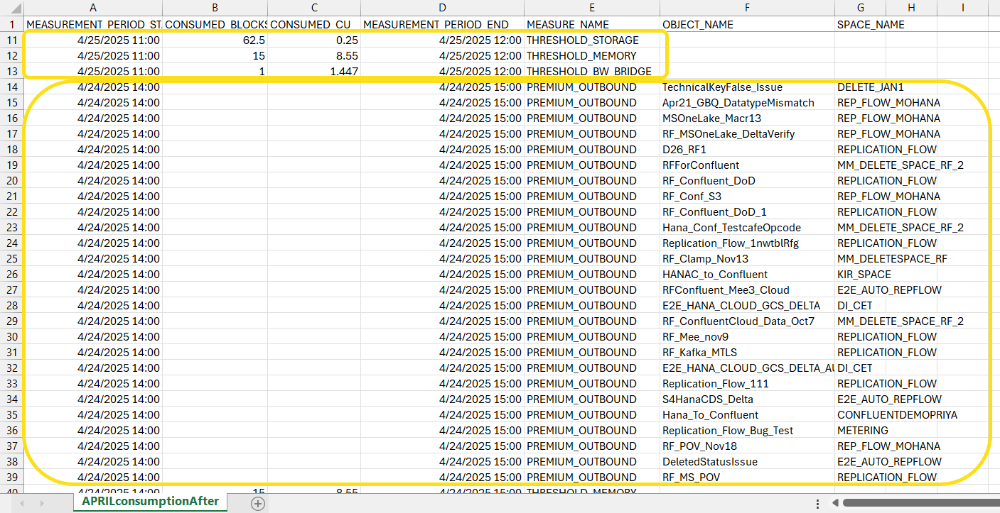

<!-- loioba3d05baac854171914c09d64bed7202 -->

<link rel="stylesheet" type="text/css" href="../css/sap-icons.css"/>

# Monitor Capacities

View the amount of capacity units you have used each month.

## Context

Monitor Capacities provides insights into monthly and daily capacity unit consumption, allowing users to track usage relative to their subscription and download detailed hourly data. This tool is useful for optimizing resource allocation and ensuring efficient subscription management.

<table>
<tr>
<th valign="top">

Card

</th>
<th valign="top">

Description

</th>
</tr>
<tr>
<td valign="top">

*Total CU Consumption*

</td>
<td valign="top">

Shows the number of capacity units consumed this month.

</td>
</tr>
<tr>
<td valign="top">

*Total CU Consumption: Relative to Your Subscription*

</td>
<td valign="top">

Shows the percentage of your capacity unit subscription that is used this month.

</td>
</tr>
<tr>
<td valign="top">

*Total CU Consumption: Daily*

</td>
<td valign="top">

Displays a bar chart showing the amount of capacity units consumed each day of this month.

</td>
</tr>
</table>

You can also download a CSV file to view the hourly consumption of capacity units. The screenshot shows the rows that go together for processing.

The following table explains the information is in each column.

<table>
<tr>
<th valign="top">

Column Heading

</th>
<th valign="top">

Description

</th>
</tr>
<tr>
<td valign="top">

MEASUREMENT\_PERIOD\_START

</td>
<td valign="top">

Marks the beginning time period in yyyy-mm-dd hh:mm:ss format. The time data is separated by hour.

</td>
</tr>
<tr>
<td valign="top">

CONSUMED\_BLOCKS

</td>
<td valign="top">

Shows approximate consumed block hours.

</td>
</tr>
<tr>
<td valign="top">

CONSUMED\_CU

</td>
<td valign="top">

Shows the approximate consumed capacity units.

</td>
</tr>
<tr>
<td valign="top">

MEASUREMENT\_PERIOD\_END

</td>
<td valign="top">

Marks the ending time period in yyyy-mm-dd hh:mm:ss format. The time data is separated by hour.

</td>
</tr>
<tr>
<td valign="top">

MEASURE\_NAME

</td>
<td valign="top">

Shows the type of measure such as THRESHOLD\_MEMORY or PREMIUM\_OUTBOUND.

</td>
</tr>
<tr>
<td valign="top">

OBJECT\_NAME

</td>
<td valign="top">

Shows the name of the object when the consumption is associated with a specific object.

</td>
</tr>
<tr>
<td valign="top">

SPACE\_NAME

</td>
<td valign="top">

Shows the name of the space when the consumption is associated with a specific object.

</td>
</tr>
</table>

The values shown for CONSUMED\_CU and CONSUMED\_BLOCKS are not final and can change. For metrics involving multiple tasks that generate CU consumption, such as Premium Outbound Integration or ECN, the values are approximate due to the concurrent nature of those tasks. When the values in these columns are empty, the cause could be:

-   The entry did not present any consumption. This might happen when there are multiple workflows present, as entries will still be displayed even though they were not running at the time.
-   The values are not available because the measurement has not been consolidated yet.

## Procedure

1.  From the side navigation menu, click  \(*System Monitor*\)** \> *Capacities*.

    The *Capacities* page is shown.

2.  To download a CSV file of the consumption, click *Download Capacity Metrics as CSV*.

3.  Click and select the beginning and end dates for the report.

4.  Click *Download*.

    The CSV file is downloaded, and you can view it in you spreadsheet application.

    > ### Note:  
    > The CSV file contains approximate data that may not reflect the finalized monthly total.

