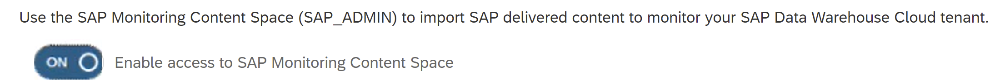
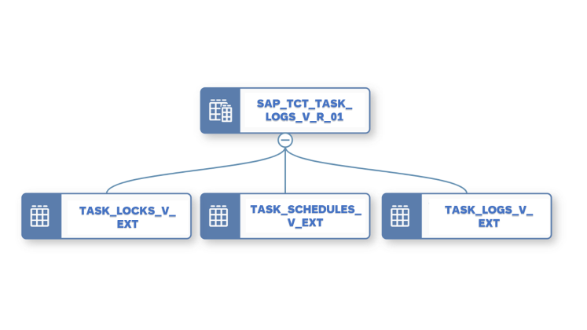
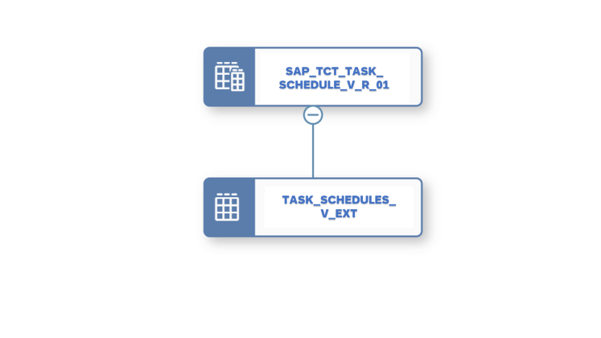
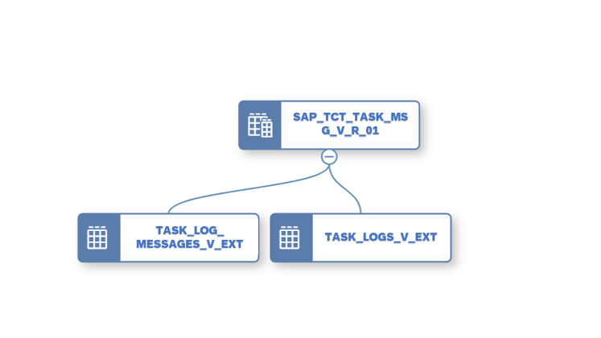

<!-- loio4ab45090c5684ebf8765757a1dfc4e5d -->

# Monitoring Tasks, Logs and Schedules With Dedicated Monitoring Views

Monitor tasks and schedules execution across spaces using monitoring views.

As an administrator, you need to keep an eye on how tasks and schedules are running across spaces. Gathering information from different logs might be time consuming and you need to find an easy way to collect this information.

> ### Note:  
> You can also monitor all tasks that are run across all spaces directly in the *System Monitor*. For more information, see [Monitoring SAP Datasphere](monitoring-sap-datasphere-28910cd.md).

<a name="loio4ab45090c5684ebf8765757a1dfc4e5d__section_smv_thx_5sb"/>

## Using SAP HANA Monitoring Views From the DWC\_GLOBAL Schema

The following monitoring views are ready to use in the DWC\_GLOBAL schema and can be recognized as they have a naming convention Suffix\_V\_EXT:

-   SPACE\_SCHEMAS\_V\_EXT:

    <table>
    <tr>
    <th valign="top">

    Column
    
    </th>
    <th valign="top">

    Function
    
    </th>
    </tr>
    <tr>
    <td valign="top">
    
    SPACE\_ID
    
    </td>
    <td valign="top">
    
    Identifier of the SAP Datasphere space. Note that one space can contain several schemas.
    
    </td>
    </tr>
    <tr>
    <td valign="top">
    
    SCHEMA\_NAME
    
    </td>
    <td valign="top">
    
    Name of the schema used to run the task.
    
    </td>
    </tr>
    </table>
    
-   SPACE\_USERS\_V\_EXT:

    <table>
    <tr>
    <th valign="top">

    Column
    
    </th>
    <th valign="top">

    Function
    
    </th>
    </tr>
    <tr>
    <td valign="top">
    
    SPACE\_ID
    
    </td>
    <td valign="top">
    
    Identifier of the SAP Datasphere space. Note that one space can contain several users.
    
    </td>
    </tr>
    <tr>
    <td valign="top">
    
    USER\_NAME
    
    </td>
    <td valign="top">
    
    Identifier of the user.
    
    </td>
    </tr>
    <tr>
    <td valign="top">
    
    USER\_TYPE
    
    </td>
    <td valign="top">
    
    Type of user, such as space technical user \(for example database user for open SQL schemas\) or global user.
    
    </td>
    </tr>
    </table>
    
-   TASK\_SCHEDULES\_V\_EXT:

    <table>
    <tr>
    <th valign="top">

    Column
    
    </th>
    <th valign="top">

    Key
    
    </th>
    <th valign="top">

    Function
    
    </th>
    <th valign="top">

    Values
    
    </th>
    </tr>
    <tr>
    <td valign="top">
    
    SPACE\_ID
    
    </td>
    <td valign="top">
    
    X
    
    </td>
    <td valign="top">
    
    Identifier of the SAP Datasphere space which contains the object with the defined schedule.
    
    </td>
    <td valign="top">
    
     
    
    </td>
    </tr>
    <tr>
    <td valign="top">
    
    OBJECT\_ID
    
    </td>
    <td valign="top">
    
    X
    
    </td>
    <td valign="top">
    
    Identifier of the SAP Datasphere object for which the schedule is defined.
    
    </td>
    <td valign="top">
    
     
    
    </td>
    </tr>
    <tr>
    <td valign="top">
    
    APPLICATION\_ID
    
    </td>
    <td valign="top">
    
    X
    
    </td>
    <td valign="top">
    
    Identifier of the type of object
    
    </td>
    <td valign="top">
    
    For example: VIEWS, REMOTE\_TABLES, DATA\_FLOWS, TASK\_CHAINS
    
    </td>
    </tr>
    <tr>
    <td valign="top">
    
    ACTIVITY
    
    </td>
    <td valign="top">
    
    X
    
    </td>
    <td valign="top">
    
    Identifier of the type of activity applied to the object.

    > ### Note:  
    > For each application, you can have multiple activities \(for example, replicating or deleting data\)

    
    </td>
    <td valign="top">
    
    For example: PERSIST \(View\), EXECUTE \(Dataflow\), REPLICATE \(Remote Tables\), RUN\_CHAIN \(Task Chain\)
    
    </td>
    </tr>
    <tr>
    <td valign="top">
    
    OWNER
    
    </td>
    <td valign="top">
    
     
    
    </td>
    <td valign="top">
    
    Identifier of the responsible of the schedule, schedule executed on users behalf, consent is checked against
    
    </td>
    <td valign="top">
    
    < DWC User ID \>
    
    </td>
    </tr>
    <tr>
    <td valign="top">
    
    CRON
    
    </td>
    <td valign="top">
    
     
    
    </td>
    <td valign="top">
    
    Defines the recurrence of a schedule in CRON format
    
    </td>
    <td valign="top">
    
    NULL \(no schedule defined, or a SIMPLE schedule is defined\) For example: "0 \*/1 \* \* \*" for hourly. For more information on CRON schedule, see [Schedule a Data Integration Task (with Cron Expression)](https://help.sap.com/viewer/9f36ca35bc6145e4acdef6b4d852d560/DEV_CURRENT/en-US/169ba34e19744362be25a4325de8d10c.html "Schedule data integration tasks such as data replication, data persistence, or data flow runs or task chains runs, by entering directly a cron expression.") :arrow_upper_right:
    
    </td>
    </tr>
    <tr>
    <td valign="top">
    
    FREQUENCY
    
    </td>
    <td valign="top">
    
     
    
    </td>
    <td valign="top">
    
    Defines the recurrence of a schedule in json format \(simple format\)
    
    </td>
    <td valign="top">
    
    NULL \(no schedule defined, or a CRON schedule is defined\) or schedule definition, for example Daily + start date + time + duration. For more information, see [Schedule a Data Integration Task (Simple Schedule)](https://help.sap.com/viewer/9f36ca35bc6145e4acdef6b4d852d560/DEV_CURRENT/en-US/7c11059ed3314e1fb753736b7867512c.html "You can schedule or unschedule data integration tasks such as remote data replication, data persistence, data flow, replication flow, or task chains runs. You may also pause and then later resume the run of scheduled tasks.") :arrow_upper_right: 
    
    </td>
    </tr>
    <tr>
    <td valign="top">
    
    CHANGED\_BY
    
    </td>
    <td valign="top">
    
     
    
    </td>
    <td valign="top">
    
    User who last changed the schedule configuration.
    
    </td>
    <td valign="top">
    
     
    
    </td>
    </tr>
    <tr>
    <td valign="top">
    
    CHANGED\_AT
    
    </td>
    <td valign="top">
    
     
    
    </td>
    <td valign="top">
    
    Timestamp containing Date and Time, at which the schedule was last changed.
    
    </td>
    <td valign="top">
    
     
    
    </td>
    </tr>
    </table>
    
-   TASK\_LOGS\_V\_EXT

    <table>
    <tr>
    <th valign="top">

    Column
    
    </th>
    <th valign="top">

    Key
    
    </th>
    <th valign="top">

    Function
    
    </th>
    <th valign="top">

    Values
    
    </th>
    </tr>
    <tr>
    <td valign="top">
    
    TASK\_LOG\_ID
    
    </td>
    <td valign="top">
    
    X
    
    </td>
    <td valign="top">
    
    Uniquely identifies an execution of a task.
    
    </td>
    <td valign="top">
    
     
    
    </td>
    </tr>
    <tr>
    <td valign="top">
    
    SPACE\_ID
    
    </td>
    <td valign="top">
    
     
    
    </td>
    <td valign="top">
    
    Identifier of the SAP Datasphere space which contains the object with the defined schedule.
    
    </td>
    <td valign="top">
    
     
    
    </td>
    </tr>
    <tr>
    <td valign="top">
    
    APPLICATION\_ID
    
    </td>
    <td valign="top">
    
     
    
    </td>
    <td valign="top">
    
    Identifier of the type of object
    
    </td>
    <td valign="top">
    
    For example: VIEWS, REMOTE\_TABLES, DATA\_FLOWS, TASK\_CHAINS
    
    </td>
    </tr>
    <tr>
    <td valign="top">
    
    OBJECT\_ID
    
    </td>
    <td valign="top">
    
     
    
    </td>
    <td valign="top">
    
    Identifier of the SAP Datasphere object for which the schedule is defined.
    
    </td>
    <td valign="top">
    
     
    
    </td>
    </tr>
    <tr>
    <td valign="top">
    
    ACTIVITY
    
    </td>
    <td valign="top">
    
     
    
    </td>
    <td valign="top">
    
    For each application there could be multiple activities, e.g. replicating or deleting data
    
    </td>
    <td valign="top">
    
    For example: PERSIST \(View\), EXECUTE \(Dataflow\), REPLICATE \(Remote Tables\), RUN\_CHAIN \(Task Chain\)
    
    </td>
    </tr>
    <tr>
    <td valign="top">
    
    PEAK\_MEMORY
    
    </td>
    <td valign="top">
    
     
    
    </td>
    <td valign="top">
    
    Captures the highest peak memory consumption \(in bytes\). Note: this value is not available for all apps. To capture this value when it's available, you must check *Enable Expensive Statement Tracing* in *Configuration* \> *Monitoring*. For more information, see [Monitoring SAP Datasphere](monitoring-sap-datasphere-28910cd.md).
    
    </td>
    <td valign="top">
    
    Null \(not available for the application, or not measured because the *Enable Expensive Statement Tracing* is not set, or the threshold defined is not reached\), 0 or value of the memory consumption.
    
    </td>
    </tr>
    <tr>
    <td valign="top">
    
    PEAK\_CPU
    
    </td>
    <td valign="top">
    
     
    
    </td>
    <td valign="top">
    
    Total CPU time \(in microseconds\) consumed by the task. Note: This value is not available for all apps.To capture this value when it's available, you must check *Enable Expensive Statement Tracing* in *Configuration* \> *Monitoring*. For more information, see [Monitoring SAP Datasphere](monitoring-sap-datasphere-28910cd.md).
    
    </td>
    <td valign="top">
    
    Null \(not available for the application, or not measured because the *Enable Expensive Statement Tracing* is not set, or the threshold defined is not reached\), 0 or value of the CPU time consumption.
    
    </td>
    </tr>
    <tr>
    <td valign="top">
    
    RECORDS
    
    </td>
    <td valign="top">
    
     
    
    </td>
    <td valign="top">
    
    Shows the number of records of the target table after the task has finished running.
    
    </td>
    <td valign="top">
    
    Null \(not applicable or not measured\), 0 or number of records.
    
    </td>
    </tr>
    <tr>
    <td valign="top">
    
    START\_TIME
    
    </td>
    <td valign="top">
    
     
    
    </td>
    <td valign="top">
    
    Timestamp containing Date and Time, at which the scheduled task was started.
    
    </td>
    <td valign="top">
    
     
    
    </td>
    </tr>
    <tr>
    <td valign="top">
    
    END\_TIME
    
    </td>
    <td valign="top">
    
     
    
    </td>
    <td valign="top">
    
    Timestamp containing Date and Time, at which the scheduled task was stopped.
    
    </td>
    <td valign="top">
    
     
    
    </td>
    </tr>
    <tr>
    <td valign="top">
    
    STATUS
    
    </td>
    <td valign="top">
    
     
    
    </td>
    <td valign="top">
    
    Reports if this task execution is still running, completed or failed.
    
    </td>
    <td valign="top">
    
     
    
    </td>
    </tr>
    <tr>
    <td valign="top">
    
    TRIGGERED\_TYPE
    
    </td>
    <td valign="top">
    
     
    
    </td>
    <td valign="top">
    
    Indicates if task execution was triggered manually \(DIRECT\) or via schedule \(SCHEDULED\)
    
    </td>
    <td valign="top">
    
     
    
    </td>
    </tr>
    <tr>
    <td valign="top">
    
    APPLICATION\_USER
    
    </td>
    <td valign="top">
    
     
    
    </td>
    <td valign="top">
    
    The user on whose behalf the schedule was executed \(the owner at this point in time\)
    
    </td>
    <td valign="top">
    
     
    
    </td>
    </tr>
    <tr>
    <td valign="top">
    
    DURATION
    
    </td>
    <td valign="top">
    
     
    
    </td>
    <td valign="top">
    
    Duration of the task execution \(also works for ongoing execution\)
    
    </td>
    <td valign="top">
    
     
    
    </td>
    </tr>
    <tr>
    <td valign="top">
    
    START\_DATE
    
    </td>
    <td valign="top">
    
     
    
    </td>
    <td valign="top">
    
    Date when the scheduled task was started.
    
    </td>
    <td valign="top">
    
     
    
    </td>
    </tr>
    </table>
    
-   TASK\_LOG\_MESSAGES\_V\_EXT

    <table>
    <tr>
    <th valign="top">

    Column
    
    </th>
    <th valign="top">

    Key
    
    </th>
    <th valign="top">

    Function
    
    </th>
    </tr>
    <tr>
    <td valign="top">
    
    TASK\_LOG\_ID
    
    </td>
    <td valign="top">
    
    X
    
    </td>
    <td valign="top">
    
    Uniquely identifies an execution of a task
    
    </td>
    </tr>
    <tr>
    <td valign="top">
    
    MESSAGE\_NO
    
    </td>
    <td valign="top">
    
    X
    
    </td>
    <td valign="top">
    
    Order sequence of all messages belonging to a certain Tasklog ID.
    
    </td>
    </tr>
    <tr>
    <td valign="top">
    
    SEVERITY
    
    </td>
    <td valign="top">
    
     
    
    </td>
    <td valign="top">
    
    Indicates if the message provides general information \(INFO\) or error information \(ERROR\)
    
    </td>
    </tr>
    <tr>
    <td valign="top">
    
    TEXT
    
    </td>
    <td valign="top">
    
     
    
    </td>
    <td valign="top">
    
    The message itself
    
    </td>
    </tr>
    <tr>
    <td valign="top">
    
    DETAILS
    
    </td>
    <td valign="top">
    
     
    
    </td>
    <td valign="top">
    
    Technical additional information. For example, it can be an error stack or a correlation ID.
    
    </td>
    </tr>
    </table>
    
-   TASK\_LOCKS\_V\_EXT

    <table>
    <tr>
    <th valign="top">

    Column
    
    </th>
    <th valign="top">

    Key
    
    </th>
    <th valign="top">

    Function
    
    </th>
    </tr>
    <tr>
    <td valign="top">
    
    LOCK\_KEY
    
    </td>
    <td valign="top">
    
    X
    
    </td>
    <td valign="top">
    
    Identifier, flexible field as part of the lock identifier, usually set to WRITE or EXECUTE.
    
    </td>
    </tr>
    <tr>
    <td valign="top">
    
    APPLICATION\_ID
    
    </td>
    <td valign="top">
    
    X
    
    </td>
    <td valign="top">
    
    Identifier of the type of object.
    
    </td>
    </tr>
    <tr>
    <td valign="top">
    
    SPACE\_ID
    
    </td>
    <td valign="top">
    
    X
    
    </td>
    <td valign="top">
    
    Identifier of the SAP Datasphere space which contains the object with the defined schedule.
    
    </td>
    </tr>
    <tr>
    <td valign="top">
    
    OBJECT\_ID
    
    </td>
    <td valign="top">
    
    X
    
    </td>
    <td valign="top">
    
    Identifier of the SAP Datasphere object for which the schedule is defined.
    
    </td>
    </tr>
    <tr>
    <td valign="top">
    
    TASK\_LOG\_ID
    
    </td>
    <td valign="top">
    
     
    
    </td>
    <td valign="top">
    
    Uniquely identifies the task execution that set the lock.
    
    </td>
    </tr>
    <tr>
    <td valign="top">
    
    CREATION\_TIME
    
    </td>
    <td valign="top">
    
     
    
    </td>
    <td valign="top">
    
    Indicates when the lock has been set.
    
    </td>
    </tr>
    </table>
    

> ### Note:  
> Cross-space sharing is active for all SAP HANA monitoring views. The row level access of shared views is bound to the space read access privileges of the user who consumes the view.

You can then choose a space that is dedicated to task framework monitoring. For more information, see [Analyze Monitoring Data in a Space](analyze-monitoring-data-in-a-space-9cd0691.md).

<a name="loio4ab45090c5684ebf8765757a1dfc4e5d__section_wvp_zhx_5sb"/>

## Using SAP Datasphere Monitoring Views \(Delivered via the Content Network\)

**Prerequisites**:

-   You need to create a space with the space ID *<SAP\_ADMIN\>* and the space name *<Administration \(SAP\)\>* and to configure it as a monitoring space by enabling the toggle *Enable Access to SAP Monitoring Content Space*: 

    For more information, see [Analyze Monitoring Data in a Space](analyze-monitoring-data-in-a-space-9cd0691.md).

-   You need to import the package that contains monitoring views via the *Content Network*. Import the package *<Technical Content: Task Monitoring\>*. For more information, see [Importing SAP and Partner Business Content from the Content Network](https://help.sap.com/viewer/9f36ca35bc6145e4acdef6b4d852d560/DEV_CURRENT/en-US/400078d689bf4454b3fc977a4e201c2f.html "Users with the DW Administrator global role (or users with both a scoped DW Space Administrator role and a global role providing the Lifecycle privilege), can use the Semantic Onboarding app to import business content and sample content from SAP and partners published to the Content Network.") :arrow_upper_right:.

Thanks to SAP Datasphere pre-configured monitoring views, you can monitor data integration tasks in a more flexible way. They are based on top of the V\_EXT HANA views \(see previous section\), and we enriched them with further information as preparation for consumption in an SAP Analytics Cloud Story.

For more information about how to create such a story,

See the blogs [SAP Datasphere: Data Integration Monitoring – Sample Content for Reporting](https://blogs.sap.com/2021/10/12/sap-data-warehouse-cloud-data-integration-monitoring-sample-content-for-reporting/) \(published in October 2021\) and [SAP Datasphere: Data Integration Monitoring – Running Task Overview](https://blogs.sap.com/2021/11/04/sap-data-warehouse-cloud-data-integration-monitoring-running-task-overview/) \(published in November 2021\).

For more information about data integration, see [Importing SAP and Partner Business Content from the Content Network](https://help.sap.com/viewer/9f36ca35bc6145e4acdef6b4d852d560/DEV_CURRENT/en-US/400078d689bf4454b3fc977a4e201c2f.html "Users with the DW Administrator global role (or users with both a scoped DW Space Administrator role and a global role providing the Lifecycle privilege), can use the Semantic Onboarding app to import business content and sample content from SAP and partners published to the Content Network.") :arrow_upper_right:.

> ### Restriction:  
> Content modification is not recommended as any update will overwrite custom changes.

The following views are available:

-   SAP\_TCT\_TASK\_LOGS\_V\_R\_01: Monitoring: Task Execution Headers

    -   **The view exposes**:
        -   Task properties, such as duration and execution status \(e.g. failed, completed, ...\).

        -   Various measures for counting tasks \(e.g. failed\).
        -   The schedule description.
        -   Locking status

    -   It uses the views TASK\_LOCKS\_V\_EXT, TASK\_SCHEDULES\_V\_EXT and TASK\_LOGS\_V\_EXT:
    -   Best Practice: To enable the navigation between SAP Datasphere and SAP Analytics Cloud, you must change the constant for the url\_host to your SAP Datasphere instance. Open the view in the view editor, and update the URL host: 

-   SAP\_TCT\_TASK\_SCHEDULE\_V\_R\_01: Monitoring: Schedule Properties
    -   **The view exposes** the properties of a data integration schedule.
    -   It uses the view TASK\_SCHEDULES\_V\_EXT and adds a row-count to be compatible with OLAP reporting:

-   SAP\_TCT\_TASK\_MSG\_V\_R\_01: Monitoring: Task Execution Items
    -   **The view exposes**:
        -   All messages occurring during data integration monitoring.
        -   Error code, header line and first stack line parsed out from detailed message.
        -   An indicator that the task\_id has an error \(facilitate filtering of messages\).

    -   It uses the views TASK\_LOG\_MESSAGES\_V\_EXT and TASK\_LOGS\_V\_EXT:

-   -   Best Practice: To enable the navigation between SAP Datasphere and SAP Analytics Cloud, you must change the constant for the url\_host to your SAP Datasphere instance. Open the view in the view editor, and update the URL host: 

